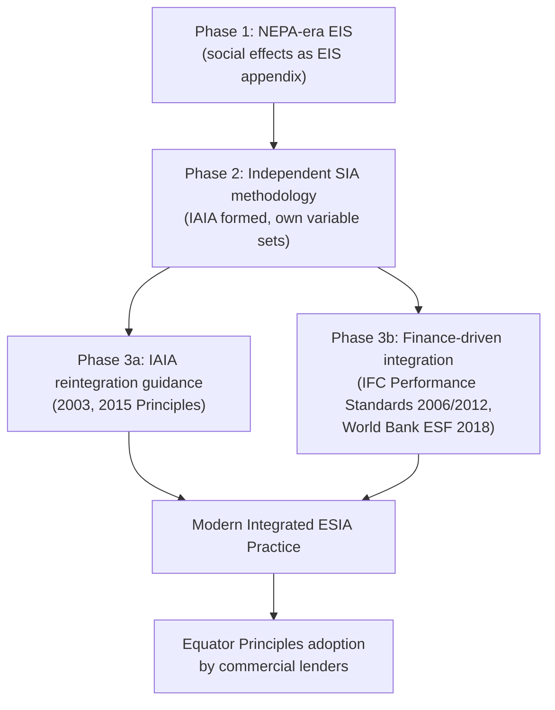

## Evolution from Environmental to Integrated Social and Environmental Assessment

### Overview

Following its origin as a subordinate component of Environmental Impact Statements (EIS) under the U.S. National Environmental Policy Act (NEPA), Social Impact Assessment (SIA) underwent several decades of methodological and institutional evolution, moving from an ecology-derived add-on toward increasingly integrated frameworks that treat social and environmental dimensions as co-equal, interdependent lines of analysis. This progression reflects both theoretical critique within impact assessment scholarship and practical pressure from international development finance institutions.

### Phase 1: Subordinated Social Analysis (1970s)

**Characteristics**

- Social variables were appended to EIS documents largely as descriptive context (demographics, land use, employment) rather than as independently predicted and mitigated impacts.
- Analysts were typically drawn from environmental science and planning backgrounds, applying biophysical impact-assessment logic (dose-response style prediction) to social phenomena, which fit awkwardly given the qualitative, perception-based, and power-mediated nature of social change.
- [Inference] Because social effects lacked their own accepted metrics at this stage, EIS documents often treated them inconsistently — sometimes robustly analyzed, sometimes reduced to a brief paragraph — depending on the individual preparer's background rather than a standardized requirement.

### Phase 2: Parallel but Distinct Methodology (1980s–1990s)

**Key Developments**

- The formation of the International Association for Impact Assessment (IAIA) in 1980–1981 created an institutional home where social scientists could develop SIA-specific theory independent of environmental science paradigms.
- The Interorganizational Committee on Guidelines and Principles for Social Impact Assessment published its foundational guidance in the mid-1990s (widely cited as the 1994/1995 guidelines in the journal *Impact Assessment*), providing the first standardized list of social variables (population characteristics, community/institutional structures, political and social resources, individual and family changes, community resources) independent of any environmental-science variable set.
- **Divergence in practice**: SIA began developing its own participatory and qualitative methods — social mapping, ethnographic fieldwork, stakeholder analysis — that differed methodologically from the quantitative modeling common in biophysical EIA (e.g., air dispersion models, hydrological models).

**Why Divergence Occurred**

[Inference] Social scientists working in SIA argued that treating social change with the same linear, dose-response prediction logic used for pollutant dispersion was epistemologically inappropriate — social impacts are mediated by community perception, adaptive capacity, and power relations, none of which behave like a diffusing contaminant. This argument is generally credited with driving the field toward distinct, socially-grounded methodologies rather than borrowed environmental-science tools.

### Phase 3: Formal Integration Frameworks (2000s–Present)

**IAIA's Reintegration Effort**

Despite the divergence in method, the IAIA's 2003 *International Principles for Social Impact Assessment* and its 2015 updated guidance explicitly reframed SIA not as a standalone silo but as a process that should be integrated with, and inform, the broader impact assessment and project-planning process from the outset — rather than being conducted as an afterthought to an already-designed project.

**International Finance-Driven Integration**

A major force behind formal integration has been international development finance institutions requiring combined environmental and social review as a condition of lending:

- **World Bank Environmental and Social Framework (ESF)**, effective 2018, replaced the Bank's older, more environmentally-weighted safeguard policies with ten integrated Environmental and Social Standards (ESS) covering both biophysical and social risks (labor, resettlement, Indigenous Peoples, cultural heritage, stakeholder engagement) under one unified assessment and management framework.
- **IFC Performance Standards** (International Finance Corporation, private-sector arm of the World Bank Group), first issued 2006 and updated 2012, established eight performance standards requiring integrated Environmental and Social Impact Assessment (ESIA) rather than separate environmental and social documents, becoming a global private-sector lending benchmark adopted by many commercial banks via the **Equator Principles**.
- [Unverified] Many national EIA/SIA regulatory systems that modernized their frameworks from the 2000s onward (in various jurisdictions across Asia, Africa, and Latin America) explicitly cite these international finance standards as models when drafting combined "Environmental and Social Impact Assessment" (ESIA) regulatory requirements, rather than maintaining separate environmental and social review tracks.

**Terminology Shift**

The nomenclature shift from "EIA" (Environmental Impact Assessment) and "SIA" (Social Impact Assessment) as separate terms toward the combined term "ESIA" (Environmental and Social Impact Assessment) in professional and regulatory usage from the 2000s onward reflects this integration trend at the terminological level.

### Structural Comparison: Then vs. Now

| Dimension | 1970s (Subordinated) | Present (Integrated ESIA) |
| --- | --- | --- |
| Institutional home | Environmental science/planning agencies | Combined environmental-social units; dedicated ESIA teams |
| Trigger | Only if EIA legally required | EIA and social review triggered together by project screening |
| Methodology | Borrowed dose-response/prediction logic | Distinct qualitative + quantitative social methods integrated with environmental modeling |
| Standards body | None specific to social | IAIA principles, World Bank ESF, IFC Performance Standards |
| Terminology | "Environmental Impact Statement" with social appendix | "Environmental and Social Impact Assessment (ESIA)" |
| Stakeholder engagement | Often minimal, notification-level | Formal Stakeholder Engagement Plans (SEPs) mandated by standard |

### Evolutionary Pathway Diagram

### Practical Example: How Integration Changes Project Workflow

**Pre-integration workflow (illustrative, 1970s-style)**:

1. Environmental scientists complete biophysical EIA
2. Social section drafted separately, often near project completion, sometimes by a different team with less influence over design
3. Mitigation measures for social effects treated as lower priority than engineering/environmental fixes

**Integrated ESIA workflow (modern standard)**:

1. Joint environmental-social scoping conducted simultaneously at project inception
2. Combined baseline studies collect biophysical and social/socioeconomic data concurrently
3. Impact prediction addresses linked effects explicitly (e.g., water diversion's environmental effect on a river co-analyzed with its social effect on downstream fishing communities' livelihoods)
4. A single integrated Environmental and Social Management Plan (ESMP) sets mitigation and monitoring commitments for both dimensions
5. Stakeholder Engagement Plan (SEP) governs engagement across the full project lifecycle, not just a pre-approval consultation window

**Key Points**

- The shift from EIA-with-social-appendix to integrated ESIA was driven by two distinct forces: (1) internal professional critique from social scientists arguing for methodological independence, and (2) external pressure from international finance institutions requiring combined risk review.
- [Inference] Practitioners generally regard combined ESIA frameworks as reducing the risk that social risks are treated as secondary to environmental/engineering concerns, since both are assessed and reported through the same governance instrument (a single ESMP) rather than parallel, unequally weighted documents.
- Terminology in current use ("ESIA") signals this integration, though [Unverified] some national legal systems still formally separate "EIA" and "SIA" as distinct statutory requirements even while encouraging combined study preparation in practice.

**Next Steps**

- World Bank Environmental and Social Framework (ESF) — ten Environmental and Social Standards in detail
- IFC Performance Standards and the Equator Principles for commercial lenders
- Stakeholder Engagement Plans (SEPs) as a modern integration mechanism
- Cumulative impact assessment across combined environmental-social pathways
- Comparative national ESIA regulatory systems (Philippines PD 1586, EU EIA Directive, Canada's Impact Assessment Act)
- Critiques of ESIA integration (resource/capacity constraints in combined teams)