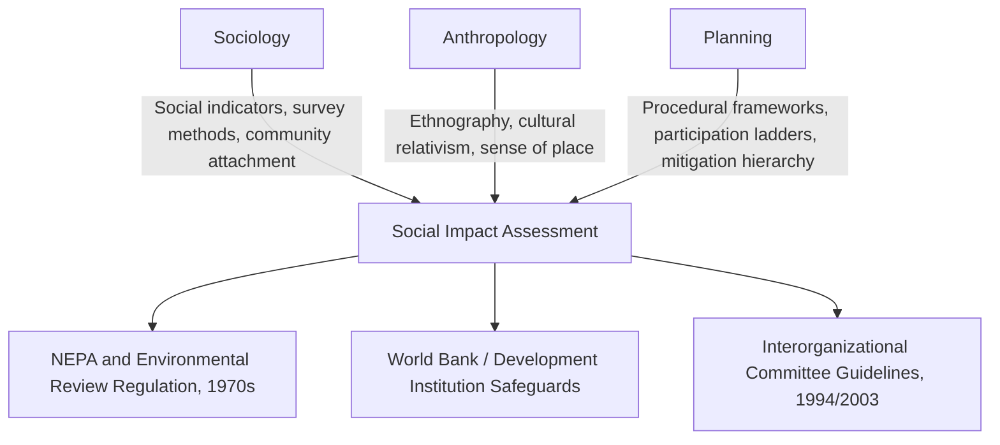

## Disciplinary Roots in Sociology, Anthropology, and Planning

### Overview

Social Impact Assessment (SIA) did not emerge from a single discipline. It formed at the intersection of three distinct intellectual traditions, each contributing methods, theoretical frameworks, and normative commitments that still shape practice today. Understanding these roots explains why SIA practitioners draw on ethnographic fieldwork, survey-based social indicators, and land-use planning frameworks simultaneously, and why tensions between these traditions (quantitative vs. qualitative, expert-driven vs. participatory, predictive vs. interpretive) persist in contemporary practice.

### Sociological Roots

**Key Points**

- Sociology contributed the concept of "social indicators" and structured approaches to measuring community-level change
- Rooted in structural-functionalist and later conflict-theory traditions studying how institutions and communities respond to external change
- Provided SIA with survey methodology, demographic analysis, and social stratification frameworks

The sociological lineage traces to the **Social Indicators Movement** of the 1960s–1970s in the United States, which sought to complement purely economic measures of national progress (like GNP) with quantifiable social measures — crime rates, education levels, health outcomes, housing quality. This movement was itself a response to growing awareness that economic growth did not automatically translate into social wellbeing.

Rural sociology played a particularly direct role. Sociologists studying agricultural communities, resource-dependent towns, and rural-to-urban migration developed frameworks for understanding how external interventions (dam construction, resource extraction, infrastructure projects) altered community structure, social cohesion, and local institutions. This work fed directly into early environmental impact statement requirements in the United States, where sociologists were called upon to predict "boomtown effects" from large energy and resource projects in the 1970s.

Key sociological concepts embedded in SIA methodology include:

- **Social capital** — networks, trust, and reciprocity within communities, later formalized by Putnam and Coleman
- **Community attachment and social disruption** — how rapid change (in-migration, economic shifts) affects existing social networks
- **Social stratification analysis** — recognizing that impacts are rarely uniform across a community; they are differentiated by class, income, and access to resources

### Anthropological Roots

**Key Points**

- Anthropology contributed ethnographic method, cultural relativism, and attention to meaning-making within communities
- Emphasized qualitative, participant-observation-based fieldwork over survey instruments
- Introduced the concept of "cultural impact" as distinct from purely social or economic impact

Anthropology's contribution centers on **ethnography** — sustained, immersive fieldwork aimed at understanding a community from the perspective of its members ("emic" understanding) rather than imposing external analytical categories ("etic" understanding). This distinction remains foundational in SIA methodological debates about whether assessments should be researcher-driven or community-driven.

Applied and development anthropology, particularly through work with the World Bank and USAID from the 1970s onward, institutionalized anthropological input into development project appraisal. Anthropologists were tasked with assessing how infrastructure and development projects would affect indigenous and traditional communities — work that directly anticipated modern requirements for **Free, Prior, and Informed Consent (FPIC)** in projects affecting indigenous peoples.

Central anthropological contributions to SIA:

- **Cultural relativism** — evaluating impacts against a community's own values and cosmology rather than external standards
- **Kinship and social organization analysis** — understanding how projects disrupt or reconfigure family and clan structures, particularly relevant in resettlement contexts
- **Sense of place and cultural landscape** — treating land not merely as an economic resource but as embedded in identity, spirituality, and historical memory
- **Long-term fieldwork ethics** — informing SIA's emphasis on rapport-building and iterative engagement rather than one-off data extraction

[Inference] The anthropological emphasis on long-term embedded fieldwork is frequently in tension with the compressed timelines of regulatory SIA processes, which typically allow weeks or months rather than the years anthropologists traditionally spend in a field site; this tension is widely discussed in SIA methodology literature as a persistent practical constraint.

### Planning Roots

**Key Points**

- Planning contributed the procedural and regulatory architecture within which SIA operates
- Rooted in urban and regional planning's mid-20th century shift toward rational-comprehensive planning models
- Introduced systematic impact prediction, mitigation hierarchies, and public participation requirements

The planning discipline supplied SIA with its **procedural scaffolding**. Mid-20th-century planning theory, especially the rational-comprehensive planning model, established the logic of: define objectives, generate alternatives, predict consequences, evaluate against criteria, select and implement. SIA adopted this structure directly, embedding social impact prediction as one evaluative criterion alongside environmental and economic ones.

Planning's most direct institutional contribution was through **environmental planning law**. The U.S. National Environmental Policy Act (NEPA) of 1969 required environmental impact statements for major federal actions, and social impacts were progressively incorporated into this requirement through subsequent guidance and litigation. This created the first systematic, legally mandated demand for SIA as a professional practice, distinct from academic sociology or anthropology.

Planning also contributed:

- **Public participation frameworks** — drawing on Sherry Arnstein's 1969 "Ladder of Citizen Participation," which planning theory adopted as a normative benchmark for evaluating engagement quality
- **Land-use and zoning analysis** — technical tools for assessing how projects alter land use patterns, displacement risk, and neighborhood character
- **Mitigation hierarchy logic** — avoid, minimize, mitigate, compensate — borrowed from environmental planning and applied to social impacts
- **Comprehensive/master planning integration** — situating individual project SIAs within broader jurisdictional plans

### Convergence into a Unified Field

The three disciplines converged through practical necessity rather than deliberate theoretical synthesis. By the late 1970s, agencies conducting environmental review needed teams that could produce legally defensible, time-bound, comprehensible assessments — pulling sociologists for quantitative social indicators, anthropologists for qualitative cultural understanding, and planners for procedural integration and mitigation design.

This convergence was formalized in the **Interorganizational Committee on Guidelines and Principles for Social Impact Assessment**, whose 1994/2003 guidelines (published in *Impact Assessment and Project Appraisal*) remain a reference document synthesizing all three traditions into a common SIA methodology.

### Tensions Inherited From Disciplinary Origins

**Key Points**

- Quantitative (sociology) vs. qualitative (anthropology) methodological divides persist in SIA debates over rigor and validity
- Expert-driven prediction (planning/sociology) vs. participatory co-production (anthropology) reflects unresolved epistemological differences
- Universal indicator frameworks (sociology) vs. context-specific cultural assessment (anthropology) create tension in comparative or standardized SIA reporting

These inherited tensions are not resolved in contemporary practice; they are actively managed. Modern SIA frameworks (e.g., the International Association for Impact Assessment's guidance) typically call for **mixed-methods approaches** that pair quantitative social indicators with qualitative, participatory fieldwork — a direct methodological echo of the field's three-part origin.

### Example

A hydroelectric dam project's SIA team might include: a sociologist analyzing census and household survey data to project demographic shifts among resettled populations; an anthropologist conducting interviews and participant observation to understand kinship networks and sacred site significance that survey instruments would miss; and a planner integrating both inputs into a resettlement action plan compliant with regulatory review timelines and mitigation requirements.

### Related Topics

- Emergence of Environmental Impact Assessment (EIA) and NEPA's role in institutionalizing SIA
- The Interorganizational Committee Guidelines and Principles for SIA (1994/2003)
- Arnstein's Ladder of Citizen Participation and its adaptation in planning practice
- Applied anthropology in international development (World Bank, USAID safeguard policies)
- Free, Prior, and Informed Consent (FPIC) and indigenous rights frameworks
- Quantitative vs. qualitative methodological debates in contemporary SIA
- Social indicators movement and its legacy in wellbeing measurement
- Mixed-methods research design for community impact studies