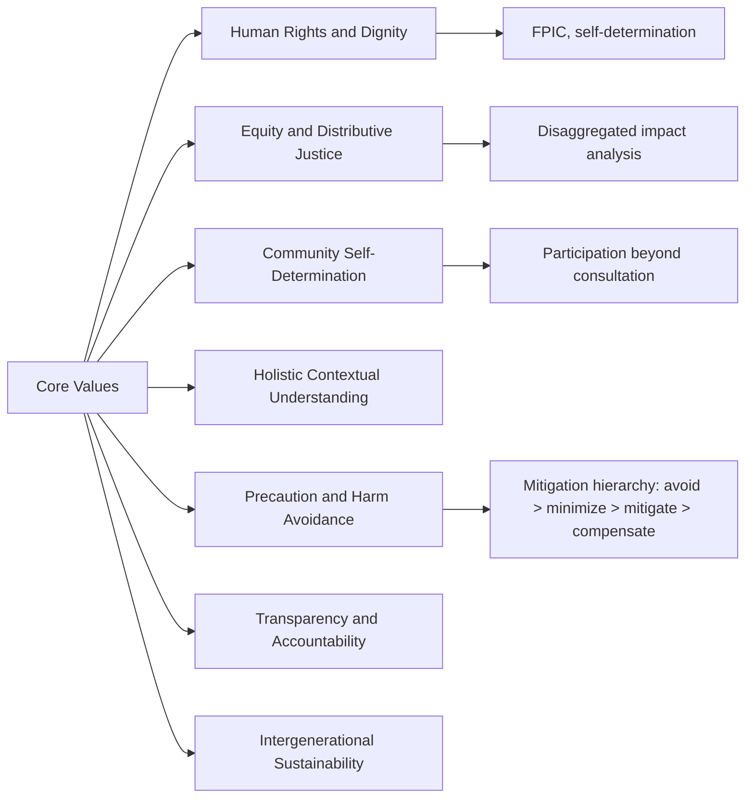

## Core Values of the Social Impact Assessment Community

### Overview

The SIA community — practitioners, researchers, and affected communities working together — operates under a set of shared normative commitments that distinguish it from purely technical or regulatory compliance work. These values were most explicitly codified in the International Association for Impact Assessment's (IAIA) guidance documents and the Interorganizational Committee's Guidelines and Principles, but they draw directly on the disciplinary ethics of sociology, anthropology, and planning. Understanding these values is essential because they shape methodological choices, define what counts as "good practice," and provide the basis for critiquing assessments that are procedurally compliant but substantively inadequate.

### Human Rights and Dignity

**Key Points**

- Affected people are rights-holders, not merely data sources or stakeholders to be managed
- Grounded in international human rights instruments and, for indigenous peoples, in self-determination frameworks
- Requires assessment of impacts on rights to livelihood, culture, health, and self-determination, not only economic loss

SIA practice treats the people affected by a proposed action as holders of enforceable rights and inherent dignity, not simply as a population whose reactions must be predicted and managed. This value underlies the emphasis on **Free, Prior, and Informed Consent (FPIC)** for indigenous communities and the broader principle that consent and voice matter independently of whether an impact can be economically compensated.

### Equity and Distributive Justice

**Key Points**

- Impacts are never uniform across a community; SIA values require explicit attention to who bears costs and who receives benefits
- Special attention to vulnerable and marginalized subgroups: women, children, elderly, disabled persons, low-income households, ethnic minorities
- Concerned with both distributive justice (who gets what) and procedural justice (who gets a say)

A foundational value is the rejection of "average impact" thinking. A project may show net positive impact in aggregate while imposing severe, concentrated harm on a specific subgroup — displaced households, downstream fishing communities, or informal settlement residents. SIA's equity commitment requires disaggregated analysis by gender, income, ethnicity, age, and disability status, and explicit reporting of differential impacts rather than only community-wide averages.

### Community Self-Determination and Participation

**Key Points**

- Communities have the right to participate meaningfully in decisions that affect them, not merely be informed after decisions are made
- Participation quality is evaluated against frameworks like Arnstein's Ladder — tokenism is explicitly rejected as insufficient
- Local and indigenous knowledge is valued as legitimate evidence, not subordinate to technical/expert knowledge

This value holds that the legitimacy of an SIA depends substantially on the quality of community involvement in producing it, not just in reviewing its conclusions. It draws directly from anthropology's emic/etic distinction (valuing community members' own framing of impacts) and planning's participatory theory. Genuine participation is distinguished from **consultation theater** — public meetings held to satisfy procedural requirements without any real capacity to alter project design.

### Holistic and Contextual Understanding

**Key Points**

- Social impacts must be understood in relation to cultural, historical, and ecological context — not analyzed as isolated variables
- Rejects purely quantitative or checklist-based assessment as insufficient on its own
- Recognizes cumulative and indirect impacts, not just direct, first-order effects

The SIA community values assessments that situate a proposed action within a community's history (including prior projects and cumulative burden), its cultural meaning-making, and its relationship to land and ecology. This reflects anthropology's holistic tradition and pushes back against assessments that treat social impact as a simple checklist exercise disconnected from lived context.

### Precaution and Avoidance of Harm

**Key Points**

- Preference for avoiding and minimizing harm over compensating for it after the fact — mirrors the environmental mitigation hierarchy
- Uncertainty about impacts should trigger caution, not dismissal of the concern
- Irreversible impacts (cultural loss, community fragmentation, loss of sacred sites) are weighted more heavily than reversible ones

The mitigation hierarchy — **avoid, minimize, mitigate, compensate** — is treated as a value ordering, not just a procedural checklist. Compensation is considered a last resort, reflecting recognition that many social and cultural impacts (loss of community cohesion, displacement from ancestral land) cannot be fully restored through monetary payment.

### Transparency and Accountability

**Key Points**

- Assessment methods, data, and assumptions should be disclosed and open to scrutiny
- Findings should be accessible to affected communities in appropriate language and format, not just technical reports for regulators
- Practitioners are accountable for methodological rigor and for avoiding conflicts of interest, particularly when funded by project proponents

Because SIAs are frequently commissioned and paid for by the entity proposing the project under assessment, the community places significant weight on practitioner independence, disclosure of funding relationships, and methodological transparency as safeguards against biased conclusions.

### Sustainability and Intergenerational Responsibility

**Key Points**

- Impacts should be assessed not only for the current generation but for future community members
- Long-term social sustainability (institutional capacity, social cohesion) valued alongside short-term project benefits
- Connects SIA to broader sustainable development and triple-bottom-line frameworks

### Values in Tension

**Key Points**

- Participation vs. timeliness: genuine participatory processes take time that regulatory schedules often do not allow
- Independence vs. funding structure: proponent-funded SIA creates structural pressure against independence
- Universal principles vs. cultural specificity: applying consistent rights-based standards while respecting cultural relativism can create friction

[Inference] These tensions are widely acknowledged in IAIA and academic SIA literature as unresolved structural challenges rather than solved problems; the values function as aspirational commitments that practice continually falls short of and works to approximate, rather than as fully achieved operational standards.

### Example

In assessing a proposed mining project near an indigenous community, a values-driven SIA would: seek FPIC before finalizing project design (self-determination); disaggregate predicted impacts by gender and household type rather than reporting only community-wide averages (equity); document sacred site locations and cultural significance through community-led mapping rather than external GIS analysis alone (holistic understanding); and prioritize route or design changes to avoid a sacred grove over offering financial compensation for its loss (precaution).

### Related Topics

- Free, Prior, and Informed Consent (FPIC) as an operational standard
- Arnstein's Ladder of Citizen Participation and critiques of tokenism
- IAIA Principles and Guidelines for Social Impact Assessment
- Distributive vs. procedural justice frameworks in impact assessment
- Practitioner independence and conflict-of-interest safeguards in proponent-funded SIA
- Cumulative impact assessment methodology
- Triple-bottom-line and sustainable development frameworks
- Indigenous knowledge systems as evidence in formal assessment processes