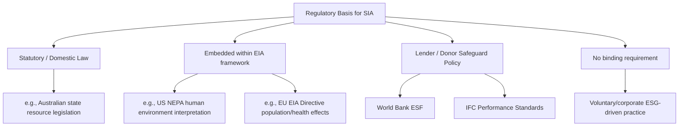

## Global Variation in Terminology and Practice

### Overview

Social Impact Assessment is not a single standardized global practice. It goes by different names, follows different regulatory triggers, and emphasizes different methodological priorities depending on jurisdiction, legal tradition, and institutional context. A practitioner working across borders must recognize that "SIA" in a U.S. NEPA context, a World Bank safeguard context, and an EU/UK planning context refer to related but structurally distinct processes. This variation affects everything from what must legally be assessed, to who conducts the assessment, to what counts as adequate evidence.

### Terminology Divergence

**Key Points**

- The same underlying activity is labeled differently across jurisdictions and institutions
- Terminology differences often reflect deeper differences in legal integration and institutional ownership
- Practitioners must map local terminology to the underlying assessment function, not assume equivalence

| Term | Primary Region/Institution | Notes |
| --- | --- | --- |
| Social Impact Assessment (SIA) | United States, Australia, Canada | Often paired with, or a component of, Environmental Impact Assessment (EIA) |
| Social and Environmental Impact Assessment (SEIA) | International development finance institutions | Reflects integration of social and environmental streams into one process |
| Environmental and Social Impact Assessment (ESIA) | World Bank, IFC, multilateral development banks | Standard terminology in project finance; associated with IFC Performance Standards |
| Social Effects Assessment | New Zealand (historically) | Emerged from Resource Management Act practice |
| Community Impact Assessment | Some UK and Irish planning contexts | Emphasizes community-level scale over broader "social" framing |
| Equality Impact Assessment (EqIA) | United Kingdom | Distinct legal instrument tied to the Equality Act 2010's public sector equality duty, narrower in scope than SIA |
| Health Impact Assessment (HIA) | WHO and various national contexts | Frequently run as a parallel or integrated process alongside SIA |
| Cultural Heritage Impact Assessment | Various, particularly in contexts with strong indigenous rights frameworks | Sometimes separate from, sometimes nested within, SIA |

[Inference] Because terminology is not standardized, a literature or regulatory search using only the term "SIA" will systematically miss relevant requirements and practice guidance published under these adjacent labels; comprehensive research typically requires searching multiple terms.

### Regulatory Triggers and Legal Integration

**Key Points**

- Some jurisdictions mandate SIA by statute; others require it only as a component of a broader EIA; others have no binding requirement at all
- The legal trigger determines who has authority over scope, methodology, and approval
- Voluntary/lender-driven requirements (e.g., IFC Performance Standards) function differently from statutory requirements

**United States**: SIA is not independently mandated by federal statute. It exists primarily as a component folded into Environmental Impact Statements required under the **National Environmental Policy Act (NEPA)**, where "human environment" has been interpreted through Council on Environmental Quality (CEQ) guidance to include social, economic, and cultural effects. This means SIA scope and rigor in the U.S. can vary significantly by agency and by how aggressively "human environment" is interpreted.

**Australia**: Individual states have more explicit statutory SIA requirements, particularly for major resource and mining projects. New South Wales and Queensland, for example, have developed formal SIA guidelines tied to state planning legislation.

**Multilateral Development Finance (World Bank, IFC, ADB, EBRD)**: SIA (as part of ESIA) is required through **lender safeguard policies** rather than the borrowing country's domestic law. The World Bank's Environmental and Social Framework (ESF, 2018) and IFC Performance Standards (particularly PS1, PS4, PS5, PS7, PS8) function as de facto global standards because borrower countries must comply to access financing, regardless of domestic legal requirements. This has made multilateral safeguard policy one of the most influential — if non-statutory — drivers of SIA practice globally.

**European Union**: The EIA Directive (2011/92/EU, amended 2014/52/EU) requires assessment of effects on "population and human health," which functions as a partial social impact requirement embedded within environmental assessment rather than a standalone SIA process. Member states implement this with varying degrees of social-impact specificity in domestic transposition.

**Lower- and middle-income countries with limited domestic frameworks**: SIA practice is frequently driven almost entirely by the requirements of international lenders or donor agencies (World Bank, bilateral aid agencies) rather than domestic statute, meaning practice quality and consistency depend heavily on which financing institution is involved in a given project.

### Methodological Variation

**Key Points**

- Emphasis on quantitative indicators vs. qualitative/participatory methods varies by region and institutional tradition
- Indigenous rights frameworks (FPIC) are legally mandated in some jurisdictions, best-practice recommendations in others
- Resettlement-specific methodology (RAPs, LRPs) is far more developed in development-finance contexts than in domestic planning contexts

North American SIA practice, particularly in resource-extraction contexts, has historically leaned toward quantifiable social indicators (demographic projections, housing demand, service capacity) reflecting its sociological and planning roots. Development-finance ESIA practice, by contrast, places heavier emphasis on structured resettlement instruments — **Resettlement Action Plans (RAPs)** and **Livelihood Restoration Plans (LRPs)** — because involuntary resettlement is one of the most heavily scrutinized risk categories under IFC PS5 and World Bank ESS5.

**FPIC (Free, Prior, and Informed Consent)** status also varies sharply:

- Legally binding in some jurisdictions with strong indigenous rights recognition (e.g., under Philippine law via the Indigenous Peoples' Rights Act, and in some Canadian provincial contexts following UNDRIP adoption)
- A lender requirement without domestic legal force in many World Bank/IFC-financed projects in countries lacking equivalent domestic legislation
- Absent or informal in jurisdictions without indigenous rights recognition, where community consultation may occur without a formal consent standard

### Institutional Ownership Variation

**Key Points**

- Who conducts and approves SIA differs: government agencies, independent consultants, project proponents, or community-based organizations
- Independence safeguards vary — some systems require third-party assessors, others permit proponent-funded, proponent-selected consultants
- Community-led or participatory action research models exist as an alternative institutional model in some jurisdictions

In some systems (e.g., certain Australian state processes), government planning authorities directly commission or closely oversee SIA. In most development-finance and much domestic practice, the project proponent funds and selects the SIA consultant, subject to lender or regulator review — a structural arrangement that the SIA community's transparency and independence values (see prior section on core values) exist specifically to counterbalance.

### Practical Implications for Practitioners

**Key Points**

- Cross-border or multi-jurisdictional projects may need to satisfy multiple, non-identical SIA-equivalent requirements simultaneously
- Terminology and methodology must be adapted to the audience: regulators, lenders, and communities may each expect different formats and emphases
- Practitioners should map applicable legal/institutional requirements at project outset rather than assuming a single universal template

### Example

A mining project in a lower-income country financed by an IFC loan, located on land with recognized indigenous claims, and requiring domestic environmental permitting would typically need to satisfy: (1) domestic EIA law, which may only nominally reference social effects; (2) IFC Performance Standards (PS1, PS5, PS7), requiring a full ESIA with FPIC documentation and a Resettlement Action Plan if displacement occurs; and (3) any separate cultural heritage assessment required for affected sacred sites — three overlapping but non-identical documentation and consultation processes running in parallel.

### Related Topics

- IFC Performance Standards and World Bank Environmental and Social Framework (ESF)
- NEPA and the "human environment" interpretation under CEQ guidance
- Resettlement Action Plans (RAPs) and Livelihood Restoration Plans (LRPs)
- FPIC legal status by jurisdiction and UNDRIP implementation
- EU EIA Directive and domestic transposition variation across member states
- Equality Impact Assessment (EqIA) as a distinct UK legal instrument
- Comparative regulatory mapping methodology for multi-jurisdictional projects
- Corporate voluntary ESG-driven SIA practice in the absence of binding requirements