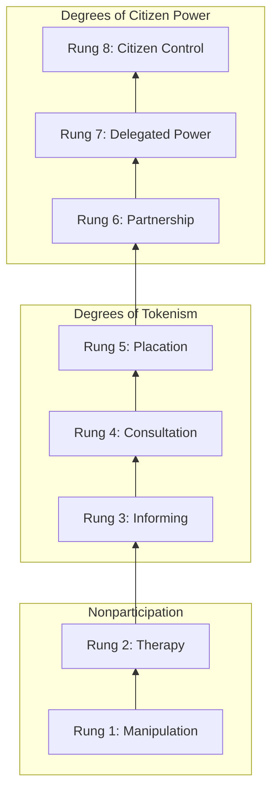

## Arnstein's Ladder of Citizen Participation

### Overview

Sherry Arnstein's "A Ladder of Citizen Participation," published in the *Journal of the American Institute of Planners* in 1969, remains the single most cited framework in participatory planning and SIA practice for evaluating the quality — not just the presence — of public participation. The ladder's central argument is that "citizen participation" is a category term covering a wide range of practices, some of which involve genuine redistribution of decision-making power and some of which are designed primarily to legitimize decisions already made. Arnstein's framework provides a typology for distinguishing between these.

### Core Argument

**Key Points**

- Participation is not a binary (present/absent) but a spectrum of power redistribution
- The central variable is the degree to which citizens can actually influence outcomes, not the degree to which they are informed or consulted
- Arnstein explicitly frames the ladder as a critique of participation processes that create an appearance of inclusion without substantive power-sharing

Arnstein's foundational claim is that citizen participation is a categorical term for citizen power and it is the redistribution of power that enables the have-not citizens, presently excluded from the political and economic processes, to be deliberately included in the future. She frames this redistribution as the mechanism by which those without power can help determine how programs affecting them are shaped, run, and evaluated.

Arnstein is notably direct about the emptiness of participation without power redistribution, arguing that the idea of citizen participation is a little like eating spinach: no one is against it in principle because it is good for you, and the phrase itself has been used to mean vastly different things by different actors. The ladder was constructed specifically to cut through this ambiguity.

### The Eight Rungs

**Key Points**

- Eight rungs are grouped into three broad categories: nonparticipation, degrees of tokenism, and degrees of citizen power
- Each rung represents a qualitatively different relationship between citizens and power-holders, not merely "more or less" participation
- Movement up the ladder corresponds to greater citizen control over outcomes, not merely more meetings or more information shared

Arnstein groups the eight rungs into nonparticipation (manipulation and therapy), degrees of tokenism (informing, consultation, and placation), and degrees of citizen power (partnership, delegated power, and citizen control), explaining that the ladder illustrates the point that having power guarantees the inclusion of citizens' views, whereas lacking it permits power-holders to educate or cure participants without their views being taken into account.

**Rung 1 — Manipulation**: The lowest rung, where participation structures (advisory committees, public boards) are used to "educate" or engineer support from citizens rather than to enable genuine citizen input, functioning as a public relations vehicle rather than a real partnership.

**Rung 2 — Therapy**: Participation is used as a form of group therapy disguised as citizen involvement — citizens are engaged, but the underlying goal is to adjust their attitudes and behavior rather than address the conditions causing their concerns.

**Rung 3 — Informing**: Citizens are told about their rights, responsibilities, and options, but this is frequently a one-way flow of information from officials to citizens, with no channel for feedback and no power to negotiate.

**Rung 4 — Consultation**: Citizens are asked for their opinions through surveys, public meetings, and hearings — but participation is measured by how many people attend, not by whether input actually changes outcomes; consultation without other participation modes is described as a hollow ritual.

**Rung 5 — Placation**: Citizens gain some real influence, though tokenism still constrains it — citizens may be placed on boards or committees, but they remain outnumbered by power-holders and lack the votes or leverage to make their inclusion consequential.

**Rung 6 — Partnership**: Power is genuinely redistributed through negotiation between citizens and power-holders, including shared planning and decision-making responsibilities, often formalized through joint committees or contractual agreements.

**Rung 7 — Delegated Power**: Citizens hold a clear majority of decision-making seats or veto power over a specific program or plan, meaning power-holders must negotiate rather than dictate outcomes.

**Rung 8 — Citizen Control**: Citizens or community-based organizations govern a program or institution entirely, with full managerial and policy control and no intermediary required to negotiate with outside authorities.

### SVG Diagram: Ladder Structure (svg_diagram)

<svg xmlns="http://www.w3.org/2000/svg" viewBox="0 0 500 620">
<text x="250" y="30" text-anchor="middle" font-size="18" font-weight="bold" font-family="sans-serif">Arnstein's Ladder of Citizen Participation (svg_diagram)</text>

<rect x="60" y="55" width="380" height="150" fill="#2e7d32" opacity="0.15" stroke="#2e7d32" stroke-width="1.5" />
<text x="70" y="72" font-size="13" font-weight="bold" fill="#2e7d32" font-family="sans-serif">Degrees of Citizen Power</text>
<rect x="90" y="80" width="320" height="35" fill="#2e7d32" opacity="0.85" />
<text x="250" y="103" text-anchor="middle" font-size="13" fill="white" font-family="sans-serif">8. Citizen Control</text>
<rect x="90" y="120" width="320" height="35" fill="#388e3c" opacity="0.85" />
<text x="250" y="143" text-anchor="middle" font-size="13" fill="white" font-family="sans-serif">7. Delegated Power</text>
<rect x="90" y="160" width="320" height="35" fill="#43a047" opacity="0.85" />
<text x="250" y="183" text-anchor="middle" font-size="13" fill="white" font-family="sans-serif">6. Partnership</text>

<rect x="60" y="215" width="380" height="150" fill="#f9a825" opacity="0.15" stroke="#f9a825" stroke-width="1.5" />
<text x="70" y="232" font-size="13" font-weight="bold" fill="#f57f17" font-family="sans-serif">Degrees of Tokenism</text>
<rect x="90" y="240" width="320" height="35" fill="#fbc02d" opacity="0.9" />
<text x="250" y="263" text-anchor="middle" font-size="13" fill="#3e2723" font-family="sans-serif">5. Placation</text>
<rect x="90" y="280" width="320" height="35" fill="#fdd835" opacity="0.9" />
<text x="250" y="303" text-anchor="middle" font-size="13" fill="#3e2723" font-family="sans-serif">4. Consultation</text>
<rect x="90" y="320" width="320" height="35" fill="#ffee58" opacity="0.9" />
<text x="250" y="343" text-anchor="middle" font-size="13" fill="#3e2723" font-family="sans-serif">3. Informing</text>

<rect x="60" y="375" width="380" height="110" fill="#c62828" opacity="0.15" stroke="#c62828" stroke-width="1.5" />
<text x="70" y="392" font-size="13" font-weight="bold" fill="#c62828" font-family="sans-serif">Nonparticipation</text>
<rect x="90" y="400" width="320" height="35" fill="#e53935" opacity="0.85" />
<text x="250" y="423" text-anchor="middle" font-size="13" fill="white" font-family="sans-serif">2. Therapy</text>
<rect x="90" y="440" width="320" height="35" fill="#ef5350" opacity="0.85" />
<text x="250" y="463" text-anchor="middle" font-size="13" fill="white" font-family="sans-serif">1. Manipulation</text>

<line x1="30" y1="480" x2="30" y2="95" stroke="black" stroke-width="2" marker-end="url(#arrow)" />
<text x="15" y="290" font-size="11" font-family="sans-serif" transform="rotate(-90 15,290)">Increasing citizen power</text>

<text x="250" y="510" text-anchor="middle" font-size="11" font-style="italic" font-family="sans-serif">Source: Arnstein (1969), Journal of the American Institute of Planners</text>

</svg>

### Critiques and Limitations

**Key Points**

- The ladder implies a linear hierarchy where "higher" is always better, which critics argue oversimplifies context-dependent participation needs
- Assumes a binary citizens-vs-power-holders structure that does not fully capture multi-stakeholder or multi-community contexts
- Does not address power differentials within the "citizen" category itself (elite capture, gender, class divisions among community members)
- Predates digital/online participation methods, requiring adaptation for contemporary practice

[Inference] Subsequent scholarship (e.g., Collins and Ison's critique, and various SIA methodology texts) has argued that full "citizen control" is not always appropriate or desired for every decision type, and that the ladder's implicit valorization of the top rung can obscure legitimate reasons for partnership-level rather than full-control arrangements; this is a widely discussed critique in participation theory literature rather than a claim made in Arnstein's original text.

### Application in SIA Practice

**Key Points**

- Used as a diagnostic tool to audit whether a proposed engagement plan constitutes genuine participation or tokenism
- Frequently cited in regulatory guidance and lender safeguard documentation (e.g., IFC, World Bank) as a benchmark for evaluating stakeholder engagement plans
- Practitioners use the ladder to set an explicit participation target rung at project outset, rather than allowing engagement level to default to the lowest-effort option

In SIA practice, the ladder functions less as a strict theoretical apparatus and more as an evaluative checklist: practitioners assess whether a project's stakeholder engagement plan sits at the "informing" or "consultation" rungs (common in minimum-compliance approaches) versus genuine "partnership" or "delegated power" arrangements (associated with co-designed mitigation and benefit-sharing agreements).

### Example

A proposed transmission line project holds three "information sessions" where a completed route design is presented to residents with a comment box for feedback that does not alter the route — this corresponds to Rung 3/4 (Informing/Consultation). By contrast, a project that convenes a community advisory board with real authority over route alternatives and mitigation fund allocation, with community representatives holding decision-making votes, corresponds to Rung 6/7 (Partnership/Delegated Power).

### Related Topics

- Consultation theater and tokenism in SIA engagement design
- IAP2 Spectrum of Public Participation (a widely used successor framework)
- Free, Prior, and Informed Consent (FPIC) as a citizen-control-adjacent standard
- Stakeholder engagement plan design for lender-financed (IFC/World Bank) projects
- Power analysis within communities (elite capture, intra-community stratification)
- Digital and online participation methods as ladder adaptations
- Collins and Ison's critique of the participation ladder model
- Benefit-sharing agreements as a partnership-rung mechanism