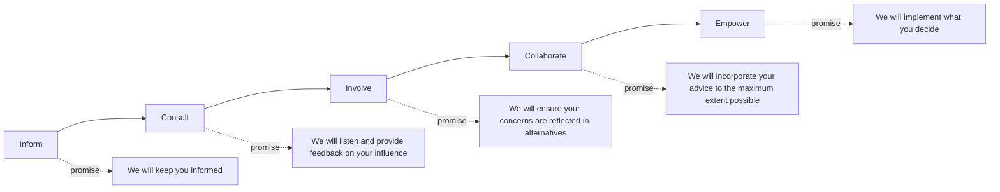

## IAP2 Spectrum of Public Participation

### Overview

The IAP2 Spectrum of Public Participation is a framework developed by the **International Association for Public Participation (IAP2)** that classifies public participation processes into five levels based on the degree of public influence on a final decision. Where Arnstein's Ladder frames participation primarily as a question of power redistribution with an implicit hierarchy of desirability, the IAP2 Spectrum reframes participation as a design choice — different levels are appropriate for different decisions, and higher is not automatically better. This makes it the dominant practical planning tool used by SIA practitioners and public agencies today, particularly in North America, Australia, and increasingly in international development contexts.

### Core Design Philosophy

**Key Points**

- Each level of the spectrum represents an increasing level of public impact on the decision, explicitly framed as a spectrum rather than a value-ranked hierarchy
- The appropriate level is selected based on the nature of the decision, not treated as a universal aspiration toward maximum participation
- Each level carries an explicit "promise to the public" stating what the organization commits to do with public input

Unlike Arnstein's ladder, which frames movement toward "citizen control" as inherently progressive, the IAP2 Spectrum explicitly avoids ranking levels as better or worse. Instead, it presents them as different tools suited to different circumstances — a purely informational regulatory notice does not require the same participation design as a contentious land-use rezoning decision. The framework's central innovation is pairing each level with a **public participation goal** and a **promise to the public**, making the level of engagement an explicit, negotiated commitment rather than an ambiguous aspiration.

### The Five Levels

**Key Points**

- Inform, Consult, Involve, Collaborate, Empower — increasing order of public influence on the decision
- Each level has a distinct goal, a distinct promise to the public, and associated typical techniques
- Selecting a level requires an honest assessment of how much decision-making latitude genuinely exists

**Level 1 — Inform**

- **Goal**: Provide the public with balanced and objective information to help them understand a problem, alternatives, opportunities, or solutions.
- **Promise to the Public**: We will keep you informed.
- **Typical techniques**: Fact sheets, websites, open houses, public notices.

**Level 2 — Consult**

- **Goal**: Obtain public feedback on analysis, alternatives, or decisions.
- **Promise to the Public**: We will keep you informed, listen to and acknowledge concerns, and provide feedback on how public input influenced the decision.
- **Typical techniques**: Public comment periods, surveys, focus groups, public meetings.

**Level 3 — Involve**

- **Goal**: Work directly with the public throughout the process to ensure that public concerns and aspirations are consistently understood and considered.
- **Promise to the Public**: We will work with you to ensure your concerns and aspirations are directly reflected in alternatives developed, and provide feedback on how input influenced the decision.
- **Typical techniques**: Workshops, deliberative polling, advisory committees.

**Level 4 — Collaborate**

- **Goal**: Partner with the public in each aspect of the decision, including development of alternatives and identification of the preferred solution.
- **Promise to the Public**: We will look to you for advice and innovation in formulating solutions and incorporate your advice and recommendations to the maximum extent possible.
- **Typical techniques**: Citizen advisory committees, consensus-building, participatory decision-making.

**Level 5 — Empower**

- **Goal**: Place final decision-making in the hands of the public.
- **Promise to the Public**: We will implement what you decide.
- **Typical techniques**: Citizen juries, ballots, delegated decision authority, participatory budgeting.

### SVG Diagram: IAP2 Spectrum (svg_diagram)

<svg xmlns="http://www.w3.org/2000/svg" viewBox="0 0 700 260">
<text x="350" y="28" text-anchor="middle" font-size="17" font-weight="bold" font-family="sans-serif">IAP2 Spectrum of Public Participation (svg_diagram)</text>
<line x1="40" y1="80" x2="660" y2="80" stroke="black" stroke-width="2" marker-end="url(#arrow2)" />
<text x="350" y="70" text-anchor="middle" font-size="11" font-family="sans-serif" font-style="italic">Increasing level of public impact on the decision</text>

<rect x="40" y="95" width="110" height="45" fill="#1565c0" opacity="0.85" />
<text x="95" y="122" text-anchor="middle" font-size="13" fill="white" font-family="sans-serif">Inform</text>

<rect x="165" y="95" width="110" height="45" fill="#1976d2" opacity="0.85" />
<text x="220" y="122" text-anchor="middle" font-size="13" fill="white" font-family="sans-serif">Consult</text>

<rect x="290" y="95" width="110" height="45" fill="#388e3c" opacity="0.85" />
<text x="345" y="122" text-anchor="middle" font-size="13" fill="white" font-family="sans-serif">Involve</text>

<rect x="415" y="95" width="110" height="45" fill="#f57f17" opacity="0.85" />
<text x="470" y="122" text-anchor="middle" font-size="13" fill="white" font-family="sans-serif">Collaborate</text>

<rect x="540" y="95" width="110" height="45" fill="#c62828" opacity="0.85" />
<text x="595" y="122" text-anchor="middle" font-size="13" fill="white" font-family="sans-serif">Empower</text>

<text x="95" y="165" text-anchor="middle" font-size="10" font-family="sans-serif">Fact sheets,</text>

<text x="95" y="178" text-anchor="middle" font-size="10" font-family="sans-serif">open houses</text>

<text x="220" y="165" text-anchor="middle" font-size="10" font-family="sans-serif">Comment periods,</text>

<text x="220" y="178" text-anchor="middle" font-size="10" font-family="sans-serif">surveys</text>

<text x="345" y="165" text-anchor="middle" font-size="10" font-family="sans-serif">Workshops,</text>

<text x="345" y="178" text-anchor="middle" font-size="10" font-family="sans-serif">advisory panels</text>

<text x="470" y="165" text-anchor="middle" font-size="10" font-family="sans-serif">Consensus</text>

<text x="470" y="178" text-anchor="middle" font-size="10" font-family="sans-serif">building</text>

<text x="595" y="165" text-anchor="middle" font-size="10" font-family="sans-serif">Citizen juries,</text>

<text x="595" y="178" text-anchor="middle" font-size="10" font-family="sans-serif">participatory budgets</text>

<text x="350" y="220" text-anchor="middle" font-size="11" font-style="italic" font-family="sans-serif">Source: International Association for Public Participation (IAP2)</text>

</svg>

### Comparison with Arnstein's Ladder

**Key Points**

- IAP2 is normatively neutral about which level is "best"; Arnstein's ladder implicitly treats higher rungs as more legitimate
- IAP2's five levels do not map one-to-one onto Arnstein's eight rungs, though rough correspondences exist
- IAP2 is designed as a practical planning and commissioning tool; Arnstein's ladder functions more as a critical/diagnostic lens

| IAP2 Level | Rough Arnstein Correspondence |
| --- | --- |
| Inform | Rung 3 (Informing) |
| Consult | Rung 4 (Consultation) |
| Involve | Rung 5 (Placation), moving toward Rung 6 |
| Collaborate | Rung 6–7 (Partnership, Delegated Power) |
| Empower | Rung 8 (Citizen Control) |

[Inference] This correspondence is an approximate conceptual mapping commonly drawn in participation theory teaching materials rather than an official cross-reference maintained by IAP2 or stated by Arnstein; practitioners should treat it as illustrative rather than a precise equivalence.

### Application in SIA Practice

**Key Points**

- Used to design and document a **Stakeholder Engagement Plan (SEP)**, specifying which spectrum level applies to which decision or project phase
- A single project frequently uses different spectrum levels for different decisions — e.g., "Inform" for technical/engineering specifications, "Collaborate" for resettlement site selection
- Referenced explicitly in IFC and World Bank stakeholder engagement guidance as a structuring tool

In practice, SIA and community engagement professionals use the spectrum to avoid a common failure mode: promising a higher level of influence than the decision-making structure actually allows, which generates the "consultation theater" critique associated with Arnstein's tokenism rungs. By selecting and explicitly communicating the intended spectrum level in advance, practitioners aim to set accurate expectations and reduce trust erosion when the promised level of input.

### Example

A utility company planning a new substation might apply: "Inform" for the technical specifications of the substation equipment (non-negotiable engineering requirements); "Consult" for the general project timeline and construction impact mitigation; and "Collaborate" for selecting among several viable site location options, where community input directly shapes the final site choice through a joint working group.

### Related Topics

- Arnstein's Ladder of Citizen Participation and its critique of tokenism
- Stakeholder Engagement Plan (SEP) design and documentation standards
- IFC Performance Standard 1 stakeholder engagement requirements
- Consultation fatigue and engagement design for long-running projects
- Deliberative democracy methods (citizen juries, deliberative polling)
- Participatory budgeting as an "Empower"-level mechanism
- Grievance redress mechanisms as a complement to spectrum-level engagement
- Cross-cultural adaptation of Western participation frameworks