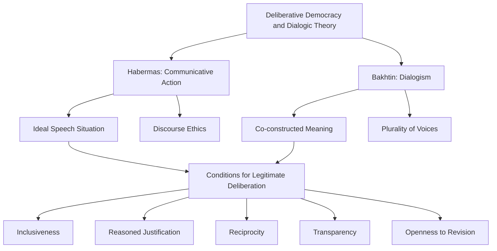

## Deliberative Democracy and Dialogic Theory

### Overview

Deliberative democracy and dialogic theory provide the philosophical foundation underlying the highest levels of both Arnstein's Ladder and the IAP2 Spectrum. Where earlier participation frameworks describe *what* levels of influence citizens should have, deliberative democracy theory addresses *why* and *how* genuine participation should function as a communicative process — specifically, through reasoned dialogue among free and equal citizens aimed at reaching mutual understanding or legitimate collective decisions, rather than through aggregating pre-formed preferences via voting or surveys. This theoretical tradition, drawing heavily on the work of Jürgen Habermas, gives SIA practitioners a normative basis for designing engagement processes as spaces of genuine dialogue rather than one-way information transfer or simple preference aggregation.

### Theoretical Foundations

**Key Points**

- Rooted primarily in Jürgen Habermas's theory of communicative action and discourse ethics
- Distinguishes "communicative rationality" (oriented toward mutual understanding) from "strategic rationality" (oriented toward achieving one's own predetermined ends)
- Legitimacy of a decision derives from the quality of the deliberative process, not merely from majority preference or expert authority

Habermas's theory of **communicative action** distinguishes between two orientations actors can take toward one another: strategic action, where participants treat each other as means to achieving their own goals, and communicative action, where participants seek mutual understanding through reasoned exchange, treating validity claims (truth, sincerity, normative rightness) as open to challenge and justification. Deliberative democracy theory extends this into political and planning contexts, arguing that decisions gain legitimacy when they result from a process meeting conditions of open, reasoned, inclusive dialogue rather than from raw power, strategic manipulation, or simple vote-counting.

Central to this framework is the concept of the **ideal speech situation** — a theoretical benchmark in which all participants have equal opportunity to speak, no one is coerced, and only the "force of the better argument" determines outcomes. While treated as an unattainable ideal rather than a practical design target, it functions as a critical yardstick against which real-world participation processes can be evaluated for distortions caused by power imbalances, unequal access to information, or unequal capacity to articulate positions persuasively.

### Dialogic Theory

**Key Points**

- Draws additionally on Mikhail Bakhtin's dialogism, emphasizing meaning as co-constructed between speakers rather than transmitted from one party to another
- Values the ongoing, unfinalized nature of dialogue over the goal of reaching a single consensus position
- Complements deliberative democracy's emphasis on reasoned argument with attention to narrative, multiple voices, and plurality of perspective

Dialogic theory, particularly as developed from Bakhtin's literary and linguistic work, contributes a distinct emphasis: meaning and understanding are not transmitted intact from speaker to listener but are actively co-constructed in the interaction between them. Applied to community engagement, this suggests that an SIA process should not treat community input as raw data to be extracted and then interpreted unilaterally by experts, but as an ongoing exchange in which community members' own framings and the practitioner's technical framings mutually shape the eventual understanding of an issue.

This dialogic emphasis also pushes back gently against a purely consensus-oriented reading of deliberative democracy: rather than treating disagreement as a problem to be resolved into unanimous agreement, dialogic approaches often treat the surfacing and preservation of multiple, sometimes irreconcilable perspectives as itself a valuable outcome, particularly relevant in culturally plural communities.

### Core Conditions for Legitimate Deliberation

**Key Points**

- Inclusiveness: all affected parties, particularly marginalized voices, must have genuine access to the process
- Reasoned justification: participants offer reasons for positions rather than simply asserting preferences or exercising power
- Reciprocity and mutual respect: participants engage with each other's arguments in good faith
- Transparency: the process and its outcomes are open to scrutiny
- Openness to revision: participants must be willing to change their views in light of persuasive arguments

These conditions function as a practical checklist for evaluating whether an engagement process approximates deliberative ideals. SIA practitioners use variants of this checklist to assess whether a stakeholder workshop, advisory panel, or citizen assembly meets minimum standards of deliberative legitimacy, versus functioning as a forum for pre-existing power dynamics to simply reassert themselves under a participatory label.

### Critiques and Practical Limitations

**Key Points**

- Critics argue the ideal speech situation presupposes equal communicative capacity that structural inequality (education, language, cultural norms) undermines in practice
- Feminist and postcolonial scholars (notably Iris Marion Young) argue deliberative norms privilege dominant cultural communication styles (argument, dispassionate reasoned speech) over other legitimate modes (testimony, storytelling, greeting)
- Deliberation can be time- and resource-intensive, creating tension with project timelines and the capacity of already-burdened community members to participate extensively

[Inference] A frequently cited critique, associated with Iris Marion Young's work on communicative democracy, holds that formal deliberative norms emphasizing dispassionate argumentation can systematically disadvantage speakers from cultural traditions where testimony, narrative, or emotional expression are the primary legitimate modes of communication; this is a well-established position in deliberative democracy critique literature, presented here as a documented scholarly critique rather than an uncontested empirical finding.

This critique has directly influenced SIA methodology by pushing practitioners toward accepting a wider range of input formats — storytelling circles, oral history, art-based methods — as legitimate deliberative contributions rather than requiring all input to take the form of structured argument.

### Application in SIA Practice

**Key Points**

- Provides the theoretical justification for methods like citizen juries, deliberative polling, and consensus conferences used at the "Collaborate" and "Empower" levels of the IAP2 Spectrum
- Informs facilitation design: skilled, neutral facilitation is treated as essential infrastructure for approximating deliberative conditions
- Used to critique engagement processes that technically include diverse voices but structurally privilege certain communication styles or power positions

In SIA practice, deliberative democracy theory most directly informs the design of **deliberative polling** and **citizen juries** — structured processes in which a representative sample of community members receives balanced information, engages in facilitated small-group and plenary discussion, and arrives at informed collective judgments, often measured through pre- and post-deliberation surveys to assess opinion change resulting from the deliberative process itself.

### Example

A proposed landfill siting decision might use a citizen jury: a demographically representative panel of residents receives balanced technical briefings from both project proponents and independent experts, engages in facilitated small-group deliberation over several sessions, and produces a set of recommendations. The legitimacy of the outcome rests not on the panel being a statistically perfect sample, but on the quality of the deliberative process — whether participants had genuine opportunity to question experts, challenge each other's assumptions, and revise initial positions based on the exchange.

### Related Topics

- Habermas's theory of communicative action and discourse ethics
- Iris Marion Young's critique of deliberative democracy and communicative democracy alternative
- Citizen juries and deliberative polling methodology (James Fishkin)
- IAP2 Spectrum "Collaborate" and "Empower" levels as deliberative applications
- Facilitation design and neutral third-party facilitation standards
- Narrative and storytelling methods as alternative deliberative input formats
- Consensus conferences and mini-publics in environmental decision-making
- Power analysis in deliberative settings (whose voice dominates discussion)