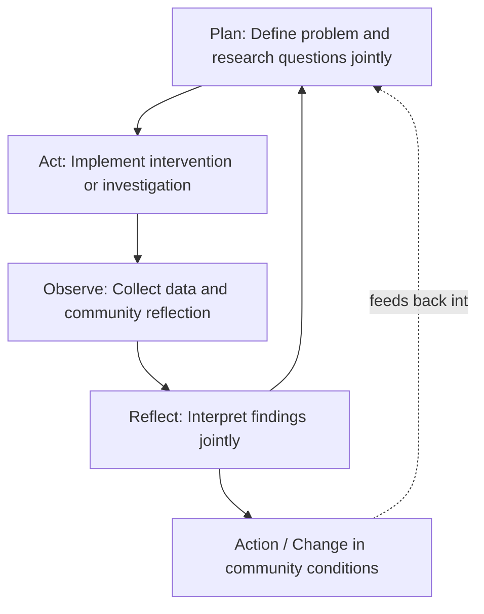

## Participatory Action Research Foundations

### Overview

Participatory Action Research (PAR) is a research paradigm in which the people affected by an issue are not merely subjects of study but co-researchers who help define research questions, collect and interpret data, and act on findings. It represents the most methodologically radical departure from conventional expert-driven SIA, fusing anthropology's participant-observation tradition with an explicit political commitment to using research as a tool for community empowerment and social change. PAR provides the methodological foundation for SIA processes operating at the "Collaborate" and "Empower" levels of the IAP2 Spectrum and the upper rungs of Arnstein's Ladder.

### Theoretical Origins

**Key Points**

- Traces to Kurt Lewin's mid-20th-century action research, which framed research and social action as an integrated cycle rather than separate activities
- Substantially shaped by Paulo Freire's critical pedagogy and concept of "conscientização" (critical consciousness)
- Influenced by participatory rural appraisal (PRA) traditions developed by Robert Chambers in international development contexts

Kurt Lewin's action research, developed in the 1940s, first proposed that social research should proceed as an iterative cycle of planning, action, and fact-finding about the results of the action, explicitly rejecting the separation between researcher and the social context under study. This provided the basic **cyclical methodology** — plan, act, observe, reflect — that PAR retains.

Paulo Freire's *Pedagogy of the Oppressed* (1970) added the essential political and pedagogical dimension. Freire argued that genuine education and knowledge production should be dialogic rather than a "banking" process where experts deposit knowledge into passive recipients, and introduced **conscientização** — the process by which people, through reflection and action on their own conditions, develop a critical awareness that enables them to transform the structures oppressing them. This concept reframes research itself as a potential tool of either domination or liberation, depending on who controls it.

**Robert Chambers'** participatory rural appraisal (PRA) work in the 1980s–1990s, developed largely in international development contexts, contributed practical field methods — participatory mapping, seasonal calendars, wealth ranking, transect walks — that translated PAR's philosophical commitments into concrete, replicable techniques usable by communities with limited formal literacy or technical training.

### Core Methodological Commitments

**Key Points**

- Co-generation of knowledge: research questions, methods, and interpretation are shaped jointly by researchers and community members, not determined solely by external experts
- Action orientation: research is explicitly aimed at producing change, not only generating knowledge for its own sake
- Iterative, cyclical process: research proceeds through repeated cycles of planning, action, observation, and reflection rather than a single linear study
- Capacity building: the process aims to build community members' own research and analytical skills, not just extract information

PAR inverts the conventional research relationship. Rather than an external expert designing a study, collecting data from a community, and publishing findings elsewhere, PAR positions community members as co-investigators throughout the entire research cycle — including deciding what questions matter, how to investigate them, what the findings mean, and what actions should follow.

### Distinguishing PAR from Conventional Consultative SIA

**Key Points**

- Conventional SIA typically treats community members as data sources whose input is collected, then analyzed and interpreted by external experts
- PAR treats community members as co-analysts with genuine authority over interpretation and, often, over what actions follow from findings
- The distinction maps closely onto the difference between IAP2's "Consult" level and its "Collaborate"/"Empower" levels

| Dimension | Conventional Consultative SIA | Participatory Action Research |
| --- | --- | --- |
| Who sets research questions | External experts/agency | Jointly, or community-led |
| Who collects data | Trained researchers | Community members, often trained as co-researchers |
| Who interprets findings | External experts | Jointly, through collective reflection |
| Primary output | Report for decision-makers | Report and community-driven action |
| Power relationship | Extractive | Collaborative/emancipatory |

### Methods Commonly Used in PAR

**Key Points**

- Participatory mapping — community members produce spatial representations of resources, land use, and impacts
- Transect walks — structured walks through a community/landscape with residents narrating observations
- Photovoice — community members photograph aspects of their lived experience, followed by group discussion and analysis
- Community scorecards and wealth ranking — locally defined criteria used to assess wellbeing or service quality
- Most significant change technique — community members collect and select narrative accounts of change they consider most significant

These methods share a common design principle: they use accessible, often visual or narrative formats that do not require formal literacy or statistical training, enabling genuine co-analysis rather than requiring community members to adapt to researcher-defined quantitative instruments.

### Ethical and Practical Considerations

**Key Points**

- Requires sustained time investment, often conflicting with compressed regulatory SIA timelines
- Raises questions about compensation, recognition, and ownership of co-produced knowledge
- Risk of "participation fatigue" if communities are repeatedly engaged without visible follow-through on findings
- Power dynamics within the community itself (who becomes a co-researcher, who is excluded) require active management to avoid replicating existing inequalities

[Inference] PAR's emphasis on extended, iterative engagement is frequently difficult to reconcile with regulatory or lender-mandated SIA timelines measured in weeks or months, which is widely acknowledged in SIA methodology literature as a structural tension rather than a flaw specific to any one project; practitioners often adopt "PAR-informed" hybrid approaches that borrow specific participatory techniques without committing to the full PAR cycle, given these time constraints.

### Application in SIA Practice

**Key Points**

- Full PAR is more common in academic, NGO-led, or long-term community development contexts than in time-bound regulatory SIA
- Elements of PAR (participatory mapping, photovoice, community-led indicator development) are increasingly incorporated into formal SIA and ESIA processes, particularly for resettlement and indigenous engagement contexts
- PAR principles inform monitoring and evaluation design, where communities co-define what "success" or "acceptable impact" means rather than external experts defining metrics unilaterally

### Example

In assessing impacts of a proposed irrigation scheme, a PAR-informed SIA might train local residents as co-researchers who conduct household interviews using questions the community itself helped design, facilitate community mapping sessions to identify water-dependent livelihoods and sacred sites, and jointly analyze the findings with the external research team to co-author recommendations — as opposed to a conventional approach where an external team designs a survey instrument, collects responses, and produces findings independently.

### Related Topics

- Paulo Freire's critical pedagogy and conscientização
- Robert Chambers and participatory rural appraisal (PRA) methods
- Participatory mapping and photovoice as SIA data collection methods
- Kurt Lewin's action research cycle
- Most Significant Change (MSC) technique for participatory monitoring and evaluation
- Community-based participatory research (CBPR) in public health contexts
- Power dynamics and elite capture risk within participatory processes
- Hybrid "PAR-informed" methods for time-bound regulatory SIA