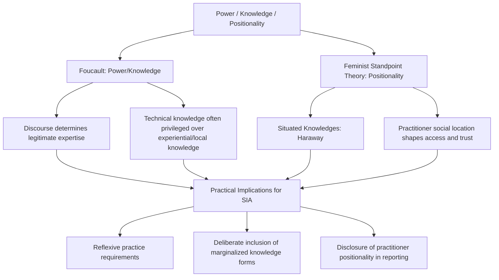

## Power, Knowledge, and Positionality in Engagement

### Overview

Every participation framework covered so far — Arnstein's Ladder, the IAP2 Spectrum, deliberative democracy, and PAR — rests on an underlying assumption that must itself be examined: that power and knowledge are not neutral background conditions of engagement but active forces that shape who speaks, whose knowledge counts as valid, and whose interests get served by a given process. This section addresses the critical theoretical apparatus — drawn substantially from Michel Foucault's power/knowledge framework and feminist standpoint theory's concept of positionality — that SIA practitioners use to interrogate their own role and the structural dynamics of the engagement processes they design.

### Foucauldian Power/Knowledge

**Key Points**

- Foucault's central claim is that power and knowledge are mutually constitutive — power produces knowledge, and knowledge exercises power, rather than knowledge being a neutral tool that power merely uses
- Rejects a purely repressive model of power (power as something that only prohibits or restricts) in favor of a productive model (power that shapes what can be known, said, and thought)
- Introduces the concept of "discourse" as a structured way of talking about and knowing a topic that determines what counts as legitimate expertise

Michel Foucault's power/knowledge framework, developed primarily through his analyses of institutions like prisons, clinics, and psychiatric hospitals, argues that what a society treats as valid "truth" or "expertise" is inseparable from the power relations that produce and authorize it. Applied to SIA, this framework raises a pointed question: when a technical expert's quantitative social indicator report is treated as more authoritative than a community elder's experiential account of the same impact, this hierarchy of credibility is not a neutral epistemic fact but itself a product of institutionalized power relations — which forms of knowledge (scientific, bureaucratic, technical) have historically been authorized as legitimate, and which forms (oral tradition, local ecological knowledge, lived experience) have been marginalized.

This has direct practical implications for SIA methodology: it explains why purely "expert-driven" impact prediction, however methodologically rigorous by conventional standards, can still reproduce power imbalances by systematically privileging externally legible, quantifiable forms of evidence over locally meaningful but less easily quantified forms of harm (loss of cultural continuity, disruption of spiritual relationships to land, erosion of intergenerational knowledge transmission).

### Positionality

**Key Points**

- Positionality refers to the researcher's or practitioner's own social location — race, gender, class, nationality, institutional affiliation — and how it shapes what they can see, whom they can access, and how their presence is interpreted by community members
- Rooted in feminist standpoint theory, which argues that knowledge is always situated and partial rather than a neutral "view from nowhere"
- Requires reflexive practice: practitioners are expected to explicitly acknowledge and account for their own positionality rather than presenting findings as objective and interest-free

Feminist standpoint theory, associated with scholars such as Sandra Harding and Donna Haraway, challenges the notion of a detached, objective observer producing value-neutral knowledge. Haraway's concept of **situated knowledges** argues that all knowledge claims are produced from a particular embodied, historically and socially located position, and that acknowledging this situatedness — rather than falsely claiming an impossible "view from everywhere" or "view from nowhere" — is itself a condition for more rigorous and accountable knowledge production.

For an SIA practitioner, positionality has concrete, practical consequences. An outside consultant flown in for a two-week assessment, a government-affiliated researcher, and a local community-based researcher will each be perceived differently by community members, granted different levels of trust and candor, and will consequently generate different — not equally complete — pictures of community concerns. A foreign or urban-based practitioner assessing a rural indigenous community's impacts is differently positioned than a practitioner who shares the community's language, history, or social location, and this positioning shapes both data access and interpretation, regardless of methodological rigor.

### Reflexivity as Methodological Practice

**Key Points**

- Reflexivity requires practitioners to critically examine and disclose how their own identity, institutional affiliation, and assumptions shape the research process and findings
- Commonly implemented through positionality statements in reports, reflexive field journals, and peer debriefing
- Distinguished from mere bias disclosure — reflexivity is an ongoing analytical practice throughout the research process, not a one-time disclaimer

Reflexive practice asks practitioners to treat their own presence and perspective as part of the object of analysis, not simply a neutral instrument collecting data about an external community. A **positionality statement**, increasingly common in academic and some applied SIA reporting, explicitly names the practitioner's relevant social location and institutional relationships and discusses how these may have shaped data access, participant candor, and interpretation.

### Power Mapping and Stakeholder Analysis

**Key Points**

- Power mapping is a practical technique for identifying which actors hold formal and informal power over a decision, and which groups are structurally excluded from influence
- Distinguishes formal power (regulatory authority, land title) from informal power (social status, traditional authority, information control)
- Used to identify groups at risk of being systematically underrepresented in standard consultation processes (women, youth, informal settlers, migrant workers, those without land title)

Practical SIA methodology translates power/knowledge and positionality theory into a concrete tool: **power mapping**, which identifies stakeholders not just by their stake in outcomes but by their relative power to influence the process itself. This is used specifically to identify who is likely to be marginalized by a "neutral" consultation process — for instance, a public meeting format may systematically favor those with formal education, fluency in the dominant language, and social confidence to speak in public settings, effectively silencing women in gender-segregated societies, non-native speakers, or those in subordinate social positions who face social sanction for speaking against community leaders.

### Practical Implications for SIA Design

**Key Points**

- Diversify evidence types accepted as legitimate: oral testimony, ethnographic observation, and community-generated data alongside quantitative indicators
- Actively design engagement formats to counteract predictable exclusions identified through power mapping (separate women's focus groups, youth-specific sessions, translated materials)
- Disclose practitioner positionality and funding relationships in SIA reporting as a transparency and accountability measure
- Treat "who is not in the room" as an active analytical question, not an incidental gap

[Inference] Because these theoretical frameworks originate primarily in critical social theory rather than technical impact-assessment methodology, their translation into standard operating procedures varies considerably across SIA practice; some practitioners and institutions apply them rigorously through formal power mapping and reflexivity requirements, while others reference them only nominally, and this variation is a recognized gap between SIA theory and practice discussed in the methodological literature.

### Example

An SIA team assessing a large agricultural land acquisition holds an initial public meeting that draws primarily male landholders with formal title, while women who perform most of the agricultural labor but hold no formal land rights are largely absent. A power/positionality-informed redesign would explicitly map this exclusion, convene separate women's focus groups facilitated by a female team member, and treat women's assessment of impacts on informal land use and food security as evidence with equal standing to the formal titleholders' input — rather than treating the initial meeting's attendance as representative of "the community."

### Related Topics

- Foucault's discourse analysis and its application to expert/lay knowledge hierarchies
- Feminist standpoint theory and Donna Haraway's situated knowledges
- Power mapping and stakeholder analysis methodology
- Intersectionality and its application to differentiated impact analysis
- Positionality statements and reflexive reporting standards
- Gender-disaggregated consultation design (separate focus groups, translated materials)
- Local and indigenous knowledge systems as legitimate evidence
- Practitioner independence and funding-relationship disclosure