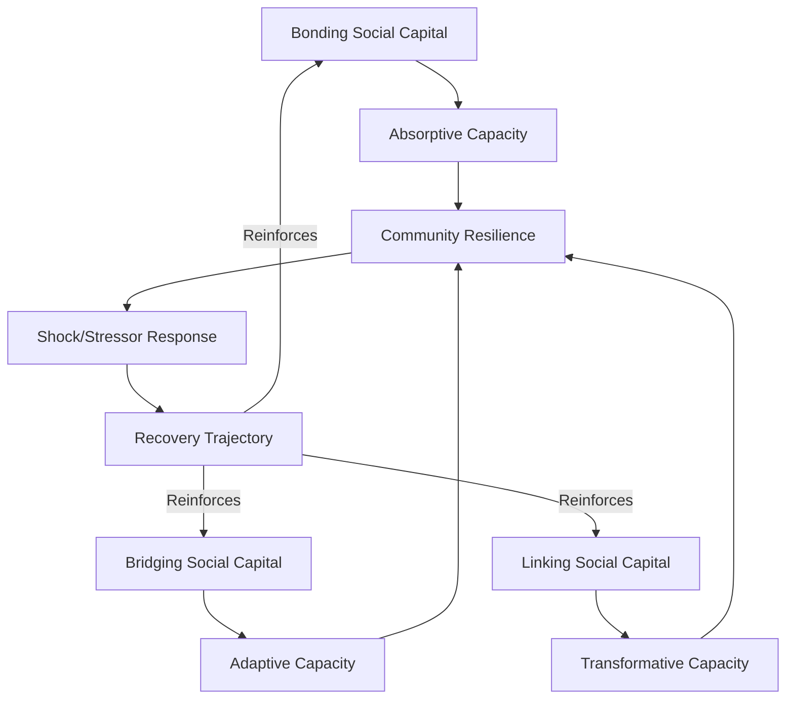

## Social capital and community resilience theory

### Definition and Core Constructs

**Social capital** refers to the networks, norms of reciprocity, and interpersonal trust that enable coordinated action among members of a community. In Community Engagement and Social Impact Assessment (SIA) practice, social capital is treated as a measurable community asset that mediates how populations absorb, adapt to, and recover from disruptions — including those induced by development projects, infrastructure interventions, or external shocks.

**Community resilience** is the capacity of a social system to anticipate, withstand, adapt to, and recover from stressors (economic, environmental, or project-induced) while retaining core functions, identity, and structure. Social capital is widely treated in the SIA literature as a primary determinant of this capacity, functioning as the connective tissue that allows collective resources — information, labor, mutual aid, political voice — to be mobilized under stress.

### The Three Forms of Social Capital (Putnam/Woolcock Typology)

The dominant analytical framework in SIA divides social capital into three structurally distinct forms, each with different implications for resilience outcomes.

#### Bonding Social Capital

Ties within homogeneous groups sharing identity, kinship, or immediate locality (extended family, ethnic enclave, faith congregation). Bonding capital provides:

- Emotional and material support during acute shocks (mutual aid, informal lending, shared labor)
- Rapid, low-cost coordination due to high trust and shared norms
- **Risk**: can produce insularity, exclusion of outsiders, and resistance to external assistance or change — sometimes termed the "dark side" of social capital

#### Bridging Social Capital

Horizontal ties across heterogeneous groups (different ethnicities, occupations, or neighborhoods) that share roughly equal social standing. Bridging capital provides:

- Diffusion of information, innovation, and resources across group boundaries
- Broader coalition-building for collective action (e.g., cross-sector disaster response)
- Dilution of intergroup conflict through repeated positive contact

#### Linking Social Capital

Vertical ties connecting community members to individuals or institutions holding formal power or authority (government agencies, financial institutions, NGOs, project proponents). Linking capital provides:

- Access to external resources, subsidies, and formal recovery assistance
- Political voice and representation in decision-making forums
- Channels for grievance redress and accountability

**[Inference]** In SIA baseline assessments, communities exhibiting strong bonding capital but weak linking capital are frequently identified as more vulnerable to project-induced displacement, because they possess internal cohesion but limited capacity to negotiate terms with external authorities.

### Theoretical Lineage

| Theorist | Contribution | Core Emphasis |
| --- | --- | --- |
| Pierre Bourdieu (1986) | Social capital as a resource convertible to economic/cultural capital, embedded in durable networks | Structural, power-and-class oriented |
| James Coleman (1988) | Social capital as a function facilitating action within a social structure | Functionalist, closure-of-networks focus |
| Robert Putnam (1995, 2000) | Social capital as civic norms, networks, and trust that enable collective action at the societal level | Communitarian, associational-life focus |
| Michael Woolcock (1998, 2001) | Synthesis introducing the bonding/bridging/linking typology; ties social capital explicitly to development outcomes | Applied/operational, World Bank framework |

**[Unverified]** The relative explanatory weight given to Bourdieu's structural-power framing versus Putnam's communitarian framing varies significantly across SIA practitioner traditions and is not settled in the literature; practitioners should specify which lineage informs a given assessment instrument.

### Social Capital as a Resilience Mechanism

Community resilience theory (drawing on socio-ecological systems literature, e.g., Adger 2000, Norris et al. 2008) positions social capital as one of several interacting capacities:

$$R_c = f(SC, EC, IC, CC)$$

Where $R_c$ is community resilience capacity, $SC$ is social capital, $EC$ is economic capital, $IC$ is institutional capacity, and $CC$ is community competence (collective problem-solving skill). This is a conceptual, not empirically fitted, formulation used to structure multi-capital resilience assessments in SIA frameworks — **[Inference]** its use is heuristic rather than a validated predictive model.

Norris, Stevens, Pfefferbaum, Wyche, and Pfefferbaum's (2008) widely cited framework identifies **four primary resilience capacities**, of which social capital (termed "social resources") is one:

1. Economic development
2. Social capital
3. Information and communication
4. Community competence

Resilient communities are theorized to exhibit these capacities as *dynamic adaptive processes* rather than static stocks — the emphasis is on a community's ability to mobilize and re-organize resources following disturbance, not merely on possessing them beforehand.

### Diagram: Social Capital Contribution to Resilience Pathway

This pathway reflects a widely used tripartite resilience capacity model (Béné et al., 2012): **absorptive capacity** (coping with shocks using existing resources), **adaptive capacity** (adjusting behaviors/livelihoods), and **transformative capacity** (systemic change enabled by governance access) — each disproportionately fed by a different form of social capital.

### Application in Social Impact Assessment

#### Baseline Social Capital Mapping

SIA practitioners typically operationalize social capital assessment through:

- **Social network analysis (SNA)**: mapping node (individual/household/organization) relationships and measuring density, centrality, and clustering coefficients
- **Household surveys** using validated instruments (e.g., the World Bank's Social Capital Assessment Tool, SOCAT; or the Integrated Questionnaire for the Measurement of Social Capital, SC-IQ)
- **Key informant interviews** with community leaders, elders, and formal/informal authority figures
- **Participatory mapping** of associational membership, mutual aid networks, and trust relationships

#### Key Indicators Commonly Used

- **Structural social capital**: group membership density, network size, frequency of interaction, associational diversity
- **Cognitive social capital**: generalized trust, perceived reciprocity, sense of belonging, shared norms
- **Density of civic associations**: cooperatives, religious groups, farmer associations, women's groups
- **Collective action history**: prior successful instances of community-organized response to shocks

#### Impact Pathway Analysis

A rigorous SIA traces how a proposed project intervention (e.g., resettlement, land acquisition, extractive operations) may erode or strengthen each form of social capital, and models downstream resilience effects:

**Example**: A hydropower resettlement scheme that physically disperses a previously co-located community fragments bonding capital (loss of proximity-based mutual aid) even if bridging/linking capital is nominally preserved through resettlement committees. **[Inference]** This fragmentation effect is one of the most consistently documented negative externalities in involuntary resettlement literature (following Cernea's Impoverishment Risks and Reconstruction model), though the magnitude varies by resettlement design and host-community integration approach.

### Risks and Critiques of the Framework

- **Reification risk**: treating social capital as an inherent community "stock" rather than a relational, context-dependent, and power-inflected process; Bourdieusian critics argue this obscures how elites capture the benefits of network access
- **Instrumentalization critique**: development agencies may treat social capital as a substitute for state investment ("communities will self-organize"), shifting burden of resilience onto under-resourced populations
- **Measurement validity**: proxy indicators (association membership counts, trust survey scores) are contested as weak operationalizations of a multidimensional, context-specific construct
- **Dark side effects**: strong bonding capital can entrench exclusionary practices, gender-based restrictions, or resistance to beneficial external interventions (e.g., vaccination programs, land reform)

**[Speculation]** Some practitioners argue that digital/virtual social capital (online diaspora networks, social media-mediated mutual aid) is becoming an increasingly significant fourth category alongside bonding/bridging/linking, though this is not yet standardized in mainstream SIA instruments.

### Practical SIA Workflow Integration

1. **Pre-project baseline**: conduct SNA and SC-IQ survey to establish pre-intervention social capital profile across all three forms
2. **Impact prediction**: model which project activities (land take, displacement, in-migration of workers, changes to livelihood patterns) are likely to disrupt specific network types
3. **Mitigation design**: propose measures such as phased resettlement preserving kinship clusters, formation of new bridging institutions (resettlement committees, livelihood cooperatives), and formalized linking mechanisms (grievance redress committees with government liaison)
4. **Monitoring**: track longitudinal indicators (association membership rates, trust survey scores, mutual aid incidence) at defined intervals post-implementation
5. **Adaptive management**: feed monitoring data back into project design to correct for unanticipated social capital erosion

### Related Topics

- Social network analysis (SNA) methods for SIA baseline studies
- Cernea's Impoverishment Risks and Reconstruction (IRR) model
- Adger's vulnerability and resilience framework in socio-ecological systems
- World Bank Social Capital Assessment Tool (SOCAT) and SC-IQ instrument design
- Free, Prior, and Informed Consent (FPIC) as a linking-capital mechanism
- Gender dimensions of social capital and exclusionary bonding networks
- Livelihood restoration frameworks in involuntary resettlement
- Collective action theory (Ostrom) and common-pool resource governance