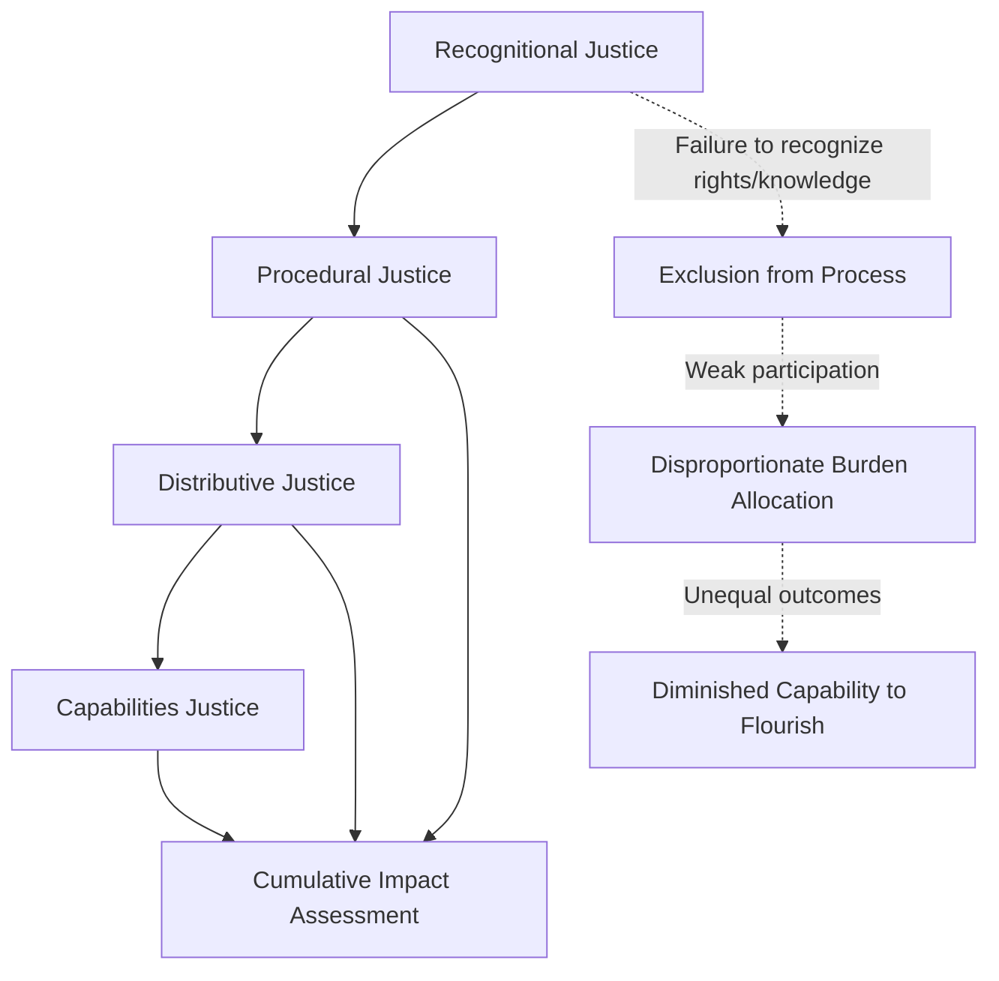

## Environmental justice and distributive equity

### Definition and Core Constructs

**Environmental justice (EJ)** is the theoretical and policy framework concerned with the fair distribution of environmental benefits and burdens (pollution exposure, resource access, land use decisions) and the fair inclusion of all population groups — particularly those historically marginalized by race, ethnicity, income, or indigeneity — in environmental decision-making processes. In Community Engagement and Social Impact Assessment (SIA) practice, EJ functions both as an analytical lens for identifying disproportionate impacts and as a procedural mandate shaping how engagement must be conducted.

**Distributive equity** is the specific EJ dimension concerned with *outcomes*: how environmental goods (clean air, water, green space, project benefits like employment or compensation) and environmental bads (pollution, displacement, resource depletion, project-induced risk) are allocated across social groups, geographies, and generations. It is distinguished analytically from procedural equity (fairness of decision-making processes) and recognitional equity (acknowledgment of differing identities, knowledge systems, and rights).

### The Three (or Four) Pillars of Environmental Justice

The dominant analytical framework, developed across EJ scholarship (Schlosberg, 2007; Walker, 2012), decomposes justice into interacting dimensions:

#### Distributive Justice

Concerned with the spatial and social patterning of environmental risks and benefits. Core empirical question: *do environmental burdens correlate systematically with race, class, or indigeneity?* This is the dimension most amenable to quantitative SIA analysis (e.g., GIS overlay of pollution sources against demographic data).

#### Procedural Justice

Concerned with fairness of process: meaningful participation, access to information, transparency, and absence of coercion in decisions affecting a community's environment. In SIA, procedural justice is operationalized through free, prior, and informed consent (FPIC) standards, public comment mechanisms, and grievance redress systems.

#### Recognitional Justice

Concerned with whether affected groups' identities, cultural practices, knowledge systems (including indigenous and traditional ecological knowledge), and legal/customary rights are acknowledged and respected within assessment and decision processes. Failure of recognition is theorized to precede and produce failures of distribution and procedure (Schlosberg's capabilities-based extension of the framework).

#### Capabilities Justice (Schlosberg extension)

Drawing on Sen and Nussbaum's capabilities approach, this dimension asks whether environmental conditions support the full range of human functioning and flourishing a community values — moving beyond resource distribution to ask what people are actually *able to do and be* given their environmental circumstances.

### Diagram: EJ Pillars and Their Interaction

**[Inference]** The directional arrows reflect a widely cited theoretical claim (Schlosberg, Whyte) that recognitional failures causally precede procedural exclusion, which in turn produces distributive harm — but this sequencing is a conceptual heuristic rather than an empirically validated causal chain, and reverse or reinforcing loops (e.g., distributive harm entrenching further exclusion) are also documented.

### Theoretical Lineage

| Theorist/Movement | Contribution | Core Emphasis |
| --- | --- | --- |
| Environmental Justice Movement (US, 1980s–90s; Bullard, Warren County NC protests) | Empirical documentation of racialized siting of hazardous waste facilities | Grassroots, race-and-class distributive analysis |
| Robert Bullard (1990, "Dumping in Dixie") | Foundational empirical case studies linking race to environmental hazard exposure | Distributive, US civil-rights framing |
| David Schlosberg (2007) | Integration of distribution, recognition, procedure, and capabilities into unified theory | Philosophical/normative synthesis |
| Gordon Walker (2012) | Critical geography of EJ; spatial and scalar analysis of environmental inequality | Spatial/geographic, scale-sensitive |
| Kyle Whyte (2011–ongoing) | Indigenous environmental justice; critiques of settler-colonial framings of "justice" | Indigenous sovereignty, relational, temporal (intergenerational) |
| UN Framework on Business and Human Rights (Ruggie, 2011) | "Protect, Respect, Remedy" pillars applied to corporate environmental conduct | Applied, corporate accountability |

**[Unverified]** The degree to which mainstream SIA methodologies have operationally incorporated Whyte's indigenous-relational critique (which challenges liberal-distributive framings of justice as insufficient for addressing settler-colonial land relationships) varies substantially by jurisdiction and practitioner training; this remains a contested and evolving area of practice rather than a settled standard.

### Application in Social Impact Assessment

#### Cumulative Impact and Disproportionality Analysis

SIA practitioners assess distributive equity through:

- **Spatial overlay analysis**: GIS-based mapping of project-related environmental burdens (emissions, noise, land take, traffic) against demographic layers (income, race/ethnicity, indigenous status, age, disability)
- **Cumulative impact assessment (CIA)**: aggregating the proposed project's burden with pre-existing environmental stressors in the same geography, recognizing that historically burdened communities often face compounding, not isolated, impacts
- **Benefit-sharing analysis**: quantifying whether project benefits (jobs, royalties, infrastructure, compensation) accrue proportionally to the populations bearing the burdens, or are captured disproportionately by non-affected or more powerful stakeholders

#### Key Indicators Commonly Used

- Proximity-based exposure metrics (distance from hazard source, population density within buffer zones)
- Demographic disparity ratios (percentage of affected population from marginalized groups vs. regional baseline)
- Compensation/benefit distribution ratios across demographic subgroups
- Participation rate disparities (who attends consultations, whose input is documented and acted upon)
- Land tenure security and customary rights recognition status

#### Distributive Equity Formalization

A simplified disproportionality index used in some CIA frameworks:

$$DI = \frac{B_a / P_a}{B_r / P_r}$$

Where $DI$ is the disproportionality index, $B_a$ is the burden experienced by the affected/marginalized subgroup, $P_a$ is that subgroup's population, $B_r$ is the burden experienced by the reference population, and $P_r$ is the reference population. A $DI$ value substantially greater than 1 indicates disproportionate burden concentration in the affected subgroup. **[Inference]** This ratio form is a common simplification used across EJ screening tools; actual regulatory instruments (e.g., EPA's EJScreen) typically use percentile-based rather than direct ratio comparisons, and methodology varies by jurisdiction.

### Regulatory and Institutional Frameworks

- **US EPA Environmental Justice framework**: Executive Order 12898 (1994) mandates federal agencies assess disproportionate impacts on minority and low-income populations; operationalized via tools like EJScreen
- **IFC Performance Standards** (particularly PS1, PS5, PS7): require differentiated impact assessment and engagement for vulnerable and indigenous groups in development-financed projects
- **World Bank Environmental and Social Framework (ESF)**: ESS7 specifically addresses Indigenous Peoples, requiring FPIC for projects with adverse impacts on their lands, resources, or livelihoods
- **UNDRIP (UN Declaration on the Rights of Indigenous Peoples, 2007)**: establishes FPIC as an international normative standard, directly informing procedural justice requirements in SIA

### Risks and Critiques of the Framework

- **Distributive-only reductionism**: focusing solely on quantitative burden distribution (the most measurable dimension) while neglecting recognitional and procedural failures that produce those distributions in the first place
- **Cumulative impact data gaps**: many jurisdictions lack baseline environmental health data disaggregated by demographic group, limiting empirical disproportionality analysis
- **Compensation as justice substitute**: critique that monetary compensation for environmental harm can function as a justice-washing mechanism rather than addressing root inequities in decision-making power
- **Scalar mismatch**: EJ analysis conducted at regional or national scale can obscure severe hyperlocal disproportionality, and vice versa (Walker's critique of scale-insensitive EJ mapping)
- **Settler-colonial framing critique** (Whyte): liberal distributive-justice frameworks may inadequately address indigenous claims rooted in sovereignty and relational land ties rather than resource allocation alone

**[Speculation]** Some emerging SIA practice is beginning to integrate climate justice and intergenerational equity metrics (e.g., discounting frameworks that account for future population burden) into distributive equity analysis, though standardized methodologies for this integration are not yet widely adopted.

### Practical SIA Workflow Integration

1. **Baseline disproportionality screening**: GIS overlay of existing environmental burdens against demographic data to establish pre-project equity baseline
2. **Impact prediction with equity disaggregation**: model project impacts separately for identified vulnerable/marginalized subgroups rather than reporting only aggregate community-level effects
3. **Recognitional audit**: verify legal/customary rights, land tenure status, and cultural/spiritual site significance are documented prior to design finalization
4. **Procedural safeguards**: implement FPIC processes, accessible-format consultations, and independent grievance redress mechanisms
5. **Benefit-sharing design**: structure compensation, employment, and infrastructure benefits to proportionally reach the populations bearing disproportionate burden
6. **Monitoring and cumulative tracking**: maintain longitudinal disproportionality indices through project lifecycle, feeding into adaptive management

### Related Topics

- Free, Prior, and Informed Consent (FPIC) as procedural justice mechanism
- Cumulative impact assessment (CIA) methodologies
- Indigenous environmental justice and Kyle Whyte's relational sovereignty critique
- IFC Performance Standards and World Bank ESF (ESS7) comparative analysis
- GIS-based environmental burden mapping and EJScreen-type tools
- Climate justice and intergenerational equity frameworks
- Benefit-sharing agreement design in extractive industries
- Grievance redress mechanism (GRM) design standards