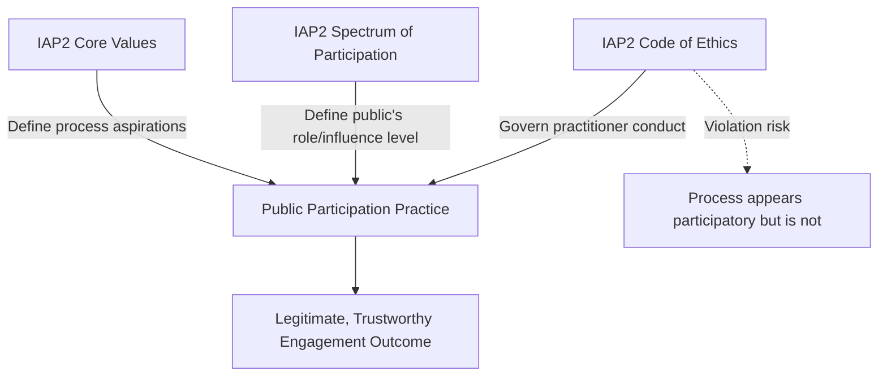

## IAP2 Code of Ethics for engagement practitioners

### Definition and Purpose

The **IAP2 Code of Ethics for Public Participation Practitioners** is the professional conduct standard issued by the International Association for Public Participation (IAP2), operationalizing IAP2's Core Values into concrete behavioral commitments for individuals who design, facilitate, or manage public/community engagement processes. Where the **Core Values** define the aspirations and expectations of a public participation *process*, the Code of Ethics governs the *actions of the practitioner* conducting that process — it is a conduct code, not a process design standard.

The Code of Ethics is a set of principles which guide practitioners in enhancing the integrity of the public participation process; practitioners hold themselves accountable to these principles and strive to hold all participants to the same standards. [Iap2sa](https://iap2sa.org/iap2-code-of-ethics/)

### Relationship to the IAP2 Three Pillars

IAP2 developed three interlocking pillars for effective public participation, formed with broad international input that cross national, cultural, and religious boundaries. The Code of Ethics is one of three foundational instruments: [Iap2](https://www.iap2.org/page/pillars)

1. **Core Values** — define the aspirations and expectations of the public participation *process itself*
2. **Spectrum of Public Participation** — describes a range of roles for the public in a decision process (Inform, Consult, Involve, Collaborate, Empower) [Iap2usa](https://www.iap2usa.org/cvs)
3. **Code of Ethics** — governs practitioner *conduct* within that process

In SIA practice, the Code of Ethics functions as the professional-integrity layer sitting beneath methodological frameworks like the Spectrum: a practitioner can technically execute the correct engagement level on the Spectrum while still violating the Code (e.g., running a "Consult"-level process while covertly pursuing a predetermined outcome).

### Diagram: Relationship of the Three Pillars

### The Ten Ethical Principles

The Code articulates ten principles, each addressing a distinct dimension of practitioner conduct:

| # | Principle | Core Commitment |
| --- | --- | --- |
| 1 | **Purpose** | Support public participation as a process to make better decisions that incorporate the interests and concerns of all affected stakeholders and meet the needs of the decision-making body |
| 2 | **Role of Practitioner** | Enhance the public's participation in the decision-making process and assist decision-makers in being responsive to the public's concerns and suggestions |
| 3 | **Trust** | Undertake and encourage actions that build trust and credibility for the process and among all participants |
| 4 | **Defining the Public's Role** | Carefully consider and accurately portray the public's role in the decision-making process |
| 5 | **Openness** | Encourage the disclosure of all information relevant to the public's understanding and evaluation of a decision |
| 6 | **Access to the Process** | Ensure that stakeholders have fair and equal access to the public participation process and the opportunity to influence decisions |
| 7 | **Respect for Communities** | Avoid strategies that risk polarizing community interest or that appear to "divide and conquer" |
| 8 | **Advocacy** | Advocate for the public participation process and will not advocate for a particular interest, party or project outcome |
| 9 | **Commitments** | Ensure that all commitments made to the public, including those by the decision-maker, are made in good faith |
| 10 | **Support of the Practice** | Mentor new practitioners in the field and educate decision-makers and the public about the value and use of public participation |

### Defined Terms

The Code establishes three precise operational definitions that govern its interpretation:

- **Stakeholders**: any individual, group of individuals, organization or political entity with an interest or stake in the outcome of a decision [Iap2sa](https://iap2sa.org/iap2-code-of-ethics/)
- **Public**: those stakeholders who are not typically part of the decision-making entity or entities [Iap2sa](https://iap2sa.org/iap2-code-of-ethics/)
- **Public Participation**: any process that involves the public in problem-solving or decision-making and that uses public input to make better decisions [Iap2sa](https://iap2sa.org/iap2-code-of-ethics/)

**[Inference]** The narrow definition of "Public" (excluding those already part of the decision-making entity) is significant for SIA scoping, since it implies the Code's protections and access guarantees apply specifically to externally affected stakeholders rather than internal project staff or governance bodies — a distinction relevant when defining stakeholder universes in a Terms of Reference.

### Principle 8 (Advocacy) as the Distinguishing Ethical Test

Principle 8 is frequently treated in professional practice as the sharpest operational test separating legitimate facilitation from advocacy or PR work: a practitioner advocates for *the fairness and integrity of the process itself*, never for a particular substantive outcome, project approval, or party's interest. This has direct implications for SIA practitioners who may be contracted by a project proponent:

- A practitioner may be paid by a proponent to *design and run* the engagement process
- A practitioner may **not** use that role to steer participants toward a predetermined conclusion, suppress dissenting input, or misrepresent the level of influence the public genuinely holds (this links directly to Principle 4, Defining the Public's Role)

**[Inference]** This creates a structural tension frequently discussed in SIA ethics training: proponent-funded engagement practitioners face an inherent conflict-of-interest risk that the Code addresses through role-clarity (Principle 2, 4) and honesty-of-commitment (Principle 9) rather than through funding-source prohibition, since IAP2 does not require practitioner independence from project funding as a categorical Code requirement.

### Application in Social Impact Assessment

#### Engagement Plan Design

SIA practitioners apply the Code when drafting Stakeholder Engagement Plans (SEPs) by:

- Explicitly stating, in writing and to participants, which Spectrum level (Inform/Consult/Involve/Collaborate/Empower) applies to a given decision — operationalizing **Principle 4**
- Disclosing methodology limitations, funding source, and decision-making authority structure upfront — operationalizing **Principle 5 (Openness)** and **Principle 9 (Commitments)**
- Designing outreach and scheduling to avoid systematically excluding marginalized subgroups (low-literacy populations, remote settlements, women, persons with disabilities) — operationalizing **Principle 6 (Access)**

#### Facilitation Conduct

During consultation events, the Code translates into observable facilitator behaviors:

- Neutral framing of discussion questions (not leading toward a predetermined project-favorable answer)
- Accurate, undistorted documentation of dissenting or critical input in meeting records
- Refusal to selectively convene only stakeholder subgroups likely to be supportive (a direct violation of **Principle 7**, "divide and conquer")

#### Grievance and Accountability Mechanisms

Because the Code requires commitments to be made in good faith (**Principle 9**), SIA practice typically requires:

- Formal tracking of commitments made during consultation (what was promised, to whom, by when)
- Independent or third-party audit capacity where a grievance alleges a broken commitment
- Institutional consequences (professional accountability, not legal enforceability) for practitioners found in violation, since the Code addresses how practitioners conduct themselves with an honest and ethical underpinning — supporting the practice in everyone's best interests, acting as conduits between people and decision-makers, and pushing for trust and credibility [Theparticipationcompany](https://theparticipationcompany.com/2021/02/how-to-ensure-effective-public-participation-and-democracy/)

### Enforcement Status and Limitations

**[Unverified]** The IAP2 Code of Ethics functions as a professional/aspirational standard rather than a legally enforceable instrument; IAP2 (as a membership association) does not appear, based on available public documentation, to operate a formal disciplinary tribunal with sanctioning power comparable to licensed professions (e.g., law, medicine, engineering). Compliance is substantially a matter of professional reputation, employer policy, and voluntary member accountability rather than statutory enforcement — practitioners and organizations relying on the Code for regulatory compliance purposes should verify current enforcement mechanisms directly with IAP2, as this is an area subject to change and regional variation (IAP2 operates through semi-autonomous regional affiliates, e.g., IAP2 USA, IAP2 Australasia, IAP2 Canada, IAP2 Southern Africa).

### Copyright and Use Restrictions

Basic ethics and courtesy require clear acknowledgement of the International Association for Public Participation (IAP2 International) as the source of this material in all cases; to use, copy, or reproduce the Code of Ethics or Core Values, a written request must be submitted to the IAP2 International Executive Director. SIA practitioners incorporating the Code into training materials, SEPs, or institutional policy documents should observe this attribution requirement and, where reproduction beyond fair-use citation is intended, submit the required permission request. [IAP2 Australasia](https://iap2.org.au/About-Us/About-IAP2-Australasia-/Code-of-Ethics/)

### Practical SIA Workflow Integration

1. **Pre-engagement**: brief all engagement team members and subcontracted facilitators on the ten principles before fieldwork begins
2. **SEP drafting**: explicitly cross-reference Spectrum level and Code principles in the written engagement plan submitted to regulators/lenders
3. **Facilitation**: apply Principle 7 and 8 tests in real time during consultation events (is this framing neutral? does this design risk dividing the community?)
4. **Documentation**: record commitments made (Principle 9) in a trackable commitments register, separate from general meeting minutes
5. **Post-engagement audit**: assess documented process against the ten principles as part of SIA quality assurance, alongside procedural-justice and FPIC compliance checks
6. **Grievance handling**: route allegations of ethical breach through the project's Grievance Redress Mechanism (GRM), documenting outcome and corrective action

### Related Topics

- IAP2 Spectrum of Public Participation (Inform–Consult–Involve–Collaborate–Empower)
- IAP2 Core Values for the Practice of Public Participation
- Free, Prior, and Informed Consent (FPIC) as a procedural justice standard
- Stakeholder Engagement Plan (SEP) design standards (IFC PS1)
- Grievance Redress Mechanism (GRM) design and independence
- Conflict of interest management for proponent-funded practitioners
- Professional accountability frameworks in community engagement practice
- National Coalition for Dialogue & Deliberation (NCDD) Core Principles for Public Engagement