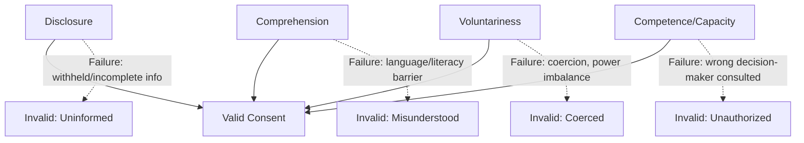

## Informed consent in community-based work

### Definition and Core Constructs

**Informed consent** in community-based work refers to the ethical and procedural requirement that individuals and communities affected by a research, engagement, or development activity possess sufficient understanding of that activity's purpose, methods, risks, and implications to voluntarily agree to (or decline) participation, free from coercion, manipulation, or undue inducement. In Community Engagement and Social Impact Assessment (SIA), informed consent operates at two distinct but related levels:

- **Individual informed consent**: the research-ethics tradition (derived from biomedical/human-subjects research ethics) governing an individual's agreement to participate in data collection (surveys, interviews, focus groups)
- **Collective/community consent**: the participation-ethics tradition governing a community's or people's agreement to a project, policy, or intervention affecting their land, resources, or way of life — most formally codified as **Free, Prior, and Informed Consent (FPIC)**

**[Inference]** SIA practitioners must operate in both registers simultaneously: obtaining individual consent from each survey respondent while also determining whether a community-level consent process (FPIC or equivalent) is triggered by the nature and scale of the proposed intervention.

### The Four Core Elements of Valid Consent

Across both individual and collective consent traditions, four elements are consistently required for consent to be considered ethically and legally valid:

1. **Disclosure**: relevant information about the activity, risks, benefits, alternatives, and consequences of participation/non-participation must be communicated
2. **Comprehension**: the information must be understood by the recipient, accounting for language, literacy, cultural framing, and cognitive capacity
3. **Voluntariness**: agreement must be given free from coercion, manipulation, undue inducement, or power-based pressure
4. **Competence/Capacity**: the individual or collective decision-making body must have the legal and practical capacity to consent

### Diagram: Elements of Valid Consent and Failure Modes

### Individual Informed Consent: Research Ethics Tradition

#### Historical and Regulatory Lineage

Individual informed consent in community-based research derives from biomedical research ethics codified after documented historical abuses:

| Instrument | Year | Contribution |
| --- | --- | --- |
| Nuremberg Code | 1947 | First formal requirement of voluntary consent for human subjects research |
| Declaration of Helsinki (WMA) | 1964, revised periodically | Medical research ethics; informed consent as foundational principle |
| Belmont Report (US) | 1979 | Three core principles: respect for persons, beneficence, justice; informed consent operationalizes "respect for persons" |
| Common Rule (US federal regulation, 45 CFR 46) | 1991, revised | Institutional Review Board (IRB) requirements for human subjects research |

#### Operational Requirements in SIA Field Data Collection

- **Written or verbal consent scripts** disclosing: purpose of data collection, who is conducting it, how data will be used and stored, confidentiality protections, voluntariness of participation, right to withdraw, and any risks
- **Literacy-appropriate formats**: verbal consent with witness signature for low-literacy populations; translated materials in local language(s)
- **Assent vs. consent for minors**: age-appropriate assent from minors plus parental/guardian consent, per applicable jurisdictional and institutional standards
- **Ongoing/process consent**: particularly for longitudinal or participatory methods, consent is treated as an ongoing negotiation rather than a single signature event

**[Unverified]** The degree to which formal IRB-style review is required for SIA field research (as opposed to academic research) varies substantially by jurisdiction, funder, and lender safeguard policy; practitioners should verify the specific consent documentation standard mandated by the applicable regulatory or financing framework (e.g., IFC Performance Standards, World Bank ESF) for a given project rather than assuming academic human-subjects protocols automatically apply.

### Collective Consent: Free, Prior, and Informed Consent (FPIC)

FPIC is the internationally recognized standard for collective consent, applying specifically (though not exclusively) to Indigenous Peoples and, in some frameworks, other communities with customary land tenure or particular vulnerability to project impacts.

#### The Four FPIC Components

- **Free**: consent given without coercion, intimidation, manipulation, or bribery; not conditioned on acceptance of other unrelated benefits
- **Prior**: consent sought sufficiently in advance of project authorization or commencement of activities, allowing genuine time for internal community deliberation
- **Informed**: information disclosed in accessible language and format, covering nature, scale, duration, risks, benefits, and reversibility of impacts
- **Consent**: a collective decision made through the community's own customary or chosen decision-making institutions and processes — not merely "consultation," which requires disclosure and dialogue but not agreement

**[Inference]** The distinction between "consultation" and "consent" is the single most consequential technical distinction in this domain: a process satisfying Free, Prior, and Informed *Consultation* (FPIC-C) discloses information and solicits input, but the decision-making authority remains with the proponent/government; a process satisfying Free, Prior, and Informed *Consent* (FPIC) vests the decision-making authority (an effective right to withhold agreement) in the affected community itself.

#### Regulatory Anchors for FPIC

- **UNDRIP** (UN Declaration on the Rights of Indigenous Peoples, 2007), Articles 10, 19, 29, 32: establishes FPIC as the normative standard for indigenous peoples regarding relocation, legislative/administrative measures, hazardous materials storage, and use of lands/territories/resources
- **ILO Convention 169** (1989): requires consultation with indigenous and tribal peoples through appropriate procedures, particularly through representative institutions, with the objective of achieving agreement or consent
- **IFC Performance Standard 7** (Indigenous Peoples): requires FPIC for specific circumstances — relocation from traditional/customary lands, impacts on critical cultural heritage, and use of natural resources on indigenous lands
- **World Bank ESF, ESS7** (Indigenous Peoples/Sub-Saharan African Historically Underserved Traditional Local Communities): requires FPIC for the same triggering circumstances as IFC PS7

### Application in Social Impact Assessment

#### Determining Whether FPIC (vs. Consultation) Is Triggered

SIA screening typically assesses whether a proposed project:

- Involves relocation or resettlement from traditionally owned or customarily used lands
- Impacts critical cultural heritage material to community identity/practices
- Involves use of natural resources on indigenous/customary lands central to livelihoods

If any trigger is present under IFC PS7 or World Bank ESS7, the engagement standard escalates from general stakeholder consultation to FPIC.

#### Consent Process Design

A defensible FPIC process typically documents:

1. **Identification of legitimate decision-making bodies**: verifying which customary institutions, councils, or representative structures hold authority to grant or withhold consent (avoiding both external imposition of unfamiliar governance structures and capture by unrepresentative local elites)
2. **Disclosure phase**: culturally and linguistically accessible information sharing, often iterative across multiple sessions
3. **Independent deliberation period**: time for the community to deliberate without proponent presence, respecting customary decision-making timeframes
4. **Documented outcome**: a recorded decision (agreement, conditional agreement, or withholding of consent), ideally through a process the community itself recognizes as legitimate
5. **Ongoing consent**: mechanisms for revisiting consent if project scope, risk profile, or impacts materially change

#### Consent Documentation and Evidentiary Standards

- Video/audio recording of consent-granting proceedings (with the community's own consent to be recorded)
- Signed or thumbprint-witnessed agreements where written literacy is limited, with independent witness attestation
- Third-party or independent facilitation to reduce power-imbalance risk between proponent and community
- Translation verification (back-translation checks) to confirm disclosed information was accurately rendered in local language

### Risks and Critiques of Consent Frameworks in Practice

- **Power asymmetry**: formal consent procedures can mask underlying power imbalances between well-resourced proponents and communities with limited legal, technical, or financial capacity to evaluate disclosed information critically
- **Elite capture**: consent obtained from unrepresentative community leadership (e.g., co-opted chiefs, non-customary "representatives") may not reflect genuine collective will, particularly regarding women, youth, or marginalized subgroups within the community
- **Consultation-as-consent conflation**: proponents sometimes document consultation processes (information sharing, meetings held) as if they satisfy FPIC's consent requirement, when no actual agreement/veto mechanism was operative — a widely documented critique in extractive-industry and infrastructure SIA literature
- **"Prior" erosion**: consent sought after key design decisions are already finalized (project sunk-cost pressure) undermines genuine capacity to withhold or substantially alter agreement
- **Legal non-bindingness in some jurisdictions**: UNDRIP is a declaration, not a treaty, and its FPIC standard is not uniformly binding domestic law; **[Unverified]** the legal enforceability of FPIC therefore varies substantially by jurisdiction, and practitioners should verify current domestic legal status rather than assume UNDRIP-level protection is directly enforceable everywhere it is referenced.

**[Speculation]** Some SIA practitioners and indigenous rights scholars (building on Kyle Whyte's critique) argue that FPIC, framed within a liberal-consent paradigm, may still inadequately capture relational and sovereignty-based indigenous conceptions of land relationship that exceed a simple "agree/withhold" transactional framing — this remains a live debate rather than a resolved methodological consensus.

### Practical SIA Workflow Integration

1. **Screening**: determine whether individual research consent, general stakeholder consultation, or full FPIC is the applicable standard for a given engagement activity
2. **Decision-maker identification**: for FPIC contexts, map legitimate customary/representative decision-making structures before disclosure begins
3. **Consent instrument design**: draft context-appropriate consent scripts/forms (individual) or FPIC protocols (collective), translated and literacy-adapted
4. **Independent facilitation/verification**: engage third-party facilitators or observers where power asymmetry risk is high
5. **Documentation**: maintain auditable consent records (recordings, witnessed signatures, deliberation minutes) suitable for lender/regulator review
6. **Ongoing consent monitoring**: establish triggers for re-consultation/re-consent if project scope or impact profile changes materially during implementation

### Related Topics

- Free, Prior, and Informed Consent (FPIC) implementation protocols
- IFC Performance Standard 7 and World Bank ESS7 comparative requirements
- Consultation vs. consent: legal and procedural distinctions
- Environmental justice and distributive equity (recognitional/procedural justice dimensions)
- Grievance Redress Mechanism (GRM) design for consent-related disputes
- Research ethics boards and IRB protocols in field-based SIA
- Elite capture risk in community representative structures
- Kyle Whyte's relational sovereignty critique of liberal consent frameworks