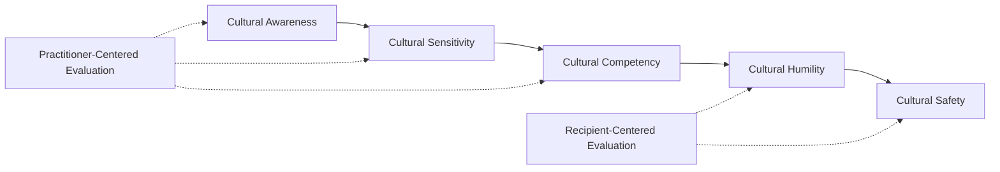

## Cultural competency and cultural safety

### Definition and Core Constructs

**Cultural competency** refers to the set of congruent behaviors, attitudes, and policies that enable practitioners and organizations to work effectively in cross-cultural situations — encompassing knowledge of cultural practices and worldviews, self-awareness of one's own cultural positioning, and skill in adapting communication and methods across cultural contexts. It is typically framed as a *developmental continuum* rather than a fixed credential.

**Cultural safety** is a distinct, more radical construct originating in Māori nursing education (Ramsden, 1990s, New Zealand) that shifts the locus of evaluation: safety is defined not by the practitioner's self-assessed competency but by *whether the recipient of the service experiences the interaction as safe*, free of assault, demeaning treatment, or disempowerment of their cultural identity. Cultural safety is fundamentally about power, not knowledge — it foregrounds the practitioner's own culture, biases, and institutional power as the primary site of analysis, rather than treating "other" cultures as the object of study.

**[Inference]** In SIA practice, this distinction is consequential: a cultural-competency framework can inadvertently center the practitioner's acquired knowledge as the marker of success ("I have learned about this community's customs"), while cultural safety requires community-defined evaluation ("do the people we engage experience this process as safe and non-diminishing"), which is a fundamentally different accountability structure.

### The Cultural Competence–Safety Continuum

Cross-cultural practice frameworks are frequently arranged along a developmental continuum, moving from lower to higher structural engagement with power and identity:

| Stage | Focus | Locus of Evaluation |
| --- | --- | --- |
| Cultural awareness | Recognizing that cultural differences exist | Practitioner's self-reflection |
| Cultural sensitivity | Recognizing that differences matter and should be respected | Practitioner's attitude |
| Cultural competency | Acquiring knowledge, skills, and adaptive behaviors for cross-cultural effectiveness | Practitioner's demonstrated skill |
| Cultural humility (Tervalon & Murray-García, 1998) | Lifelong, self-reflective commitment to redressing power imbalances; explicitly rejects the idea of "achieving" competency | Ongoing practitioner self-critique |
| Cultural safety (Ramsden) | Whether the recipient/community experiences the interaction as non-diminishing and empowering | Recipient/community's lived experience |

**[Inference]** This progression reflects a broader shift in the field's theoretical center of gravity: earlier frameworks (competency, sensitivity) are practitioner-centered and knowledge-based, while later frameworks (humility, safety) are power-centered and recipient-defined. Cultural humility and cultural safety are often presented in current literature as more rigorous successors to competency-only models, though **[Unverified]** the degree to which SIA practitioner training programs have fully adopted this later framing (versus retaining competency-checklist approaches) varies substantially by institution and jurisdiction.

### Diagram: Cultural Competence–Safety Continuum

### Theoretical Lineage

| Theorist/Origin | Contribution | Core Emphasis |
| --- | --- | --- |
| Cross, Bazron, Dennis, Isaacs (1989) | Foundational cultural competence continuum model in US child/family services | Institutional capacity-building |
| Irihapeti Ramsden (1990s, Aotearoa/New Zealand) | Originated "cultural safety" in nursing education, centering Māori patient experience | Power, colonization, recipient-defined safety |
| Melanie Tervalon & Jann Murray-García (1998) | "Cultural humility" as alternative to competency; lifelong self-critique over achieved mastery | Reflexivity, power-imbalance redress |
| Sue, Arredondo, McDavis (1992) | Multicultural counseling competencies framework (awareness, knowledge, skills) | Applied clinical/counseling competency |

### Cultural Safety's Structural Emphasis

Cultural safety theory identifies specific structural and interpersonal conditions that determine whether an engagement is experienced as safe:

- **Power analysis**: explicit recognition that the practitioner/institution typically holds structural power (professional authority, institutional backing, often racial/colonial privilege) relative to community members
- **Self-reflexivity requirement**: practitioners are required to examine their own cultural conditioning, biases, and the historical power relations (e.g., colonization, systemic discrimination) shaping the interaction — not primarily to study the "other" culture
- **Recipient-defined outcome**: whether an interaction was culturally safe is determined by the recipient's experience, not the practitioner's intent or self-assessed sensitivity
- **Institutional, not just individual, responsibility**: cultural safety implicates organizational policy, staffing, physical environment, and institutional history — not solely individual practitioner behavior

### Application in Social Impact Assessment

#### Engagement Design

- **Pre-engagement cultural protocol research**: identifying appropriate greeting, gender, and seniority protocols; gatekeeping and permission structures (who must be approached first); taboo topics or timing (e.g., mourning periods, ceremonial seasons)
- **Reflexive positionality statements**: SIA team members documenting their own cultural, institutional, and power positioning relative to the community prior to fieldwork, as a methodological transparency practice
- **Co-design of engagement formats**: allowing communities to shape meeting structure, location, timing, and facilitation approach rather than imposing a standardized external format

#### Team Composition and Training

- Employing local or culturally matched field staff/interpreters, not solely for language translation but for relational and protocol navigation
- Mandatory cultural safety (not merely competency-checklist) training prior to fieldwork, emphasizing self-reflexivity over static cultural-fact memorization
- Debrief mechanisms allowing community members to report if an interaction felt unsafe, disrespectful, or diminishing — feeding directly into team practice correction

#### Data Collection Method Adaptation

- Avoiding extractive interview formats that mirror colonial/institutional power dynamics (e.g., rigid, closed-ended surveys imposed without context) in favor of participatory or narrative methods where culturally appropriate
- Ensuring informed consent processes (see companion topic) are themselves culturally safe — disclosure and comprehension checks conducted in ways that do not humiliate or disempower low-literacy or non-dominant-language participants
- Triangulating standardized SIA indicators with community-defined wellbeing or impact indicators, avoiding imposition of externally defined "success" metrics as the sole evaluative frame

#### Institutional and Reporting Practices

- Presenting SIA findings back to communities in accessible, non-technical formats before or alongside formal regulator/lender reporting (validation loop)
- Ensuring grievance mechanisms are culturally accessible (appropriate language, non-threatening format, recognition of customary dispute-resolution preferences) rather than solely bureaucratic/legalistic

### Risks and Critiques

- **Competency-as-checklist reduction**: reducing cultural competency to a static training module or knowledge checklist risks treating culture as a fixed, learnable body of facts rather than a dynamic, internally diverse, and power-inflected context — a common critique of early institutional competency frameworks
- **Essentialism risk**: cultural competency training can inadvertently stereotype or homogenize a community's practices, obscuring intra-community diversity (class, gender, generational, political divisions within an ostensibly single "culture")
- **Safety as unfalsifiable/contested standard**: because cultural safety is recipient-defined, differing community members may report divergent experiences of the same engagement process, complicating practitioner accountability measurement — **[Inference]** this is generally treated in the literature not as a flaw but as an accurate reflection of real intra-community heterogeneity that practitioners must navigate rather than resolve into a single metric
- **Institutional tokenism**: adopting cultural safety language without corresponding structural change (staffing diversity, power redistribution in decision-making, resourcing) risks the framework functioning as reputational cover rather than substantive practice change

**[Speculation]** Some practitioners argue that cultural safety principles are increasingly being extended beyond their original indigenous-health-context origin to broader SIA and development contexts (class, disability, gender, migrant status); the degree of methodological fidelity in this extension to contexts outside Ramsden's original framework is not fully settled in current practice literature.

### Practical SIA Workflow Integration

1. **Pre-fieldwork**: conduct cultural protocol research and team positionality reflection; identify legitimate community gatekeepers and permission structures
2. **Team preparation**: deliver cultural safety (reflexive) rather than purely cultural competency (checklist) training; include local/culturally matched staff
3. **Engagement design**: co-design formats, timing, and locations with community input rather than imposing standardized templates
4. **Fieldwork conduct**: apply self-reflexive monitoring; use debrief mechanisms to surface recipient-experienced safety concerns in real time
5. **Data interpretation**: triangulate external indicators with community-defined wellbeing measures; avoid over-standardization that erases cultural specificity
6. **Reporting and validation**: present findings back to community in accessible form prior to/alongside formal deliverables; ensure grievance mechanisms are culturally accessible

### Related Topics

- IAP2 Code of Ethics for engagement practitioners
- Informed consent in community-based work
- Free, Prior, and Informed Consent (FPIC) and indigenous engagement standards
- Positionality and reflexivity in qualitative field research
- Participatory Rural Appraisal (PRA) and community-led data collection methods
- Environmental justice: recognitional justice dimension
- Grievance Redress Mechanism (GRM) accessibility design
- Intersectionality in stakeholder vulnerability analysis