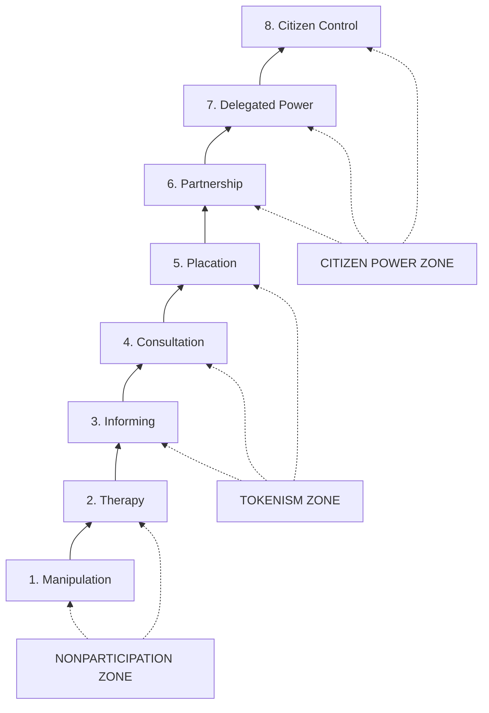

## Avoiding extractive and tokenistic engagement

### Definition and Core Constructs

**Extractive engagement** refers to community engagement practices in which a practitioner, researcher, or institution collects data, knowledge, stories, or input from a community primarily to serve external institutional interests (research outputs, project approval, funder reporting), without commensurate reciprocal benefit, ongoing relationship, or return of value to the community itself. The term draws a deliberate analogy to resource extraction: knowledge and testimony are "mined" and removed from the community context to generate value elsewhere.

**Tokenistic engagement** refers to participatory processes that create the *appearance* of meaningful community input and influence while decision-making authority remains effectively unchanged and predetermined. Tokenism is a structural failure of the engagement process itself — participation is performed rather than substantively empowered.

Both concepts function in SIA ethics as diagnostic categories for identifying engagement processes that fail to meet the procedural and recognitional justice standards articulated elsewhere in this framework, even when such processes are formally documented as "consultation."

### Arnstein's Ladder of Citizen Participation

The foundational theoretical framework for diagnosing tokenism is Sherry Arnstein's "Ladder of Citizen Participation" (1969), which remains the most widely cited typology in participation theory for distinguishing genuine power redistribution from its simulation.

| Rung | Category | Description |
| --- | --- | --- |
| 8 | Citizen Control | Full managerial and decision-making authority held by citizens |
| 7 | Delegated Power | Citizens hold dominant decision-making authority over a plan/program |
| 6 | Partnership | Power redistributed through negotiation between citizens and power-holders |
| — | **(Degrees of Citizen Power)** | *Rungs 6–8: genuine power redistribution* |
| 5 | Placation | Citizens advise but power-holders retain the right to decide |
| 4 | Consultation | Citizens' opinions solicited (surveys, meetings) but no guarantee of influence |
| 3 | Informing | One-way information flow to citizens; no feedback channel |
| — | **(Degrees of Tokenism)** | *Rungs 3–5: appearance without redistributed power* |
| 2 | Therapy | Engagement used to "cure" citizens of perceived deficiency rather than address real grievances |
| 1 | Manipulation | Citizen input used to legitimize predetermined decisions |
| — | **(Nonparticipation)** | *Rungs 1–2: no genuine participation* |

**[Inference]** Arnstein's framework is over five decades old, and subsequent theorists (e.g., White, Cornwall) have refined and critiqued its linear "ladder" metaphor as oversimplifying participation as a single power-dimension; nonetheless it remains the standard diagnostic reference point across contemporary SIA and development practice literature for identifying tokenistic process design.

### Diagram: Arnstein's Ladder and Extractive/Tokenistic Zones

### White's Typology of Participation Functions

Sarah White's (1996) framework complements Arnstein by asking not just *how much* power is redistributed but *whose interests the participation process actually serves*, distinguishing four functions:

- **Nominal participation**: legitimizes the project/institution (display function) — the community's presence itself is the desired output, regardless of substantive input
- **Instrumental participation**: uses community participation as a means to project efficiency (cost reduction, smoother implementation) rather than as an end in itself
- **Representative participation**: gives community voice a genuine role in shaping decisions, potentially generating sustainability through ownership
- **Transformative participation**: participation as empowerment in itself, aimed at building community capacity to demand rights and hold power-holders accountable

**[Inference]** White's typology is analytically useful in SIA because it can identify a process that scores high on Arnstein's ladder (e.g., genuine consultation, rung 4) while still functioning primarily in a *nominal* or *instrumental* mode — for instance, a well-designed consultation whose real institutional purpose is to satisfy a lender's procedural requirement rather than to substantively inform project design.

### Diagnostic Markers of Extractive Engagement

SIA practitioners identify extractive dynamics through several observable process characteristics:

- **One-way data flow**: community knowledge, stories, or survey data collected with no mechanism for returning findings, analysis, or reports back to participants in accessible form
- **Absence of reciprocity**: no compensation, capacity-building, or tangible benefit for participants' time, knowledge, or risk of exposure (particularly relevant for politically sensitive disclosures)
- **Parachute research pattern**: research/engagement teams enter, collect data, and depart without ongoing relationship, follow-up, or accountability to the community
- **Outsider-defined research questions**: the questions asked, indicators measured, and success metrics used are determined entirely externally, without community input into what should be studied or valued
- **Single-extraction events**: one-off data collection with no longitudinal relationship, undermining trust-building and preventing correction of misunderstandings

### Diagnostic Markers of Tokenistic Engagement

- **Consultation-after-decision**: engagement conducted after key project design decisions are already finalized, such that community input cannot substantively alter outcomes (directly parallels the "Prior" erosion critique in FPIC)
- **Selective stakeholder inclusion**: convening only stakeholders likely to be supportive, or excluding groups whose input would complicate the desired outcome (a violation of IAP2 Code of Ethics Principle 7, "divide and conquer")
- **Documentation without responsiveness**: meeting minutes and input logs are meticulously kept for regulatory compliance, but no evidence exists that input changed project design, mitigation measures, or benefit-sharing arrangements
- **Disproportionate procedural burden on participants**: requiring community members to attend numerous meetings, provide extensive input, and undergo repeated consultation cycles with no corresponding increase in their actual decision-making authority
- **Symbolic representation**: appointing a small number of community representatives to committees or boards without resourcing, capacity-building, or genuine voting power to substantively influence outcomes

### Application in Social Impact Assessment

#### Process Design Safeguards

- **Front-load engagement before key decisions are locked**: sequencing SIA and stakeholder engagement activities early enough in project design that input can genuinely alter siting, mitigation, or benefit-sharing decisions
- **Build in defined power-transfer mechanisms**: specifying, prior to engagement, exactly what decisions the community will have genuine authority over (Arnstein rungs 6–8) versus what will remain proponent/regulator authority (rungs 4–5), and communicating this distinction transparently — directly operationalizing IAP2 Code of Ethics Principle 4
- **Reciprocity and benefit-return design**: ensuring data collection activities include mechanisms for returning findings to the community (accessible-format reports, community validation workshops) and, where appropriate, compensation for participant time and knowledge contribution

#### Verification and Audit Methods

- **Input-to-outcome traceability matrix**: a documented mapping showing which specific community inputs led to which specific project design changes, distinguishing genuine responsiveness from performative documentation
- **Independent process audit**: third-party review of whether consultation timing, stakeholder inclusion, and decision-point sequencing meet the procedural justice standards required by the applicable safeguard framework (IFC PS1, World Bank ESS10)
- **Community-defined success metrics**: incorporating indicators of engagement quality defined by the community itself (e.g., perceived responsiveness, trust, cultural safety — see companion topic) alongside institutionally defined compliance metrics

#### Data Sovereignty Practices

- **[Inference]** Emerging practice increasingly incorporates data sovereignty principles (e.g., the CARE Principles for Indigenous Data Governance — Collective Benefit, Authority to Control, Responsibility, Ethics — as a complement to the FAIR data principles) into SIA data management, giving communities ongoing authority over how their collected data is stored, used, and shared, rather than treating data solely as proponent/researcher property once collected.

### Risks and Critiques

- **Participation fatigue**: even well-intentioned, non-tokenistic engagement can become extractive in effect if repeated consultation demands exceed community capacity without corresponding benefit, particularly for communities facing multiple concurrent development projects
- **Power-transfer rhetoric without structural change**: institutions may adopt the *language* of partnership or citizen control (Arnstein rungs 6–8) without the accompanying legal, financial, or governance restructuring required to make that power transfer real — a critique paralleling the "institutional tokenism" risk identified in cultural safety practice
- **Representivity gaps in "transformative" participation**: even genuinely empowering participation processes can reproduce internal community power imbalances (elite capture, gender exclusion) if representative structures are not carefully verified
- **Metric gaming**: SIA processes under regulatory or lender pressure to demonstrate "meaningful consultation" may satisfy input/output metrics (number of meetings held, attendance figures) without meeting the substantive non-tokenism standard

**[Speculation]** Some practitioners argue that standardized international safeguard frameworks (IFC PS1, World Bank ESF), by specifying minimum consultation *process* requirements (number of rounds, disclosure timing) without mandating power-transfer outcomes, may inadvertently create compliance incentives that favor Arnstein's tokenism zone (rungs 3–5) as the "safe" regulatory target rather than incentivizing genuine partnership — this is a normative critique found in participation literature rather than a settled empirical finding.

### Practical SIA Workflow Integration

1. **Pre-engagement power mapping**: explicitly classify, using Arnstein's ladder, which decisions the engagement process will place under genuine community authority versus consultation-only
2. **Sequencing check**: verify engagement occurs before, not after, key design decisions are finalized
3. **Reciprocity design**: build in data-return, compensation, and capacity-building mechanisms as a standard engagement plan component, not an optional add-on
4. **Inclusion audit**: verify stakeholder mapping does not systematically exclude dissenting or marginalized subgroups
5. **Traceability documentation**: maintain an input-to-outcome matrix demonstrating how specific community input altered project design
6. **Independent verification**: commission third-party or community-led audits of engagement quality against non-tokenism criteria, feeding into adaptive management and continuous improvement

### Related Topics

- Arnstein's Ladder of Citizen Participation (extended critique and successor models)
- IAP2 Code of Ethics for engagement practitioners
- Free, Prior, and Informed Consent (FPIC) and the "Prior" timing requirement
- Cultural competency and cultural safety
- CARE Principles for Indigenous Data Governance
- Elite capture risk in community representative structures
- Participatory Rural Appraisal (PRA) and community-led research methods
- Grievance Redress Mechanism (GRM) as an accountability backstop for non-responsive engagement