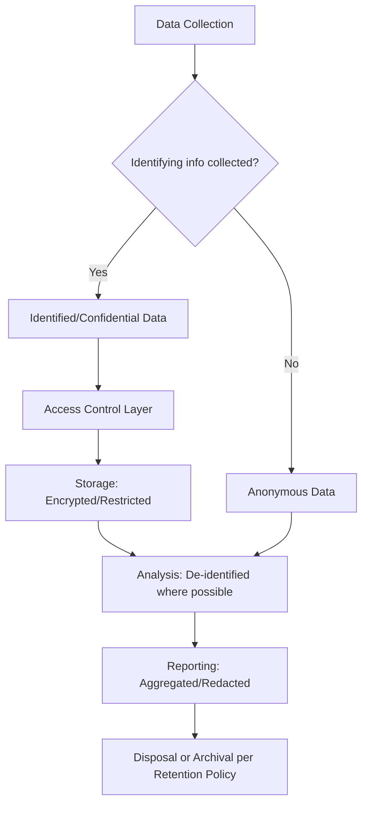

## Confidentiality and protection of participant data

### Definition and Core Constructs

**Confidentiality** in community-based work refers to the ethical and procedural obligation to control access to information disclosed by participants such that only authorized parties, for authorized purposes, can view or use it — protecting participants from harms arising from unwanted disclosure of their identity, statements, or circumstances. **Protection of participant data** extends this principle across the full data lifecycle: collection, storage, transmission, analysis, reporting, and eventual disposal or archiving.

Confidentiality is distinguished from **anonymity**: anonymity means the researcher/practitioner never collects or retains identifying information at all (the data cannot be linked back to an individual, even by the collecting institution), whereas confidentiality means identifying information *is* collected but access to it is restricted and protected — a distinction with direct implications for SIA data architecture and consent language.

**[Inference]** In practice, most SIA field data collection (household surveys, interviews with named community members) is confidential rather than anonymous, because attribution (knowing which household or respondent provided which information) is frequently necessary for analysis, verification, and follow-up — this makes robust confidentiality protection, rather than anonymity, the primary operative safeguard in most SIA contexts.

### Diagram: Confidentiality vs. Anonymity in the Data Lifecycle

### Core Ethical and Legal Foundations

| Instrument/Framework | Scope | Relevance to SIA |
| --- | --- | --- |
| Belmont Report (1979) | Respect for persons, beneficence, justice | Confidentiality as an expression of "respect for persons" and risk minimization |
| GDPR (EU, 2018) | Comprehensive data protection regulation | Extraterritorial application to data of EU-linked subjects; consent, purpose limitation, data minimization principles widely adopted as de facto global standard |
| IFC Performance Standards / World Bank ESF | Development finance safeguards | Require data protection protocols in stakeholder engagement and grievance mechanisms, particularly for sensitive disclosures |
| National data protection laws (jurisdiction-specific) | Varies by country | **[Unverified]** Applicable legal requirements vary substantially by project jurisdiction; practitioners must verify current domestic law rather than assume a single global standard applies |

### Data Classification and Sensitivity Tiering

SIA data protection protocols typically classify collected information by sensitivity level, since protective measures should be proportionate to risk of harm from disclosure:

- **Standard/low-sensitivity data**: general demographic or infrastructure-use data with limited harm potential if disclosed (e.g., aggregate household size, general land-use patterns)
- **Sensitive personal data**: information that could expose participants to discrimination, stigma, or social harm if disclosed (health status, ethnicity, religion, political affiliation, gender-based violence disclosures, land tenure disputes)
- **High-risk/security-sensitive data**: information that could expose participants to physical danger, legal jeopardy, or retaliation if disclosed (e.g., testimony regarding corruption, criminal activity, conflict-affected areas, opposition to powerful local actors, or land rights claims contested by powerful interests)

**[Inference]** High-risk data categories are particularly consequential in SIA contexts involving land acquisition, resettlement, or extractive-industry projects, where participants may disclose grievances against powerful proponents or local authorities; inadequate confidentiality protection in these contexts carries not merely reputational or privacy risk but potential physical safety risk to informants.

### Technical and Procedural Safeguards

#### Collection-Stage Safeguards

- **Data minimization**: collecting only the identifying information genuinely necessary for the stated purpose, rather than defaulting to maximal data capture
- **Pseudonymization at point of collection**: assigning participant ID codes at first contact, with the identity-linkage key stored separately from substantive response data
- **Secure consent documentation**: informed consent forms/scripts explicitly disclosing what data will be collected, how it will be stored, who can access it, and retention/disposal timelines (directly connects to the companion informed consent topic)

#### Storage and Transmission Safeguards

- **Encryption at rest and in transit**: encrypted storage for digital field data (mobile data collection platforms, cloud storage) and encrypted transmission channels
- **Access control tiering**: role-based access restricting which team members can view identified versus de-identified/aggregated data, following a least-privilege principle
- **Physical security for paper records**: locked storage, controlled access logs, and secure transport protocols for paper-based field data in low-connectivity contexts
- **Separation of identity-linkage keys**: storing the key mapping participant IDs to identities in a separate, more restrictively controlled location/system than the substantive data itself

#### Analysis and Reporting Safeguards

- **Aggregation and suppression thresholds**: reporting data only in aggregated form when small population sizes risk re-identification (a small-community demographic breakdown by a rare characteristic can inadvertently identify an individual even without a name attached — sometimes termed the "small cell" or "small-N" disclosure risk)
- **Direct quote redaction/generalization**: removing or generalizing identifying details from quoted testimony in public-facing SIA reports (occupation, specific location, family composition) where disclosure risk exists, even when the participant consented to being quoted
- **Differential reporting tiers**: producing a full internal dataset for project team use and a redacted/aggregated public disclosure version for regulatory and community-facing reporting

#### Retention and Disposal

- **Defined retention schedules**: establishing and communicating to participants how long identified data will be retained before secure disposal or full de-identification/archiving
- **Secure disposal protocols**: physical destruction of paper records, secure digital deletion (not merely file deletion, which may leave recoverable data) at the end of the retention period

### Application in Social Impact Assessment

#### Grievance Mechanism Confidentiality

Grievance Redress Mechanisms (GRMs) present a particular confidentiality tension: effective grievance handling often requires investigating and verifying a complaint, which can risk exposing the complainant's identity to the party against whom they are complaining — creating retaliation risk. SIA practitioners address this through:

- Anonymous or confidential submission channels (as distinct from the investigation stage, which may require some identity disclosure to the investigating body only)
- Non-retaliation clauses formally communicated to all parties
- Tiered disclosure protocols limiting complainant identity knowledge to the minimum necessary investigating personnel

#### Vulnerable Group Data Protection

Enhanced confidentiality protocols are typically applied to data concerning legally or socially vulnerable disclosures:

- Gender-based violence (GBV) disclosures collected under specialized safe-disclosure protocols (e.g., WHO ethical and safety guidelines for researching GBV), often requiring trained specialist staff rather than general field enumerators
- Land tenure disputes or informal/customary claims that could expose disclosing parties to legal or social risk if identified to opposing claimants
- Political or governance-critical testimony in contexts of weak rule of law or active conflict

#### Cross-Border and Third-Party Data Sharing

- Explicit consent scope limitation regarding whether collected data may be shared with project proponents, government regulators, lenders, or third-party contractors, and under what confidentiality terms
- **[Inference]** Development-finance-linked SIAs frequently involve multiple institutional stakeholders (proponent, lender, regulator, independent monitor) with varying data access needs; a defensible confidentiality protocol specifies, prior to data collection, precisely which of these parties receives identified versus de-identified data.

### Risks and Critiques

- **Consent-scope creep**: data collected under one stated purpose (e.g., baseline SIA) being repurposed for a different use (e.g., ongoing corporate monitoring, government security purposes) without renewed consent — a significant ethical breach risk in politically sensitive contexts
- **Aggregation failure in small populations**: SIA fieldwork frequently occurs in small rural communities where standard aggregation/suppression thresholds calibrated for large-population statistical disclosure control may be insufficient to prevent re-identification
- **Digital data collection platform risk**: mobile/tablet-based data collection tools (e.g., KoboToolbox, ODK-based platforms, CommCare) introduce cybersecurity dependencies (device loss, unsecured local storage, server breach) that paper-based methods do not share, requiring explicit technical security protocols as part of the SIA methodology
- **Confidentiality vs. accountability tension**: strict confidentiality protections, while protecting individual participants, can reduce the traceability/auditability that oversight bodies and communities themselves may want for accountability purposes — requiring careful protocol design that balances these competing goods rather than assuming confidentiality is an unqualified good

**[Speculation]** As SIA practice increasingly incorporates digital data collection and, in some cases, AI-assisted analysis of qualitative interview data, emerging practitioner discussion addresses whether existing confidentiality protocols adequately anticipate re-identification risks introduced by large-scale data linkage or algorithmic pattern-matching across datasets — this is an evolving area without yet-standardized SIA methodological guidance.

### Practical SIA Workflow Integration

1. **Data protection protocol drafting**: establish a written data management plan prior to fieldwork, specifying classification tiers, access controls, and retention schedules
2. **Consent language alignment**: ensure informed consent scripts accurately reflect the actual data protection measures in place, avoiding overpromising confidentiality that technical/procedural systems cannot deliver
3. **Field-level safeguards**: implement pseudonymization at point of collection, secure device/paper handling protocols, and role-based access control for field team members
4. **Sensitive disclosure protocols**: apply specialized safe-disclosure procedures (trained staff, referral pathways) for GBV, health, or high-risk political/legal testimony
5. **Reporting-stage review**: conduct a disclosure-risk review of draft SIA reports prior to publication, checking for small-N re-identification risk and appropriate quote redaction
6. **Retention and disposal**: execute defined data disposal or de-identification procedures at the end of the specified retention period, with documentation for audit purposes

### Related Topics

- Informed consent in community-based work
- Grievance Redress Mechanism (GRM) design and non-retaliation safeguards
- CARE Principles for Indigenous Data Governance and data sovereignty
- WHO ethical and safety guidelines for researching gender-based violence
- Digital data collection platform security (mobile/tablet-based field tools)
- Cultural competency and cultural safety
- Small-N statistical disclosure control methods
- Cross-institutional data sharing agreements in development finance contexts