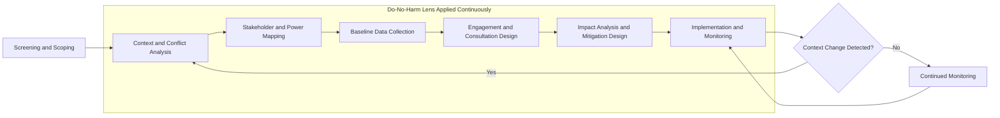

## Do-No-Harm and Conflict-Sensitivity Principles

### Definition and Conceptual Foundation

**Do-no-harm** is an ethical and operational principle requiring that any intervention — a project, policy, engagement process, or assessment activity — be designed and implemented so that it does not, on balance, cause or exacerbate harm to the people, communities, or systems it touches. In the context of Social Impact Assessment (SIA) and community engagement, do-no-harm extends beyond avoiding direct physical harm to include avoiding the exacerbation of social tensions, inequities, exclusion, or resource competition that an intervention might trigger even unintentionally.

**Conflict-sensitivity** is the applied discipline of understanding the context in which an intervention operates — particularly the social, political, and resource dynamics that could generate or worsen conflict — and deliberately adjusting design, engagement, and implementation choices to minimize negative interactions and maximize positive ones between the intervention and that context.

The two principles are related but distinct:

- **Do-no-harm** is the *ethical minimum standard*: it asks "could this cause harm, and if so, how do we avoid or mitigate it?"
- **Conflict-sensitivity** is the *analytical and operational method*: it asks "how does this context work, what are its fault lines, and how does our presence interact with them?"

Conflict-sensitivity is often described as operationalizing do-no-harm through structured context analysis, but do-no-harm is broader — it also covers non-conflict harms such as environmental degradation, health risks, loss of livelihoods, or erosion of cultural practices.

### Historical and Institutional Origins

[Inference] The formal articulation of "do no harm" as a development-sector principle is widely attributed to Mary B. Anderson's 1999 work *Do No Harm: How Aid Can Support Peace — or War*, which analyzed how humanitarian and development aid, despite good intentions, could inadvertently fuel conflict by reinforcing intergroup divisions, feeding war economies, or creating perceptions of bias.

This work gave rise to the **Do No Harm / Local Capacities for Peace (LCP) Framework**, later stewarded by organizations such as CDA Collaborative Learning Projects. The framework's central analytical tools — **dividers and connectors** analysis — remain foundational to conflict-sensitivity practice today.

Since then, the principle has been institutionalized across multiple domains relevant to SIA practice:

- **Humanitarian sector**: enshrined in the Sphere Standards and the Core Humanitarian Standard.
- **Development finance**: embedded in safeguard policies of institutions such as the World Bank (Environmental and Social Framework, ESF) and the International Finance Corporation (IFC Performance Standards).
- **Peacebuilding**: central to conflict-sensitive approaches promoted by the OECD-DAC and the International Alert "Conflict-Sensitive Business Practice" guidance.
- **Corporate/extractive sector**: integrated into the UN Guiding Principles on Business and Human Rights (UNGPs), which require human rights due diligence including harm prevention.

### Core Principles

#### 1. Context Analysis as a Prerequisite

No engagement or assessment activity should proceed without first understanding:

- Existing social divisions (ethnic, religious, political, class-based, gender-based, generational)
- Historical grievances and unresolved disputes
- Resource competition (land, water, employment, benefit-sharing)
- Power structures, both formal (government, traditional authorities) and informal (elites, gatekeepers)
- Prior experiences with similar interventions (trust deficits, past broken promises)

#### 2. Dividers and Connectors Analysis

This is the signature analytical tool of the Do No Harm framework.

- **Dividers**: factors that separate groups or increase tension — e.g., unequal access to project benefits, differing treatment of ethnic groups, land disputes reactivated by project footprint.
- **Connectors**: factors that bring groups together or reinforce shared identity — e.g., shared infrastructure, common economic interests, intermarriage, joint local institutions, shared local leadership structures.

**Example**: In a proposed road-widening project passing through two villages with a history of land disputes, dividers might include unequal compensation offers and asymmetric access to construction jobs. Connectors might include a shared irrigation cooperative and a joint school serving both villages. A conflict-sensitive engagement plan would deliberately structure compensation and hiring processes to reinforce the connector (joint cooperative as the negotiating body) rather than negotiate with each village separately, which would amplify the divider.

#### 3. Impact of Assistance/Intervention on Conflict Dynamics

Conflict-sensitivity requires examining how the intervention's own resource transfers interact with the context, along several vectors historically identified in Do No Harm literature:

| Vector | Mechanism | SIA-Relevant Example |
| --- | --- | --- |
| Distribution effects | Who receives resources/benefits and who does not | Compensation paid only to registered landholders, excluding informal users |
| Legitimization effects | Who is engaged with, implicitly conferring authority | Engaging only with one clan's elders, sidelining others |
| Substitution effects | Resources freeing up other resources for harmful use | Community development funds freeing local elite funds for patronage or coercion |
| Market effects | Local price/wage distortions | Sudden influx of project wages inflating local food prices, harming non-beneficiaries |
| Legitimization of power | Reinforcing exclusionary structures | Consulting only formal governance bodies that exclude marginalized castes/tribes |

#### 4. "First, Do No Harm" as an Ethical Floor, Not a Ceiling

Do-no-harm sets a **minimum threshold** — avoiding harm — not a **maximum aspiration**. Ethical SIA practice pairs do-no-harm with a positive obligation to seek beneficial outcomes ("do good") wherever feasible, but the do-no-harm threshold cannot be traded off against anticipated benefits elsewhere. This is sometimes summarized in professional codes as the non-negotiability of harm avoidance even when net social benefit is projected to be positive.

#### 5. Free, Prior, and Informed Consent (FPIC) as a Conflict-Sensitivity Safeguard

For projects affecting Indigenous Peoples or communities with customary land tenure, conflict-sensitivity practice generally requires FPIC processes consistent with ILO Convention 169 and UNDRIP principles, since imposed or extractive consultation processes are themselves a primary source of intervention-induced conflict.

### Application Within the SIA Process

#### Screening and Scoping Phase

- Conduct a rapid conflict/context screening to flag high-sensitivity contexts (active disputes, post-conflict settings, contested land tenure, presence of armed actors).
- Identify stakeholders using a power-interest and vulnerability mapping approach, ensuring marginalized or historically excluded groups are separately identified rather than assumed to be represented by dominant community voices.

#### Baseline and Data Collection Phase

- **Do-no-harm in data collection itself**: interviews or surveys that surface sensitive information (land claims, ethnic identity, political affiliation, past victimization) can create risk for respondents if confidentiality is breached or if the mere act of being consulted marks someone as a project "insider" or "informant."
- Practice safeguards include:
  - Disaggregated but anonymized data handling
  - Avoiding public identification of individual respondents in reports
  - Using separate, gender- and group-segregated focus groups where power dynamics would otherwise suppress input (e.g., women-only groups in patriarchal contexts)
  - Training enumerators in conflict-sensitive interviewing (neutral language, no promises, no political commentary)

#### Engagement and Consultation Design

- **Sequencing**: engaging with informal power brokers before formal authorities (or vice versa) can itself send unintended political signals; sequencing decisions require prior conflict analysis.
- **Venue and format neutrality**: selecting meeting locations perceived as "neutral ground" avoids the appearance of favoring one faction.
- **Grievance redress mechanisms (GRM)**: a functioning, accessible, and trusted GRM is considered a core conflict-sensitivity instrument, since unaddressed grievances are a leading driver of intervention-induced conflict escalation.

#### Impact Analysis and Mitigation Design

- Assess **differential and cumulative impacts** — how the same project activity affects different subgroups differently, and how impacts compound with other projects or historical harms in the area.
- Mitigation hierarchy applied conflict-sensitively: avoid > minimize > mitigate > compensate > offset, with explicit attention to whether compensation mechanisms themselves could become new dividers (e.g., unequal payouts creating new intra-community resentment).

#### Monitoring Phase

- Conflict-sensitivity is not a one-time screening but an **iterative, adaptive practice**: context can shift during implementation (elections, resource discoveries, political realignments), requiring periodic re-analysis ("Do No Harm" literature refers to this as maintaining a "conflict lens" throughout the project cycle.
- Early warning indicators (e.g., rising GRM complaint volume, boycotts of consultation meetings, elite capture signals) should trigger a re-scoping of the engagement strategy.

### Illustrative Diagram: Do-No-Harm Integration Across the SIA Cycle

### Dividers and Connectors Framework (SVG)

<svg xmlns="http://www.w3.org/2000/svg" viewBox="0 0 720 380" font-family="Arial, sans-serif">
<text x="360" y="28" text-anchor="middle" font-size="18" font-weight="bold" fill="#1a1a1a">Dividers and Connectors Analysis (svg_diagram)</text>

<circle cx="360" cy="190" r="55" fill="#4a6fa5" opacity="0.9" />
<text x="360" y="185" text-anchor="middle" font-size="14" fill="#ffffff" font-weight="bold">Project /</text>
<text x="360" y="202" text-anchor="middle" font-size="14" fill="#ffffff" font-weight="bold">Intervention</text>

<rect x="30" y="90" width="220" height="200" rx="10" fill="#d9534f" opacity="0.15" stroke="#d9534f" stroke-width="2" />
<text x="140" y="115" text-anchor="middle" font-size="15" font-weight="bold" fill="#a83232">Dividers</text>
<text x="50" y="140" font-size="12" fill="#333333">• Unequal compensation</text>
<text x="50" y="160" font-size="12" fill="#333333">• Ethnic/clan favoritism</text>
<text x="50" y="180" font-size="12" fill="#333333">• Land tenure disputes</text>
<text x="50" y="200" font-size="12" fill="#333333">• Asymmetric job access</text>
<text x="50" y="220" font-size="12" fill="#333333">• Elite capture</text>
<text x="50" y="240" font-size="12" fill="#333333">• Historical grievances</text>
<text x="50" y="260" font-size="12" fill="#333333">• Excluded minority voices</text>

<rect x="470" y="90" width="220" height="200" rx="10" fill="#5cb85c" opacity="0.15" stroke="#5cb85c" stroke-width="2" />
<text x="580" y="115" text-anchor="middle" font-size="15" font-weight="bold" fill="#357a35">Connectors</text>
<text x="490" y="140" font-size="12" fill="#333333">• Shared cooperatives</text>
<text x="490" y="160" font-size="12" fill="#333333">• Joint infrastructure use</text>
<text x="490" y="180" font-size="12" fill="#333333">• Cross-group kinship ties</text>
<text x="490" y="200" font-size="12" fill="#333333">• Common economic interest</text>
<text x="490" y="220" font-size="12" fill="#333333">• Shared local leadership</text>
<text x="490" y="240" font-size="12" fill="#333333">• Joint grievance mechanism</text>
<text x="490" y="260" font-size="12" fill="#333333">• Trusted intermediaries</text>

<line x1="250" y1="190" x2="305" y2="190" stroke="#a83232" stroke-width="2" marker-end="url(#arrowRed)" />
<line x1="415" y1="190" x2="470" y2="190" stroke="#357a35" stroke-width="2" marker-end="url(#arrowGreen)" />
<text x="360" y="340" text-anchor="middle" font-size="12" fill="`#555555`" font-style="italic">Conflict-sensitive design minimizes dividers and reinforces connectors</text>

</svg>

### Common Pitfalls in Practice

- **Treating "community" as monolithic**: aggregated consultation results can mask intra-community power differentials, silencing women, youth, migrants, or lower-caste/minority subgroups.
- **One-off consultation fatigue**: a single, poorly sequenced round of engagement can be worse than none, if it raises expectations that are not met, generating a new grievance.
- **Benefit concentration**: livelihood restoration or CSR-style benefits channeled through existing elites can entrench the very power asymmetries that generate grievances.
- **Security-force involvement**: use of public or private security to manage community engagement events (e.g., at land acquisition or resettlement sites) is a well-documented high-risk practice that can itself trigger the harm the assessment is meant to prevent. [Unverified: specific security-related outcomes are highly context-dependent and cannot be generalized without case-level evidence.]
- **Static risk assessment**: treating conflict-sensitivity as a one-time checkbox at project appraisal rather than an ongoing practice throughout implementation.

### Relationship to Related Safeguards Frameworks

| Framework | Relevant Provision |
| --- | --- |
| IFC Performance Standards | PS1 (Assessment and Management of Environmental and Social Risks), PS5 (Land Acquisition and Involuntary Resettlement), PS7 (Indigenous Peoples) |
| World Bank ESF | ESS1 (Assessment and Management), ESS5 (Resettlement), ESS7 (Indigenous Peoples/Sub-Saharan African Historically Underserved Traditional Local Communities), ESS10 (Stakeholder Engagement) |
| UN Guiding Principles on Business and Human Rights | Pillar II: Corporate Responsibility to Respect Human Rights (human rights due diligence) |
| OECD-DAC Guidelines | Conflict, Peace and Development Co-operation guidance |
| ILO Convention 169 / UNDRIP | FPIC for Indigenous Peoples |

### Worked Example: Applying Do-No-Harm in a Resettlement Context

**Scenario**: A hydropower project requires resettling three villages with overlapping customary and formal land claims.

**Application of principles**:

1. **Context analysis** reveals a decades-old boundary dispute between two of the villages, dormant but unresolved.
2. **Dividers/connectors mapping** identifies the dispute as a latent divider, and a shared market day and intermarriage patterns as connectors.
3. **Engagement sequencing** deliberately convenes joint (not separate) resettlement negotiation committees representing all three villages together, using the shared market association as the convening body — leveraging a connector rather than negotiating with each village in isolation, which risks reactivating the boundary dispute over resettlement site allocation.
4. **Compensation design** uses a transparent, publicly disclosed, uniform valuation methodology applied identically across all claimants, reducing the risk that compensation itself becomes a new divider.
5. **GRM design** includes a joint grievance committee with representation from all three villages plus an independent chair, providing a channel to surface the boundary dispute if it resurfaces without it derailing the resettlement process itself.

**Conclusion**: This example illustrates that do-no-harm and conflict-sensitivity are not separate "add-on" safeguards but are integrated into core SIA design choices — stakeholder identification, engagement sequencing, compensation methodology, and grievance mechanism design — at every phase of the assessment and implementation cycle.

**Related Topics**

- Stakeholder mapping and power-interest analysis
- Free, Prior, and Informed Consent (FPIC) procedures
- Grievance redress mechanism (GRM) design
- Vulnerability and social exclusion analysis
- Cumulative impact assessment
- Resettlement Action Plan (RAP) development
- Gender-sensitive and inclusive consultation methods
- Human rights due diligence under the UN Guiding Principles