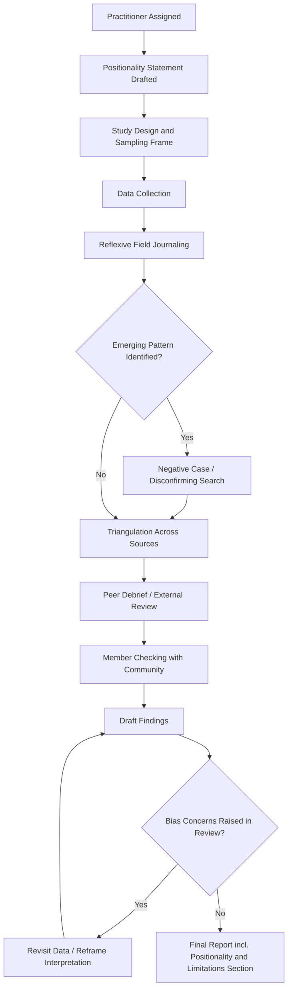

## Reflexivity and Managing Practitioner Bias

### Definition and Conceptual Foundation

**Reflexivity** is the disciplined practice of a practitioner critically examining their own positionality, assumptions, values, and influence on the research or assessment process, and explicitly accounting for how these factors shape data collection, interpretation, and reporting. In Social Impact Assessment (SIA), reflexivity is not introspection for its own sake — it is a methodological control mechanism intended to improve the validity and credibility of findings by making the practitioner's influence visible and manageable rather than hidden or denied.

**Practitioner bias** refers to systematic distortions in how a practitioner perceives, elicits, records, or interprets social information, arising from the practitioner's own background, prior expectations, institutional affiliations, or unconscious cognitive shortcuts. Unlike random error, bias is directional and, if unaddressed, tends to skew findings consistently in a particular direction.

The relationship between the two: reflexivity is the *process*; bias mitigation is the *goal*. A practitioner cannot eliminate bias — subjectivity is inherent to any human observer — but reflexive practice makes bias identifiable, discussable, and correctable within the limits of the method.

### Theoretical Origins

[Inference] The concept of reflexivity in social research draws substantially from the sociology of knowledge and ethnographic methodology, particularly the work of Pierre Bourdieu on "epistemic reflexivity" (examining how the researcher's own social position shapes the categories used to understand others), and from feminist standpoint theory, which emphasizes that all knowledge production is situated and partial rather than neutral.

In applied SIA and impact evaluation practice, reflexivity requirements have been increasingly formalized through:

- **International Association for Impact Assessment (IAIA)** guidance on social impact assessment principles, which frames practitioner independence and transparency about methodological limitations as core ethical obligations.
- **Evaluation professional bodies** (e.g., American Evaluation Association Guiding Principles), which require evaluators to disclose conflicts of interest, values, and perspectives that could affect the evaluation.
- **Qualitative research methodology literature**, where reflexivity is treated as a validity criterion equivalent to what quantitative research calls addressing "measurement bias."

### Categories of Practitioner Bias Relevant to SIA

#### 1. Cognitive and Perceptual Biases

| Bias | Mechanism | SIA Manifestation |
| --- | --- | --- |
| Confirmation bias | Seeking/interpreting information that confirms prior beliefs | Practitioner expecting a project to be "beneficial" interprets ambiguous community statements as support |
| Availability bias | Overweighting vivid or recent information | One dramatic testimony disproportionately shapes overall impact characterization |
| Anchoring bias | Over-reliance on first information received | Initial briefing from the project proponent frames all subsequent community data collection |
| Halo effect | Positive/negative impression in one area bleeding into unrelated judgments | Well-organized community leadership assumed to represent all subgroups fairly |
| Social desirability bias (in respondents, but practitioner-induced) | Practitioner's presence/framing causes respondents to give expected rather than honest answers | Respondents praise a project when a practitioner is introduced by the project proponent |

#### 2. Positionality-Driven Biases

- **Class, educational, and cultural distance**: practitioners with urban, formal-education backgrounds may systematically undervalue informal, customary, or non-literate forms of community knowledge and governance.
- **Institutional affiliation bias**: practitioners commissioned directly by a project proponent may — consciously or not — frame findings in ways that reduce perceived project risk, a dynamic sometimes termed **"client capture"** in evaluation ethics literature.
- **Gender and identity positionality**: a practitioner's own gender, ethnicity, or outsider/insider status affects which respondents feel comfortable speaking candidly, and which topics are considered discussable in their presence.
- **Disciplinary bias**: practitioners trained primarily in economics, engineering, or environmental science may systematically underweight social and cultural impact pathways relative to their trained specialty, and vice versa for those trained in social sciences.

#### 3. Methodological and Process Biases

- **Elite bias / key informant bias**: over-reliance on accessible, articulate, or powerful informants (government officials, project-friendly community leaders) because they are easier to reach and communicate more fluently with practitioners.
- **Site-selection bias**: choosing more accessible villages or communities for fieldwork due to logistical convenience, producing findings unrepresentative of harder-to-reach or more affected populations.
- **Time-in-field bias**: short field visits ("helicopter" or "safari" research) that produce oversimplified snapshots of dynamic, seasonally variable social conditions.
- **Translation and interpretation bias**: meaning loss or reframing introduced by interpreters, especially where interpreters themselves have local power interests or biases.

### Reflexive Practice: Core Techniques

#### 1. Positionality Statements

A **positionality statement** is a documented, explicit account of the practitioner's own background, relationship to the project or funder, prior assumptions, and potential sources of bias, disclosed as part of the methodology section of an SIA report. This converts subjective factors from a hidden influence into a visible, reviewable methodological variable.

**Example positionality statement excerpt**:

"The lead assessor was contracted directly by the project proponent and has prior professional experience in extractive-sector social performance. This creates a potential incentive bias toward findings that minimize identified risks. To mitigate this, triangulation with an independent local research partner and a structured negative-case search protocol were applied (see Section 4.3)."

#### 2. Reflexive Journaling / Field Notes

Maintaining a parallel, methodologically distinct record — separate from data notes — that documents the practitioner's own reactions, assumptions being tested, moments of surprise or discomfort, and decisions made during fieldwork (e.g., why a particular informant was prioritized, why a line of questioning was abandoned). This creates an audit trail of interpretive choices.

#### 3. Triangulation

Cross-verifying findings across multiple independent sources — data types (qualitative and quantitative), informant categories (elites and marginalized groups), and methods (interviews, observation, document review) — to reduce the risk that any single source's bias (including the practitioner's own elicitation bias) dominates the conclusion.

$$\text{Confidence}(F) \propto \sum_{i=1}^{n} w_i \cdot \text{Independence}(S_i)$$

Where $F$ is a finding, $S_i$ are independent sources, and $w_i$ reflects source reliability weighting. [Inference] This is a conceptual heuristic rather than a formally standardized SIA metric; triangulation is typically applied qualitatively rather than through an explicit weighting formula in practice.

#### 4. Negative Case Analysis / Disconfirming Evidence Search

Deliberately and systematically searching for evidence that contradicts the practitioner's emerging conclusions or the project proponent's preferred narrative, rather than only for confirming evidence. This directly counters confirmation bias.

#### 5. Peer Debrief and External Review

Structured discussion of findings and interpretive choices with a colleague or reviewer not involved in data collection, specifically to surface unexamined assumptions. In participatory or community-based research, this can extend to **member checking** — returning preliminary findings to community respondents to verify that the practitioner's interpretation matches their own understanding.

#### 6. Structured, Pre-Registered Protocols

Using standardized interview guides, sampling frames, and coding frameworks decided *before* fieldwork begins reduces the scope for ad hoc, bias-susceptible improvisation during data collection, while still allowing qualitative flexibility within the structure.

#### 7. Team and Source Diversification

Deliberately composing assessment teams (or informant pools) to include diversity along dimensions relevant to the context — gender, ethnicity, insider/outsider status, disciplinary background — so that no single positionality dominates data collection and interpretation.

### Integration Into the SIA Workflow

### Illustration: Sources of Distortion Between Observed Reality and Reported Findings (SVG)

<svg xmlns="http://www.w3.org/2000/svg" viewBox="0 0 740 320" font-family="Arial, sans-serif">
<text x="370" y="26" text-anchor="middle" font-size="17" font-weight="bold" fill="#1a1a1a">Bias Filters Between Community Reality and Reported Findings (svg_diagram)</text>
<rect x="20" y="130" width="130" height="60" rx="8" fill="#4a6fa5" />
<text x="85" y="165" text-anchor="middle" font-size="12" fill="#ffffff" font-weight="bold">Community</text>
<text x="85" y="180" text-anchor="middle" font-size="12" fill="#ffffff" font-weight="bold">Reality</text>
<line x1="150" y1="160" x2="210" y2="160" stroke="#555555" stroke-width="2" marker-end="url(#arrow1)" />
<rect x="215" y="120" width="140" height="80" rx="8" fill="#d9534f" opacity="0.2" stroke="#d9534f" stroke-width="2" />
<text x="285" y="140" text-anchor="middle" font-size="11" font-weight="bold" fill="#a83232">Elicitation Filter</text>
<text x="230" y="158" font-size="10" fill="#333333">Interpreter framing</text>
<text x="230" y="172" font-size="10" fill="#333333">Social desirability</text>
<text x="230" y="186" font-size="10" fill="#333333">Power dynamics</text>
<line x1="355" y1="160" x2="415" y2="160" stroke="#555555" stroke-width="2" marker-end="url(#arrow1)" />
<rect x="420" y="120" width="140" height="80" rx="8" fill="#d9534f" opacity="0.2" stroke="#d9534f" stroke-width="2" />
<text x="490" y="140" text-anchor="middle" font-size="11" font-weight="bold" fill="#a83232">Perceptual Filter</text>
<text x="435" y="158" font-size="10" fill="#333333">Confirmation bias</text>
<text x="435" y="172" font-size="10" fill="#333333">Positionality/identity</text>
<text x="435" y="186" font-size="10" fill="#333333">Disciplinary lens</text>
<line x1="560" y1="160" x2="615" y2="160" stroke="#555555" stroke-width="2" marker-end="url(#arrow1)" />
<rect x="620" y="130" width="100" height="60" rx="8" fill="#4a6fa5" />
<text x="670" y="165" text-anchor="middle" font-size="12" fill="#ffffff" font-weight="bold">Reported</text>
<text x="670" y="180" text-anchor="middle" font-size="12" fill="#ffffff" font-weight="bold">Findings</text>
<path d="M 285 200 Q 370 260 490 200" stroke="#357a35" stroke-width="2" fill="none" stroke-dasharray="5,4" marker-end="url(#arrowGreen1)" />
<text x="370" y="255" text-anchor="middle" font-size="11" fill="#357a35" font-weight="bold">Reflexive Practice Counteracts Both Filters</text>
<text x="370" y="270" text-anchor="middle" font-size="10" fill="#357a35">(triangulation, journaling, peer debrief, member checking)</text>
</svg>

### Reflexivity and Independence: Managing Structural Conflicts of Interest

A distinct but related concern is **structural bias arising from funding and reporting relationships** rather than individual cognition:

- **Client-commissioned assessments**: when the entity being assessed also pays for and receives the assessment, an inherent incentive misalignment exists regardless of individual practitioner integrity. Mitigations include:
  - Contractual guarantees of methodological independence and non-suppression of findings
  - Public disclosure of funding source in the report
  - Use of independent third-party reviewers or advisory panels
  - Adoption of standardized reporting templates that do not permit selective omission of negative findings
- **Repeat-engagement incentives**: practitioners dependent on repeat contracts from the same proponent may face implicit pressure to produce favorable findings to preserve future business, a dynamic requiring explicit institutional safeguards (e.g., rotating assessors, blind review) rather than individual willpower alone.

[Unverified: the effectiveness of any single safeguard (e.g., blind review, rotation) in fully eliminating client-capture effects has not been definitively established in the literature and likely varies by institutional context.]

### Practical Example: Applying Reflexivity in the Field

**Scenario**: A practitioner conducting household interviews for a resettlement SIA notices that respondents consistently express support for the project during interviews conducted at the village chief's compound.

**Reflexive response**:

1. **Recognize the signal**: interview location itself may be inducing social desirability bias, since respondents may fear the chief's disapproval of dissent expressed on his premises.
2. **Document in field journal**: note the pattern and the hypothesis (venue-induced bias) rather than accepting responses at face value.
3. **Adjust method**: relocate a subsample of interviews to neutral or private locations (e.g., respondents' own homes, or anonymized written surveys) to test whether responses shift.
4. **Triangulate**: compare interview responses against independent behavioral indicators (e.g., attendance at project consultation meetings, GRM complaint records) that are less susceptible to venue-based social pressure.
5. **Report transparently**: disclose the observed discrepancy and methodological adjustment in the final report's limitations section, rather than presenting only the more favorable initial data.

**Conclusion**: Reflexivity converts a potential validity threat into a documented, methodologically managed feature of the assessment, strengthening rather than undermining the credibility of the final findings.

### Common Pitfalls

- **Reflexivity as performative disclosure only**: including a positionality statement without any corresponding methodological adjustment is a superficial compliance exercise, not genuine reflexive practice.
- **Overcorrection**: excessive second-guessing of every observation can paralyze analysis or lead practitioners to discount valid findings simply because they align with prior expectations.
- **Conflating reflexivity with relativism**: acknowledging subjectivity does not mean all interpretations are equally valid; reflexivity is meant to improve rigor, not abandon standards of evidence.
- **Individual-level fixes for structural problems**: personal self-awareness cannot fully substitute for institutional safeguards against client capture or funding-driven bias.

**Related Topics**

- Positionality statements and methodological transparency in reporting
- Triangulation methods in mixed-methods SIA
- Independence and conflict-of-interest safeguards in commissioned assessments
- Participatory and community-based validation (member checking)
- Free, Prior, and Informed Consent (FPIC) procedures
- Vulnerability and social exclusion analysis
- Ethical codes of conduct for impact assessment practitioners (IAIA, AEA)