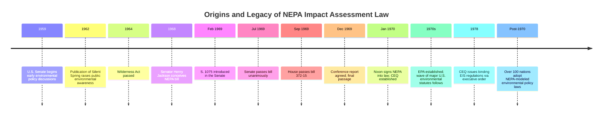

## Origins of Impact Assessment Law under the National Environmental Policy Act

### Historical and Political Context (1960s Precursors)

The National Environmental Policy Act (NEPA) did not emerge in isolation; it was the legislative culmination of a decade of rising public and scientific concern about the environmental consequences of industrial growth, unmanaged federal infrastructure projects, and pollution.

Key precursor dynamics included increasing public concern beginning in the late 1950s and through the 1960s about the impact that human activity could have on the environment, with advocates arguing that without a specific national policy, federal agencies were neither able nor inclined to consider the environmental impacts of their actions in fulfilling their missions. [everycrsreport](https://www.everycrsreport.com/reports/RL33152.html)

Contributing social and intellectual currents of the period included:

- **Scientific and popular environmental literature**: public concern was substantially shaped by environmental interest-group efforts and rising public awareness driven by Rachel Carson's 1962 book Silent Spring, which also helped drive support for the 1964 Wilderness Act and subsequent legislation. [marist](https://technology.marist.com/explora/28285446)
- **Industrial and urban growth pressures**: the period saw rising industrialization, urban and suburban growth, and pollution across the country, feeding growing public respect and concern for the environment. [marist](https://technology.marist.com/explora/28285446)
- **Absence of any legal requirement** for federal agencies to consider environmental consequences before acting — highway construction, dam building, and public works projects proceeded without any statutory obligation to assess ecological or social effects.

### Legislative History

#### Sponsorship and Drafting

NEPA is often called the Magna Carta of the nation's environmental laws and was the brainchild of Senator Henry M. "Scoop" Jackson, who conceived of the bill in 1968 and shepherded it through his Senate Interior and Insular Affairs Committee and then through the full Senate in 1969. [historylink](https://historylink.org/File/9903)

Jackson articulated the bill's rationale directly. In a statement before his Interior Committee on April 16, 1969, he explained the bill's "threefold purpose": establishing a national policy on the environment, authorizing expanded research and understanding of natural resources and human ecology, and establishing in the Office of the President a properly staffed Council of Environmental Quality Advisors. [historylink](https://historylink.org/File/9903)

#### Legislative Path

| Milestone | Date |
| --- | --- |
| Introduced in Senate as S. 1075 by Sen. Henry Jackson | February 18, 1969 |
| Passed the Senate (unanimous) | July 10, 1969 |
| Passed the House of Representatives (372–15) | September 22/23, 1969 |
| Joint conference committee report | December 17, 1969 |
| Final passage — Senate | December 20, 1969 |
| Final passage — House | December 22/23, 1969 |
| Signed into law by President Richard Nixon | January 1, 1970 |

[Unverified: minor source discrepancies exist regarding the exact House passage date (September 22 vs. 23) and final House concurrence date (December 22 vs. 23); these reflect inconsistencies across secondary sources rather than a substantive dispute about the Act's enactment.]

The Act was codified as Public Law 91-190, 83 Stat. 852, creating 42 U.S.C. § 4321 et seq. under Title 42 (Public Health and Welfare), and it does not apply to the President, Congress, or the federal courts. [4everland](https://bafybeiemxf5abjwjbikoz4mc3a3dla6ual3jsgpdr4cjr3oz3evfyavhwq.ipfs.4everland.io/wiki/NEPA.html)

### Statutory Purpose and Core Provisions

NEPA states that it is intended to declare a national policy which will encourage productive and enjoyable harmony between man and his environment, promote efforts to prevent or eliminate damage to the environment and biosphere and stimulate the health and welfare of man, enrich understanding of ecological systems and natural resources important to the Nation, and establish a Council on Environmental Quality. [encyclopedia](https://www.encyclopedia.com/science/news-wires-white-papers-and-books/national-environmental-policy-act)

The Act's practical mechanism for achieving this policy was procedural rather than substantive — it did not mandate particular environmental outcomes, but rather mandated a **disclosure and consideration process**:

- To implement its policy, NEPA requires federal agencies to provide a detailed statement of environmental impacts — subsequently referred to as an environmental impact statement (EIS) — for every recommendation or report on proposals for legislation and other major federal action significantly affecting the quality of the human environment. [everycrsreport](https://www.everycrsreport.com/reports/RL33152.html)
- NEPA's most significant outcome was the requirement that all executive Federal agencies prepare environmental assessments (EAs) and environmental impact statements (EISs). [Wikipedia](https://www.wikipedia.org/wiki/NEPA)
- The law also requires that reviews of proposed projects be open to input from members of the public. [encyclopedia](https://www.encyclopedia.com/science/news-wires-white-papers-and-books/national-environmental-policy-act)

#### The Council on Environmental Quality (CEQ)

NEPA created a Council on Environmental Quality (CEQ) in the Executive Office of the President, which among other duties provides oversight of NEPA's implementation. In 1978, CEQ was authorized by executive order to issue regulations applicable to all federal agencies regarding the preparation of EISs, although CEQ was not authorized to enforce those regulations. This structural limitation — an oversight body without direct enforcement power — became a defining feature of how NEPA compliance would later be driven primarily through **judicial review and citizen litigation** rather than administrative enforcement. [everycrsreport](https://www.everycrsreport.com/reports/RL33152.html)[everycrsreport](https://www.everycrsreport.com/files/20110110_RL33152_db1c10c5393a713b8dc27444a0c48d1ce6da3fa1.html)

### Historic Significance as the Origin Point of Impact Assessment Law

To date, more than 100 nations around the world have enacted national environmental policies modeled after NEPA, making it the foundational template for the entire field of environmental and social impact assessment practice globally. [Wikipedia](https://www.wikipedia.org/wiki/NEPA)

NEPA broke new ground as the first major Federal legislative effort to incorporate environmental considerations into all government decision-making, fundamentally altering how lawmakers and regulators approached human impacts on the natural world by requiring federal agencies to prepare Environmental Impact Statements for all major Federal actions significantly affecting the environment. [eli](https://eli.org/taxonomy/term/10605?page=1)

According to a 2007 statement by the Council on Environmental Quality, NEPA was the first major U.S. environmental law, and it was the first of several major environmental laws passed in the 1970s. As an early step in the development of U.S. environmental policy, NEPA is referred to as the "environmental Magna Carta." [National Environmental Policy Act +2](https://www.encyclopedia.com/science/news-wires-white-papers-and-books/national-environmental-policy-act)

**Significance for SIA practice specifically**: while NEPA's text centers on "environmental" impacts, its implementing regulations and subsequent judicial interpretation established that the "human environment" encompasses social, cultural, and economic effects — not solely biophysical ones. This interpretive expansion is the direct legal ancestor of what is now recognized as the distinct discipline of Social Impact Assessment, since it created the first formal, legally mandated requirement to systematically document how government decisions affect human communities.

### The EIS as a Legal and Procedural Innovation

The Environmental Impact Statement introduced several features that remain structurally embedded in impact assessment practice worldwide:

1. **Ex ante disclosure requirement**: analysis must occur *before* a decision is finalized, not as a post hoc justification.
2. **Alternatives analysis**: agencies must consider a reasonable range of alternatives, including the "no action" alternative — a requirement that shaped the now-standard SIA practice of comparative scenario assessment.
3. **Public comment and participation**: reviews of proposed projects must be open to input from members of the public, establishing the legal foundation for stakeholder consultation as a formal procedural right rather than a discretionary courtesy. [encyclopedia](https://www.encyclopedia.com/science/news-wires-white-papers-and-books/national-environmental-policy-act)
4. **Judicial reviewability**: the Environmental Impact Statement provision became an important tool for environmentalists and became the basis for hundreds of lawsuits aimed at stopping or delaying projects, which is a major reason the Act remains controversial even while being widely credited for bringing environmental protection to the forefront of American policy. [historylink](https://historylink.org/File/9903)

### Illustrative Diagram: Legislative and Conceptual Lineage of NEPA

### Structural Diagram: NEPA's Core Legal Mechanism (SVG)

<svg xmlns="http://www.w3.org/2000/svg" viewBox="0 0 720 300" font-family="Arial, sans-serif">
<text x="360" y="26" text-anchor="middle" font-size="17" font-weight="bold" fill="#1a1a1a">NEPA's Procedural Mechanism (svg_diagram)</text>
<rect x="20" y="60" width="150" height="60" rx="8" fill="#4a6fa5" />
<text x="95" y="85" text-anchor="middle" font-size="12" fill="#ffffff" font-weight="bold">Proposed Federal</text>
<text x="95" y="102" text-anchor="middle" font-size="12" fill="#ffffff" font-weight="bold">Action</text>
<line x1="170" y1="90" x2="225" y2="90" stroke="#555555" stroke-width="2" marker-end="url(#arrowN)" />
<rect x="230" y="60" width="150" height="60" rx="8" fill="#5a8f5a" />
<text x="305" y="85" text-anchor="middle" font-size="12" fill="#ffffff" font-weight="bold">Environmental</text>
<text x="305" y="102" text-anchor="middle" font-size="12" fill="#ffffff" font-weight="bold">Assessment (EA)</text>
<line x1="380" y1="90" x2="435" y2="90" stroke="#555555" stroke-width="2" marker-end="url(#arrowN)" />
<rect x="440" y="60" width="160" height="60" rx="8" fill="#d9534f" opacity="0.85" />
<text x="520" y="85" text-anchor="middle" font-size="12" fill="#ffffff" font-weight="bold">Significant Impact?</text>
<text x="520" y="102" text-anchor="middle" font-size="11" fill="#ffffff">(Finding of No Significant Impact vs EIS trigger)</text>
<line x1="520" y1="120" x2="520" y2="160" stroke="#555555" stroke-width="2" marker-end="url(#arrowN)" />
<rect x="380" y="165" width="150" height="55" rx="8" fill="#e8a33d" />
<text x="455" y="186" text-anchor="middle" font-size="11" fill="#ffffff" font-weight="bold">FONSI</text>
<text x="455" y="202" text-anchor="middle" font-size="10" fill="#ffffff">(No further review)</text>
<rect x="550" y="165" width="150" height="55" rx="8" fill="#8b5aa8" />
<text x="625" y="186" text-anchor="middle" font-size="11" fill="#ffffff" font-weight="bold">Full EIS Required</text>
<text x="625" y="202" text-anchor="middle" font-size="10" fill="#ffffff">Alternatives + Public Comment</text>
<line x1="500" y1="140" x2="455" y2="160" stroke="#555555" stroke-width="1.5" />
<line x1="545" y1="140" x2="600" y2="160" stroke="#555555" stroke-width="1.5" />
<line x1="625" y1="220" x2="625" y2="250" stroke="#555555" stroke-width="2" marker-end="url(#arrowN)" />
<rect x="500" y="255" width="250" height="35" rx="6" fill="#333333" opacity="0.85" />
<text x="625" y="277" text-anchor="middle" font-size="11" fill="#ffffff">Subject to Judicial Review</text>
</svg>

### Relevance to Contemporary SIA Practice

NEPA's structural legacy in current SIA methodology includes:

- **The "human environment" doctrine**: subsequent CEQ regulations and case law interpreted NEPA's mandate to extend to social, economic, cultural, and health effects, establishing the legal basis for treating social impacts as a mandatory component of impact assessment rather than an optional add-on.
- **Scoping as a formal step**: NEPA's implementing regulations formalized "scoping" as an early, mandatory phase to determine the range of issues to be addressed — a structure mirrored in virtually all modern SIA methodologies.
- **Tiering and cumulative effects analysis**: NEPA jurisprudence developed the concept of assessing cumulative and indirect effects, which directly informs current SIA practice on cumulative social impact analysis.
- **Global diffusion**: as noted above, NEPA's basic architecture — screening, scoping, impact statement, public comment, decision record — was replicated, with local adaptation, in national EIA/SIA legal frameworks across more than 100 countries, making it the direct legal ancestor of virtually all statutory impact assessment regimes in use today, including those requiring social impact assessment as a component of environmental review.

**Conclusion**: NEPA's origin as a procedural, disclosure-based environmental statute — rather than a substantive environmental outcomes law — is the foundational reason that modern impact assessment, including SIA, is structured around systematic analysis, alternatives comparison, public participation, and documentation rather than fixed regulatory outcome standards. Understanding this legislative and legal history is essential for practitioners because it explains *why* SIA methodology emphasizes procedural rigor and transparency: these are not arbitrary methodological preferences but direct descendants of a specific legal architecture designed to be judicially enforceable through procedural compliance rather than substantive environmental guarantees.

**Related Topics**

- CEQ regulations (40 C.F.R. Parts 1500–1508) and their evolution
- Scoping, screening, and the Finding of No Significant Impact (FONSI) process
- Judicial review and citizen-suit enforcement of NEPA
- The "human environment" doctrine and inclusion of social/cultural impacts
- Comparative national EIA/SIA legal frameworks modeled on NEPA
- Cumulative impact assessment methodology
- Public participation requirements in environmental and social review
- Evolution from NEPA to IFC Performance Standards and World Bank ESF safeguards