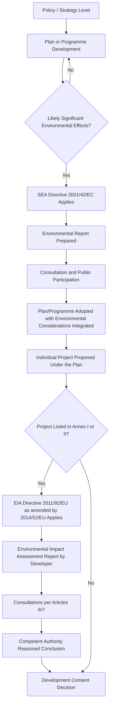

## European Union Environmental Impact Assessment and Strategic Environmental Assessment Directives

### Overview and Distinction Between the Two Instruments

The European Union operates two complementary, legally distinct impact assessment regimes:

- **Environmental Impact Assessment (EIA) Directive** — applies at the **project level** (individual public and private developments such as roads, dams, industrial facilities).
- **Strategic Environmental Assessment (SEA) Directive** — applies at the **plan and programme level** (land-use plans, transport strategies, energy policy frameworks) — i.e., upstream of individual projects, at the point where the framework for future development consent is established.

This two-tier structure is a deliberate policy design: SEA is intended to catch cumulative and strategic-level environmental effects that would be too late to meaningfully address once individual projects reach the EIA stage, since SEA requires assessment of plans and programmes which set the framework for future development consent of projects which are subject to EIA.

### The EIA Directive: Legislative Lineage

#### Original Instrument and Consolidation

The EIA Directive's legal lineage traces to **Council Directive 85/337/EEC**, the original 1985 instrument establishing environmental impact assessment requirements for projects in the European Community. This original directive was substantially amended multiple times and was eventually consolidated into **Directive 2011/92/EU**, which harmonised the principles for the environmental impact assessment of projects by introducing minimum requirements with regard to the type of projects subject to assessment.

#### The 2014 Amendment: Directive 2014/52/EU

Directive 2011/92/EU was substantially amended by **Directive 2014/52/EU of 16 April 2014**, adopted to ensure a high level of protection of the environment and human health through establishing common minimum requirements on the assessment of the effects of certain public and private projects on the environment.

**Legislative and procedural details**:

| Attribute | Detail |
| --- | --- |
| Adoption date | 16 April 2014 |
| Publication in Official Journal | 25 April 2014 (OJ L 124, p. 1–18) |
| Entry into force | 15 May 2014 |
| Member State transposition deadline | 16 May 2017 |
| Legal basis | Treaty on the Functioning of the European Union, Article 192(1) |
| Legislative procedure | Ordinary legislative procedure (co-decision between Parliament and Council) |

The amendment's stated purpose, per its recitals, was threefold: the Commission's 2007 mid-term review of the Sixth Community Environment Action Programme and a 2009 Commission report on the application and effectiveness of the original 1985 Directive stressed the need to improve the principles of environmental impact assessment of projects and adapt the framework to an evolved policy, legal, and technical context. Consequently, the 2014 amendment aimed to strengthen the quality of the environmental impact assessment procedure, align that procedure with the principles of smart regulation, and enhance coherence and synergies with other Union legislation and policies.

#### Key Substantive Changes Introduced by Directive 2014/52/EU

A significant structural change was the introduction of a formal statutory definition of the EIA process itself. The amendment added a definition specifying that "environmental impact assessment" means a process consisting of: the preparation of an environmental impact assessment report by the developer; the carrying out of consultations; and further procedural steps (examination by the competent authority, reasoned conclusion, and integration into the consent decision).

[Inference] Beyond the definitional clarification directly confirmed in the amending text, the 2014 reform is broadly understood in EU environmental law commentary to have also: strengthened requirements for assessing alternatives, climate change, biodiversity, and disaster/vulnerability risks; introduced stricter conflict-of-interest and quality-control safeguards for competent authorities and expert reports; introduced binding time limits for certain procedural steps; and required reasoned justification when authorities conclude no significant effects are likely (screening decisions). These broader substantive changes are well-documented in secondary EU law literature, though this response focuses on the explicitly confirmed core structural elements.

### The SEA Directive: Directive 2001/42/EC

#### Legal Basis and Purpose

**Directive 2001/42/EC on the assessment of the effects of certain plans and programmes on the environment** is the EU's foundational strategic-level impact assessment instrument. Its stated objective is to provide for a high level of protection of the environment and to contribute to the integration of environmental considerations into the preparation and adoption of plans and programmes with a view to promoting sustainable development, by ensuring that an environmental assessment is carried out of certain plans and programmes likely to have significant environmental effects.

**Key dates**:

| Milestone | Date |
| --- | --- |
| Entry into force | 21 July 2001 |
| Member State transposition deadline | 21 July 2004 |
| Applicability | Plans/programmes whose preparation or review commenced after 21 July 2004 |

The SEA Directive filled a gap not covered by the earlier EIA Directive (Directive 85/337/EEC), since project-level assessment alone could not capture the cumulative and strategic environmental consequences embedded in higher-level plans and programmes.

#### Scope: Sectoral Coverage

The SEA Directive applies to public plans and programmes — those subject to preparation and/or adoption by an authority and required by national legislative, regulatory, or administrative provisions. Article 3 of the Directive lists the sectors in which an SEA must be carried out for qualifying plans and programmes: **Agriculture, Forestry, Fisheries, Energy, Industry, Transport, Waste Management, Water Management, Telecommunications, Tourism, and Town and Country Planning or Land Use**.

A plan or programme also triggers mandatory SEA where it sets the framework for future development consent of EIA-subject projects, or where an assessment is required due to likely effects on sites protected under the Habitats Directive (Directive 92/43/EEC), establishing an important interlinkage between the SEA regime and EU nature conservation law.

#### Procedural Stages of SEA

The characteristic procedural sequence of an SEA process, as implemented in national transposing frameworks (illustrated here via a representative UK/Ireland practice model consistent with the Directive's requirements), comprises: **Pre-screening, Screening, Scoping, Environmental Report, Adoption, and Monitoring**.

SEA is described as a tool used internationally to improve the environmental performance of plans by predicting and evaluating the environmental impacts of plans and their alternatives at an early stage in their preparation, with improvements identified through the involvement of environmental experts, stakeholders, and the public.

#### Implementation Experience

Formal Commission review found that Member State implementation of the SEA Directive was, in its early years, uneven: due to delays in transposing the Directive in many Member States and limited experience of its application, the Commission's first statutorily required implementation report (due by 21 July 2006) could not be produced as planned. The overall picture of application and effectiveness across Member States was found to be varied in terms of institutional and legal arrangements and in how Member States perceived the SEA procedure's role, with the general finding that SEA application was still in its infancy and that Member States generally preferred legislative stability to allow national SEA systems to mature before further amendment was considered.

### Comparative Structure: EIA vs. SEA

| Dimension | EIA Directive (2011/92/EU, as amended by 2014/52/EU) | SEA Directive (2001/42/EC) |
| --- | --- | --- |
| Level of application | Individual projects | Plans and programmes |
| Original/founding instrument | Directive 85/337/EEC (1985) | Directive 2001/42/EC (2001) |
| Core output | Environmental Impact Assessment Report + reasoned conclusion by competent authority | Environmental Report + integration into plan adoption |
| Triggering test | Likely significant effects on the environment from a specific project | Likely significant effects on the environment from a plan/programme, especially where it frames future development consents |
| Sectoral scope | Annexes I and II project lists (energy, infrastructure, extractive, waste, etc.) | Eleven sectors listed under Article 3 |
| Consultation requirement | Public and authority consultation on the EIA report | Public and authority consultation on the Environmental Report before adoption |
| Interlinkage | Downstream from SEA — project-level detail | Upstream — sets framework that triggers/shapes subsequent EIA |

### Illustrative Diagram: Tiered Relationship Between SEA and EIA

### Diagram: EU Impact Assessment Legal Hierarchy (SVG)

<svg xmlns="http://www.w3.org/2000/svg" viewBox="0 0 700 340" font-family="Arial, sans-serif">
<text x="350" y="26" text-anchor="middle" font-size="17" font-weight="bold" fill="#1a1a1a">EU EIA/SEA Legal Hierarchy (svg_diagram)</text>
<rect x="230" y="50" width="240" height="55" rx="8" fill="#4a6fa5" />
<text x="350" y="73" text-anchor="middle" font-size="12" fill="#ffffff" font-weight="bold">TFEU Article 192(1)</text>
<text x="350" y="90" text-anchor="middle" font-size="11" fill="#ffffff">(Environmental Policy Legal Base)</text>
<line x1="350" y1="105" x2="350" y2="135" stroke="#555555" stroke-width="2" marker-end="url(#arrE)" />
<rect x="60" y="140" width="260" height="70" rx="8" fill="#5a8f5a" />
<text x="190" y="163" text-anchor="middle" font-size="12" fill="#ffffff" font-weight="bold">SEA Directive 2001/42/EC</text>
<text x="190" y="180" text-anchor="middle" font-size="10" fill="#ffffff">Plans and Programmes</text>
<text x="190" y="195" text-anchor="middle" font-size="10" fill="#ffffff">(11 sectors, Art. 3)</text>
<rect x="380" y="140" width="260" height="70" rx="8" fill="#8b5aa8" />
<text x="510" y="158" text-anchor="middle" font-size="12" fill="#ffffff" font-weight="bold">EIA Directive 2011/92/EU</text>
<text x="510" y="175" text-anchor="middle" font-size="10" fill="#ffffff">(as amended by 2014/52/EU)</text>
<text x="510" y="192" text-anchor="middle" font-size="10" fill="#ffffff">Individual Projects</text>
<line x1="320" y1="175" x2="380" y2="175" stroke="#555555" stroke-width="2" stroke-dasharray="6,3" marker-end="url(#arrE)" />
<text x="350" y="168" text-anchor="middle" font-size="9" fill="#555555">frames</text>
<line x1="190" y1="210" x2="190" y2="245" stroke="#555555" stroke-width="2" marker-end="url(#arrE)" />
<line x1="510" y1="210" x2="510" y2="245" stroke="#555555" stroke-width="2" marker-end="url(#arrE)" />
<rect x="60" y="250" width="260" height="60" rx="8" fill="#e8a33d" />
<text x="190" y="275" text-anchor="middle" font-size="11" fill="#ffffff" font-weight="bold">National Transposition</text>
<text x="190" y="292" text-anchor="middle" font-size="10" fill="#ffffff">Member State legislation</text>
<rect x="380" y="250" width="260" height="60" rx="8" fill="#e8a33d" />
<text x="510" y="275" text-anchor="middle" font-size="11" fill="#ffffff" font-weight="bold">National Transposition</text>
<text x="510" y="292" text-anchor="middle" font-size="10" fill="#ffffff">Member State legislation</text>
</svg>

### Relevance to SIA Practice

While both Directives are formally titled "environmental" assessment instruments, their practical implementation carries substantial social impact assessment content:

- **Public participation as a legal right**: both Directives mandate consultation with the public and affected authorities before decisions are finalized, providing a legally enforceable EU-wide floor for stakeholder engagement that SIA practitioners operating in EU jurisdictions must integrate into their consultation design.
- **"Environmental Report" content requirements**: national transposing legislation for both Directives typically requires consideration of effects on population, human health, and material assets alongside biophysical environmental factors — creating a statutory hook for embedding social impact analysis within an otherwise environmentally-framed legal process.
- **Tiering discipline**: the SEA-to-EIA tiering structure is a model increasingly referenced in SIA methodology for how cumulative and strategic-level social impacts (e.g., regional land-use change, displacement patterns across multiple projects) should be assessed upstream of individual project-level social impact assessments, rather than only at the point of individual project approval.
- **Reasoned conclusions and transparency**: the EIA Directive's requirement that competent authorities issue a reasoned conclusion integrating assessment findings into the consent decision mirrors, and legally reinforces, SIA good-practice norms requiring documented, traceable linkage between assessment findings and final decisions.

**Conclusion**: The EU's EIA/SEA framework represents one of the most developed statutory tiered-assessment systems globally, distinguishing project-level environmental impact assessment (Directive 2011/92/EU, as amended by 2014/52/EU) from plan/programme-level strategic environmental assessment (Directive 2001/42/EC). For SIA practitioners, understanding this tiered structure — and its explicit linkage points such as the Habitats Directive cross-reference and the "sets the framework for future development consent" trigger — is essential for correctly sequencing social impact analysis across strategic planning and individual project approval stages within EU and EU-influenced regulatory contexts.

**Related Topics**

- Habitats Directive (92/43/EEC) and Appropriate Assessment interlinkages
- National transposition variation in EIA/SEA implementation across EU Member States
- Public participation and Aarhus Convention obligations in EU environmental law
- Screening and scoping thresholds under Annex I/II of the EIA Directive
- Cumulative effects assessment in tiered SEA-EIA systems
- Comparative frameworks: NEPA vs. EU EIA/SEA Directives
- Post-Brexit UK retained EU environmental assessment law