## Comparative National Environmental and Social Impact Assessment Systems

### Overview

Comparative Environmental and Social Impact Assessment (ESIA) systems analysis examines how different national jurisdictions structure, mandate, and operationalize impact assessment law. While the foundational concept, an ex-ante evaluation of a proposed action's environmental and social consequences before authorization, originated with the U.S. National Environmental Policy Act (NEPA) of 1969, over 190 countries have since adopted some form of impact assessment legislation, each with distinct triggers, procedural architecture, public participation mechanisms, and enforcement models. Understanding these variations is essential for practitioners working on multilateral-funded projects, cross-border infrastructure, extractive industries, and any engagement requiring harmonization between national law and international lender safeguards.

### Foundational Legal Architecture: Common Design Choices

Every national ESIA system must resolve several recurring design questions. Comparing systems is largely an exercise in comparing how each jurisdiction answers these:

- **Trigger mechanism** — a fixed list of prescribed project types/thresholds ("list-based" or "Annex" approach) versus case-by-case discretionary screening
- **Screening authority** — centralized national environmental agency versus decentralized/subnational authority versus sectoral ministries
- **Scoping formality** — mandatory public scoping versus proponent-driven scoping with agency review
- **Social impact integration** — whether social impacts are assessed within a unified ESIA instrument or require a separate Social Impact Assessment (SIA)/Resettlement Action Plan (RAP)
- **Public participation stage** — consultation only at draft-report stage versus consultation embedded at screening, scoping, draft, and post-decision stages
- **Decision-maker independence** — assessment prepared by proponent-hired consultants and reviewed by government versus assessment led directly by a state authority
- **Legal effect of the assessment** — informational input to a discretionary decision versus a binding precondition for permit issuance
- **Enforcement and standing** — administrative appeal only versus judicial review versus third-party/NGO standing to sue

### United States: NEPA Model

**Key Points**

- Statute: National Environmental Policy Act (1969), implementing regulations at 40 CFR Parts 1500–1508 (Council on Environmental Quality, CEQ)
- Trigger: any "major federal action significantly affecting the quality of the human environment" — applies to federal agency actions (permits, funding, land management), not purely private/state actions absent a federal nexus
- Three-tier assessment structure:
  1. **Categorical Exclusion (CE)** — actions with no significant effect; no further analysis required
  2. **Environmental Assessment (EA)** — concise document determining significance; results in either a Finding of No Significant Impact (FONSI) or escalation to an EIS
  3. **Environmental Impact Statement (EIS)** — full analysis for actions with significant effects, including alternatives analysis (the "heart" of the EIS), cumulative impacts, and mitigation
- NEPA is **procedural, not substantive** — it does not require agencies to choose the most environmentally protective alternative, only to take a "hard look" at consequences before deciding
- Public participation: scoping (for EIS only), public comment on Draft EIS, availability of Final EIS before Record of Decision (ROD)
- Judicial review: extensive, under the Administrative Procedure Act (APA); citizen suits are a primary enforcement mechanism
- Social impacts are addressed as a sub-component ("socioeconomic effects," environmental justice under Executive Order 12898) rather than a separately mandated SIA instrument

[Inference] The degree of Environmental Justice analysis rigor in federal EAs/EISs can vary significantly between presidential administrations due to differing CEQ guidance and enforcement priorities, so current practice should be verified against the latest CEQ regulations in effect at time of application.

### European Union: Directive-Based Harmonization

**Key Points**

- Core instrument: EIA Directive 2011/92/EU, as amended by Directive 2014/52/EU; separately, the Strategic Environmental Assessment (SEA) Directive 2001/42/EC governs plans and programs (upstream of project-level EIA)
- Structure: a **directive**, not a regulation — sets binding outcomes but leaves transposition method to each of the 27 Member States, producing meaningful national variation in implementing detail even though core obligations are harmonized
- Trigger: Annex I (mandatory EIA — e.g., large thermal power stations, motorways) and Annex II (screening required — Member States apply thresholds or case-by-case criteria to determine significance)
- 2014 amendment strengthened: quality control of EIA reports, conflict-of-interest safeguards (competent authority must be functionally separate from the developer where the authority is also the proponent), climate change and biodiversity considerations, and mandatory reasoned conclusions
- Public participation is treated as a **procedural right** under the Aarhus Convention (to which the EU and Member States are parties), covering access to information, public participation in decision-making, and access to justice — this third "pillar" gives EU citizens and NGOs standing to challenge EIA decisions in ways narrower than typical U.S. citizen-suit provisions but broader than most non-EU systems
- Social impacts are not separately mandated at EU level; some Member States (e.g., through national transposition) fold social/health impacts into the "population and human health" factor required by Annex IV

### United Kingdom (Post-Brexit Divergence)

**Key Points**

- Retained EU-derived EIA law post-Brexit via the EU (Withdrawal) Act 2018, then subject to independent amendment
- Town and Country Planning (Environmental Impact Assessment) Regulations 2017 (England) remain the operative framework, with devolved variants in Scotland, Wales, and Northern Ireland
- [Unverified] The UK government has periodically proposed replacing EIA/SEA with a unified "Environmental Outcomes Reports" (EOR) framework under the Levelling-up and Regeneration Act 2023; the implementation timeline and final substantive content should be verified against current UK government guidance, as EOR regulations had not been fully finalized as of general knowledge cutoff
- Illustrates a broader comparative pattern: post-EU jurisdictions retain Aarhus-influenced participation structures while gaining discretion to diverge on scope and stringency

### China: EIA Law and the "Three Simultaneities"

**Key Points**

- Statute: Environmental Impact Assessment Law of the PRC (2002, amended 2016, 2018)
- Distinctive feature — the **"three simultaneities" (三同时) principle**: pollution control facilities must be designed, constructed, and commissioned *simultaneously* with the main project, not merely assessed beforehand
- Two-tier classification: EIA Report (comprehensive, for significant impact projects), EIA Form/Tabulation (simplified, for moderate impact), and a registration-only category for minimal-impact projects
- Regional/Strategic EIA exists for development zones and industrial parks (Planning EIA, 规划环评), conceptually parallel to SEA
- Enforcement: administrative penalties, and since 2015 amendments, the ability of environmental authorities to order project suspension for EIA non-compliance; public interest litigation by qualified environmental NGOs was introduced via the 2014 Environmental Protection Law
- Public participation provisions exist (Measures for Public Participation in EIA, 2019 revision) but implementation intensity varies by province — this is a documented area of practical variation rather than a formal legal gap
- Social/resettlement impacts for large infrastructure (notably dams) are governed by separate resettlement regulations rather than integrated into the EIA Law itself

### India: EIA Notification Regime

**Key Points**

- Legal basis: Environment (Protection) Act, 1986, operationalized through the **EIA Notification, 2006** (as amended), issued by the Ministry of Environment, Forest and Climate Change (MoEFCC)
- Category-based structure:
  - **Category A** — appraised at national level by the Expert Appraisal Committee (EAC); requires Environmental Clearance (EC) from MoEFCC
  - **Category B** — appraised at state level by State Expert Appraisal Committee (SEAC); further split into B1 (full EIA required) and B2 (EIA exempted)
- Four-stage process: Screening → Scoping (Terms of Reference) → Public Consultation (including mandatory public hearing conducted by the State Pollution Control Board) → Appraisal
- Public hearing is a distinguishing procedural feature — a formal, minuted, in-person hearing requirement not universally mandated in other jurisdictions' base EIA processes
- Specialized appellate body: **National Green Tribunal (NGT)**, established 2010, provides a dedicated judicial forum for environmental clearance challenges — a structural feature relatively uncommon globally (most jurisdictions route review through general administrative or civil courts)
- [Inference] The existence of a specialized environmental tribunal with dedicated technical expertise plausibly produces faster and more consistent EIA-related jurisprudence compared to systems relying on generalist courts, though comparative empirical studies on adjudication speed/quality should be consulted to substantiate this rather than treating it as self-evident.

### Multilateral/Lender Safeguard Systems (De Facto Harmonizing Force)

Because many LGU and national-government-executed projects in the Philippines and comparable contexts are financed through multilateral development banks, lender safeguard policies function as a parallel, often more stringent, layer atop domestic law:

- **World Bank Environmental and Social Framework (ESF, 2018)** — ten Environmental and Social Standards (ESS1–ESS10); ESS1 mandates integrated environmental *and social* risk assessment, explicitly folding SIA into a unified instrument (unlike NEPA's more environmentally centered lineage)
- **IFC Performance Standards (2012, PS1–PS8)** — the private-sector-lending analog, widely adopted as the reference standard ("Equator Principles") by commercial banks financing large infrastructure and extractive projects globally
- **Asian Development Bank Safeguard Policy Statement (SPS, 2009)** — three safeguards: environment, involuntary resettlement, Indigenous Peoples — structurally treats social categories (resettlement, Indigenous Peoples) as standalone safeguards rather than sub-sections of an environmental document
- When domestic law (e.g., a national EIA statute) is less stringent than the applicable lender safeguard, the **"most stringent standard applies"** principle typically governs project preparation — a critical practical point for jurisdictions like the Philippines where PD 1586 (Philippine EIS System) coexists with ADB/World Bank-financed LGU projects

### Comparative Table: Core Structural Features

| Jurisdiction | Primary Instrument | Trigger Model | Social Impact Integration | Review/Appeal Forum |
| --- | --- | --- | --- | --- |
| United States | NEPA (1969) | Federal nexus + significance test | Sub-component (EJ, socioeconomic) | Federal courts (APA) |
| European Union | EIA Directive 2011/92/EU (am. 2014/52/EU) | Annex I mandatory / Annex II screened | Sub-component (population/health factor) | Member State courts + Aarhus rights |
| United Kingdom | 2017 Regulations (retained EU law) | Schedule 1 mandatory / Schedule 2 screened | Sub-component | Judicial review (High Court) |
| China | EIA Law (2002, am. 2018) | Report/Form/Registration tiers | Separate resettlement regulations | Administrative + limited public interest litigation |
| India | EIA Notification 2006 | Category A (national) / B (state) | Sub-component; public hearing mandatory | National Green Tribunal |
| World Bank (ESF) | ESS1 (2018) | Risk-categorization (High/Substantial/Moderate/Low) | **Fully integrated** (unified E+S instrument) | Inspection Panel (accountability mechanism, not court) |

### Diagram: Comparative Process Flow Divergence (svg_diagram)

```mermaid
flowchart TD
    subgraph US["United States - NEPA"]
        A1[Federal Action Proposed] --> A2{Categorical Exclusion?}
        A2 -->|Yes| A3[No further review]
        A2 -->|No| A4[Environmental Assessment]
        A4 --> A5{Significant Impact?}
        A5 -->|No| A6[FONSI]
        A5 -->|Yes| A7[EIS: Scoping to ROD]
    end

    subgraph EU["European Union - EIA Directive"]
        B1[Project Proposed] --> B2{Annex I or II?}
        B2 -->|Annex I| B3[Mandatory EIA]
        B2 -->|Annex II| B4[Screening Decision]
        B4 --> B3
        B3 --> B5[Public Consultation - Aarhus rights]
        B5 --> B6[Competent Authority Decision]
    end

    subgraph IN["India - EIA Notification 2006"]
        C1[Project Proposed] --> C2{Category A or B?}
        C2 -->|A| C3[National EAC Appraisal]
        C2 -->|B1| C4[State SEAC Appraisal]
        C2 -->|B2| C5[Exempted from EIA]
        C3 --> C6[Mandatory Public Hearing]
        C4 --> C6
        C6 --> C7[Environmental Clearance]
        C7 -.appeal.-> C8[National Green Tribunal]
    end
```

### Practical Comparative Framework for LGU/Multilateral-Financed Projects

For a practitioner assessing a Philippine LGU project with potential multilateral financing, the comparative analysis translates into a practical gap-analysis workflow:

1. **Map the domestic trigger** — determine whether the project falls under Philippine EIS System (PD 1586, DENR Administrative Order 2003-30) categories (Environmentally Critical Project or located in an Environmentally Critical Area)
2. **Identify the applicable lender safeguard** (if co-financed) and its risk categorization
3. **Compare social impact treatment** — Philippine EIS practice typically integrates social impact within the EIS (via the Social Impact Assessment / Social Development Plan components required by the Environmental Impact Statement System's IEE/EIS Checklist), which structurally resembles the World Bank ESF's unified approach more than NEPA's sub-component model
4. **Identify the more stringent public participation requirement** — compare DENR's public scoping/consultation timelines against the lender's specific consultation and disclosure requirements (e.g., ADB SPS requires disclosure of draft documents in a form and language accessible to affected communities, a standard that can exceed baseline domestic practice)
5. **Reconcile grievance/appeal mechanisms** — domestic administrative appeal (DENR Secretary) versus lender-specific accountability mechanisms (e.g., ADB Accountability Mechanism, World Bank Inspection Panel)

### Common Pitfalls in Comparative Analysis

- **Conflating "impact assessment" with "environmental clearance"** — in most systems these are legally distinct; the assessment document informs, but does not automatically constitute, the permit decision
- **Assuming SEA and project-level EIA are interchangeable** — SEA operates upstream on plans/programs/policies; project EIA operates on discrete, physically defined projects; conflating them misattributes legal obligations
- **Treating "public participation" as a uniform concept** — the *legal effect* of participation varies enormously, from a right to submit comments that must be considered (most systems) to a right that can independently ground judicial annulment of a decision (stronger under Aarhus-influenced EU/UK jurisprudence) to a mandatory in-person hearing as a hard procedural precondition (India)
- **Overlooking subnational variation** — federal systems (US, India) and quasi-federal systems (EU Member States) frequently have materially different EIA stringency at the state/provincial level even under a common national framework

### Related Topics

- Philippine EIS System (PD 1586) and DENR Administrative Order 2003-30 in comparative context
- World Bank ESF vs. IFC Performance Standards: divergence in categorization methodology
- Strategic Environmental Assessment (SEA) as distinct from project-level EIA
- Aarhus Convention: access to information, participation, and justice pillars
- Free, Prior and Informed Consent (FPIC) as a distinct Indigenous Peoples safeguard layer
- Grievance Redress Mechanisms (GRM) design across domestic and lender systems
- Cumulative impact assessment methodologies across jurisdictions
- Resettlement Action Plans (RAP) as a standalone instrument versus integrated SIA chapter