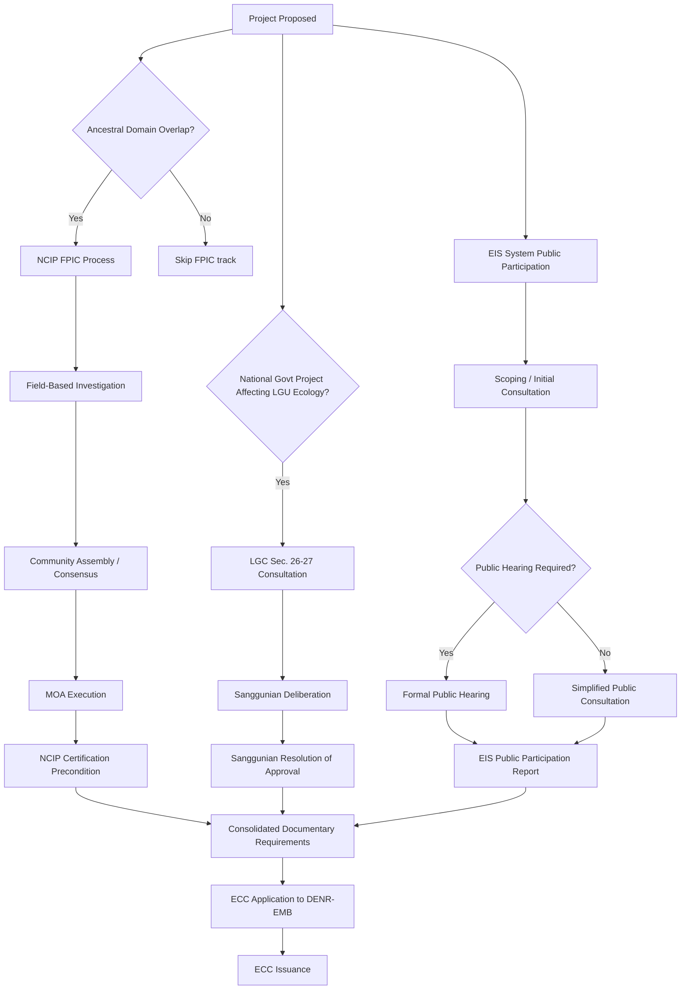

## Local Government Consultation and Social Acceptability Requirements

### Overview

In the Philippine legal system, "social acceptability" is a formal, codified concept, not merely a colloquial term for community goodwill. It functions as a decision-relevant criterion within the Environmental Impact Statement (EIS) System, and it is procedurally intertwined with a dense set of Local Government Code (LGC) consultation requirements, Indigenous Peoples' rights protections, and sectoral clearances (e.g., for mining, water resources, and land use conversion). For LGU-based document management and workflow systems, this topic determines which consultation records, resolutions, and endorsements must be captured, sequenced, and made retrievable as part of a compliant project or ordinance approval trail.

### Legal Basis: The Local Government Code (RA 7160)

**Key Points**

- **Sections 26–27, RA 7160 (1991)** are the core statutory anchors:
  - **Section 26** — "Duty of National Government Agencies in the Maintenance of Ecological Balance": national agencies/GOCCs must consult the LGU, other sectors concerned, and *explain the goals and objectives of the project* before implementation of any project or program that may cause pollution, climate change, depletion of non-renewable resources, loss of crop land/forest cover, or ecological imbalance
  - **Section 27** — requires **prior consultations** with affected LGUs, non-governmental organizations (NGOs), people's organizations (POs), and other concerned sectors, and mandates **prior approval of the sanggunian** (local legislative council) before such projects/programs are implemented — the sanggunian's approval is expressed via a formal **Sanggunian Resolution**
- Section 27 applies specifically to *national government* projects/programs implemented within LGU territorial jurisdiction — a distinct legal basis from purely private-sector projects, which are separately routed through the EIS System's social acceptability requirement
- Failure to secure the sanggunian resolution under Section 27 has been treated by Philippine courts as a basis for enjoining project implementation, making this resolution a legally material — not merely ceremonial — document within a DMS workflow

### Legal Basis: The Philippine EIS System (PD 1586)

**Key Points**

- Presidential Decree 1586 (1978), as implemented by DENR Administrative Order 2003-30 (Revised Procedural Manual), establishes the **Environmental Compliance Certificate (ECC)** as the operative clearance instrument
- **Social acceptability is an explicit evaluation criterion** within the EIA review process — the Environmental Impact Assessment includes a mandatory **Public Participation** component, structured typically as:
  1. Initial Public Consultation / Scoping (during EIA study preparation)
  2. Public Hearing or Public Consultation on the draft EIS/IEE (conducted by DENR-EMB or its authorized representative, typically once the project is deemed to require it based on the project's classification and potential for controversy)
  3. Continuing information, education, and communication (IEC) obligations during project implementation
- DENR Administrative Order 2003-30 vests the EMB Regional/Central Office with discretion on whether a formal public hearing (vs. simpler public consultation) is required, generally triggered by project category (Environmentally Critical Project status), scale, or anticipated controversy
- The **Sworn Statement of Full Responsibility and Undertaking of Compliance**, together with proof of consultations (minutes, attendance sheets, notices, resolutions of concerned LGUs/sanggunians), forms part of the documentary requirements submitted to DENR-EMB for ECC application

### Indigenous Peoples' Rights Act (RA 8371) — Free, Prior and Informed Consent (FPIC)

**Key Points**

- Where a project area overlaps an **Ancestral Domain/Ancestral Land**, the **Indigenous Peoples' Rights Act (IPRA, RA 8371, 1997)** imposes an additional, distinct consultation regime administered by the **National Commission on Indigenous Peoples (NCIP)**
- **FPIC** is legally and procedurally separate from both the Section 27 sanggunian resolution and the EIS System's public consultation — it cannot be substituted by either
- FPIC process (per NCIP Administrative Order 3, Series of 2012, as subsequently amended) generally proceeds through:
  1. Field-Based Investigation (FBI) to confirm ancestral domain claim and affected community
  2. Community assemblies and consensus-building per the community's own decision-making process
  3. Execution of a **Memorandum of Agreement (MOA)** between the proponent and the Indigenous Cultural Community/Indigenous Peoples (ICC/IP), witnessed by NCIP
  4. Issuance of a **Certification Precondition** by NCIP, which is itself typically a documentary prerequisite for ECC issuance where ancestral domain overlap exists
- [Inference] Because FPIC certification is commonly required *before* DENR will finalize ECC issuance for domain-overlapping projects, in practice FPIC frequently sits upstream in the document/approval sequence relative to the EIS public hearing, though exact sequencing can vary by regional DENR-EMB and NCIP office practice and should be confirmed against current inter-agency procedures rather than assumed uniform nationwide.

### Sectoral Layer: Mining, Water, and Land Use

**Key Points**

- **Philippine Mining Act (RA 7942)** and its IRR impose their own social acceptability-adjacent requirements, including the Social Development and Management Program (SDMP) and consultation obligations distinct from, but overlapping with, PD 1586 and Section 27 LGC requirements
- **Local Government Code Section 26/27** consultations for water-resource-affecting or ecologically significant national projects often run parallel to National Water Resources Board (NWRB) permitting
- **Land use conversion** (e.g., agricultural to non-agricultural) under DAR administrative processes and local zoning ordinances (via the Sangguniang Bayan/Panlungsod's land use planning authority under the LGC) triggers a separate local legislative consultation and approval track, generally through public hearings mandated for zoning ordinance amendments
- The practical effect for a batac-dms-type system is that a single infrastructure or extractive project may generate **multiple, legally distinct consultation record sets** (LGC Sec. 27, EIS public hearing, FPIC/NCIP, sectoral SDMP) that must each be tracked to completion with their own document types, approving bodies, and certification outputs, even though they are colloquially referred to together as "social acceptability" or "community consultation."

### Comparative Table: Distinct Consultation Tracks

| Legal Basis | Triggering Condition | Consultation Body | Output Document | Approving/Certifying Authority |
| --- | --- | --- | --- | --- |
| RA 7160, Sec. 26–27 | National govt. project/program with ecological impact within LGU jurisdiction | Sanggunian + affected NGOs/POs | Sanggunian Resolution | Local Sanggunian (Bayan/Panlungsod/Panlalawigan) |
| PD 1586 / DAO 2003-30 | Project requires ECC (Environmentally Critical Project or in Environmentally Critical Area) | Public consultation/hearing participants | Minutes, attendance sheets, EIS Public Participation report | DENR-EMB |
| RA 8371 (IPRA) | Project area overlaps Ancestral Domain/Land | Indigenous Cultural Community/IP via NCIP-facilitated process | Certification Precondition, MOA | NCIP |
| RA 7942 (Mining Act) | Mining project | Affected communities per SDMP framework | Social Development and Management Program | Mines and Geosciences Bureau (MGB) |
| Local zoning ordinances (LGC land use authority) | Reclassification/conversion of land use | Public hearing (ordinance-making process) | Zoning Ordinance / Reclassification Resolution | Local Sanggunian |

### Diagram: Consultation Track Convergence Toward ECC Issuance (svg_diagram)

### Documentary and Workflow Implications for LGU Systems

For a legislative/document management system supporting a Sangguniang Panlungsod office, the practical implications include:

- **Section 27 Sanggunian Resolutions** must be tracked as a distinct resolution *type* (not conflated with ordinary ordinances), since they certify a specific statutory consultation obligation and may be legally required as a precondition document referenced in ECC applications submitted by national agencies operating within the LGU
- **Public hearing records** (notices, attendance, minutes, resolutions of concerns raised and proponent responses) generated for zoning/land-use ordinances follow the LGU's own legislative process rules (readings, committee referral, public hearing scheduling) and should be sequenced and version-controlled as part of the ordinance's legislative history
- Where FPIC/NCIP certification is a precondition, the DMS should support **cross-referencing external certifications** (issued by NCIP, not the LGU) as attached/linked evidentiary documents within the local approval file, since the local body does not issue this document but may need to confirm its existence before proceeding
- **Social acceptability documentation is evidentiary, not merely archival** — in the event of a legal challenge to a project or ordinance, the completeness and sequencing of these consultation records (was the sanggunian resolution obtained *before* implementation, as Section 27 requires, rather than after) can be determinative, making metadata such as document date, approval date, and implementation date critical fields rather than optional ones

### Common Pitfalls

- **Treating Section 27 sanggunian approval as interchangeable with an EIS public hearing** — they are separate legal requirements administered by different bodies (local legislative body vs. DENR-EMB) and satisfying one does not satisfy the other
- **Assuming FPIC applies only to mining** — FPIC applies to *any* project or activity affecting ancestral domains, including infrastructure, energy, and agribusiness projects, not solely extractive industries
- **Conflating "social acceptability" (an EIS System evaluative concept) with "social license to operate"** — the latter is a broader, non-codified sociological/business concept describing ongoing informal community consent, whereas social acceptability in Philippine EIA practice refers to a specific procedural evaluation within the ECC application
- **Missing the temporal requirement in Section 27** — the statute requires *prior* consultation and approval before implementation; retroactive or concurrent-with-implementation consultation does not cure the defect

### Related Topics

- Environmental Compliance Certificate (ECC) application and amendment procedures
- Free, Prior and Informed Consent (FPIC) documentary requirements under NCIP AO No. 3-2012
- Sanggunian legislative process: readings, committee referral, and public hearing sequencing for ordinances
- Social Development and Management Program (SDMP) under the Philippine Mining Act
- Grievance mechanisms distinguishing LGU-level complaints from DENR/NCIP-level complaints
- Land use reclassification procedures and the role of the Sangguniang Panlungsod
- Comparative national ESIA systems and integration of social impact assessment (prior chapter item)
- Document retention and evidentiary standards for consultation records in judicial review of local ordinances