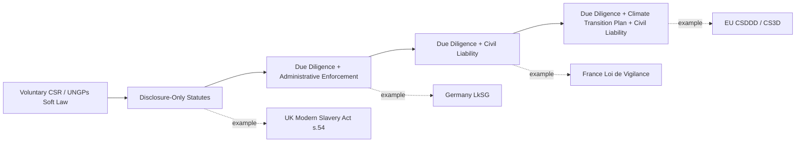

## Corporate Human Rights and Environmental Due Diligence Legislation

### Overview

Corporate human rights and environmental due diligence (HREDD) legislation represents a distinct and comparatively recent regulatory movement that shifts from voluntary corporate social responsibility (CSR) toward **mandatory, liability-bearing due diligence obligations**. Rather than assessing the impact of a single project (the traditional ESIA/SIA function), HREDD statutes require covered companies to identify, prevent, mitigate, and account for adverse human rights and environmental impacts across their **entire value chain**, including subsidiaries, suppliers, and business partners, often regardless of where in the world those impacts occur. This body of law is directly relevant to any organization engaging with multinational supply chains, foreign direct investment, or companies contracting with LGUs, since covered entities increasingly require their local partners and contractors to demonstrate due diligence compliance as a contractual precondition.

### Conceptual Foundation: The UN Guiding Principles on Business and Human Rights (UNGPs)

**Key Points**

- Endorsed by the UN Human Rights Council in 2011, the UNGPs are **soft law** (non-binding) but function as the near-universal conceptual template that subsequent hard-law statutes codify
- Three-pillar structure ("Protect, Respect, Remedy"):
  1. **State duty to protect** against human rights abuses by third parties, including businesses
  2. **Corporate responsibility to respect** human rights — requiring due diligence to identify, prevent, mitigate, and account for impacts
  3. **Access to remedy** for victims, both judicial and non-judicial
- The UNGPs' due diligence cycle (assess, integrate/act, track, communicate) is the direct structural ancestor of the due diligence steps now codified in binding EU and national legislation
- OECD Guidelines for Multinational Enterprises (updated 2023) and the OECD Due Diligence Guidance for Responsible Business Conduct provide parallel, more operationally detailed soft-law due diligence methodology, frequently cross-referenced by hard-law statutes as the applicable technical standard

### EU Corporate Sustainability Due Diligence Directive (CSDDD / CS3D)

**Key Points**

- Directive (EU) 2024/1760, adopted 2024 — the most comprehensive binding HREDD instrument to date at the time of drafting
- [Unverified] Given the pace of EU implementation and periodic legislative amendment (including a 2025 "omnibus" simplification package reportedly under negotiation to adjust scope and timelines), specific thresholds, phase-in dates, and scope details should be verified against the current consolidated text and national transposition measures rather than treated as fixed, since amendments were under active discussion following adoption
- Core structural obligations (as adopted) include:
  - Integrating due diligence into corporate policies and risk management systems
  - Identifying actual and potential adverse human rights and environmental impacts arising from the company's own operations, subsidiaries, and **established business relationships** across the value chain (upstream and, more narrowly, downstream)
  - Preventing and mitigating potential impacts; bringing actual impacts to an end or minimizing their extent
  - Establishing and maintaining a notification/complaints mechanism
  - Monitoring the effectiveness of due diligence measures
  - Public communication on due diligence (annual reporting)
- Introduces **civil liability**: companies can be held liable for damages caused by a failure to comply with due diligence obligations, where that failure caused the harm — a significant departure from the largely reporting-only obligations of predecessor instruments
- Requires large companies to adopt a **climate transition plan** aligned with limiting global warming to 1.5°C, linking corporate due diligence law to climate governance
- Extraterritorial reach: applies to non-EU companies meeting specified EU-generated turnover thresholds, meaning companies based outside the EU (including Philippine-based suppliers within a covered company's value chain) can be indirectly subject to due diligence expectations flowed down contractually

### National Precursors and Parallel Statutes

**Key Points**

**France — Loi de Vigilance (2017)**

- First binding "duty of vigilance" statute globally; requires large French companies to establish and implement a vigilance plan covering the company, its subsidiaries, and subcontractors/suppliers with which it has an established commercial relationship
- Creates civil liability for damages resulting from a failure to establish or properly implement the vigilance plan

**Germany — Supply Chain Due Diligence Act (Lieferkettensorgfaltspflichtengesetz, LkSG, 2021, effective 2023)**

- Imposes due diligence obligations on qualifying large companies regarding direct suppliers (mandatory) and indirect suppliers (risk-based, triggered by substantiated knowledge of violations)
- Enforced administratively by the Federal Office for Economic Affairs and Export Control (BAFA), with fines rather than a standalone civil liability cause of action (liability under general civil law remains separately possible)

**Norway — Transparency Act (Åpenhetsloven, 2021)**

- Requires covered enterprises to carry out human rights due diligence per the OECD due diligence model and to respond to public information requests about how adverse impacts are being addressed — notable for its **public right-to-information mechanism**, distinct from most peer statutes' reporting-to-regulator model

**United States — Sectoral and Import-Control Approach**

- No single comprehensive federal HREDD statute; instead a patchwork:
  - **Dodd-Frank Act Section 1502** (conflict minerals reporting for tin, tantalum, tungsten, gold sourced from DRC/adjoining countries) — disclosure-based, not a general due diligence mandate
  - **Uyghur Forced Labor Prevention Act (UFLPA, 2021)** — creates a rebuttable presumption that goods from Xinjiang, China are produced with forced labor, barring importation unless the importer provides "clear and convincing evidence" otherwise; enforced by U.S. Customs and Border Protection (CBP) import detention
  - State-level statutes (e.g., California Transparency in Supply Chains Act) impose narrower disclosure obligations

**United Kingdom — Modern Slavery Act (2015), Section 54**

- Requires qualifying large companies to publish an annual slavery and human trafficking statement describing steps taken (or that no steps were taken) — a **disclosure-based** model without a standalone civil liability mechanism for due diligence failure, structurally lighter than CSDDD or the French/German models

### Comparative Table: Regulatory Models

| Instrument | Jurisdiction | Obligation Type | Liability Mechanism | Scope Reach |
| --- | --- | --- | --- | --- |
| Loi de Vigilance | France (2017) | Due diligence plan + implementation | Civil liability for damages | Company, subsidiaries, subcontractors with established relationship |
| LkSG | Germany (2021/2023) | Due diligence obligations | Administrative fines (BAFA) | Direct suppliers mandatory; indirect risk-based |
| CSDDD (CS3D) | EU (2024) | Due diligence + climate transition plan | Civil liability for damages | Own ops, subsidiaries, value chain (incl. non-EU cos. above threshold) |
| Transparency Act | Norway (2021) | Due diligence + public disclosure duty | Public information request mechanism | Value chain and business partners |
| Modern Slavery Act s.54 | UK (2015) | Disclosure statement only | None (disclosure-based) | Company and its supply chains (reporting) |
| UFLPA | USA (2021) | Import evidentiary presumption | Import ban absent rebuttal evidence | Goods with Xinjiang nexus |
| Dodd-Frank s.1502 | USA (2010) | Conflict minerals disclosure | SEC reporting enforcement | 3TG minerals from DRC region |

### Diagram: Due Diligence Obligation Escalation by Legal Model (svg_diagram)

### Relevance to Philippine LGU and Supply-Chain Contexts

**Key Points**

- The Philippines does not currently have a comprehensive national HREDD statute equivalent to CSDDD or LkSG; [Unverified] specific current legislative proposals under Philippine Congress on mandatory human rights due diligence should be verified via current legislative tracking, as bill status changes frequently between congressional sessions
- Practical exposure arises indirectly: Philippine-based suppliers, contractors, or LGU-partnered private entities that form part of an EU- or German-regulated company's value chain may be contractually required to demonstrate due diligence practices (audits, codes of conduct, grievance mechanisms) as a **flow-down obligation**, even absent direct domestic legal compulsion
- This creates a practical documentation parallel to the ESIA/social acceptability tracks already discussed: due diligence questionnaires, supplier codes of conduct, grievance mechanism logs, and human rights impact assessments (HRIAs) may need to be tracked as a distinct document category from environmental compliance certificates, particularly for LGU projects involving foreign direct investment or multinational contractors
- The **UN Guiding Principles' non-judicial grievance mechanism** criteria (legitimate, accessible, predictable, equitable, transparent, rights-compatible, a source of continuous learning, and based on engagement and dialogue) are increasingly used as an audit benchmark against which LGU or project-level grievance redress mechanisms (GRMs) are evaluated by lenders and multinational partners, linking this topic back to the multilateral safeguard systems discussed in the comparative ESIA context

### Common Pitfalls

- **Conflating disclosure-based statutes (UK Modern Slavery Act, Dodd-Frank 1502) with due-diligence-mandate statutes (CSDDD, LkSG, Loi de Vigilance)** — the former requires companies to *report*, even if the report says "we did nothing"; the latter requires companies to actually *act* and can generate liability for inaction
- **Assuming HREDD statutes apply only to the company's own operations** — the defining feature of this legislative generation is **value chain reach**, extending obligations (and consequent contractual pressure) to suppliers, subcontractors, and business partners outside the regulated company's home jurisdiction
- **Treating UNGP compliance as legally sufficient** — the UNGPs remain soft law; satisfying UNGP expectations does not automatically satisfy binding statutory due diligence obligations, which typically impose more specific procedural and documentary requirements
- **Underestimating extraterritorial reach** — non-EU, non-German companies (including Philippine entities) can become subject to due diligence expectations purely through commercial relationships with covered companies, without the host country itself adopting equivalent legislation

### Related Topics

- UN Guiding Principles on Business and Human Rights: the due diligence cycle in operational detail
- OECD Due Diligence Guidance for Responsible Business Conduct: sector-specific supplements (minerals, garments, agriculture)
- Grievance Redress Mechanism (GRM) design standards and UNGP effectiveness criteria
- EU CSDDD transposition tracking and national implementing legislation
- Human Rights Impact Assessment (HRIA) methodology as distinct from environmental/social impact assessment
- Comparative national ESIA systems (prior chapter item) and their integration with corporate due diligence obligations
- Contractual flow-down clauses and supplier code of conduct drafting for LGU-partnered private projects
- Free, Prior and Informed Consent (FPIC) as it intersects with corporate due diligence for Indigenous Peoples' rights