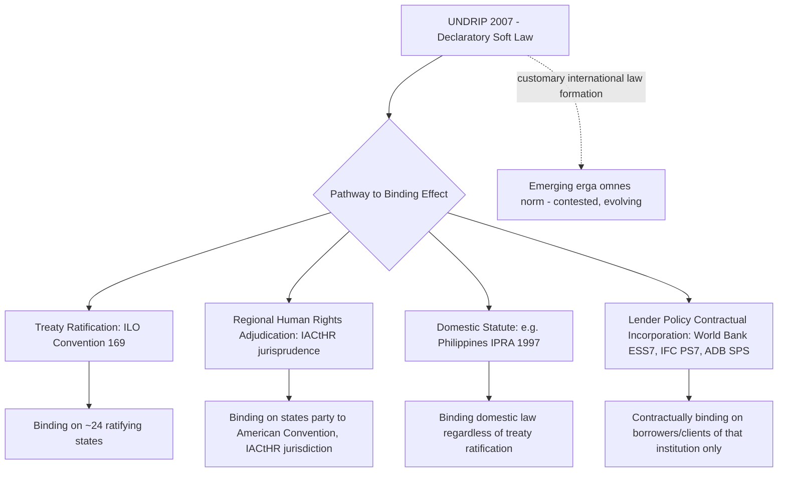

## Free, Prior and Informed Consent as an International Legal Norm

### Overview

Free, Prior and Informed Consent (FPIC) is a substantive and procedural right of Indigenous Peoples recognized in international law, requiring that decisions affecting their lands, territories, resources, and cultural heritage be made only with their consent, obtained through a process that is free of coercion, occurs prior to authorization or commencement of activities, and is based on full and accessible information. FPIC is analytically distinct from ordinary public "consultation," and understanding that distinction — in both its international legal sourcing and its degree of bindingness across different instruments — is essential for any practitioner working across jurisdictions with varying domestication of the norm, including the Philippines, where FPIC is given unusually robust statutory and administrative form.

### Distinguishing FPIC from Consultation

**Key Points**

- **Consultation** generally requires that affected parties be informed and given an opportunity to be heard; the decision-maker retains authority to proceed regardless of the outcome of that consultation
- **FPIC** requires that the affected Indigenous community's **consent** — not merely their input — be obtained before a decision proceeds; withheld consent is intended to have legal consequence, though the precise consequence (an absolute veto versus a strong presumption against proceeding) is contested and varies by instrument and jurisdiction
- The four components each carry independent legal content:
  - **Free** — consent given without coercion, intimidation, manipulation, or undue inducement, and without externally imposed timelines that pressure a decision
  - **Prior** — consent sought sufficiently in advance of authorization or commencement of activities, allowing time for the community's own decision-making processes (which may be lengthy and consensus-based, not majoritarian)
  - **Informed** — information provided must be accessible (appropriate language, form, and channels), comprehensive (nature, scope, duration, reversibility, and cumulative impacts of the activity), and provided by the state/proponent, not solely relied upon from the community's own investigation
  - **Consent** — the outcome must reflect a collective decision reached through the community's own customary decision-making processes and representative institutions, not an agreement extracted from unrepresentative individuals

### International Legal Sourcing

**Key Points**

**UN Declaration on the Rights of Indigenous Peoples (UNDRIP, 2007)**

- The principal international instrument articulating FPIC; Articles 10, 11(2), 19, 28, 29(2), and 32(2) each specify FPIC requirements in distinct contexts (relocation, cultural/intellectual property restitution, legislative/administrative measures, redress for lands taken without consent, storage/disposal of hazardous materials, and resource development/exploitation)
- **UNDRIP is a General Assembly declaration, not a treaty** — it is not self-executing hard law and does not, by itself, create binding obligations on states in the way a ratified convention does; its normative force derives from (a) near-universal state endorsement (adopted 2007, with the original opposing states — Australia, Canada, New Zealand, United States — subsequently reversing their positions) and (b) its function as an authoritative interpretive reference for binding instruments and evolving customary international law
- [Inference] Because of this declaratory status, characterizing UNDRIP's FPIC provisions as directly "binding" on states is imprecise; the more accurate characterization is that UNDRIP reflects an emerging (and increasingly consolidated) customary international law norm, with binding effect flowing primarily through domestication in national statutes or through ILO Convention 169 where ratified — this distinction matters significantly for legal drafting and should be stated precisely rather than glossed over.

**ILO Convention No. 169 (Indigenous and Tribal Peoples Convention, 1989)**

- A **binding treaty** for ratifying states (approximately 24 ratifications as of general knowledge; current ratification status should be verified via the ILO NORMLEX database for any time-sensitive application)
- Article 6 requires consultation "in good faith" and "with the objective of achieving agreement or consent" — a formulation frequently read as establishing a strong good-faith consent-seeking obligation, though ILO 169's textual standard is arguably narrower than UNDRIP's explicit "free, prior and informed consent" language in specific high-stakes contexts (e.g., relocation under Article 16, which does require consent)
- The Philippines has **not ratified ILO Convention 169**; Philippine FPIC obligations therefore derive from domestic statute (IPRA) rather than direct treaty incorporation of ILO 169, though IPRA's drafting was substantially influenced by both ILO 169 and emerging UNDRIP-era norms

**American Convention on Human Rights / Inter-American Court Jurisprudence**

- The Inter-American Court of Human Rights has developed some of the most concrete binding FPIC jurisprudence globally through cases such as *Saramaka People v. Suriname* (2007) and *Kichwa Indigenous People of Sarayaku v. Ecuador* (2012), interpreting the American Convention's property and cultural rights provisions to require FPIC-equivalent consent for large-scale natural resource extraction affecting Indigenous/tribal territories
- These are **binding judgments** on the respondent states and function as persuasive (non-binding) authority elsewhere, illustrating how FPIC has moved from soft declaratory language into hard binding law within specific regional human rights systems

**Convention on Biological Diversity (CBD) — Nagoya Protocol (2010)**

- Requires FPIC (or "prior informed consent," depending on domestic legislation) for access to genetic resources and associated traditional knowledge held by Indigenous and local communities — a narrower, resource-access-specific application of the FPIC concept

### Comparative Table: FPIC's Legal Status Across Instruments

| Instrument | Legal Nature | FPIC Formulation | Binding On |
| --- | --- | --- | --- |
| UNDRIP (2007) | Declaration (soft law) | Explicit "free, prior and informed consent" in multiple articles | Not directly binding; interpretive/customary law authority |
| ILO Convention 169 (1989) | Treaty (hard law) | "Consultation...with objective of achieving agreement or consent"; explicit consent required for relocation | Ratifying states only (~24 states; Philippines not a party) |
| American Convention on Human Rights (via IACtHR jurisprudence) | Treaty + binding case law | Judicially developed FPIC-equivalent consent standard for resource extraction | States party, subject to IACtHR jurisdiction |
| Nagoya Protocol (CBD, 2010) | Treaty (hard law) | FPIC/PIC for genetic resource and traditional knowledge access | Ratifying states, resource-access context only |
| World Bank ESF / IFC PS7 / ADB SPS | Lender policy (contractual, not public international law) | FPIC required for specified high-risk categories (physical/economic relocation, resource impacts on ancestral domain) | Borrowers/clients of the respective institution |

### The Philippines: A Case of Robust Domestication

**Key Points**

- The **Indigenous Peoples' Rights Act (IPRA, RA 8371, 1997)** predates UNDRIP by a decade and is frequently cited internationally as an early and comparatively strong domestic codification of FPIC, administered through the **National Commission on Indigenous Peoples (NCIP)**
- IPRA's FPIC requirement attaches to any plan, program, project, or activity within or affecting an Ancestral Domain — not limited to extractive industries — and the consent requirement is operationalized through the community's own customary decision-making process, as facilitated and documented by NCIP (see the detailed procedural treatment under "Local Government Consultation and Social Acceptability Requirements," this chapter, for the Field-Based Investigation, community assembly, MOA, and Certification Precondition sequence)
- This places the Philippines in a comparatively small group of jurisdictions where FPIC functions with **statutory consent-based force domestically**, despite the country not being party to ILO 169 — illustrating that binding domestic effect does not require treaty ratification of the specific international instrument that inspired it

### Diagram: FPIC's Normative Pathway from Soft Law to Binding Domestic Effect (svg_diagram)

### Key Contested Issues in FPIC Doctrine

**Key Points**

- **Veto power vs. strong presumption** — the central unresolved doctrinal debate is whether withheld FPIC constitutes an absolute veto over a project or a strong presumption against proceeding that can, in narrowly defined circumstances (e.g., overriding public interest, subject to proportionality and safeguard review), be overcome by the state. UNDRIP's text is not fully determinative on this point, and state practice diverges
- **Who holds the right to consent** — determining the legitimate representative body/process for a given Indigenous community (traditional councils, elected bodies, customary elders) is frequently contested and is a common source of procedural challenge to FPIC processes globally
- **Consent fatigue and process manipulation risk** — documented critiques (including from UN Special Rapporteurs on the Rights of Indigenous Peoples) note that FPIC processes can be procedurally satisfied on paper (meetings held, MOAs signed) while substantively failing the "free" and "informed" elements, particularly where there are asymmetries of information, resources, or bargaining power between proponents and communities
- **Extraterritorial application to corporate actors** — FPIC's original formulation binds states; its extension as an expected standard for corporate conduct (via IFC Performance Standard 7, and increasingly via HREDD statutes such as CSDDD) represents a distinct and more recent normative development, importing a public international law concept into private corporate due diligence frameworks (see "Corporate Human Rights and Environmental Due Diligence Legislation," this chapter)

### Common Pitfalls

- **Treating UNDRIP as directly binding hard law** — it is a declaration; its authority is customary/interpretive unless separately domesticated or incorporated by treaty or statute
- **Assuming FPIC and "consultation" are interchangeable terms** — the consent element is the legally distinguishing feature; using the terms interchangeably in legal drafting or documentation risks understating the actual obligation
- **Assuming uniform global FPIC standards** — the *content* of the obligation varies meaningfully between ILO 169's "objective of achieving agreement," UNDRIP's explicit "consent," IACtHR's judicially developed consent standard, and lender-specific FPIC policies (e.g., IFC PS7's own operational definition), each of which can produce different compliance requirements for the same project depending on which instrument applies
- **Conflating Philippine IPRA/NCIP FPIC with a generic international requirement** — IPRA is a specific, robust domestic statutory scheme; its procedural detail (Field-Based Investigation, MOA, Certification Precondition) is a Philippine-specific implementation, not a universal international procedural template

### Related Topics

- Indigenous Peoples' Rights Act (IPRA) FPIC procedure in operational detail (cross-reference: Local Government Consultation and Social Acceptability Requirements)
- IFC Performance Standard 7 and World Bank ESS7: Indigenous Peoples safeguard requirements
- UN Special Rapporteur on the Rights of Indigenous Peoples: thematic reports on FPIC implementation gaps
- *Saramaka People v. Suriname* and *Kichwa Indigenous People of Sarayaku v. Ecuador*: comparative case law study
- Nagoya Protocol and traditional knowledge/genetic resource access consent regimes
- Corporate Human Rights and Environmental Due Diligence Legislation (prior chapter item) and FPIC as a due diligence benchmark
- Customary international law formation: state practice and *opinio juris* in Indigenous rights norms
- Ancestral Domain delineation and Certificate of Ancestral Domain Title (CADT) processes under IPRA