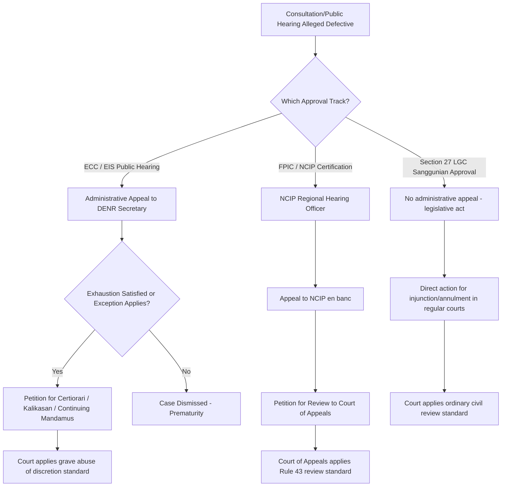

## Judicial and Administrative Review of Consultation Processes

### Overview

Once a consultation, public hearing, or FPIC process has been conducted, its legal adequacy is not self-certifying — it remains subject to challenge through administrative appeal or judicial review. This topic addresses the *procedural pathways, standards of review, and grounds for challenge* applicable when a stakeholder (an affected community, an NGO, an LGU, or a proponent) disputes whether a consultation process was legally sufficient. This is the enforcement backbone that gives the substantive requirements covered elsewhere in this chapter (Section 27 sanggunian approval, EIS public participation, FPIC) their practical legal weight — a requirement without a reviewable mechanism to test compliance is, in practice, difficult to enforce.

### Distinguishing Administrative Review from Judicial Review

**Key Points**

- **Administrative review** occurs *within the executive branch hierarchy* — an aggrieved party appeals a decision (e.g., ECC issuance, denial, or a consultation-adequacy finding) to a superior administrative authority (e.g., DENR Secretary reviewing a Regional Director's ECC decision, or NCIP en banc reviewing a Regional Hearing Officer's FPIC-related ruling)
- **Judicial review** occurs *before the courts*, generally invoked either (a) after administrative remedies are exhausted (the **doctrine of exhaustion of administrative remedies**, a near-universal precondition in Philippine administrative law before a court will entertain a petition) or (b) through specific statutory or constitutional exceptions to that exhaustion requirement
- The **standard of review differs materially** between the two tracks: administrative review bodies typically may review both procedural compliance *and* the substantive merits/technical findings de novo or with limited deference; courts applying judicial review (particularly via certiorari) are generally confined to reviewing whether the administrative body acted with **grave abuse of discretion amounting to lack or excess of jurisdiction**, not whether the court would have reached the same substantive conclusion

### Philippine Framework: Exhaustion, Standing, and Available Remedies

**Key Points**

**Doctrine of Exhaustion of Administrative Remedies**

- A petitioner generally must pursue all available administrative appeals (e.g., DENR Secretary appeal of an EMB Regional Office ECC decision under DAO 2003-30's administrative appeal provisions) before a court will take cognizance of a petition challenging that same decision
- Recognized exceptions (developed through Philippine jurisprudence) include: the issue is purely a question of law, the administrative act is patently illegal, there is urgent need for judicial intervention, exhaustion would be unreasonable or would cause irreparable injury, or the administrative remedy is inadequate

**Standing (Locus Standi)**

- Philippine courts have progressively liberalized standing in environmental cases, most notably through the doctrine articulated in *Oposa v. Factoran* (1993), recognizing standing for present and future generations to sue on environmental matters based on the constitutional right to a balanced and healthful ecology — a doctrine frequently invoked (directly or by extension) in challenges to inadequate environmental consultation
- **Rules of Procedure for Environmental Cases (A.M. No. 09-6-8-SC, 2010)**, promulgated by the Supreme Court, introduced the **citizen suit** provision, allowing any Filipino citizen to file an action to enforce environmental laws on behalf of themselves and others, including minors or generations yet unborn, representing one of the most liberalized standing regimes globally for environmental enforcement

**Available Extraordinary Remedies (Rules of Procedure for Environmental Cases)**

- **Writ of Kalikasan** — an extraordinary remedy available to a natural or juridical person, entity authorized by law, people's organization, NGO, or public interest group, for environmental damage of such magnitude as to prejudice the life, health, or property of inhabitants of two or more cities/provinces; can be directed against a government agency's or private entity's unlawful act or omission, including one arising from inadequate consultation preceding an environmentally significant approval
- **Writ of Continuing Mandamus** — compels a government agency or officer to perform a duty specifically enjoined by law (e.g., compelling DENR-EMB to properly conduct a required public hearing) and to submit periodic compliance reports until full compliance is achieved, giving courts an ongoing supervisory role rather than a one-time order
- **Temporary Environmental Protection Order (TEPO)** — an interim injunctive remedy available under the same Rules, allowing courts to immediately restrain an activity pending resolution of a Kalikasan petition

**Judicial Review of ECC Decisions and Consultation Adequacy**

- Philippine courts have entertained challenges alleging that an ECC was issued despite an inadequate, non-representative, or procedurally defective public consultation/hearing — the *substantive* ground typically argued is that the consultation failed to meet DAO 2003-30's procedural requirements (adequate notice, accessible venue/language, genuine opportunity to raise concerns, documented response to issues raised), such that the resulting ECC is void for having been issued in violation of law
- Challenges to **Section 27 (RA 7160)** non-compliance — implementation of a national government project without prior sanggunian approval — have similarly been raised as grounds for injunctive relief, reflecting the earlier-noted point that the sanggunian resolution is an evidentiary precondition, not a ceremonial formality

**NCIP/FPIC-Specific Review**

- Disputes over the adequacy or validity of an FPIC process (e.g., alleged manipulation, unrepresentative consent-givers, inadequate information disclosure) are first addressed through NCIP's own administrative dispute resolution mechanisms (Regional Hearing Officers, appeal to the NCIP en banc), reflecting IPRA's establishment of NCIP with quasi-judicial authority over disputes involving Indigenous Peoples' rights, before resort to the regular courts

### Comparative Table: Review Pathways by Consultation Type

| Consultation/Approval Type | First-Instance Administrative Body | Administrative Appeal | Judicial Remedy (if applicable) |
| --- | --- | --- | --- |
| ECC issuance (PD 1586 public hearing) | DENR-EMB Regional Office | DENR Secretary | Certiorari/Kalikasan/Continuing Mandamus to courts |
| Section 27 sanggunian approval | Local Sanggunian | N/A (legislative act) | Injunction/annulment action in regular courts |
| FPIC/NCIP Certification Precondition | NCIP Regional Hearing Officer | NCIP en banc | Petition for review to Court of Appeals |
| Zoning ordinance public hearing | Local Sanggunian (legislative process) | DILG/HLURB-successor review (land use compliance) | Declaratory relief/annulment in regular courts |

### Comparative International Note: Judicial Review Models

**Key Points**

- **United States (NEPA)** — judicial review proceeds under the Administrative Procedure Act (APA), with courts assessing whether the agency took the required "hard look" at environmental consequences; courts generally do not substitute their judgment on the merits but scrutinize whether the process (including public comment consideration) was procedurally adequate — conceptually similar in structure to the Philippine certiorari/grave-abuse-of-discretion standard, though doctrinally distinct
- **European Union (Aarhus-influenced systems)** — the Aarhus Convention's "access to justice" pillar requires member states to provide "adequate and effective remedies" for challenges to the substantive or procedural legality of decisions subject to public participation requirements, with the Court of Justice of the EU (CJEU) having developed jurisprudence requiring that review not be "prohibitively expensive" — a distinctive access-oriented doctrinal feature not directly paralleled in Philippine procedure
- [Inference] The Philippine citizen-suit and Writ of Kalikasan framework is frequently cited in comparative environmental law literature as among the more liberalized standing/remedy regimes globally, comparable in spirit to Aarhus-influenced EU access-to-justice guarantees, though direct empirical comparison of case outcomes/frequency across these systems would require jurisdiction-specific caseload data rather than doctrinal comparison alone.

### Diagram: Philippine Review Pathway for a Challenged Consultation Process (svg_diagram)

### Grounds Commonly Raised in Consultation-Adequacy Challenges

**Key Points**

- **Inadequate notice** — insufficient advance notice period, notice not published/posted per required channels, or notice not provided in accessible language/format for the affected population
- **Unrepresentative participation** — consultation conducted with unrepresentative individuals rather than the community's legitimate representative structures (particularly significant in FPIC challenges)
- **Failure to disclose material information** — information about scope, scale, duration, or impacts withheld or presented in inaccessible technical form, undermining the "informed" element
- **Consultation held after de facto commencement** — activities begun before the consultation/approval was legally finalized, directly implicating the "prior" requirement
- **Failure to document or respond to concerns raised** — absence of a documented record showing that issues raised during consultation were considered, which can undermine an agency's later claim that it took the required "hard look" or exercised due diligence in the approval decision
- **Procedural capture or coercion** — allegations that consent or non-objection was obtained through undue influence, misrepresentation, or inducement, most directly relevant to FPIC's "free" element

### Practical Implications for Document Management Systems

**Key Points**

- Because virtually every ground for challenging a consultation's adequacy turns on **documentary proof** (notice publication records, attendance sheets, minutes reflecting issues raised and responses given, timestamps establishing sequence relative to project commencement), the evidentiary integrity of consultation records is directly determinative of litigation/appeal outcomes
- A DMS supporting LGU legislative and environmental compliance workflows should therefore preserve **immutable timestamps and version history** for consultation-related documents (notices, minutes, resolutions), since the "prior" element of both Section 27 and FPIC turns on precise temporal sequencing relative to implementation
- Maintaining a **clear chain of custody** between the consultation record, the resulting resolution/certification, and the ultimate approval decision (ECC, sanggunian resolution, NCIP certification) supports the agency's or LGU's ability to demonstrate procedural adequacy if later challenged, and conversely gives challengers a documentary basis to test that adequacy

### Common Pitfalls

- **Filing a court petition without first exhausting administrative appeal**, absent a recognized exception — the most common procedural ground for dismissal in Philippine administrative law challenges, independent of the underlying merits
- **Assuming judicial review re-examines the substantive adequacy of a consultation de novo** — courts applying certiorari generally examine only whether the process was conducted with grave abuse of discretion, not whether the court itself would have found the consultation adequate
- **Treating the Writ of Kalikasan as available for any environmental grievance** — it is reserved for environmental damage of significant magnitude affecting the inhabitants of two or more cities or provinces; localized, single-LGU grievances are generally pursued through other remedies
- **Overlooking that Section 27 sanggunian approval, being a legislative act, does not route through the ECC's administrative appeal chain** — it is challenged through a distinct pathway (direct court action), not through DENR's appeal process

### Related Topics

- *Oposa v. Factoran* and the doctrine of intergenerational standing in Philippine environmental law
- Rules of Procedure for Environmental Cases (A.M. No. 09-6-8-SC): full remedy catalogue and procedural requirements
- DAO 2003-30 administrative appeal procedure for ECC decisions
- NCIP quasi-judicial authority and dispute resolution mechanisms under IPRA
- Local Government Consultation and Social Acceptability Requirements (prior chapter item) — documentary basis for review
- Comparative national ESIA systems (prior chapter item) — NEPA/APA and Aarhus access-to-justice models
- Document retention, version control, and chain-of-custody design for legislative and compliance records
- Grave abuse of discretion as a standard of review: doctrinal development in Philippine jurisprudence