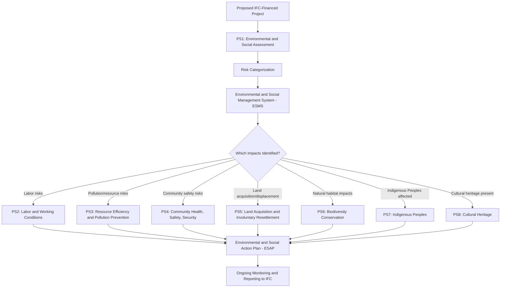

## IFC Performance Standards Overview and Scope

### Overview

The IFC Performance Standards on Environmental and Social Sustainability are the operative risk-management framework applied by the International Finance Corporation (IFC), the private-sector-lending arm of the World Bank Group, to the projects it directly finances. Effective January 1, 2012 (updating the original 2006 framework), the eight Performance Standards collectively define the environmental and social outcomes a client must achieve throughout the life of an IFC investment. Their significance extends well beyond IFC's own balance sheet: because the Performance Standards were adopted as the reference benchmark by the **Equator Principles Financial Institutions (EPFIs)** — the consortium of commercial banks applying equivalent standards to project finance globally — they function as the de facto global private-sector standard against which large infrastructure, extractive, agribusiness, and energy projects are assessed, independent of whether IFC itself is a project financier.

### Legal and Institutional Nature

**Key Points**

- The Performance Standards are **not public international law and not a national statute** — they are **contractual/policy instruments** of the IFC, incorporated into financing agreements as binding conditions of the loan or investment relationship between IFC (or an Equator Principles bank) and its client
- Structurally, the Sustainability Framework comprises three components: IFC's Policy and Performance Standards on Environmental and Social Sustainability, and IFC's Access to Information Policy, with the Policy component describing IFC's commitments, roles, and responsibilities related to environmental and social sustainability and the Access to Information Policy reflecting IFC's commitment to transparency and good governance on its operations [FEIAr%20 %20Appendix%20Pages%20Combined%20Part%20A +2](https://sahris.sahra.org.za/sites/default/files/additionaldocs/FEIAr%20-%20Appendix%20Pages%20Combined%20Part%20A.pdf)
- The Performance Standards are explicitly **principles-based rather than a licensing/prescriptive approach** — they set outcome-oriented requirements and expect clients to develop context-appropriate management responses, in contrast to the more front-loaded, prescriptive style common in many national legal traditions
- Where a client cannot immediately meet a Performance Standard's requirements at the time of IFC's investment decision, IFC's approach allows for an **Environmental and Social Action Plan (ESAP)** to close identified gaps over time — a "progressive realization" model rather than a strict precondition-only model
- This contractual (not statutory) nature means Performance Standard compliance is enforced through the **financing relationship** (covenant breach, potential loan acceleration or suspension of disbursement) and through IFC's own **Compliance Advisor/Ombudsman (CAO)** accountability mechanism, rather than through domestic courts — a materially different enforcement architecture from the domestic and treaty-based instruments covered elsewhere in this syllabus

### The Eight Performance Standards

**Key Points**

The complete current (2012) set of Performance Standards is: Performance Standard 1: Assessment and Management of Environmental and Social Risks and Impacts; Performance Standard 2: Labor and Working Conditions; Performance Standard 3: Resource Efficiency and Pollution Prevention; Performance Standard 4: Community Health, Safety, and Security; Performance Standard 5: Land Acquisition and Involuntary Resettlement; Performance Standard 6: Biodiversity Conservation and Sustainable Management of Living Natural Resources; Performance Standard 7: Indigenous Peoples; Performance Standard 8: Cultural Heritage. [sahra](https://sahris.sahra.org.za/sites/default/files/additionaldocs/FEIAr%20-%20Appendix%20Pages%20Combined%20Part%20A.pdf)

- **PS1 — Assessment and Management of Environmental and Social Risks and Impacts**: the foundational, overarching standard. It establishes the importance of integrated assessment to identify the environmental and social impacts, risks, and opportunities of projects, and effective community engagement through disclosure of project-related information and consultation with local stakeholders. PS1 requires clients to establish and maintain an **Environmental and Social Management System (ESMS)** proportionate to the project's risk level, and it is the standard against which every other PS operates as a specialized module [sahra](https://sahris.sahra.org.za/sites/default/files/additionaldocs/FEIAr%20-%20Appendix%20Pages%20Combined%20Part%20A.pdf)
- **PS2 — Labor and Working Conditions**: covers working conditions, worker-management relationships, occupational health and safety, and protections against child labor and forced labor across the client's direct workforce, contracted workers, and (in defined circumstances) primary supply chain workers
- **PS3 — Resource Efficiency and Pollution Prevention**: addresses efficient use of resources (energy, water, raw materials), pollution prevention consistent with internationally disseminated technologies and practices, and greenhouse gas emissions management
- **PS4 — Community Health, Safety, and Security**: addresses risks to affected communities from project activities, infrastructure, and equipment, including the specific and sensitive topic of security personnel arrangements and their potential human rights implications
- **PS5 — Land Acquisition and Involuntary Resettlement**: governs physical and/or economic displacement arising from land acquisition or restrictions on land use, requiring avoidance where feasible and, where unavoidable, resettlement planning designed to improve or at minimum restore livelihoods and standards of living
- **PS6 — Biodiversity Conservation and Sustainable Management of Living Natural Resources**: applies a mitigation hierarchy (avoid, minimize, restore, offset) calibrated to habitat classification (modified, natural, critical habitat), with heightened requirements as habitat sensitivity increases
- **PS7 — Indigenous Peoples**: requires a differentiated, rights-based approach to project impacts on Indigenous Peoples, including FPIC requirements triggered by specific high-risk impact categories (see cross-reference below)
- **PS8 — Cultural Heritage**: protects tangible and intangible cultural heritage from adverse project impacts, addressing both physical cultural resources (chance finds procedures) and, more recently, project use of cultural heritage for commercial purposes

### Applicability and Screening: Who Must Comply, and With Which Standards

**Key Points**

- Applicability is **not uniform across all eight standards for every project** — actual applicability is determined through IFC's environmental and social risk categorization and project-specific screening, meaning a given project may be assessed against only a subset of the Performance Standards depending on its risk profile, as reflected in practice where project disclosures list which Performance Standards provisionally considered relevant to the project apply, sometimes explicitly excluding one or more standards (for example, a project screening in PS1 through PS6 and PS8 while excluding PS7 where no Indigenous Peoples nexus exists) [ifc](https://disclosures.ifc.org/project-detail/AS/609410/t-if-in-ern-i-n-l-air-r-child-2)
- **PS1 applies universally** to any IFC-financed project as the overarching risk-assessment and management-system standard; PS2–PS8 apply based on the specific risks and impacts identified through that PS1 assessment process
- **Financial Intermediary (FI) clients** — banks, private equity funds, and other institutions that re-lend or re-invest IFC funds — are subject to a modified application: for all FI clients, an Environmental and Social Management System (ESMS) commensurate with the level of risk and aligned with the requirements of Performance Standard 1 is required, along with application of Performance Standard 2 on Labor and Working Conditions, an exclusion list, and national law compliance — full application of all eight standards to each individual sub-investment is not automatically required, with the FI's own ESMS serving as the primary compliance mechanism [iaia](https://iaia.org/pdf/wab/IFC%20-%20IAIA%2012-Mar-2012.pdf)
- The Performance Standards apply to both **project finance and long-term corporate lending** relationships, reflecting IFC's dual financing modalities as project finance and long term corporate lending arrangements [iaia](https://iaia.org/pdf/wab/IFC%20-%20IAIA%2012-Mar-2012.pdf)
- The framework is explicitly structured around a **risk-management hierarchy**: anticipate and avoid impacts first, minimize where avoidance is not possible, and compensate or offset residual impacts, alongside identifying opportunities — this avoid-minimize-compensate sequencing is the interpretive lens applied throughout all eight standards, not merely PS6's biodiversity mitigation hierarchy [iaia](https://iaia.org/pdf/wab/IFC%20-%20IAIA%2012-Mar-2012.pdf)

### Comparative Table: The Eight Performance Standards at a Glance

| Standard | Core Subject | Key Instrument Required |
| --- | --- | --- |
| PS1 | Assessment & Management of E&S Risks/Impacts | Environmental and Social Management System (ESMS); Stakeholder Engagement Plan |
| PS2 | Labor and Working Conditions | Human Resources Policy; Worker Grievance Mechanism |
| PS3 | Resource Efficiency and Pollution Prevention | Resource/emissions management measures |
| PS4 | Community Health, Safety and Security | Community Health & Safety risk assessment |
| PS5 | Land Acquisition and Involuntary Resettlement | Resettlement Action Plan (RAP) / Livelihood Restoration Plan |
| PS6 | Biodiversity Conservation | Biodiversity Action Plan (where triggered) |
| PS7 | Indigenous Peoples | Indigenous Peoples Plan; FPIC (specified circumstances) |
| PS8 | Cultural Heritage | Chance Find Procedures; cultural heritage management measures |

### Diagram: PS1 as the Governing Framework for PS2–PS8 Applicability

### Relationship to Other Frameworks Covered in This Syllabus

**Key Points**

- **PS1's stakeholder engagement requirements** parallel, but are contractually distinct from, the domestic public consultation requirements covered under "Local Government Consultation and Social Acceptability Requirements" — a Philippine project financed by IFC or an Equator Principles bank must satisfy **both** domestic EIS System/LGC consultation requirements **and** PS1's disclosure/consultation requirements, which are not automatically coextensive
- **PS7's FPIC trigger** is narrower and more specifically defined than IPRA's blanket ancestral-domain FPIC requirement: PS7 requires FPIC specifically where a project involves (i) impacts on lands/resources subject to traditional ownership or customary use, (ii) relocation of Indigenous Peoples, or (iii) impacts on critical cultural heritage — meaning a project could satisfy IPRA's domestic FPIC trigger while requiring separate confirmation that PS7's narrower trigger conditions are independently met, and vice versa
- **PS5's resettlement standard** ("improve or at minimum restore" livelihoods) sets a materially higher bar than many domestic expropriation/eminent domain frameworks, which typically require only "just compensation" at fair market value without an explicit livelihood-restoration outcome standard — this divergence is a common source of gap-filling ESAP commitments in IFC-financed projects operating in jurisdictions with less protective domestic resettlement law
- The Performance Standards are structurally the ancestor and near-direct template for the **World Bank's Environmental and Social Framework (ESF)** Environmental and Social Standards (ESS1–ESS10) applied to public-sector borrowers, and for the **ADB Safeguard Policy Statement** — meaning practitioners familiar with PS structure can transfer significant conceptual understanding across IFC, World Bank, and ADB-financed projects, while still needing to verify standard-specific numbering and threshold differences

### Common Pitfalls

- **Assuming all eight Performance Standards apply automatically to every IFC-financed project** — applicability is risk- and impact-based following PS1 screening; project disclosure documentation should always be checked to confirm which standards were determined relevant, since standards can be explicitly excluded (e.g., PS7 where no Indigenous Peoples nexus exists)
- **Treating Performance Standard compliance as equivalent to domestic legal compliance** — the two are parallel, independently enforceable obligations; satisfying domestic EIS/consultation law does not automatically satisfy PS1/PS7 stakeholder engagement or FPIC requirements, and vice versa
- **Confusing the Performance Standards' contractual enforcement mechanism with statutory or treaty enforcement** — remedies for PS non-compliance run through the financing relationship (covenant breach, CAO complaint) rather than through domestic courts or international tribunals
- **Applying FI-client screening logic to project-finance clients** — the lighter ESMS-plus-PS2-plus-exclusion-list approach applies specifically to Financial Intermediary clients, not to direct project or corporate finance clients, who are subject to full PS1–PS8 screening

### Related Topics

- IFC Performance Standard 7 (Indigenous Peoples): FPIC trigger conditions in operational detail
- World Bank Environmental and Social Framework (ESF) and ESS1–ESS10 comparative mapping to PS1–PS8
- Equator Principles: adoption of IFC Performance Standards by commercial project-finance lenders
- Compliance Advisor/Ombudsman (CAO): accountability mechanism structure and complaint procedure
- Environmental and Social Action Plans (ESAP): gap-closing mechanism design and monitoring
- Resettlement Action Plan (RAP) methodology under PS5 versus domestic expropriation compensation standards
- Comparative national ESIA systems (Legal, Regulatory, and Policy Frameworks chapter) — integration points with PS1 assessment requirements
- Corporate Human Rights and Environmental Due Diligence Legislation — PS7 FPIC as an emerging corporate due diligence benchmark