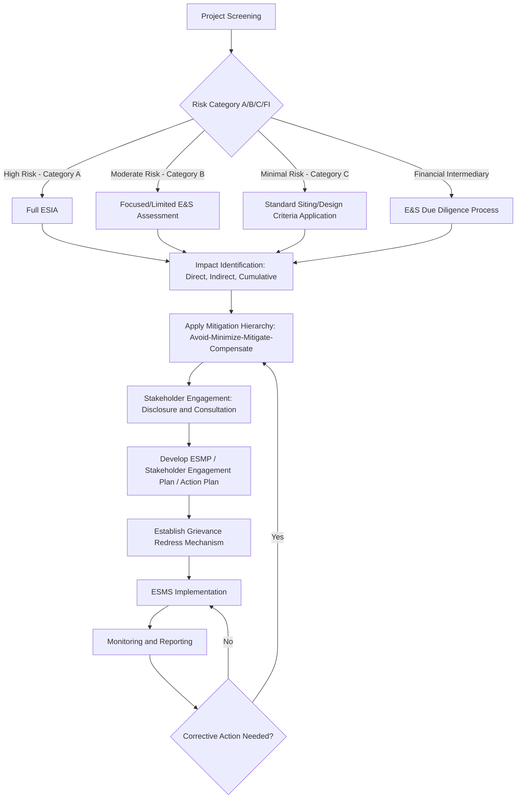

## IFC Performance Standard 1 on environmental and social risk assessment

### Overview and Regulatory Context

IFC Performance Standard 1 (PS1), *Assessment and Management of Environmental and Social Risks and Impacts*, is the foundational standard within the IFC's 2012 Performance Standards on Environmental and Social Sustainability. It is the "umbrella" standard: PS1 establishes the overarching process-based requirements — risk identification, management systems, stakeholder engagement, and grievance mechanisms — while Performance Standards 2 through 8 describe potential environmental and social risks and impacts that require particular attention in specific domains (labor, resource efficiency, community health, land acquisition, biodiversity, indigenous peoples, and cultural heritage). [Scribd](https://www.scribd.com/document/734381488/Ifc-Performance-Standards-01-15-1)

PS1 applies to all projects seeking IFC financing (and, by extension, projects financed by institutions that have adopted the Equator Principles, which incorporate the IFC Performance Standards as their environmental and social risk framework for project finance). The Performance Standards may also be applied by other financial institutions beyond IFC itself, making PS1 a de facto global benchmark for private-sector environmental and social (E&S) due diligence. [Scribd](https://www.scribd.com/document/734381488/Ifc-Performance-Standards-01-15-1)

### Three Pillars of Performance Standard 1

PS1's requirements rest on three interlocking pillars, all of which a client must satisfy throughout the project lifecycle:

1. **Integrated assessment** — Integrated assessment to identify the environmental and social impacts, risks, and opportunities of projects. [Sporthumanrights](https://www.sporthumanrights.org/library/ifc-performance-standard-1-assessment-and-management-of-environmental-and-social-risks-and-impacts/)
2. **Effective community engagement** — Effective community engagement through disclosure of project-related information and consultation with local communities on matters that directly affect them. [Sporthumanrights](https://www.sporthumanrights.org/library/ifc-performance-standard-1-assessment-and-management-of-environmental-and-social-risks-and-impacts/)
3. **Ongoing management** — The client's management of environmental and social performance throughout the life of the project. [Sporthumanrights](https://www.sporthumanrights.org/library/ifc-performance-standard-1-assessment-and-management-of-environmental-and-social-risks-and-impacts/)

For Community Engagement & Social Impact Assessment (SIA) practice, pillars 1 and 2 are the operational core: the assessment process determines *what* impacts exist and *who* is affected, while the engagement process determines *how* affected communities inform, contest, and shape the client's response.

### The Environmental and Social Management System (ESMS)

PS1's central operational requirement is that the client establish and maintain an **Environmental and Social Management System (ESMS)**. An environmental and social management system helps companies integrate plans and standards into their core operations—so they can anticipate environmental and social risks posed by their business activities and avoid, minimize, and compensate for such impacts as necessary. A good management system provides for consultation with stakeholders and a means for complaints from workers and local communities to be addressed. [International Finance Corporation](https://www.ifc.org/en/insights-reports/2012/ifc-performance-standard-1)[International Finance Corporation](https://www.ifc.org/en/insights-reports/2012/ifc-performance-standard-1)

The ESMS is built as a continuous-improvement cycle (commonly aligned with a Plan-Do-Check-Act logic), consisting of the following elements:

- **Policy** — a statement of the client's overarching E&S commitments and principles.
- **Identification of risks and impacts** — the assessment process (see below).
- **Management programs** — mitigation and performance-improvement measures, often documented in an Environmental and Social Management Plan (ESMP) or Action Plan (ESMAP/ESAP).
- **Organizational capacity and competency** — assigned roles, responsibilities, training, and resources for E&S management.
- **Emergency preparedness and response**.
- **Stakeholder engagement** — disclosure, consultation, and grievance handling.
- **Monitoring and review** — tracking performance indicators and corrective actions.
- **External communications and reporting**.

`(svg_diagram)`

<svg viewBox="0 0 900 560" xmlns="http://www.w3.org/2000/svg" font-family="Arial, sans-serif">
<text x="450" y="30" text-anchor="middle" font-size="20" font-weight="bold" fill="#1a1a1a">IFC PS1 — ESMS Continuous Improvement Cycle (svg_diagram)</text>
<!-- Circular arrangement of 8 boxes -->
<g font-size="13" fill="#ffffff">
<rect x="380" y="60" width="140" height="55" rx="8" fill="#2c5f8a"/>
<text x="450" y="83" text-anchor="middle" font-weight="bold">Policy</text>
<text x="450" y="100" text-anchor="middle" font-size="11">E&amp;S commitments</text>



```
<rect x="620" y="120" width="160" height="55" rx="8" fill="#2c5f8a"/>
<text x="700" y="143" text-anchor="middle" font-weight="bold">Risk &amp; Impact ID</text>
<text x="700" y="160" text-anchor="middle" font-size="11">Assessment process</text>

<rect x="690" y="240" width="160" height="55" rx="8" fill="#2c5f8a"/>
<text x="770" y="263" text-anchor="middle" font-weight="bold">Management Programs</text>
<text x="770" y="280" text-anchor="middle" font-size="11">ESMP / Action Plan</text>

<rect x="620" y="360" width="170" height="55" rx="8" fill="#2c5f8a"/>
<text x="705" y="383" text-anchor="middle" font-weight="bold">Org. Capacity &amp;</text>
<text x="705" y="400" text-anchor="middle" font-size="11">Competency / Training</text>

<rect x="440" y="440" width="180" height="55" rx="8" fill="#2c5f8a"/>
<text x="530" y="463" text-anchor="middle" font-weight="bold">Emergency Preparedness</text>
<text x="530" y="480" text-anchor="middle" font-size="11">&amp; Response</text>

<rect x="210" y="400" width="180" height="55" rx="8" fill="#c0392b"/>
<text x="300" y="423" text-anchor="middle" font-weight="bold">Stakeholder Engagement</text>
<text x="300" y="440" text-anchor="middle" font-size="11">Disclosure / Consultation / GRM</text>

<rect x="90" y="280" width="170" height="55" rx="8" fill="#2c5f8a"/>
<text x="175" y="303" text-anchor="middle" font-weight="bold">Monitoring &amp; Review</text>
<text x="175" y="320" text-anchor="middle" font-size="11">Indicators / corrective action</text>

<rect x="120" y="150" width="180" height="55" rx="8" fill="#2c5f8a"/>
<text x="210" y="173" text-anchor="middle" font-weight="bold">External Reporting</text>
<text x="210" y="190" text-anchor="middle" font-size="11">Communications</text>
```

</g>
<!-- Connecting arrows forming a cycle -->
<defs>
<marker id="arrow1" markerWidth="8" markerHeight="8" refX="6" refY="3" orient="auto">
<path d="M0,0 L6,3 L0,6 Z" fill="#555"/>
</marker>
</defs>
<g stroke="#555" stroke-width="2" fill="none" marker-end="url(#arrow1)">
<path d="M520,88 Q600,95 660,130"/>
<path d="M745,175 Q790,205 780,245"/>
<path d="M740,295 Q730,340 705,365"/>
<path d="M640,410 Q580,435 530,440"/>
<path d="M480,470 Q380,460 320,430"/>
<path d="M280,400 Q210,360 200,335"/>
<path d="M175,280 Q170,230 195,205"/>
<path d="M275,155 Q330,110 385,85"/>
</g>

<text x="450" y="530" text-anchor="middle" font-size="12" fill="#555">Center pillar (red) — Stakeholder Engagement is the interface with Community Engagement & SIA practice</text>

</svg>

### The Risk and Impact Identification Process

PS1 requires the scope, depth, and type of assessment to be proportional to project risk. The scope of the risks and impacts identification process will be consistent with good international industry practice, and will determine the appropriate and relevant methods and assessment tools. The process may comprise a full-scale environmental and social impact assessment, a limited or focused environmental and social assessment, or straightforward application of environmental siting, pollution standards, design criteria, or construction standards. [International Finance Corporation](https://www.ifc.org/content/dam/ifc/doc/2010/2012-ifc-performance-standard-1-en.pdf)[International Finance Corporation](https://www.ifc.org/content/dam/ifc/doc/2010/2012-ifc-performance-standard-1-en.pdf)

Distinct assessment pathways apply depending on project maturity:

- **Greenfield/new projects** — full or focused Environmental and Social Impact Assessment (ESIA).
- **Existing assets/brownfield projects** — when the project involves existing assets, environmental and/or social audits or risk/hazard assessments can be appropriate and sufficient to identify risks and impacts. [International Finance Corporation](https://www.ifc.org/content/dam/ifc/doc/2010/2012-ifc-performance-standard-1-en.pdf)
- **Undefined future assets (e.g., financial intermediary portfolios)** — if assets to be developed, acquired or financed have yet to be defined, the establishment of an environmental and social due diligence process will identify risks and impacts at a point in the future when the physical characteristics become known. [International Finance Corporation](https://www.ifc.org/content/dam/ifc/doc/2010/2012-ifc-performance-standard-1-en.pdf)

The assessment must consider direct, indirect, and cumulative impacts, and must integrate cross-cutting issues. Performance Standard 1 establishes topics such as climate change, gender, human rights, and water as issues to be addressed within the integrated assessment. [Scribd](https://www.scribd.com/document/734381488/Ifc-Performance-Standards-01-15-1)

### Interaction with Performance Standards 2–8

PS1 functions as the gateway: once risks are identified through the assessment process, the client must determine which of the topic-specific standards apply and design management responses accordingly. Performance Standards 2 through 8 describe potential environmental and social risks and impacts that require particular attention. Where environmental or social risks and impacts are identified, the client is required to manage them through its Environmental and Social Management System consistent with Performance Standard 1. [Scribd](https://www.scribd.com/document/734381488/Ifc-Performance-Standards-01-15-1)

| PS | Topic Area |
| --- | --- |
| PS2 | Labor and Working Conditions |
| PS3 | Resource Efficiency and Pollution Prevention |
| PS4 | Community Health, Safety, and Security |
| PS5 | Land Acquisition and Involuntary Resettlement |
| PS6 | Biodiversity Conservation and Sustainable Management of Living Natural Resources |
| PS7 | Indigenous Peoples |
| PS8 | Cultural Heritage |

PS1 also incorporates the **IFC/World Bank Group Environmental, Health, and Safety (EHS) Guidelines** as the technical reference for acceptable performance levels. IFC uses the EHS Guidelines as a technical source of information during project appraisal. The EHS Guidelines contain the performance levels and measures that are normally acceptable to IFC, and that are generally considered to be achievable in new facilities at reasonable costs by existing technology. For existing facilities, application of the EHS Guidelines to existing facilities may involve the establishment of site-specific targets rather than strict compliance with new-build benchmarks. [Scribd](https://www.scribd.com/document/734381488/Ifc-Performance-Standards-01-15-1)[Scribd](https://www.scribd.com/document/734381488/Ifc-Performance-Standards-01-15-1)

### Mitigation Hierarchy

A core analytical principle embedded across PS1 and the topic-specific standards is the **mitigation hierarchy**, which structures how identified risks must be addressed in a strict order of preference:

1. **Avoid** — eliminate the risk or impact at the design/siting stage.
2. **Minimize** — reduce the impact to acceptable levels where avoidance is not feasible.
3. **Mitigate/Restore** — implement measures to restore conditions or reduce residual harm.
4. **Compensate/Offset** — where residual impacts remain after avoidance and minimization, provide compensation or offsets.

Performance Standards 2 through 8 establish objectives and requirements to avoid, minimize, and where residual impacts remain, to compensate/offset for risks and impacts to workers, Affected Communities, and the environment. [International Finance Corporation](https://www.ifc.org/content/dam/ifc/doc/2010/2012-ifc-performance-standard-1-en.pdf)

`(svg_diagram)`

<svg xmlns="http://www.w3.org/2000/svg" viewBox="0 0 800 260" font-family="Arial, sans-serif">
<text x="400" y="28" text-anchor="middle" font-size="18" font-weight="bold" fill="#1a1a1a">Mitigation Hierarchy (svg_diagram)</text>
<g font-size="14" fill="#fff" text-anchor="middle">
<polygon points="20,60 200,60 180,180 40,180" fill="#1b5e20" />
<text x="110" y="115" font-weight="bold">AVOID</text>
<text x="110" y="135" font-size="11">Design / siting</text>



```
<polygon points="220,60 400,60 388,180 232,180" fill="#33691e" />
<text x="310" y="115" font-weight="bold">MINIMIZE</text>
<text x="310" y="135" font-size="11">Reduce impact</text>

<polygon points="420,60 600,60 596,180 424,180" fill="#f9a825" />
<text x="510" y="115" font-weight="bold" fill="#1a1a1a">MITIGATE /</text>
<text x="510" y="132" font-size="11" fill="#1a1a1a">RESTORE</text>

<polygon points="620,60 800,60 804,180 616,180" fill="#c62828" />
<text x="710" y="115" font-weight="bold">COMPENSATE /</text>
<text x="710" y="132" font-size="11">OFFSET</text>
```

</g>
<text x="400" y="215" text-anchor="middle" font-size="12" fill="#555">Preference order: leftmost options exhausted before moving right (residual-impact basis)</text>
<path d="M40,225 L780,225" stroke="#333" stroke-width="2" marker-end="url(#arrowhead)" />
</svg>

### Human Rights Due Diligence

PS1 embeds human rights considerations into the assessment process without requiring a standalone human rights impact assessment in every case. Performance Standard 1 underscores the importance of managing environmental and social (including labor, health, safety, and security) performance throughout the life of the investment, and this responsibility exists independently of state duties to respect, protect, and fulfill human rights. By carrying out due diligence against the Performance Standards, as required by Performance Standard 1, clients address many relevant business human rights issues. [2012-ifc-performance-standards-guidance-note-en. ... +2](https://www.ifc.org/content/dam/ifc/doc/2010/2012-ifc-performance-standards-guidance-note-en.pdf)

Clients must also consider third-party and associated-facility risks. A third party may be a government agency as a regulator or contract party, a contractor or supplier with whom the project has a substantial involvement, or an operator of an associated facility, and the client should consider the risk of being complicit in third parties' actions or omissions by knowingly supporting, endorsing, or benefiting from them. [International Finance Corporation](https://www.ifc.org/content/dam/ifc/doc/2010/2012-ifc-performance-standards-guidance-note-en.pdf)[International Finance Corporation](https://www.ifc.org/content/dam/ifc/doc/2010/2012-ifc-performance-standards-guidance-note-en.pdf)

### Documentation Outputs

The scale and complexity of documentation required under PS1 scales with project risk. Depending on the scale of the project and significance of the risks and impacts, relevant document(s) could range from full Environmental and Social Assessments and Action Plans (i.e., Stakeholder Engagement Plan, Resettlement Action Plans, Biodiversity Action Plans, Hazardous Materials Management Plans, Emergency Preparedness and Response Plans, Community Health and Safety Plans, Ecosystem Restoration Plans, and Indigenous Peoples Development Plans, etc.) to easy-to-understand summaries of key issues and commitments. These documents could also include the client's environmental and social policy and any supplemental measures and actions defined as a result of independent due diligence conducted by financiers. [World Bank](https://documents1.worldbank.org/curated/en/285401491286459602/pdf/113768-WP-ENGLISH-PS1-Environmental-and-Social-risks-2012-PUBLIC.pdf)[World Bank](https://documents1.worldbank.org/curated/en/285401491286459602/pdf/113768-WP-ENGLISH-PS1-Environmental-and-Social-risks-2012-PUBLIC.pdf)

For SIA and community engagement practitioners, the **Stakeholder Engagement Plan (SEP)** is the primary deliverable arising from PS1's engagement pillar, typically comprising:

- Stakeholder identification and analysis (mapping affected and interested parties, including vulnerable groups)
- Disclosure strategy (timing, format, language, accessibility of information)
- Consultation methodology (free, prior, and informed consultation leading to broad community support, particularly for projects with significant adverse impacts on Affected Communities)
- Grievance Redress Mechanism (GRM) design
- Reporting schedule back to stakeholders

### Assessment Process Flow



### Practical Example

**Example:** A mid-sized hydropower project in a rural river basin is screened under PS1 and categorized as Category B (moderate risk) due to localized resettlement and downstream water-use impacts, but not large-scale, irreversible ecological harm.

- **Assessment scope:** A focused Environmental and Social Assessment (not a full ESIA) is triggered, examining resettlement of ~40 households (PS5), downstream fisheries dependency of two villages (PS4/PS6), and construction-phase labor influx risks (PS2).
- **ESMS action:** The client develops an ESMP integrating a Resettlement Action Plan and a Stakeholder Engagement Plan.
- **Community engagement:** Consultation meetings are held in local languages at accessible times/locations; a grievance log is established at the site office and a toll-free hotline; disclosure includes a non-technical summary distributed to affected villages before consultation begins (informed consultation, not post-hoc notification).
- **Mitigation hierarchy applied:** Avoidance considered by relocating intake structure (partially reduces resettlement footprint); residual resettlement compensated per PS5 replacement-cost principles; downstream flow management minimizes fisheries impact; residual community risk addressed through a livelihood restoration program.
- **Monitoring:** Quarterly ESMP compliance reports and an independent third-party monitor for the resettlement component, given its sensitivity.

This proportional, risk-tiered response — full ESIA rigor for the highest-risk elements, streamlined process for lower-risk elements — is the practical expression of PS1's core design intent. [Inference: the specific project scenario is illustrative rather than drawn from a documented case; the regulatory mechanics described (categorization tiers, mitigation hierarchy, ESMP/SEP structure) reflect PS1's documented requirements.]

### Key Points

- PS1 is the overarching, process-based standard governing how all E&S risk is identified, managed, and disclosed under the IFC framework.
- The ESMS is the mandatory operational vehicle: policy → risk identification → management programs → capacity → emergency preparedness → stakeholder engagement → monitoring → reporting, applied as a continuous cycle.
- Assessment methodology (full ESIA vs. audit vs. straightforward design-standard application) must be proportional to project risk and asset maturity.
- PS2–PS8 provide the substantive risk content that PS1's process must capture and manage.
- The mitigation hierarchy (avoid → minimize → mitigate/restore → compensate) governs how every identified impact must be addressed.
- Community engagement (disclosure + consultation + grievance mechanism) is not a discrete add-on but one of PS1's three foundational pillars, directly shaping SIA practice.
- Human rights due diligence and third-party/associated-facility risk are embedded obligations under PS1, not separate standards.

**Next Steps / Related Topics**

- IFC Performance Standard 2: Labor and Working Conditions
- IFC Performance Standard 4: Community Health, Safety, and Security
- IFC Performance Standard 5: Land Acquisition and Involuntary Resettlement
- IFC Performance Standard 7: Indigenous Peoples and Free, Prior, and Informed Consent (FPIC)
- Equator Principles and project-finance adoption of IFC Performance Standards
- Stakeholder Engagement Plan (SEP) design and implementation
- Grievance Redress Mechanism (GRM) design principles
- Environmental and Social Impact Assessment (ESIA) methodology and scoping
- Cumulative Impact Assessment (Good Practice Handbook methodology)
- IFC/World Bank Group EHS Guidelines as technical performance benchmarks
- Free, Prior, and Informed Consultation vs. Free, Prior, and Informed Consent (FPIC) distinctions
- Category A/B/C/FI project risk screening methodology