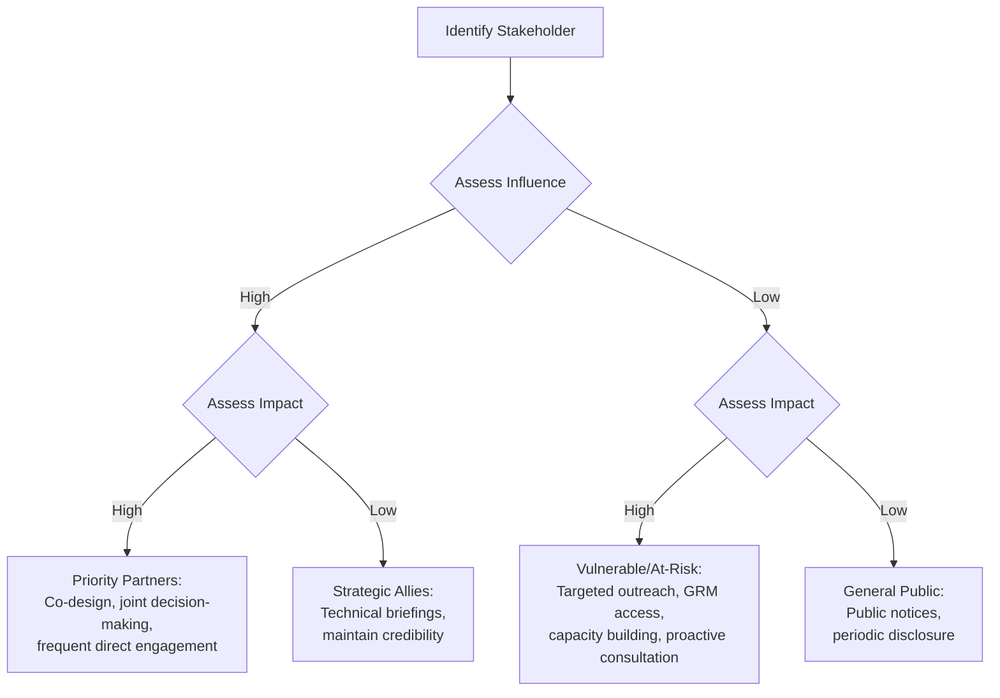

## Power-Interest and Influence-Impact Matrices

### Overview

Power-interest and influence-impact matrices are stakeholder prioritization tools used during Social Impact Assessment (SIA) and community engagement planning to classify stakeholders into quadrants based on two dimensions, enabling differentiated engagement strategies. These matrices convert qualitative stakeholder knowledge into an actionable visual framework that guides resource allocation, communication frequency, and engagement depth across a project's lifecycle.

Both matrices share a 2x2 grid structure but differ in the variables plotted:

- **Power-Interest Matrix**: Plots a stakeholder's power (capacity to affect the project) against their interest (degree to which the project affects them or they care about its outcome)
- **Influence-Impact Matrix**: Plots a stakeholder's influence (ability to affect project decisions, timelines, or resources) against the impact the project has on them (magnitude of social, economic, or environmental effect experienced)

The distinction matters in SIA contexts specifically: power-interest is oriented toward managing the project's relationship with stakeholders who can help or hinder it, while influence-impact is oriented toward equity — ensuring that communities who bear the greatest impact but hold the least influence (often marginalized or vulnerable groups) are not systematically under-engaged.

### Power-Interest Matrix

#### Structure and Quadrants

The matrix is built on two axes, typically scored on a scale (e.g., Low/Medium/High or a 1–5 numeric scale):

- **X-axis**: Interest — how much the stakeholder cares about or is affected by the project
- **Y-axis**: Power — how much capacity the stakeholder has to influence project outcomes, resources, or approvals

This produces four quadrants, conventionally labeled:

1. **High Power, High Interest — "Manage Closely" / Key Players**

   Stakeholders in this quadrant require the most intensive engagement. In an SIA context, this often includes regulatory agencies, local government units (LGUs), project financiers, and organized community groups with legal standing (e.g., Indigenous Peoples' councils under Free, Prior and Informed Consent requirements).
2. **High Power, Low Interest — "Keep Satisfied"**

   These stakeholders can significantly affect the project but are not currently engaged with its day-to-day details. Examples include senior government officials, national regulatory bodies, or investors not directly involved in operations. Engagement strategy: periodic, concise updates; avoid over-communication that could shift them into disengagement or generate unnecessary scrutiny.
3. **Low Power, High Interest — "Keep Informed"**

   These stakeholders are directly affected but have limited formal power to alter project decisions. This quadrant frequently contains the communities most central to SIA concerns — households facing resettlement, small-scale fishers, informal settlers, or local livelihoods groups. [Inference] In practice, SIA practitioners often argue this quadrant deserves engagement intensity comparable to "Manage Closely," even though the matrix's default heuristic assigns it lower priority — this is a recognized critique of the tool's power-centric bias, addressed further below.
4. **Low Power, Low Interest — "Monitor" / Minimal Effort**

   Minimal engagement required; periodic scanning for status changes over the project lifecycle, since power and interest are not static.

#### SVG Diagram: Power-Interest Matrix (svg_diagram)

<svg xmlns="http://www.w3.org/2000/svg" viewBox="0 0 620 520" font-family="Helvetica, Arial, sans-serif">
<text x="310" y="28" text-anchor="middle" font-size="18" font-weight="bold" fill="#1a1a1a">Power-Interest Matrix (svg_diagram)</text>

<line x1="90" y1="440" x2="90" y2="60" stroke="#333" stroke-width="2" />
<line x1="90" y1="440" x2="580" y2="440" stroke="#333" stroke-width="2" />

<text x="335" y="480" text-anchor="middle" font-size="15" fill="`#1a1a1a`">Interest (low → high)</text>

<text x="40" y="250" text-anchor="middle" font-size="15" fill="`#1a1a1a`" transform="rotate(-90 40 250)">Power (low → high)</text>

<line x1="335" y1="60" x2="335" y2="440" stroke="#999" stroke-dasharray="4 4" />
<line x1="90" y1="250" x2="580" y2="250" stroke="#999" stroke-dasharray="4 4" />

<rect x="90" y="60" width="245" height="190" fill="#fde68a" opacity="0.5" />
<rect x="335" y="60" width="245" height="190" fill="#fca5a5" opacity="0.5" />
<rect x="90" y="250" width="245" height="190" fill="#e5e7eb" opacity="0.5" />
<rect x="335" y="250" width="245" height="190" fill="#93c5fd" opacity="0.5" />

<text x="212" y="90" text-anchor="middle" font-size="13" font-weight="bold" fill="`#374151`">Keep Satisfied</text>

<text x="212" y="106" text-anchor="middle" font-size="11" fill="`#4b5563`">(High Power, Low Interest)</text>

<text x="457" y="90" text-anchor="middle" font-size="13" font-weight="bold" fill="`#374151`">Manage Closely</text>

<text x="457" y="106" text-anchor="middle" font-size="11" fill="`#4b5563`">(High Power, High Interest)</text>

<text x="212" y="280" text-anchor="middle" font-size="13" font-weight="bold" fill="`#374151`">Monitor</text>

<text x="212" y="296" text-anchor="middle" font-size="11" fill="`#4b5563`">(Low Power, Low Interest)</text>

<text x="457" y="280" text-anchor="middle" font-size="13" font-weight="bold" fill="`#374151`">Keep Informed</text>

<text x="457" y="296" text-anchor="middle" font-size="11" fill="`#4b5563`">(Low Power, High Interest)</text>

<circle cx="500" cy="100" r="6" fill="#b91c1c" />
<text x="510" y="104" font-size="11" fill="#1a1a1a">National regulator</text>
<circle cx="470" cy="150" r="6" fill="#b91c1c" />
<text x="480" y="154" font-size="11" fill="#1a1a1a">City LGU</text>
<circle cx="500" cy="320" r="6" fill="#1d4ed8" />
<text x="510" y="324" font-size="11" fill="#1a1a1a">Resettled households</text>
<circle cx="180" cy="100" r="6" fill="#92400e" />
<text x="120" y="90" font-size="11" fill="#1a1a1a">Investor (silent)</text>
<circle cx="180" cy="320" r="6" fill="#374151" />
<text x="140" y="340" font-size="11" fill="#1a1a1a">General public</text>
</svg>

### Influence-Impact Matrix

#### Structure and Quadrants

- **X-axis**: Impact — the magnitude of effect the project has on the stakeholder (social, economic, cultural, environmental, health)
- **Y-axis**: Influence — the stakeholder's capacity to shape project decisions, approvals, financing, or public opinion

Quadrants:

1. **High Influence, High Impact — "Priority Partners"**

   Stakeholders who both shape the project and are substantially affected by it. In SIA, this includes host communities with formal consultation rights, unions in labor-intensive projects, or Indigenous groups with both customary authority and direct impact exposure.
2. **High Influence, Low Impact — "Strategic Allies/Gatekeepers"**

   Regulators, technical advisors, or political figures who can shape outcomes but are not personally affected. Engagement here focuses on providing accurate technical information to secure appropriate decisions rather than addressing grievances.
3. **Low Influence, High Impact — "Vulnerable/At-Risk Groups"**

   This is the quadrant SIA practice treats as ethically non-negotiable: communities who absorb the greatest social cost but have the least formal say — often including women's groups, informal economy workers, landless tenants, or ethnic minorities. Standard SIA and safeguard frameworks (e.g., IFC Performance Standards, World Bank Environmental and Social Framework) require deliberate mechanisms — grievance redress systems, targeted consultation, capacity-building — to elevate the effective voice of this quadrant rather than accepting their low-influence status as fixed.
4. **Low Influence, Low Impact — "General Public/Peripheral"**

   Broad informational engagement (public notices, newsletters) suffices; monitor for quadrant shift.

#### Mermaid Diagram: Engagement Strategy Decision Flow by Quadrant

### Comparing the Two Matrices

| Dimension | Power-Interest | Influence-Impact |
| --- | --- | --- |
| Primary orientation | Project management / risk control | Equity and safeguard compliance |
| Y-axis | Power (formal/informal authority) | Influence (capacity to shape decisions) |
| X-axis | Interest (degree of stakeholder engagement/concern) | Impact (magnitude of effect experienced) |
| Origin discipline | Corporate stakeholder management, strategic management (Mendelow, 1991) | Development practice, safeguards, participatory SIA |
| Risk of misuse | Deprioritizes affected-but-powerless groups | Requires reliable impact-magnitude data, which may be contested pre-assessment |
| Typical use point in SIA | Early scoping, stakeholder mapping | Impact identification and mitigation planning phases |

### Methodology for Constructing the Matrices

#### Step 1: Stakeholder Identification

Compile a comprehensive list via document review, key informant interviews, snowball sampling, and secondary data (census, land records, local government stakeholder registries).

#### Step 2: Attribute Scoring

For each stakeholder, assign scores (commonly 1–5 or Low/Medium/High) for each axis variable. Scoring should be triangulated using multiple data sources and, where feasible, participatory validation with community representatives to avoid analyst bias.

$$\text{Priority Score} = w_1 \cdot P + w_2 \cdot I$$

Where $P$ is the power/influence score, $I$ is the interest/impact score, and $w_1, w_2$ are weighting coefficients reflecting the SIA's strategic emphasis (e.g., weighting impact more heavily than power in a rights-based SIA framework). [Inference] This weighted formula is not a universal standard but a commonly adapted extension practitioners use when a simple 2x2 categorical placement is insufficient for prioritization within a quadrant.

#### Step 3: Plotting and Validation

Plot stakeholders on the grid. Cross-check placements with the stakeholders themselves or trusted intermediaries where possible — self-assessment of power and interest can differ meaningfully from analyst assessment.

#### Step 4: Strategy Assignment

Map each quadrant to a defined engagement protocol: consultation frequency, communication channel, decision-making involvement level (informing, consulting, involving, collaborating, empowering — per the IAP2 Spectrum of Public Participation).

#### Step 5: Periodic Revisitation

Power, interest, influence, and impact are dynamic. A community with low power at project inception may gain power through organizing, media attention, or litigation. Matrices should be revisited at each major project phase (scoping, construction, operation, decommissioning).

### Practical Example

**Scenario**: A proposed water infrastructure project in Batac City affecting an informal settler community, a barangay council, a national water regulatory agency, and a private contractor consortium.

| Stakeholder | Power | Interest | Influence | Impact | P-I Quadrant | I-I Quadrant |
| --- | --- | --- | --- | --- | --- | --- |
| Informal settlers | Low | High | Low | High | Keep Informed | Vulnerable/At-Risk |
| Barangay council | Medium-High | High | Medium-High | Medium | Manage Closely | Priority Partners |
| National water regulator | High | Low-Medium | High | Low | Keep Satisfied | Strategic Ally |
| Contractor consortium | High | High | High | Low-Medium | Manage Closely | Strategic Ally / Priority Partner (borderline) |

**Key Points**

- The informal settler community appears in the lowest-priority quadrant of the power-interest matrix but the highest-priority equity quadrant of the influence-impact matrix — this divergence is the primary analytical value of running both matrices in parallel.
- Relying on the power-interest matrix alone would systematically under-resource engagement with the group experiencing the greatest social impact.
- SIA practice guidance (e.g., IAIA principles, IFC PS1) recommends using influence-impact (or equivalent impact-centered) matrices as a corrective lens specifically to prevent this under-engagement.

### Common Pitfalls

- **Static snapshots**: Treating the matrix as a one-time output rather than a living document that should be updated as the project and stakeholder landscape evolve.
- **Analyst-only scoring**: Assigning power/interest/impact scores without stakeholder input risks embedding the analyst's own assumptions and blind spots.
- **Conflating power with legitimacy**: A stakeholder's formal power does not necessarily correspond to a legitimate claim; SIA should track both to avoid excluding legitimate but low-power claimants.
- **Ignoring intra-group heterogeneity**: Treating "the community" as a single stakeholder point obscures internal differences (e.g., gender, income, land tenure status) that produce materially different impact and influence profiles within the same nominal group.
- **Quadrant determinism**: Using the quadrant alone to fully determine engagement intensity without qualitative judgment can produce mechanical, checkbox-style consultation that fails substantive engagement standards.

### Related Frameworks Often Paired with These Matrices

- **Stakeholder Salience Model** (Mitchell, Agle & Wood, 1997): adds legitimacy and urgency as a third and fourth dimension alongside power, producing a more granular typology (definitive, dominant, dependent, dangerous, dormant, discretionary, demanding stakeholders).
- **Social Network Analysis**: maps relational ties between stakeholders, useful when influence is exercised indirectly through networks rather than formal authority.
- **Vulnerability and Capacity Assessment (VCA)**: often used to substantiate the "impact" axis score with structured vulnerability indicators.

**Next Steps**

- Stakeholder salience model (power, legitimacy, urgency)
- Free, Prior and Informed Consent (FPIC) processes for Indigenous stakeholders
- Grievance Redress Mechanism (GRM) design
- IAP2 Spectrum of Public Participation
- Social network mapping techniques for indirect influence
- Vulnerability and Capacity Assessment (VCA) integration with impact scoring
- Participatory Rural Appraisal (PRA) tools for community-validated stakeholder data