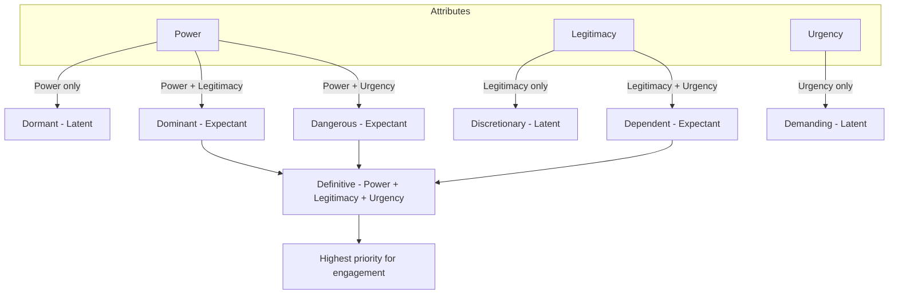

## Stakeholder Salience and Legitimacy Models

### Overview

Stakeholder salience and legitimacy models provide structured frameworks for identifying which stakeholders warrant management attention and prioritizing engagement resources in Social Impact Assessment (SIA) processes. These models move stakeholder analysis beyond a simple list of "affected parties" toward a systematic, defensible method for ranking stakeholders based on their attributes and relationship to the project or decision at hand.

In SIA contexts, these models matter because engagement resources (time, budget, facilitation capacity) are finite, while the universe of potentially affected or interested parties can be large — from directly displaced households to distant advocacy groups, regulators, and future generations. Salience and legitimacy frameworks give practitioners a principled basis for allocating attention without arbitrarily excluding vulnerable or high-risk groups.

### The Mitchell, Agle & Wood Salience Model

The most widely cited framework is Mitchell, Agle, and Wood's (1997) stakeholder salience theory, originally developed for corporate stakeholder management and widely adapted into SIA and environmental/social impact practice.

#### Three Core Attributes

The model proposes that stakeholder salience — the degree of priority managers/practitioners give to competing stakeholder claims — is a function of the cumulative presence of three attributes:

1. **Power** — the stakeholder's ability to impose its will on the project or decision, through coercive (force), utilitarian (material/financial resources), or normative (symbolic/social influence) means
2. **Legitimacy** — a generalized perception or assumption that the stakeholder's actions or claims are desirable, proper, or appropriate within a socially constructed system of norms, values, beliefs, and definitions
3. **Urgency** — the degree to which the stakeholder's claim calls for immediate attention, based on:
   - **Time sensitivity** — the extent to which delay is unacceptable to the stakeholder
   - **Criticality** — the importance of the claim or relationship to the stakeholder

#### Stakeholder Typology

Stakeholders are classified based on how many of the three attributes they possess:

**Latent stakeholders** (one attribute) — low salience, typically requiring minimal ongoing attention:

- **Dormant** (power only) — e.g., a national government agency with regulatory authority but no current active interest in the project
- **Discretionary** (legitimacy only) — e.g., a local charity with a legitimate community role but no power or urgent claim
- **Demanding** (urgency only) — e.g., an individual repeatedly submitting complaints with no power or broadly recognized legitimacy

**Expectant stakeholders** (two attributes) — moderate-to-high salience, generally active:

- **Dominant** (power + legitimacy) — e.g., a formally recognized indigenous council with both authority and social legitimacy
- **Dependent** (legitimacy + urgency) — e.g., a directly affected community with a time-sensitive, legitimate grievance but no independent power to compel action
- **Dangerous** (power + urgency) — e.g., a group willing to use coercive or illegitimate tactics (blockades, sabotage) to force urgent attention

**Definitive stakeholders** (all three attributes) — highest salience, demand priority attention — e.g., a resettlement-affected community with legal standing, urgent housing needs, and organized capacity to mobilize political or legal power

[Inference] Stakeholders can move between categories over the project lifecycle — a "demanding" stakeholder can become "dangerous" if ignored, and a "dormant" stakeholder can become "definitive" if it activates dormant power (e.g., a regulator initiating enforcement action).

### Mermaid Diagram: Salience Typology (Three-Circle Model)

### Legitimacy: A Deeper Look

Legitimacy is the most conceptually complex of the three attributes and deserves separate treatment in SIA, since misjudging legitimacy is a common source of engagement failure.

#### Types of Legitimacy (Suchman's Framework)

Mitchell et al. drew on Suchman's (1995) typology, which SIA practitioners commonly apply:

- **Pragmatic legitimacy** — based on the audience's self-interested calculations of whether the stakeholder's actions benefit them directly (e.g., a business association's legitimacy rests on whether it serves member interests)
- **Moral legitimacy** — based on normative judgments about whether the stakeholder's actions are "the right thing to do," independent of whether it benefits the evaluator (e.g., legitimacy of a group defending subsistence fishing rights)
- **Cognitive legitimacy** — based on comprehensibility and taken-for-grantedness; the stakeholder's existence and role are simply accepted as part of the natural order (e.g., an elected local government's legitimacy is rarely questioned)

#### Levels of Legitimacy Claim

Legitimacy claims can also be evaluated at different levels:

- **Individual level** — a single person's claim to represent or be affected
- **Organizational level** — an entity's claim to legitimately act or speak
- **Societal level** — broader normative acceptance of the claim within the wider social system

**Key Points**

- Legitimacy in this model is a *perceived* social property, not a legal or objective fact — a stakeholder can be legally entitled to a claim yet lack perceived legitimacy in the eyes of the assessor or other stakeholders, and vice versa
- SIA practitioners must distinguish **legal standing** (formal/legal right to be consulted, e.g., statutory landowners) from **social legitimacy** (community-recognized standing, e.g., customary leaders without formal title)
- Failure to recognize legitimate-but-not-powerful stakeholders (the "dependent" category) is a well-documented driver of grievance escalation into "dangerous" stakeholder status

### Comparative Framework: Legitimacy vs. Interest vs. Influence (Power-Interest Grid)

A complementary and simpler tool frequently used alongside or in place of the Mitchell-Agle-Wood model in practitioner-facing SIA guidance (e.g., IFC Performance Standards guidance, World Bank stakeholder engagement frameworks) is the **Power-Interest Grid** (also called the Power-Interest Matrix):

| Interest / Power | Low Power | High Power |
| --- | --- | --- |
| **Low Interest** | Monitor (minimal effort) | Keep Satisfied |
| **High Interest** | Keep Informed | Manage Closely (key players) |

**Example**

- A distant environmental NGO with strong opinions on the project but no direct power over permitting → **Keep Informed**
- A national finance ministry with approval authority but low day-to-day interest in project specifics → **Keep Satisfied**
- A directly affected resettlement community with both high interest and (via legal/political leverage) high power → **Manage Closely**
- A tangential trade association with low interest and low power → **Monitor**

[Unverified] The Power-Interest Grid is sometimes attributed to Mendelow (1991) in stakeholder management literature, though the grid format has been adapted and republished across many project management and CSR guidance documents without consistent attribution.

### Integrating Salience and Legitimacy into SIA Practice

#### Step-by-Step Application

1. **Stakeholder identification** — compile an exhaustive initial list using multiple methods (desk review, snowball sampling, community mapping, government registries)
2. **Attribute scoring** — for each stakeholder, assess presence/absence (or a scaled score, e.g., 1–5) of power, legitimacy, and urgency, using structured criteria and, where possible, triangulated evidence rather than a single assessor's judgment
3. **Typology classification** — place each stakeholder into a Mitchell-Agle-Wood category
4. **Cross-check with power-interest positioning** — validate salience classification against the simpler power-interest grid to catch inconsistencies
5. **Engagement strategy design** — tailor engagement depth, frequency, and method to the stakeholder's category (definitive stakeholders warrant continuous, resourced dialogue; latent stakeholders may need only periodic information updates)
6. **Periodic re-assessment** — salience is dynamic; reassess at key project milestones (design change, resettlement action plan finalization, construction start) since attributes shift over time

#### SIA-Specific Adaptations

Because SIA emphasizes equity and vulnerability (unlike purely corporate stakeholder management), practitioners commonly layer additional considerations onto the base model:

- **Vulnerability weighting** — explicitly up-weighting attention to stakeholders with high urgency/legitimacy but structurally low power (e.g., women's groups, indigenous peoples, informal settlers), consistent with IFC Performance Standard 1 and 7 requirements for differentiated engagement with vulnerable groups
- **Proxy representation** — for stakeholders lacking direct voice or organizational capacity to assert power or urgency (e.g., future generations, non-human environmental interests represented via NGOs), the model requires deliberate practitioner effort to avoid systematically under-scoring their salience
- **Power imbalance correction** — recognizing that "dangerous" stakeholder behavior (protest, blockade) is sometimes a rational response to a legitimate claim being persistently ignored when the stakeholder lacks formal power — reframing this as a signal of process failure rather than purely a risk to be managed

**Key Points**

- Do not conflate low salience score with low importance to overall social outcomes — a "discretionary" or "dependent" stakeholder in the model may still represent significant social risk if ignored
- Salience models describe *managerial attention allocation*, not *ethical priority* — SIA good practice (per IAIA guidance) treats them as a starting triage tool, not a justification for excluding low-power groups from meaningful consultation
- Document the scoring rationale for each stakeholder; salience classifications are frequently contested and audited during grievance mechanisms or lender due diligence (e.g., IFC/Equator Principles compliance reviews)

### Illustration: Legitimacy–Power–Urgency Attribute Space (svg_diagram)

<svg xmlns="http://www.w3.org/2000/svg" viewBox="0 0 640 560" font-family="Arial, sans-serif">
<text x="320" y="30" text-anchor="middle" font-size="18" font-weight="bold">Legitimacy–Power–Urgency Attribute Space (svg_diagram)</text>
<circle cx="250" cy="230" r="140" fill="#4C72B0" fill-opacity="0.35" stroke="#4C72B0" stroke-width="2" />
<circle cx="390" cy="230" r="140" fill="#DD8452" fill-opacity="0.35" stroke="#DD8452" stroke-width="2" />
<circle cx="320" cy="350" r="140" fill="#55A868" fill-opacity="0.35" stroke="#55A868" stroke-width="2" />

<text x="150" y="140" font-size="16" font-weight="bold" fill="`#2c3e50`">Power</text>

<text x="470" y="140" font-size="16" font-weight="bold" fill="`#2c3e50`">Legitimacy</text>

<text x="290" y="480" font-size="16" font-weight="bold" fill="`#2c3e50`">Urgency</text>

<text x="200" y="210" font-size="13" fill="`#1a1a1a`">Dormant</text>

<text x="440" y="210" font-size="13" fill="`#1a1a1a`">Discretionary</text>

<text x="300" y="420" font-size="13" fill="`#1a1a1a`">Demanding</text>

<text x="300" y="180" font-size="13" fill="`#1a1a1a`">Dominant</text>

<text x="235" y="330" font-size="13" fill="`#1a1a1a`">Dangerous</text>

<text x="370" y="330" font-size="13" fill="`#1a1a1a`">Dependent</text>

<text x="300" y="270" font-size="14" font-weight="bold" fill="`#ffffff`">Definitive</text>

<rect x="20" y="500" width="18" height="18" fill="#4C72B0" fill-opacity="0.5" />
<text x="45" y="514" font-size="12">Power</text>
<rect x="120" y="500" width="18" height="18" fill="#DD8452" fill-opacity="0.5" />
<text x="145" y="514" font-size="12">Legitimacy</text>
<rect x="250" y="500" width="18" height="18" fill="#55A868" fill-opacity="0.5" />
<text x="275" y="514" font-size="12">Urgency</text>

<text x="20" y="540" font-size="11" font-style="italic" fill="`#555555`">Overlap regions = expectant (2 attributes); center = definitive (3 attributes)</text>

</svg>

### Critiques and Limitations

- **Static snapshot bias** — the model as originally formulated is often applied as a one-time classification exercise, whereas real stakeholder attributes shift throughout a project lifecycle; SIA practice guidance stresses iterative reassessment
- **Assessor subjectivity** — power, legitimacy, and urgency are all judgment calls made by the assessing organization (often the project proponent), creating a structural risk that the framework reflects proponent interests rather than an objective stakeholder landscape [Inference]
- **Binary/threshold framing** — the original model treats attributes as present/absent rather than continuous, which can obscure meaningful gradations; many contemporary applications use scaled scoring (e.g., 1–5 Likert-type scales) to address this
- **Under-weighting of latent but critical stakeholders** — groups with low current salience but high potential future impact (e.g., future generations, downstream ecosystem-dependent communities) can be systematically underrepresented unless explicitly corrected for

### Related Standards and Cross-References

- **IFC Performance Standard 1** — requires stakeholder identification and analysis proportionate to project risks, with specific reference to differentiated engagement based on stakeholder characteristics
- **IAIA (International Association for Impact Assessment) guidance** — recommends salience-informed engagement planning while cautioning against using salience scores to justify minimal engagement with vulnerable groups
- **AA1000 Stakeholder Engagement Standard** — provides complementary materiality-based stakeholder prioritization principles that can be cross-applied with salience typologies

**Next Steps**

- Stakeholder mapping techniques (influence-interest matrices, social network analysis, stakeholder onion diagrams)
- Vulnerable and marginalized group identification methods in SIA
- Grievance redress mechanism design as a response to "dangerous" or "dependent" stakeholder escalation
- Free, Prior, and Informed Consent (FPIC) processes for indigenous stakeholder legitimacy
- Stakeholder engagement plan (SEP) development and differentiated engagement strategies
- Power analysis tools in participatory social assessment
- Materiality assessment frameworks (AA1000, GRI) as adjacent prioritization methods