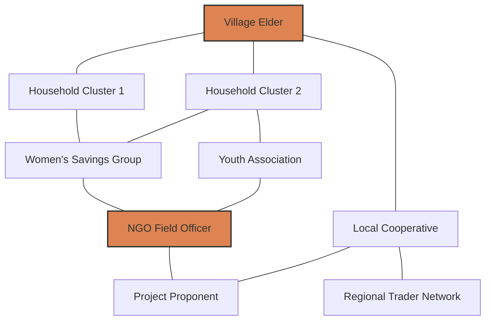

## Social Network and Relationship Mapping

### Overview

Social network and relationship mapping is a set of methods for identifying, visualizing, and analyzing the structure of relationships among stakeholders — individuals, households, organizations, and institutions — affected by or influencing a project. Unlike attribute-based frameworks (e.g., power-legitimacy-urgency models), social network mapping focuses on the *pattern of ties* between actors: who is connected to whom, how information and influence flow, and where structural positions of power, brokerage, or isolation exist.

In SIA practice, this method is used to surface informal power structures that formal stakeholder lists miss (e.g., an elder who holds no official title but is the de facto decision-maker), identify communication bottlenecks, and design culturally appropriate, socially calibrated engagement strategies.

### Core Concepts from Social Network Analysis (SNA)

#### Nodes and Ties

- **Nodes (actors)** — individuals, households, community groups, government bodies, businesses, or other entities represented as points in the network
- **Ties (edges/links)** — relationships connecting nodes, which can represent:
  - Kinship or family relationships
  - Economic exchange (trade, employment, resource-sharing)
  - Communication or information flow
  - Trust or advisory relationships
  - Formal organizational membership
  - Conflict or adversarial relationships

Ties can be **directed** (A informs B, but not necessarily vice versa) or **undirected** (mutual kinship), and can carry a **weight** representing frequency, strength, or importance of the relationship.

#### Key Structural Metrics

- **Degree centrality** — the number of direct ties a node has; high-degree actors are often well-connected community members or organizational hubs
- **Betweenness centrality** — the extent to which a node lies on the shortest paths between other nodes; high-betweenness actors act as **brokers** or **gatekeepers** controlling information flow between otherwise disconnected groups
- **Closeness centrality** — how quickly a node can reach all other nodes in the network; relevant for identifying actors who can rapidly disseminate information
- **Eigenvector centrality** — a node's influence based on being connected to other well-connected nodes (influence-of-influence)
- **Density** — the proportion of possible ties that actually exist in the network; low-density networks suggest fragmented communities, while high density suggests tight-knit, potentially insular groups
- **Clustering coefficient** — the degree to which a node's connections are also connected to each other, indicating tightly knit subgroups (cliques)
- **Structural holes** — gaps between clusters not directly connected, which brokers can exploit or bridge

**Key Points**

- High betweenness centrality, not high degree centrality, is often the better predictor of who controls information flow in a fragmented community structure
- A node with few ties but a position bridging two otherwise disconnected clusters (a structural hole broker) can have outsized influence on project outcomes despite appearing "unimportant" in a simple stakeholder list

### Mermaid Diagram: Example Community Relationship Network

In this example, the Village Elder and NGO Field Officer occupy broker positions (high betweenness), bridging clusters that otherwise have limited direct contact with the project proponent.

### Data Collection Methods

#### 1. Sociometric Surveys (Name Generators)

Structured interview or survey instruments asking respondents to name individuals or organizations with whom they have specific types of relationships:

- "Who do you go to for advice about [land use / water access / project concerns]?"
- "Who do you trust most in the community to represent your interests?"
- "Which organizations does your household regularly interact with?"

Responses are compiled into an **adjacency matrix** or **edge list** for formal network analysis.

#### 2. Participatory Mapping (Community-Led)

Facilitated group sessions where community members physically or visually map relationships using:

- **Venn diagramming** (Chapati/Chapatti diagrams) — circles of varying size represent organizations/actors, with overlap indicating relationship closeness and proximity indicating relative importance
- **Social network sketching on large paper/ground** — community members place symbols/stones for actors and draw connecting lines for relationships, facilitated by a trained enumerator
- **Transect walks combined with relationship mapping** — walking through a community while mapping physical and social connections simultaneously

[Inference] Participatory approaches tend to produce data that is more contextually valid and community-owned, though less amenable to formal quantitative SNA metrics than structured sociometric surveys, since group-elicited maps often reflect consensus narratives rather than individually reported ties.

#### 3. Key Informant Interviews and Snowball Sampling

Initial informants identify other relevant actors, who are subsequently interviewed and asked to identify further actors, until saturation (no new actors are named). This method is particularly useful for mapping elite or informal power networks not captured by official rosters.

#### 4. Secondary Data and Institutional Mapping

Organizational charts, membership rosters, land tenure records, and government administrative structures provide a formal-tie baseline that can be triangulated against informally reported relationships.

### Analytical and Visualization Tools

| Tool | Type | Typical Use in SIA |
| --- | --- | --- |
| UCINET | Desktop SNA software | Formal metric computation (centrality, density, cliques) on small-to-medium networks |
| Gephi | Open-source visualization | Large network visualization, community detection, exportable graphics for reports |
| R (igraph, statnet packages) | Programming/statistical | Reproducible, scriptable SNA workflows integrated with broader SIA data pipelines |
| NodeXL | Excel plug-in | Lightweight SNA for practitioners without programming background |
| Kumu | Web-based visualization | Stakeholder systems mapping with narrative annotation, often used in participatory settings |

[Unverified] Specific feature sets and licensing terms for these tools change over time; practitioners should verify current capabilities against the vendor's own documentation before selecting a tool for a given engagement.

### Step-by-Step Application in SIA

1. **Define the relationship of interest** — clarify whether mapping targets communication, trust, economic dependency, kinship, or a combination, since this determines survey/interview design
2. **Bound the network** — decide the population boundary (e.g., all households within the project's area of direct impact, all registered community organizations, or a purposive sample of key informants)
3. **Collect relational data** — via sociometric survey, participatory mapping, or snowball interviews, depending on literacy levels, cultural appropriateness, and available time/budget
4. **Construct the network** — compile responses into a matrix or edge list; participatory maps can be digitized post-session for consistency
5. **Compute structural metrics** — identify high-centrality actors, brokers, isolated subgroups, and structural holes
6. **Cross-validate with attribute-based analysis** — overlay network position with power-legitimacy-urgency salience classifications to identify, for example, high-betweenness actors who lack formal power/legitimacy recognition (often the most useful engagement entry points)
7. **Translate into engagement strategy** — prioritize brokers and high-centrality actors for early consultation, design targeted outreach for isolated clusters, and use identified information pathways for grievance mechanism design and project communication

**Example**

A resettlement SIA identifies through sociometric interviews that a local market vendor (not on any formal community leadership roster) has the highest betweenness centrality in the trust network, connecting three otherwise disconnected household clusters. The engagement team incorporates this vendor as a communication conduit and early consultation partner, substantially improving information reach compared to relying solely on the officially recognized village council.

### Integration with Other Stakeholder Analysis Frameworks

Social network mapping is typically used *in combination with*, not as a replacement for, attribute-based salience models:

- **Salience models** (Mitchell-Agle-Wood) answer "who deserves priority attention based on power, legitimacy, urgency"
- **Network mapping** answers "how are stakeholders structurally connected, and who controls information/influence flow between them"
- Combined analysis reveals cases where a **structurally central** actor lacks **formal salience** (an informal broker overlooked by top-down stakeholder lists) or where a **formally salient** actor is **structurally peripheral** (a legally empowered agency with weak ground-level relationship ties, risking implementation failure)

### Ethical and Methodological Considerations

- **Confidentiality and data sensitivity** — relationship data, especially regarding trust, conflict, or informal power, can be sensitive; anonymization and careful data storage protocols are required, particularly in politically fragile or conflict-affected settings
- **Consent and relational privacy** — sociometric name-generator methods require naming third parties without their direct consent to be named; informed consent protocols must address this, and some ethics boards require special review
- **Risk of exposing informal leaders** — publicizing or sharing network maps that reveal informal power holders can create social risk for those individuals (e.g., retaliation, altered community dynamics); SIA practitioners should restrict circulation of raw network data
- **Boundary specification bias** — how the network's boundary is defined (who is included/excluded from the mapping exercise) inherently shapes which relationships and power structures become visible, and can inadvertently exclude marginalized or mobile populations (migrant workers, seasonal residents)

**Key Points**

- Network maps are a snapshot of relationships at a point in time; major project events (resettlement, employment shifts, compensation payments) can rapidly reorganize social networks, warranting periodic re-mapping at key milestones
- Raw sociometric data should generally not be shared in full within community reports; aggregate findings and anonymized structural insights are the appropriate level of disclosure

### Limitations

- Resource- and time-intensive relative to simpler stakeholder listing methods, particularly for formal SNA with sociometric surveys and software-based metric computation
- Requires specialized analytical skill (SNA software/statistical literacy) to move beyond visualization into rigorous structural metrics
- Network boundary and name-generator question design significantly influence results, introducing a methodological validity dependency that requires careful piloting
- Static network snapshots can misrepresent highly dynamic or seasonal relationship patterns (e.g., agricultural communities with seasonal migration)

**Next Steps**

- Stakeholder salience and legitimacy models (attribute-based prioritization, cross-reference)
- Participatory rural appraisal (PRA) and rapid rural appraisal (RRA) toolkits
- Power analysis and political economy analysis in social assessment
- Grievance redress mechanism design leveraging identified communication pathways
- Community vulnerability and marginalization mapping
- Free, Prior, and Informed Consent (FPIC) processes and network-informed representative identification
- Digital tools for participatory GIS combined with social network overlays