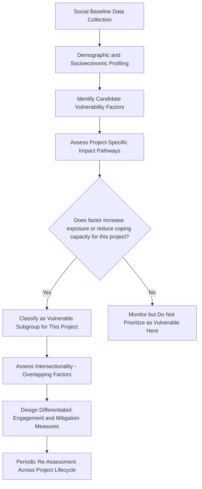

## Identifying Vulnerable and Marginalized Groups

### Overview

Identifying vulnerable and marginalized groups is a core analytical requirement in Social Impact Assessment (SIA), distinct from general stakeholder identification because it focuses specifically on individuals or groups who face a heightened risk of experiencing adverse project impacts disproportionately, or who face barriers to participating fully in consultation and benefit-sharing processes. This determination directly shapes differentiated engagement strategies, targeted mitigation measures, and compliance with lender/regulatory safeguard requirements.

Vulnerability in this context is not a fixed checklist trait but a **context-specific, intersectional condition** arising from the interaction between individual/group characteristics and the specific project's impact pathways.

### Defining Vulnerability and Marginalization

- **Vulnerability** — a heightened susceptibility to being adversely affected by project impacts, or a reduced capacity to cope with, adapt to, or recover from those impacts, relative to the general affected population
- **Marginalization** — social, economic, or political exclusion from mainstream decision-making processes, resource access, or benefit distribution, which may exist independently of a specific project but is often exacerbated by it

[Inference] These two concepts overlap substantially but are not identical: a group can be marginalized (excluded from local power structures) without being especially vulnerable to a specific project's impacts, and vice versa (e.g., a newly arrived, well-resourced household may be vulnerable to a specific hazard but not socially marginalized).

### Common Categories of Vulnerability (Non-Exhaustive)

Recognized international safeguard frameworks (IFC Performance Standards, World Bank Environmental and Social Framework, Equator Principles) commonly reference the following as groups warranting particular attention — though the applicable categories must always be determined contextually rather than applied as a universal checklist:

- **Indigenous peoples and ethnic minorities** — often with distinct customary land tenure systems, cultural/spiritual ties to land, and limited formal legal recognition of rights
- **Women and female-headed households** — who may face restricted land tenure rights, exclusion from formal consultation processes (particularly in patriarchal social structures), or disproportionate burden from changes to unpaid care and resource-gathering labor
- **Persons with disabilities** — who may face physical access barriers to consultation venues, communication barriers (sign language, accessible formats), or exclusion from livelihood restoration programs designed around able-bodied assumptions
- **Elderly individuals and unaccompanied minors** — particularly in resettlement contexts, where relocation can disrupt care networks and intergenerational support systems
- **Informal settlers and non-titled land users** — who lack formal legal recognition of land rights and are consequently at risk of exclusion from compensation frameworks that require documented title
- **Ethnic, religious, or linguistic minorities** — who may face language barriers in consultation, cultural insensitivity in engagement design, or historical marginalization from local governance
- **Economically poor or landless households** — with limited financial capacity to absorb livelihood disruption or relocation costs
- **Migrant workers and seasonal populations** — who may be excluded from consultation processes tied to permanent residency records
- **LGBTQ+ individuals** — who may face social stigma affecting safe participation in consultation processes, particularly in socially conservative contexts
- **People living with chronic illness or health conditions requiring ongoing care** — [Inference] particularly relevant where project impacts affect healthcare access or require relocation away from established care providers

**Key Points**

- This list is illustrative, not exhaustive or universally applicable — vulnerability categories must be identified through context-specific social baseline research, not assumed from global templates
- A single individual or household can experience **intersecting vulnerabilities** (e.g., an elderly, disabled, indigenous woman), which compound rather than simply add risk
- Vulnerability assessment must avoid essentializing entire demographic categories as uniformly vulnerable; heterogeneity within groups (e.g., not all women in a community face identical constraints) must be captured

### Mermaid Diagram: Intersectional Vulnerability Assessment Process

### Methodologies for Identification

#### 1. Social Baseline and Household Surveys

Structured quantitative surveys capturing demographic composition, asset ownership, land tenure status, income sources, and self-reported disability or health status across the project-affected population, enabling disaggregated statistical analysis (by sex, age, ethnicity, disability status, income quintile).

#### 2. Participatory Vulnerability Assessment

Community-based workshops and focus group discussions (often disaggregated by gender, age, or ethnicity to ensure safe disclosure) using participatory tools such as:

- **Wealth ranking / well-being ranking** — community members categorize households by relative wealth/vulnerability using locally defined criteria
- **Social mapping** — spatial mapping of where vulnerable households or groups are located relative to project impact zones
- **Vulnerability matrices** — community-generated ranking of which groups face the greatest difficulty coping with specific anticipated project changes

#### 3. Key Informant and Institutional Consultation

Interviews with local health workers, social service providers, religious/traditional leaders, disability advocacy organizations, and women's groups to identify vulnerability patterns not readily captured through household surveys (e.g., domestic violence risk, informal caregiving burdens).

#### 4. Secondary Data Review

Government census data, poverty mapping, health and education statistics, land registry records, and existing NGO/civil society vulnerability assessments provide a baseline against which primary data can be triangulated.

#### 5. Intersectional and Differential Impact Analysis

Beyond identifying *who* is vulnerable, SIA good practice requires analyzing *how* specific project impact pathways (land acquisition, resettlement, employment changes, environmental changes, in-migration) will differentially affect each identified vulnerable subgroup — a step often formalized through a **Social Impact Matrix** or **Vulnerability-Impact Crosswalk**.

**Example**

| Vulnerable Subgroup | Relevant Project Impact Pathway | Differential Risk |
| --- | --- | --- |
| Female-headed households | Land acquisition requiring formal title for compensation | Risk of exclusion from compensation if land is customarily but not formally titled to women |
| Elderly residents | Physical resettlement to new site | Disruption of established local healthcare access and social support networks |
| Indigenous community with customary tenure | Loss of access to communal forest resources | Loss of subsistence livelihood and cultural/spiritual practices tied to land |
| Persons with mobility disabilities | Consultation meetings held in physically inaccessible venues | Exclusion from grievance and consultation processes, reducing voice in decision-making |

### Regulatory and Standards Context

- **IFC Performance Standard 1** — requires identification of "disadvantaged or vulnerable individuals or groups" who "may be disproportionately affected by project impacts" and mandates differentiated measures so they can benefit from project opportunities on an equitable basis
- **IFC Performance Standard 5 (Land Acquisition and Involuntary Resettlement)** — specifically requires attention to non-titled land users and vulnerable groups in compensation and livelihood restoration planning
- **IFC Performance Standard 7 (Indigenous Peoples)** — establishes specific consultation and consent requirements (including Free, Prior, and Informed Consent in defined circumstances) for indigenous peoples as a distinct vulnerable category
- **World Bank Environmental and Social Framework (ESS1, ESS5, ESS7)** — parallels IFC standards with comparable requirements for differentiated treatment of disadvantaged/vulnerable groups
- **Equator Principles** — financial institutions applying these principles require borrowers to conduct vulnerability-inclusive social assessments as a condition of project finance

[Unverified] Specific clause numbering and requirements within these frameworks are periodically revised; practitioners should verify against the current published version of the applicable standard for a specific project's compliance requirements.

### Common Pitfalls and Practical Challenges

- **Self-selection bias in consultation** — vulnerable groups are frequently underrepresented in public consultation meetings due to time constraints, social norms restricting participation (e.g., women unable to attend mixed-gender public meetings), or physical/language barriers, leading assessors to underestimate their presence or concerns if consultation attendance is used as a proxy for representativeness
- **Elite capture** — local elites or formally recognized leaders may not accurately represent the interests of marginalized subgroups within their own communities, requiring separate, targeted consultation channels
- **Static categorization** — vulnerability status can change over the project lifecycle (e.g., a household rendered vulnerable by construction-phase employment loss that did not exist at baseline), requiring periodic reassessment rather than one-time classification
- **Over-aggregation** — treating broad categories (e.g., "women," "indigenous peoples") as internally homogeneous can obscure significant within-group variation in vulnerability and needs
- **Under-resourcing targeted outreach** — identifying vulnerable groups without allocating adequate budget/time for differentiated engagement methods (separate focus groups, accessible venues, translated materials) renders the identification exercise procedurally hollow

**Key Points**

- Vulnerability identification must translate into **differentiated engagement design** (separate consultation channels, accessible formats, safe spaces for disclosure) and **differentiated mitigation/benefit measures**, not remain a static list in a baseline report
- Gender-disaggregated and separately facilitated consultation (e.g., women-only focus groups facilitated by female staff) is widely regarded as essential for surfacing gender-specific vulnerability that mixed-group settings suppress
- Grievance mechanisms should include specific accessible, confidential channels for vulnerable groups who may face retaliation risk or social stigma in using standard grievance channels

### Integration with Broader Stakeholder Analysis

Vulnerability identification is best integrated with, rather than treated separately from, the broader stakeholder analysis toolkit covered elsewhere in this chapter:

- Cross-reference with **stakeholder salience models** — vulnerable groups often occupy the "dependent" salience category (high legitimacy, high urgency, low power), which signals elevated risk of grievance escalation if under-engaged
- Cross-reference with **social network mapping** — vulnerable individuals may be structurally peripheral or isolated within community networks, requiring proactive outreach rather than reliance on existing informal information channels
- Feed directly into **Stakeholder Engagement Plan (SEP)** design, **Resettlement Action Plan (RAP)** development (where applicable), and **Indigenous Peoples Plan (IPP)** development

**Next Steps**

- Stakeholder salience and legitimacy models (cross-reference for prioritization)
- Social network and relationship mapping (cross-reference for structural positioning of vulnerable groups)
- Free, Prior, and Informed Consent (FPIC) processes for indigenous peoples
- Gender-based analysis and gender action planning in SIA
- Resettlement Action Plan (RAP) and livelihood restoration frameworks
- Grievance redress mechanism design for vulnerable and marginalized groups
- Differentiated stakeholder engagement plan (SEP) design
- Disability-inclusive consultation methods