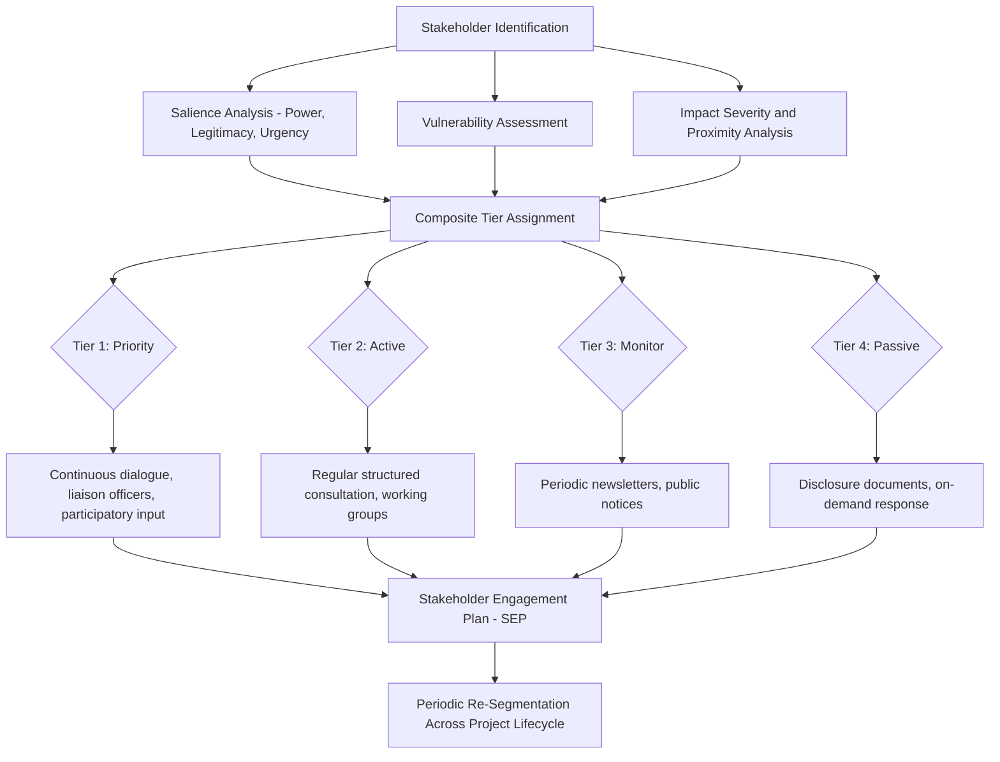

## Stakeholder Segmentation for Tiered Engagement

### Overview

Stakeholder segmentation for tiered engagement is the practice of grouping identified stakeholders into distinct tiers or categories that each receive a differentiated level, method, and intensity of engagement, rather than applying a uniform consultation approach across all stakeholders. This method translates the outputs of stakeholder identification, salience analysis, and vulnerability assessment into an operational engagement architecture — determining not just *who* to engage, but *how much*, *how often*, and *through what channel*.

Tiered engagement is a resource-allocation discipline: it ensures that high-impact, high-risk, or high-vulnerability stakeholders receive proportionally greater engagement investment, while avoiding both under-engagement of critical groups and unsustainable over-engagement of the entire stakeholder universe.

### Rationale for Segmentation

- **Resource constraints** — consultation budget, staff time, and community capacity to participate are all finite; segmentation ensures allocation reflects actual risk and impact rather than uniform treatment
- **Differentiated impact severity** — stakeholders experience vastly different magnitudes of project impact (a displaced household vs. a distant advocacy group), warranting different engagement depth
- **Differentiated capacity and preference** — stakeholders differ in literacy, language, availability, technological access, and cultural norms around participation, requiring different engagement channels and formats
- **Regulatory proportionality requirements** — lender and regulatory safeguard frameworks (IFC PS1, World Bank ESS10) explicitly require engagement "proportionate to the nature and scale of the project and its potential risks and impacts," which segmentation operationalizes

### Common Segmentation Bases

#### 1. Impact Severity and Proximity

Segmentation by the degree and directness of project impact:

- **Directly and severely affected** — e.g., households facing physical or economic displacement
- **Directly but moderately affected** — e.g., residents near construction zones experiencing temporary noise/traffic disruption
- **Indirectly affected** — e.g., downstream water users, regional labor markets
- **Interested parties with no direct impact** — e.g., national NGOs, academic researchers, media

#### 2. Salience-Based Segmentation (Cross-Referenced with Mitchell-Agle-Wood Model)

Building directly on the power-legitimacy-urgency salience typology:

- **Definitive stakeholders** (all three attributes) → Tier 1 (highest engagement intensity)
- **Expectant stakeholders** (two attributes: dominant, dependent, dangerous) → Tier 2 (active, regular engagement)
- **Latent stakeholders** (one attribute: dormant, discretionary, demanding) → Tier 3 (monitoring, periodic information)

#### 3. Vulnerability-Adjusted Segmentation

Vulnerability status can elevate a stakeholder's tier independent of raw power or impact magnitude, reflecting the principle that low-power, high-vulnerability groups warrant proactive, resourced engagement rather than being left in a low tier by default — since low measured "salience" for vulnerable groups is often an artifact of structural power imbalance rather than low legitimacy of their claim. [Inference] This is why SIA good practice generally overrides pure salience-tier placement for known vulnerable groups, promoting them to a higher engagement tier regardless of their raw power score.

#### 4. Influence-Based Segmentation (Power-Interest Grid Cross-Reference)

As covered under salience models, the power-interest grid quadrants (Manage Closely, Keep Satisfied, Keep Informed, Monitor) map directly onto tiered engagement intensity levels.

**Key Points**

- No single segmentation basis is sufficient in isolation; robust tiering typically synthesizes impact severity, salience, vulnerability status, and influence/interest into a composite tier assignment
- Composite tiering should be documented with explicit criteria and rationale per stakeholder group, since tier assignments are frequently scrutinized during lender due diligence and grievance/complaint reviews

### Standard Tiered Engagement Model

A commonly used three- or four-tier structure in SIA practice:

| Tier | Stakeholder Profile | Engagement Intensity | Typical Methods |
| --- | --- | --- | --- |
| **Tier 1 — Priority/Core** | Directly and severely affected; definitive salience; high vulnerability | Continuous, resourced, two-way dialogue | Individual/household consultations, dedicated liaison officers, regular site-level meetings, participatory decision input on mitigation design |
| **Tier 2 — Active** | Moderately affected; expectant salience (dominant/dependent/dangerous); moderate vulnerability | Regular, structured consultation | Periodic community meetings, focus group discussions, sector-specific working groups |
| **Tier 3 — Monitor/Inform** | Indirectly affected; latent salience; low vulnerability | Periodic, largely one-way information | Newsletters, public notices, project website updates, annual open house events |
| **Tier 4 — Passive/Aware** | Interested but unaffected parties (national NGOs, academics, media) | Minimal, on-demand | Public disclosure documents, website availability, response to direct inquiries |

[Inference] Some SIA frameworks collapse this into a three-tier structure (Priority/Active/Monitor) without a separate passive tier, depending on project scale and regulatory context; the specific number of tiers is a practitioner design choice rather than a fixed standard.

### Mermaid Diagram: Segmentation-to-Engagement Workflow

### Designing Differentiated Engagement Methods per Tier

#### Tier 1 (Priority) Considerations

- One-on-one or small-group consultation formats to allow detailed, individualized concern capture
- Dedicated community liaison officers or grievance focal points assigned specifically to this tier
- Engagement scheduled around stakeholder availability and cultural norms rather than proponent convenience
- Materials translated into local languages, in accessible formats (audio, pictorial for low-literacy contexts)
- Direct involvement in mitigation measure co-design where feasible (e.g., resettlement site selection input)

#### Tier 2 (Active) Considerations

- Structured but less individualized formats: focus group discussions disaggregated by relevant subgroup (gender, age, occupation)
- Regular cadence (e.g., quarterly) rather than continuous contact
- Working group or committee structures enabling stakeholder representation in specific technical areas (environmental monitoring committees, local employment committees)

#### Tier 3 (Monitor/Inform) Considerations

- Primarily one-way but responsive communication: information disclosure with a clear feedback/inquiry channel
- Broader reach methods: public notices, community bulletin boards, radio announcements, project website
- Periodic larger-format meetings (e.g., annual public information sessions) rather than frequent contact

#### Tier 4 (Passive) Considerations

- Standard public disclosure compliance (environmental and social impact assessment reports, non-technical summaries)
- Reactive engagement: responding to inquiries or formal information requests as they arise

**Example**

A hydropower project segments its stakeholder universe as follows: Tier 1 includes ~120 households facing physical resettlement (definitive salience, high vulnerability, severe direct impact) receiving individual case management and monthly consultation; Tier 2 includes ~800 households in the broader watershed experiencing altered water access (expectant salience, moderate impact) receiving quarterly community meetings; Tier 3 includes downstream municipalities and irrigation associations (latent salience, indirect impact) receiving semi-annual technical briefings and monitoring data disclosure; Tier 4 includes national environmental NGOs and academic researchers receiving standard public document disclosure and responsive inquiry handling.

### Dynamic Re-Segmentation

Stakeholder tier assignments are not static and require periodic reassessment because:

- **Salience attributes shift** — a Tier 3 stakeholder can activate dormant power (e.g., a regulator initiating enforcement action) or escalate urgency (e.g., a community group organizing collective action), requiring promotion to a higher tier
- **Project phase changes alter impact profiles** — construction-phase impacts (traffic, noise, temporary employment) differ substantially from operations-phase impacts (long-term environmental change, permanent employment structures), shifting which stakeholders experience severe impact
- **Engagement history affects trust and salience** — poorly managed engagement with a Tier 2 or 3 stakeholder can escalate grievances and effectively promote that stakeholder to Tier 1 status through the "dangerous" salience pathway

**Key Points**

- Re-segmentation should occur at defined project milestones (design finalization, construction commencement, major operational changes) rather than only reactively after a grievance or conflict event
- Documentation of tier changes and rationale supports both adaptive management and external audit/compliance review (e.g., IFC/Equator Principles lender site visits)

### Regulatory and Standards Alignment

- **IFC Performance Standard 1** and the associated **Stakeholder Engagement** guidance note require engagement "proportionate to the nature and scale of the project and its potential risks and impacts to affected communities" — directly underpinning the tiered approach
- **World Bank ESS10 (Stakeholder Engagement and Information Disclosure)** requires a Stakeholder Engagement Plan (SEP) that describes differentiated engagement methods appropriate to different stakeholder groups, including specific provisions for disadvantaged/vulnerable groups
- **AA1000 Stakeholder Engagement Standard** provides complementary materiality-based segmentation principles compatible with SIA-specific tiering

[Unverified] Specific wording and clause references within these standards are subject to periodic revision; practitioners should confirm current requirements against the latest published version applicable to their project's financing or regulatory context.

### Common Pitfalls

- **Over-reliance on formal/official stakeholder lists** for tier assignment, missing informally influential or vulnerable actors identifiable only through social network mapping or participatory vulnerability assessment
- **Treating tier assignment as permanent**, failing to re-segment as project phases and stakeholder dynamics evolve
- **Under-resourcing Tier 1 engagement** due to overall budget constraints, undermining the core rationale for segmentation (that priority stakeholders receive genuinely differentiated, adequate engagement rather than a nominally higher tier with no practical difference in resourcing)
- **Conflating administrative convenience with appropriate tiering** — e.g., assigning geographically distant but severely affected downstream communities to a low tier simply because they fall outside a fixed project boundary radius, rather than basing tier assignment on actual impact pathways

### Integration with the Stakeholder Engagement Plan (SEP)

Segmentation outputs feed directly into the SEP, which formalizes for each tier:

- Engagement objectives and methods
- Engagement frequency and responsible personnel
- Information disclosure formats and languages
- Feedback and grievance channels appropriate to that tier
- Monitoring and reporting mechanisms to track engagement effectiveness by tier

**Next Steps**

- Stakeholder salience and legitimacy models (cross-reference for tier-basis criteria)
- Identifying vulnerable and marginalized groups (cross-reference for tier elevation criteria)
- Social network and relationship mapping (cross-reference for informal influence identification)
- Stakeholder Engagement Plan (SEP) development and structure
- Grievance redress mechanism design aligned to engagement tiers
- Free, Prior, and Informed Consent (FPIC) processes for Tier 1 indigenous stakeholders
- Engagement effectiveness monitoring and adaptive management frameworks