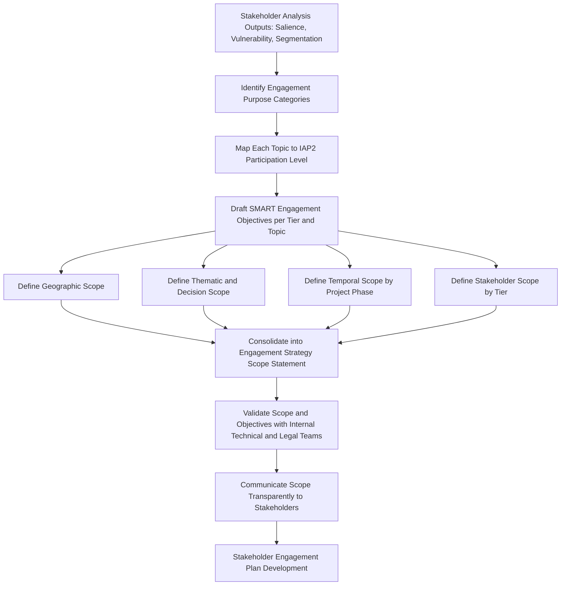

## Setting Engagement Objectives and Scope

### Overview

Setting engagement objectives and scope is the foundational planning activity in designing a Community Engagement Strategy, occurring after stakeholder identification, salience analysis, vulnerability assessment, and segmentation have been completed. This step translates the *who* of stakeholder analysis into the *why* and *what* of engagement: defining precisely what the engagement process is intended to achieve, and delimiting the boundaries of what topics, decisions, geographic areas, and time periods the engagement will address.

Poorly defined objectives and scope are among the most common root causes of engagement failure in SIA practice — producing either engagement that raises expectations it cannot fulfill (scope too broad or objectives too ambitious relative to actual decision-making authority) or engagement that fails to address stakeholders' genuine concerns (scope too narrow or objectives misaligned with stakeholder priorities).

### Defining Engagement Objectives

#### Purpose Categories

Engagement objectives typically fall into one or more of the following purpose categories, and a single engagement strategy will usually combine several:

- **Information disclosure** — ensuring stakeholders have accurate, accessible, timely information about the project, its impacts, and its decision-making processes
- **Consultation and feedback collection** — gathering stakeholder input, concerns, and local knowledge to inform project design, impact assessment, or mitigation measures
- **Collaborative decision-making / co-design** — involving stakeholders directly in shaping specific decisions (e.g., resettlement site selection, livelihood restoration program design)
- **Consent-seeking** — obtaining formal agreement, required in specific circumstances such as Free, Prior, and Informed Consent (FPIC) processes with indigenous peoples under IFC Performance Standard 7
- **Relationship-building and trust establishment** — developing durable, functional working relationships between the project proponent and affected communities that extend beyond a single consultation event
- **Grievance prevention and early warning** — surfacing emerging concerns before they escalate into formal complaints or conflict
- **Capacity building** — strengthening stakeholders' ability to meaningfully participate in engagement and monitoring processes (e.g., training community environmental monitors)

#### The IAP2 Spectrum of Public Participation

A widely used framework for calibrating engagement objectives against the actual level of stakeholder influence over outcomes is the International Association for Public Participation (IAP2) Spectrum, which distinguishes five levels:

| Level | Promise to Stakeholders | Typical SIA Application |
| --- | --- | --- |
| **Inform** | We will keep you informed | Public disclosure of ESIA findings, project updates |
| **Consult** | We will listen and acknowledge your concerns | Baseline data validation, draft mitigation measure feedback |
| **Involve** | We will work with you to ensure your concerns are reflected | Joint environmental monitoring committees |
| **Collaborate** | We will incorporate your advice into decisions to the maximum extent possible | Co-design of livelihood restoration programs |
| **Empower** | We will implement what you decide | Community-managed benefit-sharing funds, FPIC decisions |

**Key Points**

- Objectives must state, explicitly, which IAP2 level (or equivalent) applies to each engagement topic — using participatory language ("collaborate," "empower") for a topic where the proponent has already made the decision (effectively "inform" level) is a leading cause of stakeholder distrust and perceived engagement as a formality ("tick-box" consultation)
- Different topics within the same project can and should sit at different levels of the spectrum (e.g., "inform" for overall project timeline, "collaborate" for local hiring policy design, "empower" for indigenous FPIC decisions where legally or contractually required)

### Setting Objectives: SMART Criteria Applied to Engagement

Engagement objectives are strengthened when formulated using SMART criteria, adapted for the participatory and relational nature of stakeholder engagement:

- **Specific** — clearly naming the stakeholder group, topic, and desired engagement outcome (e.g., "Consult with all directly affected households on proposed resettlement site options" rather than "engage the community")
- **Measurable** — defining indicators of successful engagement (e.g., consultation attendance rates disaggregated by gender, grievance volume trends, feedback incorporation rate)
- **Achievable** — calibrated to actual decision-making authority and available resources; avoiding objectives that promise influence the proponent cannot or will not grant
- **Relevant** — aligned with identified stakeholder priorities from the stakeholder analysis phase, not solely proponent-driven communication goals
- **Time-bound** — tied to specific project milestones and decision points rather than open-ended

**Example**

| Weak Objective | SMART Objective |
| --- | --- |
| "Engage the community about the project" | "Conduct gender-disaggregated focus group discussions with all Tier 1 and Tier 2 households in the direct impact zone prior to finalization of the Resettlement Action Plan, achieving at least 80% household participation and documenting all raised concerns with a formal response within 30 days" |

### Defining Engagement Scope

#### Dimensions of Scope

Scope defines the boundaries within which engagement objectives will be pursued, typically specified across several dimensions:

1. **Geographic scope** — the physical area within which stakeholders are considered part of the engagement process (e.g., direct impact zone, indirect impact zone, downstream watershed, administrative boundaries)
2. **Thematic/topical scope** — which subject areas are open for stakeholder input (e.g., resettlement site selection is in scope; core technology/engineering design choices may be out of scope if already fixed by regulatory approval)
3. **Temporal scope** — the project phases and time period the engagement plan covers (e.g., pre-construction baseline engagement, construction-phase monitoring engagement, operations-phase long-term engagement, decommissioning engagement)
4. **Stakeholder scope** — which segmented tiers and stakeholder categories are included in a given engagement activity (cross-referencing the tiered segmentation from stakeholder analysis)
5. **Decision scope** — explicitly, which decisions are open to stakeholder influence and which have already been determined by regulatory, technical, or financial constraints

**Key Points**

- Decision scope transparency is critical: stakeholders should be told clearly which decisions are genuinely open for influence and which are fixed, to avoid the credibility damage caused by soliciting input on decisions already made
- Geographic scope for engagement should generally be broader than the formal regulatory impact assessment boundary where indirect or induced impacts (in-migration, downstream effects, cumulative impacts) are anticipated

### Mermaid Diagram: Objectives and Scope Definition Workflow

### Aligning Objectives and Scope with Regulatory Requirements

- **IFC Performance Standard 1** requires that engagement be an ongoing process "proportionate to the nature and scale of the project," which directly informs both the ambition level of objectives and the breadth of scope
- **World Bank ESS10** requires the Stakeholder Engagement Plan to specify the purpose, timing, and methods of engagement across the project lifecycle, effectively mandating explicit objective and scope-setting as a documented step
- **IFC Performance Standard 7** imposes specific consent-level (Empower-tier) objectives for engagement with indigenous peoples in defined circumstances (impacts on lands/resources subject to traditional ownership, relocation, or use of cultural heritage for commercial purposes)
- **National regulatory EIA/SIA frameworks** frequently mandate minimum scope requirements (e.g., defined public comment periods, mandatory public hearing formats) that constitute a scope floor beneath which the engagement strategy cannot fall, even if voluntary standards would permit less

[Unverified] Specific mandatory minimum scope requirements vary substantially by jurisdiction and project sector; practitioners must verify current national and local regulatory requirements applicable to the specific project location.

### Common Pitfalls

- **Objective-scope mismatch** — setting an ambitious objective (e.g., "collaborative design of mitigation measures") without a correspondingly broad decision scope (mitigation measures already finalized), creating a credibility gap
- **Scope creep without resource adjustment** — expanding geographic or stakeholder scope in response to community pressure without proportionally increasing engagement budget/staffing, resulting in diluted engagement quality across a wider stakeholder base
- **Static scope definition** — failing to revisit scope as the project evolves (e.g., project footprint changes, new impact pathways identified during construction), leaving newly affected stakeholders outside the defined engagement boundary
- **Purely proponent-driven objective setting** — defining objectives solely from the project's communication or risk-management needs rather than incorporating stakeholder-identified priorities surfaced during stakeholder analysis
- **Ambiguous decision scope communication** — failing to explicitly tell stakeholders which decisions are and are not open to their influence, leading to perceived bad faith when input is not incorporated into already-fixed decisions

**Key Points**

- Objectives and scope should be documented in writing, ideally as a distinct section of the Stakeholder Engagement Plan, and shared (in appropriate summary form) with stakeholders themselves to establish transparent mutual expectations
- Scope and objectives should be revisited at the same project milestones used for stakeholder re-segmentation (design finalization, construction commencement, major operational changes), since both stakeholder dynamics and the project's own decision-making constraints evolve over time

### From Objectives and Scope to the Engagement Strategy

Once objectives and scope are defined, they directly determine the subsequent design choices covered elsewhere in this chapter:

- **Engagement methods and channels** — selected based on the IAP2 level assigned to each objective (e.g., "inform" objectives suit broadcast channels; "collaborate" objectives require interactive workshop formats)
- **Resourcing and timeline** — derived from the temporal and stakeholder scope (broader scope and longer temporal coverage require proportionally greater budget and staffing)
- **Monitoring and evaluation indicators** — derived directly from the measurable component of each SMART objective

**Next Steps**

- Stakeholder segmentation for tiered engagement (cross-reference for stakeholder scope basis)
- IAP2 Spectrum of Public Participation and engagement level selection
- Engagement methods and channel selection design
- Stakeholder Engagement Plan (SEP) structure and content
- Free, Prior, and Informed Consent (FPIC) processes for consent-level objectives
- Engagement monitoring, evaluation, and adaptive management indicators
- Grievance redress mechanism design aligned to engagement scope