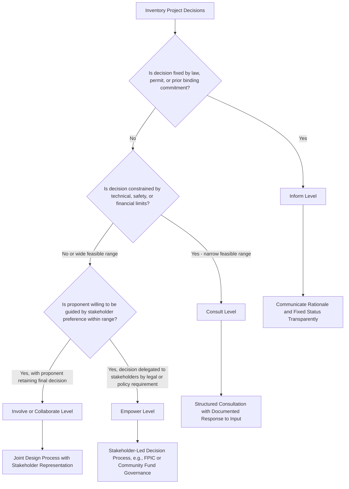

## Matching Engagement Level to Decision Context

### Overview

Matching engagement level to decision context is the practice of calibrating how much influence stakeholders are invited to exercise over a specific decision to how much influence they can actually exercise given legal, technical, financial, and organizational constraints. This is the operational discipline that prevents the objective-scope mismatch introduced in the previous topic: it provides a repeatable method for selecting the appropriate point on the IAP2 (or equivalent) participation spectrum for each individual decision within a project, rather than applying a single participation level uniformly across an entire engagement strategy.

This matching exercise sits at the interface between engagement design and project governance — it requires engagement practitioners to work closely with technical, legal, and executive decision-makers to accurately map where genuine discretion exists.

### Why Decision-by-Decision Matching Is Necessary

A single project contains many distinct decisions, each with different degrees of openness to stakeholder influence:

- Some decisions are **fixed** by regulatory approval, prior contractual commitment, engineering/safety constraints, or financial close conditions before engagement begins
- Some decisions have **bounded flexibility** — a range of technically and financially feasible options exists, and stakeholder input can influence which option is selected
- Some decisions are **substantially open** — multiple viable paths exist and the proponent has genuine willingness to be guided by stakeholder preference
- Some decisions are **stakeholder-owned** by legal or policy requirement (e.g., FPIC-triggering decisions under IFC PS7, or decisions delegated to a community-managed benefit fund)

[Inference] Applying a uniform "collaborate" or "empower" framing across all four categories — rather than identifying which category each decision actually falls into — is a primary driver of the perception that consultation is performative, because stakeholders who invest effort providing input on a "fixed" decision correctly perceive that their input had no realistic path to influence the outcome.

### Decision Classification Framework

#### Step 1: Inventory the Decisions

List the discrete decisions embedded in the project across its lifecycle that could plausibly be subject to stakeholder engagement — e.g., site layout, resettlement site selection, compensation methodology, construction scheduling, local hiring policy, benefit-sharing fund governance, environmental mitigation design, grievance mechanism design.

#### Step 2: Classify Each Decision's Actual Constraint Level

For each decision, assess:

- **Regulatory/legal constraint** — is the decision already determined by a permit condition, law, or binding prior agreement?
- **Technical/safety constraint** — does engineering, geotechnical, or safety analysis restrict the feasible option set?
- **Financial constraint** — does the project's financial structure (loan covenants, budget) restrict feasible options?
- **Organizational/governance constraint** — does the decision require sign-off from a body (e.g., board, lender, government agency) that has not delegated discretion to project-level engagement outcomes?
- **Genuine discretion remaining** — after accounting for the above, what range of options remains open, and to what extent is the proponent willing to be guided by stakeholder preference within that range?

#### Step 3: Assign the Corresponding IAP2 (or Equivalent) Level

| Constraint Assessment | Genuine Discretion | Appropriate Engagement Level | Promise to Stakeholders |
| --- | --- | --- | --- |
| Fully fixed (regulatory/technical/financial) | None | **Inform** | We will keep you informed of this decision and its rationale |
| Narrow range of feasible options | Low-moderate | **Consult** | We will listen to your concerns and explain how they were considered |
| Multiple feasible options, proponent open to being guided | Moderate-high | **Involve / Collaborate** | We will work with you to shape this decision within the feasible range |
| Legally or contractually delegated to stakeholders | Full (within legal bounds) | **Empower** | We will implement what you decide |

**Key Points**

- The classification exercise must be conducted *before* stakeholder engagement begins on that decision, and the constraint rationale should be documented and available for internal audit and, where appropriate, external stakeholder-facing explanation
- Decisions should be re-classified if constraints change (e.g., a regulatory condition is relaxed, additional budget becomes available, or a lender requires enhanced consultation as a covenant condition)

### Mermaid Diagram: Decision Classification and Engagement Level Matching

### Applying the Framework: Worked Examples

**Example**

| Decision | Constraint Analysis | Engagement Level | Rationale |
| --- | --- | --- | --- |
| Overall project location/route | Fixed by prior regulatory approval and financial close | **Inform** | No genuine discretion remains; engagement focuses on explaining rationale and implications |
| Resettlement site among 3 technically viable options | Technical/safety analysis narrows to 3 sites; proponent open to community preference among them | **Collaborate** | Genuine discretion exists within a bounded, technically vetted option set |
| Compensation calculation methodology | Constrained by national law and lender policy on replacement cost, but implementation details flexible | **Consult** | Core methodology fixed; implementation and communication approach open to input |
| Local hiring quota and skills training program design | No regulatory constraint; proponent has broad discretion and business incentive to align with community needs | **Collaborate** | Wide genuine discretion; direct co-design maximizes both social and business outcomes |
| Use of communal forest resources by indigenous community under IFC PS7 trigger conditions | Legally required Free, Prior, and Informed Consent | **Empower** | Regulatory/standard requirement transfers decision authority to the affected indigenous peoples |
| Community development fund allocation among locally identified priorities | Fund governance charter delegates allocation decisions to a community committee | **Empower** | Decision-making authority formally delegated by design |

### Communicating Decision Scope Transparently

Because stakeholders cannot judge whether their engagement experience matches reality unless they understand what level of influence was promised, transparent communication of the decision's classification is itself part of good engagement practice:

- State explicitly, in plain language, whether a given topic is open for influence, and if so, within what bounded range
- Where a decision is at "Inform" level, explain *why* (the specific regulatory, technical, or financial constraint), rather than presenting it as if it were open when it is not
- Where a decision is at "Consult" or higher, commit to and deliver a documented response explaining how stakeholder input was or was not incorporated, and why

**Key Points**

- Failure to explain *why* a decision is fixed (as opposed to simply announcing that it is fixed) is a common source of stakeholder distrust, since an unexplained fixed decision is difficult to distinguish from an arbitrary or bad-faith one
- A documented "what we heard, what we did" response loop is considered good practice at Consult level and above, closing the feedback loop that distinguishes genuine consultation from passive information collection

### Special Case: Consent-Level Engagement (FPIC and Equivalent)

Certain decisions trigger a mandatory "Empower"-equivalent engagement level under specific safeguard standards, most notably:

- **Free, Prior, and Informed Consent (FPIC)** under IFC Performance Standard 7, required in defined circumstances involving impacts on lands and natural resources subject to traditional ownership or customary use, relocation of indigenous peoples from ancestral lands, or significant impacts on critical cultural heritage
- **Free, Prior, and Informed Consultation resulting in broad community support (FPIC-lite)** — a related but distinct standard applied in some contexts, requiring evidence of broad community support without a strict consent/veto mechanism

[Unverified] The precise triggering conditions, procedural requirements, and terminology for FPIC vary across specific lender/regulatory frameworks (IFC PS7, World Bank ESS7, national indigenous rights legislation) and are subject to periodic revision; practitioners must verify the exact applicable standard and its current requirements for the specific project jurisdiction and financing structure.

[Inference] Because consent-level decisions carry veto implications, the decision classification step for potential FPIC triggers should generally involve legal and indigenous rights specialist input early in project planning, rather than being determined solely by the engagement team.

### Common Pitfalls

- **Consultation theater** — presenting fixed decisions using collaborative or empowering language, creating a mismatch between the promised and actual level of stakeholder influence
- **Under-classification of genuine discretion** — internal teams sometimes default to conservative "Inform" or "Consult" framing even where genuine discretion exists, out of risk-aversion or unfamiliarity with participatory design, thereby forgoing the social and business benefits of higher-engagement approaches
- **Failure to distinguish decision types within a single engagement event** — running a single consultation meeting that blends fixed, constrained, and open decisions without clearly signaling which is which, leaving stakeholders unable to calibrate where to focus their input
- **Static classification** — treating a decision's constraint status as permanent when project conditions (regulatory approvals, budget, lender requirements) evolve, missing opportunities to expand genuine discretion as constraints loosen
- **Omitting the "why"** — announcing a fixed decision without explaining the underlying constraint, which stakeholders may reasonably interpret as an excuse rather than a genuine limitation

### Integration with the Broader Engagement Strategy

This decision-by-decision matching exercise operationalizes the objectives and scope defined in the prior planning step, and directly informs downstream engagement strategy design:

- **Method and channel selection** should differ by engagement level — Inform-level decisions suit broadcast/disclosure channels, while Collaborate/Empower-level decisions require interactive, iterative workshop or committee-based formats
- **Resourcing** should be weighted toward decisions with higher assigned engagement levels, since Collaborate and Empower-level processes are inherently more staff- and time-intensive than Inform-level disclosure
- **Monitoring and evaluation** should track, for each decision, whether the delivered engagement level matched the classified/promised level — a key indicator of engagement strategy integrity

**Next Steps**

- Setting engagement objectives and scope (cross-reference for upstream planning input)
- IAP2 Spectrum of Public Participation, engagement method and channel selection
- Free, Prior, and Informed Consent (FPIC) processes and triggering criteria
- Stakeholder Engagement Plan (SEP) structure and content
- Engagement monitoring, evaluation, and "what we heard, what we did" feedback loop design
- Grievance redress mechanism design for decisions perceived as inadequately consulted
- Community development fund and benefit-sharing governance design