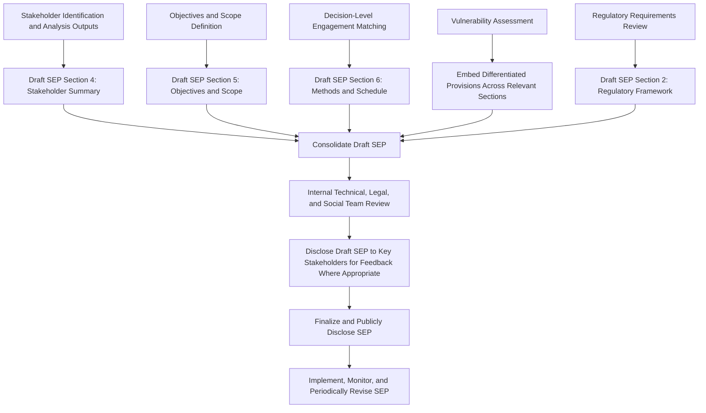

## Drafting a Stakeholder Engagement Plan

### Overview

Drafting a Stakeholder Engagement Plan (SEP) is the culminating documentation step in designing a Community Engagement Strategy, consolidating stakeholder identification, salience/vulnerability analysis, tiered segmentation, objectives and scope, and decision-level engagement matching into a single, structured, actionable document. The SEP serves as both an internal operational guide for project teams and, in most safeguard frameworks, a disclosable document that stakeholders and regulators can use to hold the proponent accountable to its stated commitments.

A well-drafted SEP is not a static compliance artifact but a living management tool, subject to periodic revision as the project progresses and stakeholder dynamics evolve.

### Purpose and Function of the SEP

- **Operational guide** — provides project teams with a concrete schedule, methods, and responsibilities for engagement activities across the project lifecycle
- **Accountability instrument** — creates a documented, disclosable commitment against which stakeholders, lenders, and regulators can assess whether engagement is actually occurring as promised
- **Risk management tool** — systematizes early identification and response to stakeholder concerns, reducing the likelihood of grievance escalation or project delay from unaddressed social risk
- **Regulatory/lender compliance requirement** — required under most major safeguard frameworks (IFC Performance Standard 1, World Bank ESS10, Equator Principles) as a condition of project approval or financing

### Standard SEP Structure

While specific formats vary by proponent, sector, and jurisdiction, a comprehensive SEP typically contains the following sections, each drawing directly on outputs from earlier stages of stakeholder analysis and engagement strategy design:

#### 1. Project Description and Context

Brief summary of the project, its location, phases, and key characteristics relevant to understanding engagement needs — sufficient for a stakeholder or reviewer to understand engagement scope without needing to consult the full ESIA.

#### 2. Regulatory and Policy Framework

Identification of applicable national regulatory requirements and international lender/standard requirements (IFC PS1, World Bank ESS10, Equator Principles, national EIA law) governing the engagement process, establishing the compliance floor the SEP must meet.

#### 3. Summary of Previous Engagement Activities

Where engagement has already occurred (e.g., during early project scoping or ESIA baseline data collection), a summary of activities conducted, methods used, and key findings/concerns raised to date.

#### 4. Stakeholder Identification and Analysis Summary

A summary (not the full underlying analysis) of:

- Stakeholder categories and key groups identified
- Salience classification highlights (particularly definitive and dependent/dangerous stakeholders)
- Identified vulnerable and marginalized groups requiring differentiated engagement
- Tiered segmentation structure

#### 5. Engagement Objectives and Scope

Drawing directly from the objectives-and-scope-setting step: stated purpose categories, SMART objectives per stakeholder tier/topic, and geographic, thematic, temporal, and decision scope boundaries.

#### 6. Engagement Methods and Schedule by Tier and Phase

The operational core of the SEP: a structured schedule specifying, for each stakeholder tier and project phase, the engagement method, frequency, responsible party, and target completion or recurrence dates.

**Example**

| Stakeholder Tier | Project Phase | Method | Frequency | Responsible Party | Target Timing |
| --- | --- | --- | --- | --- | --- |
| Tier 1 (directly/severely affected households) | Pre-construction | Individual household consultations | Monthly | Community Liaison Officer | Months 1–12 |
| Tier 1 | Construction | Grievance-linked check-ins plus monthly group meetings | Monthly | Community Liaison Officer | Throughout construction |
| Tier 2 (moderately affected communities) | Pre-construction | Gender-disaggregated focus group discussions | Quarterly | Social Team Lead | Months 1–12 |
| Tier 3 (indirectly affected downstream users) | All phases | Technical briefings, public notices | Semi-annual | Environmental & Social Manager | Ongoing |
| Tier 4 (national NGOs, media) | All phases | Public document disclosure, responsive inquiry handling | On-demand | Communications Officer | Ongoing |

#### 7. Disclosure of Information

Specification of what documents will be disclosed (ESIA reports, non-technical summaries, monitoring reports), in what languages and formats (including accessible formats for low-literacy or disability considerations), and through what channels (physical notice boards, website, community meetings).

#### 8. Consultation Procedures for Ongoing Project Phases

Detail on how engagement continues through construction, operations, and (where applicable) decommissioning — since SEP requirements under most standards are not limited to the pre-approval phase.

#### 9. Grievance Redress Mechanism (GRM)

Description of the mechanism through which stakeholders can raise concerns or complaints, including intake channels, response timelines, escalation procedures, and specific accessible provisions for vulnerable groups. [Note: GRM design is typically covered in depth as its own dedicated topic; the SEP summarizes and cross-references it.]

#### 10. Resources and Responsibilities

Identification of staffing (e.g., community liaison officers, social performance team), budget allocation, and organizational structure supporting SEP implementation.

#### 11. Monitoring, Reporting, and Adaptive Management

Indicators for tracking engagement effectiveness (e.g., consultation attendance disaggregated by gender/vulnerability status, grievance volume and resolution time, feedback incorporation rate), reporting frequency and audience, and a stated process for revising the SEP based on monitoring findings.

**Key Points**

- The SEP should explicitly cross-reference, rather than duplicate, more detailed underlying documents (full stakeholder analysis, GRM procedure manual, Resettlement Action Plan) to remain a usable, navigable operational document
- A SEP that only covers the pre-construction consultation period is generally considered non-compliant with most current safeguard standards, which require engagement planning across the full project lifecycle

### Mermaid Diagram: SEP Drafting Workflow

### Drafting Considerations and Best Practices

- **Plain-language accessibility** — the publicly disclosed version of the SEP should be written in accessible, non-technical language and translated into locally relevant languages, since it is itself a stakeholder-facing accountability document, not solely an internal planning tool
- **Realistic scheduling** — engagement schedules should reflect actual staffing and budget capacity; an overambitious schedule that is not met undermines the credibility established by the SEP itself
- **Explicit vulnerable group provisions** — rather than a generic statement that "vulnerable groups will be considered," the SEP should specify concrete differentiated methods (e.g., separate women-only focus groups facilitated by female staff, accessible meeting venues, translated materials in minority languages)
- **Living document framing** — the SEP should explicitly state that it will be reviewed and updated at defined intervals or milestones (e.g., annually, or at major project phase transitions), rather than presented as a fixed, one-time document
- **Alignment with decision-level engagement matching** — the methods and schedule section should reflect the IAP2-equivalent level assigned to each decision (Inform-level topics receive disclosure-oriented methods; Collaborate/Empower-level topics receive interactive, iterative methods), maintaining consistency with the prior planning step

### Regulatory and Standards Requirements

- **IFC Performance Standard 1** requires clients to develop and implement a SEP "scaled to the project risks and impacts" as part of the broader Environmental and Social Management System, disclosed to affected communities
- **World Bank Environmental and Social Standard 10 (ESS10)** explicitly requires borrowers to prepare and disclose a Stakeholder Engagement Plan early in project preparation, describing the timing and methods of engagement throughout the project lifecycle, and to update it as necessary
- **Equator Principles** require financial institutions to confirm that borrowers for higher-risk (Category A and, in some cases, Category B) projects have developed and implemented an SEP consistent with IFC/World Bank requirements as a condition of project finance
- **National EIA/SIA regulatory frameworks** frequently impose additional mandatory minimum requirements (e.g., mandated public hearing formats, minimum comment periods) that the SEP must incorporate as a compliance floor

[Unverified] Specific SEP content requirements, disclosure timing rules, and update triggers vary across these frameworks and are subject to periodic revision; practitioners should verify current requirements against the latest published version of the applicable standard for the specific project's financing and regulatory context.

### Common Pitfalls

- **Generic, non-project-specific drafting** — using a boilerplate SEP template without substantively tailoring stakeholder categories, methods, and schedules to the actual stakeholder analysis findings for the specific project
- **Disconnection from decision-level constraints** — promising engagement levels (Collaborate/Empower) in the SEP language without the underlying decision classification actually supporting that level of stakeholder influence
- **Treating disclosure as a one-time event** — finalizing and disclosing the SEP once without a stated mechanism or schedule for revision, despite most standards requiring the SEP to be a living document
- **Under-specifying vulnerable group provisions** — including only a general statement of intent rather than concrete, resourced, differentiated methods
- **Omitting resourcing detail** — failing to specify staffing and budget allocation, which undermines the credibility of the proposed engagement schedule and complicates internal accountability for implementation

**Key Points**

- The SEP should be reviewed by legal, technical, and social/community relations teams jointly prior to finalization, since it makes commitments that span regulatory compliance, technical decision constraints, and community relations practice
- Where feasible, sharing a draft SEP with key Tier 1/Tier 2 stakeholders for feedback prior to finalization (a "Consult" or higher-level process applied to the SEP itself) strengthens both the document's practical relevance and stakeholder buy-in to the engagement process it describes

### From SEP to Implementation

The finalized SEP becomes the operational reference document for:

- **Community liaison officers and social performance teams** executing the day-to-day engagement schedule
- **Grievance mechanism operators** cross-referencing SEP-committed engagement channels and timelines
- **Internal and external auditors/lenders** assessing compliance with disclosed engagement commitments
- **Periodic SIA monitoring and adaptive management processes** that revise the SEP based on observed engagement effectiveness and evolving stakeholder/project conditions

**Next Steps**

- Setting engagement objectives and scope (cross-reference for SEP Section 5 input)
- Matching engagement level to decision context (cross-reference for SEP Section 6 method design)
- Grievance redress mechanism design and integration into the SEP
- Engagement monitoring, evaluation, and adaptive management indicator design
- Free, Prior, and Informed Consent (FPIC) process documentation within the SEP
- Resettlement Action Plan (RAP) cross-referencing and alignment with SEP commitments
- Community development fund and benefit-sharing governance documentation