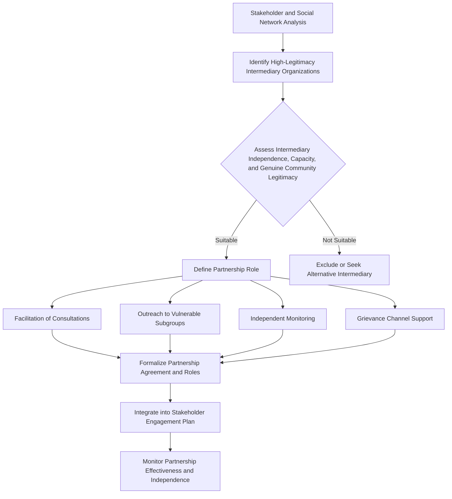

## Partnering with Civil Society Organizations and Intermediaries

### Overview

Partnering with civil society organizations (CSOs) and intermediaries is an engagement design approach in which project proponents work through established third-party organizations — NGOs, community-based organizations (CBOs), faith-based organizations, academic institutions, trade unions, and professional associations — to reach, communicate with, and build trust with stakeholder communities, rather than relying exclusively on direct proponent-to-stakeholder engagement.

This approach addresses a structural challenge identified in earlier stakeholder analysis stages: project proponents often lack pre-existing trust, cultural fluency, or logistical reach within affected communities, particularly among vulnerable or marginalized groups, whereas CSOs and intermediaries frequently possess exactly these assets by virtue of established, ongoing relationships that predate the project.

### Rationale for CSO and Intermediary Partnerships

- **Trust deficit bridging** — communities may view a project proponent as an outside, self-interested actor, while long-established local NGOs or community organizations carry accumulated social trust that a proponent cannot quickly replicate
- **Access to hard-to-reach or vulnerable groups** — intermediaries often have existing relationships with groups identified in the vulnerability assessment (women's groups, disability organizations, indigenous councils, informal settler associations) that the proponent's direct engagement channels may not reach
- **Local and technical knowledge** — CSOs frequently hold deep contextual knowledge of local social structures, customary institutions, and historical grievances relevant to accurately interpreting stakeholder concerns
- **Capacity augmentation** — intermediaries can extend the practical reach of a proponent's engagement team, particularly for geographically dispersed or large-scale stakeholder populations
- **Independent verification and credibility** — CSO involvement (particularly in monitoring or facilitation roles) can lend independent credibility to engagement processes, addressing stakeholder skepticism about proponent-controlled consultation

[Inference] The specific value proposition of any given CSO partnership depends heavily on whether the organization holds genuine community legitimacy (in the Suchman/Mitchell-Agle-Wood sense) versus purely external/donor-driven legitimacy, so CSO selection itself requires a legitimacy assessment analogous to that applied to direct stakeholders.

### Categories of Civil Society Organizations and Intermediaries

- **International NGOs (INGOs)** — often bring technical expertise, safeguard familiarity, and credibility with international lenders, but may lack deep local-context trust or long-term local presence
- **National and local NGOs** — often possess stronger grounded local relationships and contextual knowledge, though capacity and resourcing vary substantially
- **Community-based organizations (CBOs)** — locally rooted, member-based organizations (e.g., water user associations, farmer cooperatives, women's savings groups) with direct accountability to their membership
- **Faith-based organizations** — can hold significant moral legitimacy and reach in many social contexts, particularly for engaging with elderly, low-literacy, or socially conservative populations
- **Academic and research institutions** — can contribute independent technical assessment, particularly for environmental or public health-related concerns, lending analytical credibility
- **Trade unions and professional associations** — relevant intermediaries for labor-related engagement topics (working conditions, local employment policy)
- **Traditional and customary institutions** — councils of elders, customary land authorities, or traditional leadership structures that may hold legitimacy independent of formal government recognition
- **Media organizations** — while not conventional "partners" in the same sense, local media can function as an information intermediary, and proactive engagement with credible local media can shape how project information reaches broader stakeholder populations

**Key Points**

- Different intermediary types are suited to different segmentation tiers and vulnerability categories identified in earlier stakeholder analysis; a single "CSO partnership" strategy rarely suffices across a diverse stakeholder landscape
- Intermediary selection should be explicitly informed by the social network mapping exercise, identifying which organizations occupy genuine brokerage or high-legitimacy positions within the actual stakeholder network, rather than defaulting to the most visible or internationally recognized organization

### Roles CSOs and Intermediaries Can Play

1. **Facilitation** — convening and facilitating consultation meetings, focus group discussions, or community workshops, leveraging existing trust and local facilitation skill
2. **Communication and translation** — translating project information into locally appropriate language, format, and cultural framing
3. **Outreach to specific vulnerable subgroups** — e.g., a women's rights organization co-facilitating gender-disaggregated consultations, a disability rights organization ensuring accessible participation
4. **Independent monitoring** — serving on or facilitating independent environmental/social monitoring committees, lending credibility to monitoring findings
5. **Grievance mechanism support** — operating as an alternative or supplementary grievance intake channel for stakeholders who distrust direct proponent-operated channels
6. **Capacity building** — training community members in participatory monitoring, negotiation skills, or organizational capacity to engage effectively with the project
7. **Technical review and advisory input** — providing independent technical perspective on impact assessment findings or mitigation measure design

### Mermaid Diagram: CSO/Intermediary Integration into the Engagement Strategy

### Due Diligence in Selecting Partners

Before formalizing a CSO or intermediary partnership, SIA good practice requires structured due diligence covering:

- **Legitimacy verification** — evidence of genuine community mandate or recognition (membership base, historical track record, community-reported trust), distinct from organizational self-representation
- **Independence assessment** — evaluating whether the organization has pre-existing political, financial, or personal affiliations (including with the proponent itself) that could compromise its perceived neutrality or actual objectivity
- **Capacity assessment** — organizational capacity to deliver the specific role envisioned (facilitation skill, logistical reach, financial management capacity if funding is involved)
- **Track record and reputation** — prior engagement history with similar projects, including any documented conflicts of interest or controversies
- **Representativeness limitations** — explicit acknowledgment that no single CSO, however legitimate, represents the entirety of a diverse stakeholder population; a CSO partnership should supplement, not replace, direct engagement with the broader stakeholder universe

**Example**

A mining project seeking to engage a geographically dispersed indigenous population partners with a well-established regional indigenous rights NGO for FPIC process facilitation, while separately maintaining direct engagement channels with individual community councils to avoid over-reliance on a single intermediary's interpretation of community preferences, and cross-validates the NGO's positions against independent household-level consultation findings.

### Risks and Limitations of Intermediary-Based Engagement

- **Elite or organizational capture** — a partner CSO may itself have limited internal accountability to the broader community it claims to represent, risking substitution of the CSO's institutional interests for genuine community voice
- **Diminished direct relationship** — over-reliance on intermediaries can prevent the proponent from developing its own direct relationships and understanding of stakeholder concerns, creating long-term dependency and vulnerability if the intermediary relationship changes
- **Perceived co-optation** — communities or other stakeholders may perceive a CSO that partners closely (especially if compensated) with the proponent as having compromised its independence, undermining the very trust-bridging function the partnership was intended to provide
- **Uneven CSO landscape** — in some contexts, particularly fragile or authoritarian settings, independent, genuinely representative civil society organizations may be scarce, restricted, or co-opted by political actors, limiting the viability of this approach [Inference]
- **Accountability and grievance handling gaps** — if a CSO-operated engagement or grievance channel breaks down or the partnership ends, stakeholders may lose an established channel without a clear transition plan

**Key Points**

- Partnership agreements should explicitly preserve the CSO's independence and avoid contractual terms that create a perception (or reality) of the CSO acting as an extension of the proponent's communications function
- Financial support to a partner CSO, where provided, should be transparently disclosed to stakeholders to preserve perceived independence and avoid undermining the CSO's credibility
- Direct proponent engagement channels (covered in stakeholder segmentation and SEP design) should be maintained in parallel with intermediary partnerships, not replaced by them, particularly for Tier 1 (priority) stakeholders

### Regulatory and Standards Context

- **IFC Performance Standard 1** recognizes the use of "collaborative approaches" and third-party facilitation as a legitimate engagement method, particularly where local capacity or trust constraints exist, while retaining the proponent's ultimate responsibility for ensuring adequate stakeholder engagement occurs
- **World Bank ESS10** similarly permits the use of intermediaries in stakeholder engagement while requiring the borrower to ensure the overall engagement process meets the standard's substantive requirements regardless of intermediary involvement
- **IFC Performance Standard 7 (Indigenous Peoples)** frequently involves indigenous representative organizations as key intermediaries in FPIC processes, given the standard's emphasis on engaging through indigenous peoples' own representative institutions

[Unverified] Specific procedural requirements or expectations regarding intermediary use vary across these frameworks and may be updated in current guidance notes; practitioners should verify against the latest published version applicable to the project's financing structure.

### Common Pitfalls

- **Substituting intermediary engagement for direct engagement with priority (Tier 1) stakeholders**, particularly for decisions with severe direct impact where direct relationship-building is essential
- **Failing to verify actual community legitimacy** of a partner organization, instead selecting based on visibility, English-language capacity, or ease of proponent communication
- **Non-transparent financial relationships** with partner CSOs that, if later disclosed, undermine both the CSO's and the proponent's credibility
- **Treating a single CSO partnership as sufficient representation** of a diverse or internally heterogeneous stakeholder population
- **Neglecting exit/transition planning** for what happens to engagement continuity if a CSO partnership ends or an intermediary organization's capacity or standing changes

### Integration with the Stakeholder Engagement Plan

CSO and intermediary partnerships, once selected and due-diligenced, should be explicitly documented within the SEP's methods and schedule section, specifying:

- The specific role(s) each partner organization performs
- Which stakeholder tier(s) and topics the partnership addresses
- How partnership independence and effectiveness will be monitored
- The relationship between intermediary-facilitated engagement and direct proponent engagement channels

**Next Steps**

- Stakeholder segmentation for tiered engagement (cross-reference for partner-role alignment)
- Social network and relationship mapping (cross-reference for intermediary legitimacy assessment)
- Identifying vulnerable and marginalized groups (cross-reference for targeted outreach partnerships)
- Free, Prior, and Informed Consent (FPIC) processes involving indigenous representative institutions
- Grievance redress mechanism design incorporating third-party channels
- Drafting a stakeholder engagement plan (cross-reference for documenting partnership roles)
- Due diligence frameworks for civil society partner selection