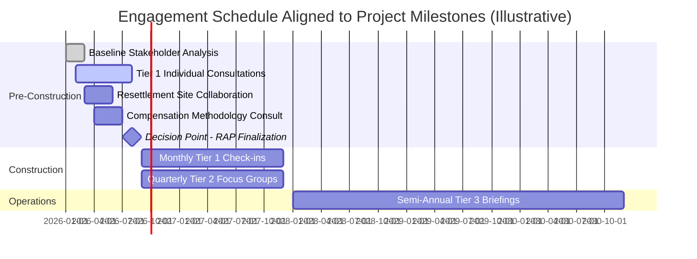

## Scheduling, Staffing, and Budgeting for Engagement

### Overview

Scheduling, staffing, and budgeting for engagement is the resourcing discipline that converts the design decisions made in preceding steps — objectives and scope, decision-level engagement matching, tiered segmentation, and CSO/intermediary partnerships — into a concrete, fundable, executable operational plan. Without this step, even a well-designed engagement strategy remains aspirational: it is the point at which engagement commitments are tested against actual organizational capacity, timeline realism, and financial resourcing.

This step is frequently under-invested in SIA practice relative to the analytical and design stages, yet inadequate resourcing is one of the most common practical reasons why otherwise well-designed engagement strategies fail to deliver as promised in the Stakeholder Engagement Plan.

### Scheduling Engagement Activities

#### Aligning Schedule to Project Lifecycle and Decision Points

Engagement scheduling should be driven by two converging factors:

- **Project decision milestones** — engagement on a given topic must occur with sufficient lead time before the corresponding decision is finalized, since engagement conducted after a decision is effectively "Inform" level regardless of the promised level
- **Stakeholder availability and rhythms** — agricultural seasons, religious observances, school calendars, and local governance cycles (e.g., village council meeting schedules) that determine when stakeholders can meaningfully participate

#### Sequencing Considerations

- **Early engagement lead time** — particularly for higher-influence engagement levels (Collaborate, Empower), sufficient lead time must be built in for iterative dialogue, feedback incorporation, and, where applicable, external verification (e.g., FPIC processes, which by definition require adequate time for community-internal deliberation before consent can be considered genuinely free and informed)
- **Buffer for iteration** — engagement schedules should not assume a single-pass consultation event is sufficient for Collaborate/Empower-level decisions; realistic scheduling includes rounds of feedback, response, and revised proposal presentation
- **Phase transitions** — construction-phase and operations-phase engagement needs differ substantially from pre-construction baseline and consultation activities, requiring distinct scheduling logic for each phase (as reflected in the SEP's methods-and-schedule section)
- **Grievance-responsive flexibility** — while core scheduled engagement activities should be predictable and reliable, the schedule must retain capacity for ad hoc, responsive engagement triggered by emerging grievances or unexpected project changes

**Key Points**

- A schedule that only specifies pre-construction consultation dates, without an operations-phase or construction-phase engagement cadence, does not meet current lender/regulatory expectations for lifecycle-spanning engagement
- Scheduling around stakeholder availability (rather than purely proponent convenience) is itself a signal of engagement good faith and materially affects actual participation rates, particularly for Tier 1 and vulnerable stakeholders with time constraints (agricultural labor, caregiving responsibilities)

### Mermaid Diagram: Engagement Schedule Alignment to Decision and Project Timeline

### Staffing for Engagement

#### Core Staffing Roles

- **Social performance / community relations manager** — overall accountability for SEP implementation, internal coordination, and reporting
- **Community liaison officers (CLOs)** — front-line staff maintaining regular, individualized contact with Tier 1 stakeholders; ideally locally recruited for language fluency and pre-existing community trust
- **Grievance mechanism officer(s)** — dedicated staff managing grievance intake, tracking, and resolution coordination (may overlap with CLO roles in smaller projects)
- **Gender and social inclusion specialist** — particularly important where differentiated engagement with women, vulnerable groups, or indigenous peoples is required, ensuring engagement design and delivery account for identified vulnerability factors
- **Translation and interpretation staff** — for multilingual stakeholder populations, both for written materials and live interpretation during consultation events
- **Monitoring and evaluation staff** — tracking engagement indicators (attendance, feedback incorporation, grievance trends) feeding into adaptive management
- **External facilitators or CSO partners** — as covered in the prior topic, supplementing internal staff capacity for specific roles or hard-to-reach subgroups

#### Staffing Ratios and Capacity Planning

[Inference] There is no universally standardized staffing ratio (e.g., CLOs per affected household) applicable across all project types, since appropriate staffing intensity depends on project scale, geographic dispersion, stakeholder tier composition, and the complexity of engagement topics (e.g., resettlement-heavy projects generally require substantially higher CLO-to-household ratios than projects with primarily indirect impacts). Staffing plans should be derived from the specific tiered segmentation and engagement schedule developed for the project rather than applying a generic industry benchmark uncritically.

**Key Points**

- Locally recruited staff (particularly CLOs) bring language and cultural fluency and pre-existing community relationships, but require careful selection and role definition to avoid perceived favoritism or conflicts of interest if recruited from within the affected community itself
- Staffing plans should build in continuity provisions (e.g., documentation, handover protocols) to prevent engagement relationship loss when individual staff turnover occurs, which is a recognized risk given the relationship-dependent nature of community liaison roles

### Budgeting for Engagement

#### Cost Categories

- **Personnel costs** — salaries, benefits, and training for social performance, CLO, grievance, gender/inclusion, and monitoring staff
- **Logistics and venue costs** — transportation (particularly relevant for dispersed rural stakeholder populations), venue rental or setup for consultation events, accessibility accommodations
- **Translation and communication materials** — professional translation services, printed materials, accessible-format materials (audio, pictorial, large-print), radio or other broadcast media costs
- **CSO/intermediary partnership costs** — where partnerships involve compensation, formal contracting, or capacity-building support
- **Grievance mechanism operating costs** — intake channel maintenance (hotline, physical drop-box network, digital platform), investigation and resolution process costs
- **Monitoring and evaluation costs** — data collection, analysis, and reporting on engagement indicators
- **Contingency/responsive engagement reserve** — an unallocated reserve for ad hoc engagement needs arising from unanticipated grievances or emerging issues, distinct from the scheduled core budget

#### Budgeting Principles

- **Tier-proportional allocation** — budget allocation should track the tiered segmentation structure, ensuring Tier 1 (priority) stakeholders receive proportionally greater resourcing per capita than Tier 3/4 stakeholders, consistent with the segmentation rationale
- **Full lifecycle budgeting** — engagement budget should be planned and committed (not merely aspirational) across pre-construction, construction, and operations phases, since operations-phase engagement is frequently under-budgeted relative to the intensive pre-construction consultation period
- **Linkage to decision-level engagement matching** — Collaborate/Empower-level decisions require materially higher per-decision engagement budget (iterative dialogue, potential external facilitation, translation, extended timelines) than Inform-level decisions, and budgeting should reflect this rather than applying flat per-meeting cost assumptions across all engagement levels

**Example**

| Budget Category | Pre-Construction | Construction | Operations |
| --- | --- | --- | --- |
| CLO staffing (Tier 1) | High — intensive relationship-building phase | High — sustained monthly contact | Moderate — reduced but ongoing contact |
| Focus group / workshop logistics (Tier 2) | Moderate | Moderate | Low — reduced frequency |
| Translation and materials | High — baseline disclosure materials | Moderate — updates | Low — periodic reporting |
| Grievance mechanism operations | Moderate — setup and initial operation | High — peak grievance volume typically during construction | Moderate — ongoing operation |
| CSO/intermediary partnerships | High — trust-building phase | Moderate | Low-moderate — as needed |
| Monitoring and evaluation | Low — baseline setup | Moderate | Moderate — ongoing tracking |

[Inference] Grievance volume commonly peaks during the construction phase due to the concentration of direct physical, environmental, and social disruption during this period, which has budgeting implications for grievance mechanism staffing and responsiveness capacity during that phase specifically; however, actual grievance patterns vary by project type and should be validated against project-specific risk assessment rather than assumed.

### Common Pitfalls

- **Front-loaded budgeting** — allocating the bulk of engagement budget to the pre-construction/ESIA phase and under-resourcing construction and operations-phase engagement, despite regulatory expectations for lifecycle-spanning commitment
- **Flat per-activity budgeting** — applying uniform cost assumptions across all engagement tiers and levels rather than reflecting the genuinely higher resource intensity of Tier 1 and Collaborate/Empower-level engagement
- **No contingency reserve** — budgeting only for scheduled activities, leaving no flexibility to respond to emerging grievances, unexpected stakeholder concerns, or project design changes requiring additional consultation
- **Understaffing relative to schedule commitments** — committing to an engagement schedule and cadence in the SEP without correspondingly adequate staffing capacity to deliver it, resulting in missed or diluted engagement activities
- **Treating engagement budget as purely a compliance cost** rather than a risk-management investment, leading to systematic under-prioritization relative to technical/engineering budget lines during project cost pressures

**Key Points**

- Engagement budget and staffing commitments made in the SEP should be realistic and achievable, since a credible but modest schedule reliably delivered is preferable to an ambitious schedule that is not met
- Budget and staffing plans should be revisited at the same project milestones used for stakeholder re-segmentation and SEP revision, since engagement needs (and associated costs) evolve as the project progresses and stakeholder/grievance dynamics change

### Regulatory and Standards Considerations

- **IFC Performance Standard 1** requires that engagement resourcing be proportionate to the project's identified risks and impacts, implicitly requiring budget and staffing scaled to the outputs of stakeholder analysis and segmentation rather than a generic minimum
- **World Bank ESS10** requires borrowers to identify the resources needed to implement stakeholder engagement activities as part of the SEP, making explicit budgeting and staffing documentation an expected component of SEP disclosure
- **Lender due diligence and monitoring** — international financial institutions applying Equator Principles or similar frameworks frequently review actual engagement resourcing during supervision visits, comparing committed SEP schedules against demonstrated staffing and budget allocation

[Unverified] Specific documentation or disclosure requirements regarding engagement budget line items vary across lenders and are not uniformly standardized in publicly available guidance; practitioners should confirm specific lender expectations directly where project financing involves multiple institutions with potentially differing requirements.

### Integration with the Stakeholder Engagement Plan

Scheduling, staffing, and budgeting outputs are documented directly within the SEP's "Resources and Responsibilities" and "Methods and Schedule" sections, and should be internally consistent with:

- The tiered segmentation structure (resourcing intensity matches tier priority)
- The decision-level engagement matching (higher-influence decisions receive proportionally greater resourcing)
- The full project lifecycle scope (pre-construction, construction, operations, decommissioning where relevant)

**Next Steps**

- Drafting a stakeholder engagement plan (cross-reference for resourcing documentation)
- Matching engagement level to decision context (cross-reference for budget allocation logic)
- Partnering with civil society organizations and intermediaries (cross-reference for partnership cost planning)
- Grievance redress mechanism design and staffing requirements
- Engagement monitoring, evaluation, and adaptive management indicator design
- Community liaison officer recruitment, training, and role definition
- Adaptive management and SEP revision triggers across the project lifecycle