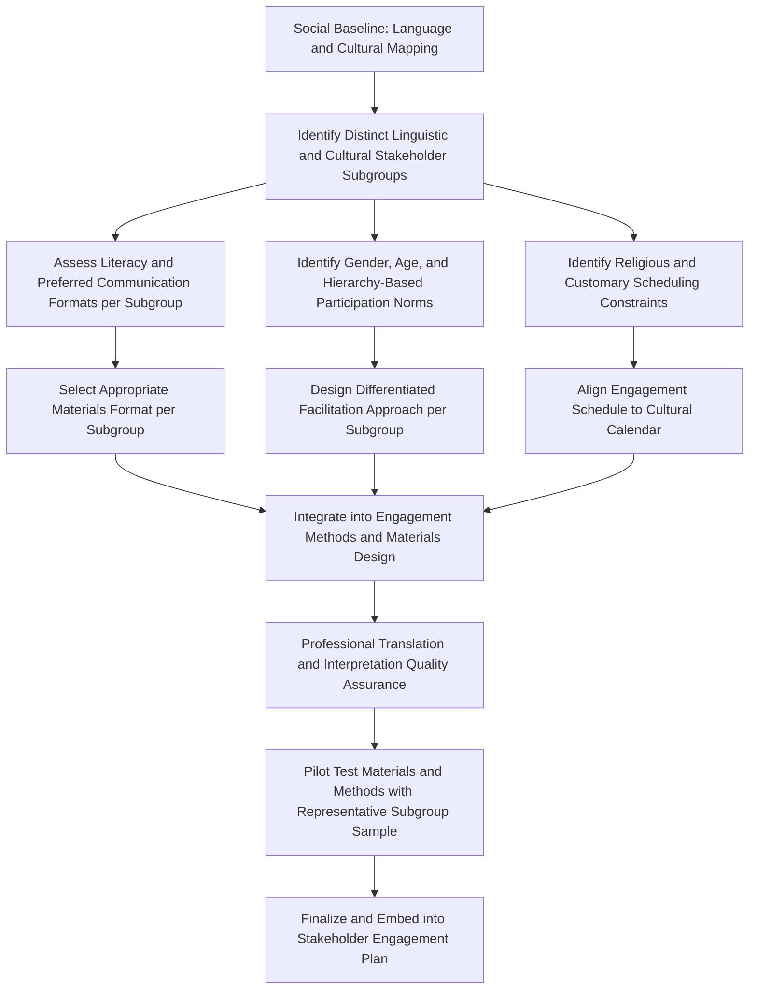

## Culturally and Linguistically Appropriate Planning

### Overview

Culturally and linguistically appropriate planning is the practice of designing every element of a Community Engagement Strategy — objectives, methods, materials, scheduling, and facilitation — to align with the cultural norms, communication practices, and language needs of the specific stakeholder population, rather than applying a generic engagement template across diverse contexts. This is a cross-cutting design principle that applies to and reinforces every other element of the engagement strategy covered in this chapter: objectives and scope, decision-level matching, the SEP, CSO partnerships, and resourcing.

Failure to plan for cultural and linguistic appropriateness is a well-documented driver of engagement failure in SIA practice — not because engagement did not occur, but because it occurred in a form inaccessible, incomprehensible, or culturally inappropriate to the intended stakeholders, rendering it functionally equivalent to no engagement at all for the excluded population.

### Core Dimensions of Cultural and Linguistic Appropriateness

#### 1. Language Access

- **Primary language identification** — mapping the actual language(s) spoken by stakeholder populations, which may differ from the official national or administrative language, including minority, indigenous, or regional languages
- **Literacy considerations** — assessing literacy rates within stakeholder populations to determine whether written materials are an appropriate primary communication method, or whether oral, pictorial, or audio-visual formats are required
- **Professional translation and interpretation** — using qualified translators and interpreters rather than informal or ad hoc translation (e.g., a project staff member with partial language fluency), particularly for legally significant documents (consent forms, compensation agreements) where translation accuracy has material consequences
- **Dialect and register sensitivity** — awareness that a single named language may have significant dialect variation, and that formal/technical register translations may be incomprehensible to populations more familiar with colloquial register

#### 2. Cultural Communication Norms

- **Direct versus indirect communication styles** — some cultural contexts favor direct, explicit statement of concerns, while others favor indirect, context-embedded communication where meaning is conveyed through relationship, silence, or third-party mediation; engagement facilitators must be trained to recognize and appropriately interpret both
- **Gender norms around participation** — in many contexts, mixed-gender public meetings systematically suppress women's participation and voice; separate, appropriately facilitated (often same-gender-facilitated) engagement channels may be necessary for genuine input capture
- **Age and hierarchy norms** — cultural expectations regarding who is appropriate to speak in public settings (e.g., deference to elders, restrictions on younger community members speaking before senior figures) can shape who is heard in a standard open-forum consultation format, requiring complementary methods to capture excluded voices
- **Concepts of time and decision-making pace** — some cultural and customary decision-making processes require extended community-internal deliberation before a collective position can be reached, which may not align with proponent-driven engagement timelines
- **Religious and customary observances** — scheduling that respects religious calendars, customary ceremonies, and locally significant events, avoiding both timing conflicts and cultural insensitivity

**Key Points**

- Cultural and linguistic appropriateness assessment should occur during the social baseline research phase (alongside vulnerability identification and social network mapping), not be retrofitted after an engagement method has already been selected
- A single project may contain multiple distinct linguistic and cultural stakeholder populations requiring genuinely differentiated (not merely translated) engagement approaches, particularly in ethnically or linguistically diverse project areas

### Mermaid Diagram: Culturally and Linguistically Appropriate Planning Workflow

### Practical Methods for Culturally Appropriate Engagement Design

#### Materials and Format Adaptation

- **Multilingual materials** — producing key disclosure and consultation materials in all relevant stakeholder languages, not solely the official national language
- **Low-literacy accessible formats** — pictorial diagrams, symbols, audio recordings, community radio broadcasts, and oral presentation formats for populations with limited formal literacy
- **Visual and spatial communication tools** — participatory mapping, model demonstrations, and site visits that convey project information through visual/spatial rather than purely textual means
- **Culturally resonant framing** — presenting project information using locally meaningful reference points and analogies rather than technical or purely proponent-centric framing

#### Facilitation Design

- **Locally recruited, culturally fluent facilitators** — engaging facilitators who share or deeply understand the cultural and linguistic context of the stakeholder population, whether internal staff or CSO/intermediary partners
- **Same-gender facilitation for gender-sensitive topics** — particularly relevant for topics involving resettlement, compensation, or gender-based concerns in contexts with strong gender segregation norms
- **Appropriate venue and format selection** — selecting venues, seating arrangements, and meeting formats consistent with local customary practice (e.g., traditional community meeting structures, appropriate physical arrangement reflecting local hierarchy or consensus-building norms)
- **Time allowance for customary decision processes** — building engagement schedules with sufficient flexibility to accommodate community-internal deliberation processes rather than expecting immediate response within a single meeting

**Example**

A project engaging an indigenous community with a strong oral tradition and limited formal literacy replaces a standard written comment-period disclosure process with: (1) community radio broadcasts of key project information in the local language, (2) in-person presentations using visual models and translated oral explanation facilitated by a trusted bilingual community member, and (3) a structured multi-week period allowing the community's traditional council to conduct internal deliberation before providing a collective response, rather than requesting individual written feedback within a standard 30-day comment window.

### Pilot Testing and Validation

Before finalizing culturally and linguistically adapted materials and methods at scale, good practice includes:

- **Back-translation verification** — translating materials back into the original language by an independent translator to check for meaning drift or error in the initial translation
- **Pilot testing with representative community members** — testing draft materials and proposed engagement formats with a small representative sample before full rollout, to identify comprehension gaps or cultural missteps
- **Community feedback incorporation** — treating the engagement format itself (not just project content) as subject to stakeholder feedback and iterative refinement

**Key Points**

- Literal translation accuracy is necessary but not sufficient; culturally appropriate planning also requires that translated content be conceptually and contextually meaningful, since some technical or legal concepts may not have direct equivalent terms in a target language and require explanatory adaptation rather than word-for-word translation
- Pilot testing costs and time should be explicitly built into the scheduling and budgeting plan (covered in the prior topic) rather than treated as an optional add-on

### Common Pitfalls

- **Treating translation as sufficient for cultural appropriateness** — producing accurately translated materials in the correct language while retaining a format, framing, or facilitation approach that remains culturally inappropriate (e.g., a technically translated but literacy-dependent written survey delivered to a low-literacy population)
- **Assuming linguistic homogeneity** — applying a single national or majority language across a linguistically diverse stakeholder population, effectively excluding minority language speakers
- **Overlooking gender and hierarchy-based participation suppression** — running only mixed-gender, open-forum public meetings and interpreting low attendance or verbal participation from women, youth, or lower-status community members as disinterest rather than a structural access barrier
- **Rigid scheduling misaligned with cultural decision-making pace** — imposing proponent-timeline-driven response deadlines that do not accommodate customary community-internal deliberation processes, particularly relevant for FPIC-triggering decisions where genuinely free and informed consent presupposes adequate time for community process
- **Using informal or unqualified translation** for legally or financially significant materials (compensation agreements, consent documentation), risking both comprehension failure and downstream legal disputes over informed consent validity

### Regulatory and Standards Context

- **IFC Performance Standard 1** requires that disclosure of information be in a form and language(s) understandable to affected communities, and that consultation methods take into account the diverse needs of affected groups, including differences based on gender, language, and cultural context
- **World Bank ESS10** requires that stakeholder engagement be conducted "in a manner that provides stakeholders with the opportunity to express their views... in a form appropriate to their culture" and specifically references the need for materials in local languages and accessible formats
- **IFC Performance Standard 7 (Indigenous Peoples)** places particular emphasis on culturally appropriate engagement through indigenous peoples' own representative institutions and decision-making processes, directly relevant to FPIC procedural requirements
- [Unverified] Specific mandated translation or accessibility requirements (e.g., minimum number of languages, specific accessible format standards) are not uniformly codified across these frameworks and should be verified against the current published guidance applicable to the specific project and jurisdiction

### Integration with the Broader Engagement Strategy

Culturally and linguistically appropriate planning is not a discrete, separable activity but a design lens applied across every other element of the Community Engagement Strategy:

- **Stakeholder segmentation** should account for distinct linguistic/cultural subgroups as a segmentation dimension where relevant
- **Decision-level engagement matching** must ensure that higher-influence engagement levels (Collaborate, Empower) are genuinely accessible in practice, not merely offered in principle, to linguistically and culturally distinct populations
- **CSO/intermediary partnerships** are frequently the primary mechanism through which genuine cultural and linguistic fluency is achieved, particularly where internal proponent staff lack this fluency
- **SEP scheduling and budgeting** must explicitly allocate time and resources for translation, interpretation, pilot testing, and culturally appropriate facilitation, rather than treating these as absorbed within standard engagement costs

**Next Steps**

- Identifying vulnerable and marginalized groups (cross-reference for language/literacy vulnerability factors)
- Partnering with civil society organizations and intermediaries (cross-reference for culturally fluent facilitation capacity)
- Scheduling, staffing, and budgeting for engagement (cross-reference for translation/pilot testing resourcing)
- Free, Prior, and Informed Consent (FPIC) processes and customary decision-making timelines
- Drafting a stakeholder engagement plan (cross-reference for materials and format documentation)
- Grievance redress mechanism design with linguistically accessible intake channels
- Gender-disaggregated and same-gender-facilitated consultation methods