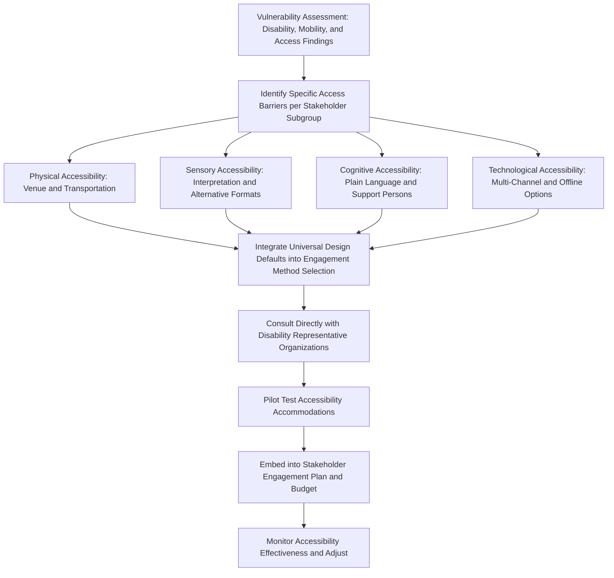

## Accessibility and Inclusive Design of Engagement

### Overview

Accessibility and inclusive design of engagement is the practice of proactively removing physical, sensory, cognitive, technological, and logistical barriers that would otherwise exclude persons with disabilities and other groups facing participation constraints from meaningfully engaging in project consultation processes. While closely related to the culturally and linguistically appropriate planning covered in the preceding topic, accessibility and inclusive design specifically addresses functional and physical barriers to participation, complementing (rather than duplicating) the linguistic and cultural dimension.

This topic operationalizes, at the engagement-method level, the vulnerability identification findings established earlier in stakeholder analysis — particularly regarding persons with disabilities, elderly individuals, and others facing mobility, sensory, or logistical constraints — translating identification into concrete design accommodations.

### Universal Design Principles Applied to Engagement

**Universal design** is the principle of designing processes, environments, and materials to be usable by the widest possible range of people, without requiring specialized adaptation or accommodation as an afterthought. Applied to community engagement, this means designing consultation processes from the outset to be accessible, rather than retrofitting accommodations only when a specific access need is raised.

Core dimensions of universal design applied to SIA engagement include:

- **Physical accessibility** — venue selection, layout, and logistics
- **Sensory accessibility** — accommodation for visual, hearing, and speech-related access needs
- **Cognitive accessibility** — communication complexity and format appropriate to varying cognitive processing needs
- **Technological accessibility** — accommodating varying levels of digital literacy and technology access
- **Temporal and logistical accessibility** — timing and location that accounts for mobility, caregiving, and transportation constraints

**Key Points**

- Universal design is a proactive design philosophy, not a reactive accommodation process — the goal is engagement architecture that works for the full range of stakeholders by default, with targeted additional accommodation reserved for genuinely individual needs rather than systemic access gaps
- Accessibility planning should be informed directly by the disability and mobility-related findings from the vulnerability identification stage, rather than treated as a generic afterthought applied uniformly without reference to the actual stakeholder population's needs

### Physical Accessibility

- **Venue selection** — choosing consultation venues with step-free access, accessible parking, and proximity to accessible transportation; avoiding venues requiring stairs, uneven terrain, or significant unassisted walking distance without accommodation
- **Seating and spatial layout** — ensuring adequate space for wheelchair users and mobility aid users, and seating arrangements that do not require standing for extended periods
- **Accessible sanitation facilities** — ensuring venues have accessible restroom facilities, particularly relevant for longer consultation events
- **Transportation support** — providing or arranging transportation assistance where distance or terrain would otherwise exclude mobility-impaired stakeholders from attending

### Sensory Accessibility

- **Sign language interpretation** — providing qualified sign language interpreters for consultation events where Deaf or hard-of-hearing stakeholders are present or anticipated within the stakeholder population
- **Captioning and visual transcription** — for any audio-visual materials or presentations, providing captioning or simultaneous visual transcription
- **Assistive listening systems** — sound amplification or induction loop systems for hard-of-hearing participants in larger venue settings
- **Materials in alternative formats** — Braille, large-print, and audio-format versions of key written materials for stakeholders with visual impairments
- **Avoiding sole reliance on visual/written communication** — ensuring that critical project information is not conveyed solely through visual or written media that would exclude stakeholders with visual impairments or low literacy

### Cognitive Accessibility

- **Plain language communication** — avoiding unnecessary technical jargon, using short sentences and concrete examples, and structuring information logically to support comprehension across varying cognitive processing needs and educational backgrounds
- **Repetition and multiple exposure opportunities** — presenting key information more than once, through multiple channels or sessions, rather than assuming single-exposure comprehension
- **Support persons and advocates** — allowing and facilitating the presence of a trusted support person or advocate for stakeholders who benefit from such support to fully participate and express their views
- **Extended time allowances** — for stakeholders who process information or formulate responses at a different pace, avoiding rigid, rushed engagement formats

### Technological Accessibility

- **Avoiding sole reliance on digital channels** — where digital consultation tools (online surveys, video conferencing, mobile applications) are used, maintaining parallel non-digital channels for stakeholders with limited internet access, digital literacy, or device ownership
- **Low-bandwidth and offline-compatible options** — for populations with limited or unreliable internet connectivity, providing SMS-based, voice-call-based, or offline data collection alternatives
- **Digital accessibility standards** — where digital platforms are used, ensuring compliance with recognized digital accessibility guidelines (e.g., screen-reader compatibility, sufficient color contrast) for stakeholders using assistive technology

[Unverified] Specific digital accessibility standards (such as WCAG conformance levels) referenced in SIA practice are not uniformly mandated across all safeguard frameworks and should be verified against project-specific lender or regulatory requirements where digital engagement channels are a significant component of the strategy.

### Mermaid Diagram: Accessibility and Inclusive Design Workflow

### Participatory Validation with Disability Representative Organizations

Rather than designing accessibility accommodations solely based on generic best-practice checklists, good practice involves direct consultation with disability representative organizations and, where feasible, disabled stakeholders themselves, to validate that proposed accommodations genuinely address the specific access needs present in the stakeholder population — recognizing that disability is heterogeneous and that a generic accommodation package may not address the full range of needs (e.g., mobility-focused accommodations do not address sensory or cognitive access needs, and vice versa).

**Example**

A project's baseline social assessment identifies a meaningful population of stakeholders with visual impairments in the project-affected area. Rather than assuming standard large-print materials are sufficient, the engagement team consults with a local association for the blind, which advises that audio-format materials and in-person oral briefings are more effective given prevailing literacy patterns among the specific population, leading the team to prioritize audio disclosure and trained oral presentation over a print-based large-format approach.

**Key Points**

- Accessibility accommodations should be co-designed with, or at minimum validated by, representative organizations or individuals from the specific access-need population, rather than assumed from generic accessibility guidance alone
- Accessibility needs should be captured through direct, respectful inquiry during social baseline data collection (as part of the broader vulnerability identification exercise), not inferred indirectly or left for stakeholders to self-identify without prompting, since stigma or unfamiliarity with available accommodations may otherwise suppress disclosure

### Integration with Grievance Mechanisms

Accessibility considerations extend beyond consultation events to the grievance redress mechanism (covered as its own topic elsewhere in this course), which should similarly provide:

- Multiple accessible intake channels (in-person, phone/voice, written, and where relevant, sign-language-supported channels)
- Accessible physical locations for in-person grievance submission
- Support for stakeholders requiring assistance to formulate or submit a grievance, without compromising the confidentiality or agency of the complainant

### Common Pitfalls

- **Reactive rather than proactive accommodation** — only providing accessibility accommodations when an individual stakeholder specifically requests one, rather than designing engagement processes with universal accessibility as a default, which can suppress participation from stakeholders unaware that accommodation is available or hesitant to request it
- **Single-modality accommodation** — providing only one type of accessibility accommodation (e.g., wheelchair-accessible venues) while neglecting sensory, cognitive, or technological access dimensions equally present in the stakeholder population
- **Tokenistic disability consultation** — engaging disability representative organizations only nominally, without genuinely incorporating their input into accommodation design
- **Under-budgeting for accessibility** — failing to allocate specific budget lines for interpretation services, accessible-format material production, or transportation support, treating accessibility as an unfunded aspiration rather than a resourced commitment
- **Over-reliance on digital channels without parallel non-digital options**, systematically excluding stakeholders with limited digital access or literacy

### Regulatory and Standards Context

- **IFC Performance Standard 1** requires that consultation processes be inclusive and accessible, taking into account the differentiated needs of disadvantaged or vulnerable groups, which extends to physical, sensory, and cognitive accessibility considerations for persons with disabilities
- **World Bank Environmental and Social Standard 10 (ESS10)** requires engagement to be conducted "in a manner that provides stakeholders with opportunities to express their views... free of external manipulation, interference, coercion, or intimidation," and references accessibility for disadvantaged or vulnerable groups as part of meeting this standard
- **UN Convention on the Rights of Persons with Disabilities (CRPD)**, while not itself a project safeguard instrument, provides the broader normative framework (accessibility, reasonable accommodation, participation) that informs current safeguard practice regarding disability-inclusive engagement, particularly in projects financed by institutions with CRPD-aligned policies

[Unverified] Specific accessibility compliance requirements and their enforcement mechanisms vary substantially by jurisdiction, sector, and financing institution; practitioners should verify current applicable requirements, including any binding accessibility legislation in the host country, for the specific project context.

### Integration with the Broader Engagement Strategy

Accessibility and inclusive design should be embedded across, rather than treated as separate from, the other engagement strategy elements covered in this chapter:

- **Stakeholder segmentation and vulnerability assessment** identify which access needs are present and at what scale within the stakeholder population
- **Culturally and linguistically appropriate planning** and accessibility planning intersect and should be co-designed, since language, literacy, and disability-related access needs frequently overlap within the same individuals (compounding, intersectional vulnerability)
- **Scheduling, staffing, and budgeting** must explicitly account for accessibility-related costs (interpretation, alternative-format materials, accessible venue premiums, transportation support) as a distinct, resourced budget line rather than an absorbed or assumed cost
- **The Stakeholder Engagement Plan** should document specific accessibility accommodations as concrete, verifiable commitments rather than general statements of intent

**Next Steps**

- Identifying vulnerable and marginalized groups (cross-reference for disability and access-need identification)
- Culturally and linguistically appropriate planning (cross-reference for overlapping accessibility and language needs)
- Scheduling, staffing, and budgeting for engagement (cross-reference for accessibility budget allocation)
- Grievance redress mechanism design with accessible intake channels
- Drafting a stakeholder engagement plan (cross-reference for documenting accessibility commitments)
- Disability representative organization partnership and consultation methods
- Universal design principles in physical infrastructure and facility planning