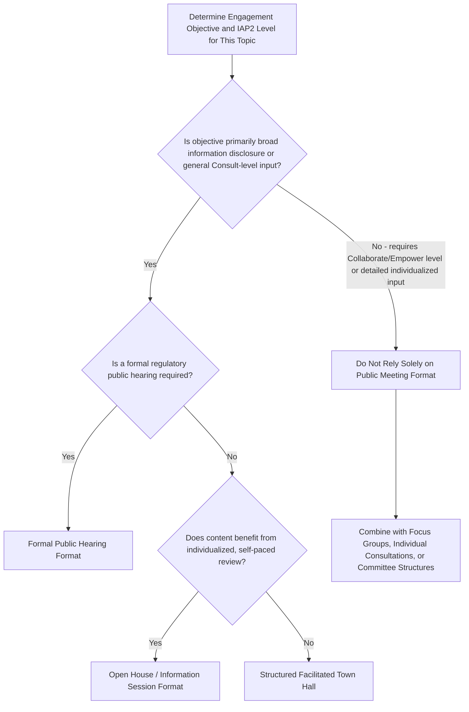

## Public Meetings and Town Hall Formats

### Overview

Public meetings and town hall formats are among the most widely used and historically foundational community engagement methods in SIA practice, involving convened, typically open-attendance gatherings where project information is presented and stakeholders can ask questions, raise concerns, or provide comments in a group setting. While often treated as a default or baseline engagement method, public meetings occupy a specific and limited position within the broader engagement methods toolkit, best suited to certain objectives and decision-levels while carrying well-documented limitations for others.

This topic addresses the practical design, execution, and appropriate use-cases of public meeting formats, building directly on the objectives-and-scope, decision-level matching, and cultural/accessibility design principles established earlier in this course.

### Appropriate Use Cases

Public meetings are generally best suited to:

- **Information disclosure (Inform level)** — presenting project information, findings, or decisions to a broad stakeholder audience efficiently
- **Broad-based initial consultation (Consult level)** — gathering a general sense of community concerns or priorities at an early project stage, particularly where the audience is large and diverse
- **Formal regulatory requirements** — many national EIA/SIA frameworks mandate a public hearing or public meeting as a minimum procedural requirement, making this format necessary for compliance regardless of its standalone adequacy for deeper engagement objectives
- **Building broad awareness** — reaching a large stakeholder population efficiently when the objective is general awareness rather than individualized or detailed input

**Key Points**

- Public meetings are generally poorly suited, used alone, to Collaborate or Empower-level engagement objectives, since the open, large-group format structurally limits detailed two-way dialogue, individualized concern capture, and iterative co-design
- Public meetings should typically be complemented by, not substituted for, smaller-format methods (focus group discussions, individual consultations) particularly for Tier 1 stakeholders and for topics requiring detailed or sensitive input

### Format Variants

- **Open public meeting / town hall** — unstructured or loosely structured open floor format, typically featuring a project presentation followed by open question-and-answer or comment period
- **Formal public hearing** — a more structured, often legally mandated format with formal procedural rules (e.g., registered speakers, time limits per speaker, official record-keeping), common in regulatory EIA processes
- **Information/open house sessions** — a less formal format where project information is presented via static displays or stations, and stakeholders circulate and engage with project staff individually or in small groups rather than through a single plenary session
- **Structured facilitated town hall** — a public meeting format incorporating facilitation techniques (breakout small-group discussion within the larger event, structured question submission, facilitated Q&A) to improve participation quality and voice equity relative to a purely open-floor format

**Example**

An open house/information session format may be more effective than a traditional plenary town hall for topics such as construction traffic management plans, where stakeholders benefit from reviewing detailed maps and asking individualized questions of technical staff at their own pace, compared to a single large-audience presentation format that limits individualized clarification.

### Mermaid Diagram: Public Meeting Format Selection Logic

### Design and Planning Considerations

#### Pre-Meeting Planning

- **Scheduling around stakeholder availability** — consistent with the scheduling principles established earlier, avoiding conflicts with agricultural, religious, or customary calendar events
- **Venue accessibility** — applying the physical, sensory, and logistical accessibility principles established in the accessibility topic (step-free access, adequate space, accessible transportation)
- **Advance notice and multi-channel invitation** — sufficient lead time and multiple communication channels (physical notices, radio, community leader announcement, direct household notification for Tier 1 stakeholders) to maximize awareness and attendance, particularly for vulnerable groups who may not access a single notification channel
- **Materials preparation** — translated, plain-language, and where relevant visual/audio materials prepared in advance, consistent with culturally and linguistically appropriate planning principles

#### During the Meeting

- **Neutral, skilled facilitation** — a trained facilitator (not necessarily the same person delivering technical project content) to manage the meeting process, ensure balanced participation, and de-escalate conflict where it arises
- **Structured question/comment capture** — a documented method (written comment cards, sign-up sheets for speaking, designated note-takers) for capturing all raised concerns, not relying solely on facilitator memory or informal notes
- **Balanced floor time management** — active facilitation to prevent domination of discussion by a small number of vocal or high-status participants, and to actively invite input from quieter attendees, including through techniques such as structured go-arounds or small-group breakouts within the larger event
- **Interpretation and accessibility provision** — sign language interpretation, spoken language interpretation, and other accommodations as identified in the accessibility and cultural planning stages
- **Clear articulation of decision scope** — explicitly communicating, consistent with decision-level engagement matching principles, which topics are open for influence at this meeting and which are informational only

#### Post-Meeting Follow-Through

- **Documented meeting record** — minutes or summary capturing attendance (disaggregated by gender/group where feasible), key concerns raised, and any commitments made
- **"What we heard, what we did" response** — a documented, ideally publicly disclosed response explaining how raised concerns were considered or addressed, closing the feedback loop
- **Grievance/follow-up channel signposting** — clear information on how attendees (or those unable to attend) can raise further questions or concerns after the meeting

**Key Points**

- The quality of facilitation, not merely the occurrence of the meeting, is what determines whether a public meeting generates genuine, representative stakeholder input versus a formally compliant but substantively hollow event
- Meeting minutes and the "what we heard, what we did" response should be treated as accountability documents subject to the same disclosure standards as other SEP-related materials

### Known Limitations of Public Meeting Formats

- **Structural exclusion of vulnerable and marginalized voices** — as established in the vulnerability, cultural appropriateness, and accessibility topics, open public meeting formats systematically under-represent women (in gender-segregated contexts), lower-status or younger community members (in hierarchical contexts), persons with disabilities (absent specific accommodation), and those facing logistical/time constraints
- **Dominance dynamics** — vocal, higher-status, or more politically connected individuals often disproportionately shape the recorded discussion, potentially misrepresenting the actual distribution of community concerns or preferences
- **Limited depth of input** — the large-group, time-constrained format structurally limits the ability to capture detailed, individualized, or sensitive concerns compared to smaller-format methods
- **Risk of becoming a "venting" or adversarial venue** — particularly where community trust in the proponent is already low, open public meetings can become a forum for generalized grievance expression rather than substantive two-way dialogue, without a structured mechanism to translate that input into project decisions
- **One-off nature** — a single public meeting, without follow-through mechanisms, cannot substitute for the ongoing, relationship-based engagement generally required for Tier 1 and Collaborate/Empower-level objectives

[Inference] These limitations are the primary reason SIA good practice frameworks (IFC PS1 guidance, World Bank ESS10 guidance) consistently recommend public meetings be one component within a broader, multi-method engagement strategy rather than the sole or primary engagement method for a project of significant social risk.

### Common Pitfalls

- **Treating a single public meeting as sufficient consultation** — using one public meeting event to claim compliance with consultation requirements for a project with significant, differentiated, or severe impacts on specific subgroups, without complementary smaller-format or individualized engagement
- **Inadequate advance notice** — insufficient lead time or narrow notification channels resulting in low or unrepresentative attendance
- **Poor facilitation allowing dominance dynamics** — failing to actively manage floor time, resulting in a skewed and unrepresentative record of community input
- **No documented response mechanism** — failing to close the feedback loop with a "what we heard, what we did" response, undermining stakeholder trust in the value of their participation
- **Using public meeting format for topics requiring Collaborate/Empower-level engagement** — mismatching format to decision-level classification established in the earlier engagement-level matching step
- **Ignoring accessibility and cultural appropriateness** — defaulting to a standard public meeting format without adapting venue, timing, language, and facilitation approach to the specific stakeholder population's needs

### Regulatory Context

- **National EIA/SIA regulatory frameworks** in many jurisdictions mandate a formal public hearing or public meeting as part of the statutory environmental/social impact assessment approval process, establishing a compliance floor independent of voluntary lender standards
- **IFC Performance Standard 1** and **World Bank ESS10** guidance both recognize public meetings as one legitimate engagement method but emphasize that engagement should be tailored and proportionate, implicitly cautioning against reliance on public meetings alone for higher-risk projects or differentiated vulnerable group needs
- [Unverified] Specific procedural requirements for formal public hearings (e.g., minimum notice periods, quorum requirements, formal record-keeping standards) vary substantially by national jurisdiction and should be verified against the specific applicable regulatory framework for the project location

### Integration with the Broader Engagement Method Toolkit

Public meetings function best as one component within a multi-method engagement strategy, typically combined with:

- **Focus group discussions** disaggregated by gender, age, or other relevant subgroup for deeper, more representative input capture
- **Individual or household-level consultations** for Tier 1 stakeholders and topics requiring detailed, sensitive, or personalized engagement
- **CSO/intermediary-facilitated engagement** for reaching populations underserved by standard public meeting formats
- **Grievance mechanisms** as an ongoing channel complementing the episodic nature of public meetings

**Next Steps**

- Matching engagement level to decision context (cross-reference for appropriate use-case determination)
- Culturally and linguistically appropriate planning (cross-reference for meeting format adaptation)
- Accessibility and inclusive design of engagement (cross-reference for venue and facilitation accommodation)
- Focus group discussions and small-group consultation methods
- Individual and household-level consultation techniques
- Grievance redress mechanism design as a complementary ongoing channel
- Meeting facilitation skills and conflict de-escalation techniques