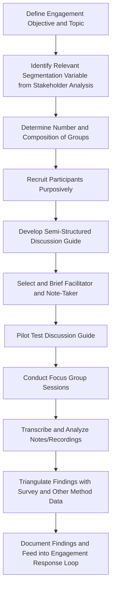

## Focus Group Discussion Design

### Overview

Focus group discussion (FGD) design is a qualitative engagement method involving structured, facilitated small-group conversations with a purposively selected set of participants sharing a relevant characteristic (e.g., gender, age cohort, livelihood type, vulnerability status), used to generate detailed, interactive qualitative data on stakeholder perceptions, concerns, and priorities. Unlike public meetings, which prioritize broad reach, focus groups prioritize depth, interaction, and representativeness of specific stakeholder subgroups, making them a core method for Consult and Involve-level engagement objectives established in earlier chapter topics.

Focus groups occupy a distinct methodological niche between large-group public meetings (broad reach, limited depth) and individual interviews (maximum depth, no group interaction dynamic), leveraging group interaction itself as a data source — participants respond to and build on each other's comments, often surfacing shared or contested perspectives that individual interviews would not reveal.

### When to Use Focus Group Discussions

Focus groups are particularly well-suited to:

- **Exploring shared or contested perceptions within a defined subgroup** — e.g., understanding how women in the project area perceive proposed compensation mechanisms
- **Validating or triangulating baseline survey findings** — providing qualitative depth and explanation behind quantitative social baseline data
- **Reaching subgroups underserved by public meeting formats** — as established in the public meetings topic, gender-segregated or hierarchy-sensitive contexts often require dedicated same-subgroup FGDs to surface voices suppressed in mixed, open-floor settings
- **Generating input on defined, bounded topics** — appropriate for Consult and Involve-level topics with a moderately open decision scope (per the decision-level engagement matching framework), though generally less suited than dedicated committee or workshop structures for genuinely Collaborate/Empower-level co-design

**Key Points**

- Focus groups are not well suited to establishing statistically representative or generalizable findings — sample sizes are deliberately small and purposively selected, so findings should be understood as illustrative and exploratory rather than quantitatively representative of the entire stakeholder population
- Focus group findings should generally be triangulated against household survey data, key informant interviews, or other methods rather than treated as a standalone basis for major project decisions

### Core Design Elements

#### 1. Segmentation and Composition

Deliberate, purposive grouping of participants who share relevant characteristics, informed directly by the tiered segmentation and vulnerability assessment work established earlier in this course:

- **Homogeneous grouping by relevant variable** — gender, age cohort, livelihood type, ethnicity, or vulnerability category, chosen based on which variable is most likely to shape distinct perspectives on the specific topic at hand
- **Group size** — typically 6 to 10 participants per group, balancing sufficient interactive dynamic against manageable facilitation and ensuring all participants have adequate speaking opportunity
- **Number of groups per subpopulation** — multiple groups per relevant subcategory (e.g., three separate women's groups from different villages) to identify whether perspectives are consistent or vary meaningfully across sub-locations, rather than relying on a single group as representative

#### 2. Facilitator and Note-Taker Roles

- **Facilitator** — manages group dynamics, poses discussion questions, ensures balanced participation, and avoids inserting personal opinions or leading responses
- **Note-taker/recorder** — a separate individual (distinct from the facilitator) responsible for detailed written notes and, where consented, audio recording, freeing the facilitator to focus fully on group management
- **Same-characteristic facilitation where relevant** — as established in the cultural appropriateness topic, same-gender facilitation for women's groups, or facilitation by a trusted community-fluent individual for sensitive topics, to support genuine disclosure

#### 3. Discussion Guide Development

A semi-structured discussion guide, rather than a rigid questionnaire, typically containing:

- **Opening/rapport-building questions** — low-stakes introductory questions to build comfort before addressing substantive topics
- **Core topic questions** — open-ended questions directly addressing the engagement objective (e.g., "What concerns do you have about the proposed resettlement site options?")
- **Probing follow-up prompts** — pre-planned but flexible follow-up prompts to explore emerging themes in greater depth
- **Closing questions** — opportunity for participants to raise any topic not otherwise covered

**Example**

| Discussion Guide Section | Sample Question |
| --- | --- |
| Opening | "Can you tell me a bit about your household and how you use land in this area?" |
| Core topic | "What are your thoughts on the three proposed resettlement site options presented earlier?" |
| Probe | "You mentioned water access as a concern — can you say more about what water access looks like for your household today?" |
| Closing | "Is there anything important to you about this project that we haven't discussed today?" |

### Mermaid Diagram: Focus Group Discussion Design and Implementation Workflow

### Participant Recruitment

- **Purposive sampling** — deliberately selecting participants to represent the relevant characteristic of interest, rather than random or convenience sampling, while still aiming for diversity within that characteristic (e.g., varying ages, household sizes, or economic status within a women's group) to avoid an artificially homogeneous or elite-captured group
- **Avoiding pre-existing group capture** — being cautious that recruitment through a single existing organization or leader does not inadvertently produce a group dominated by that organization's specific membership or viewpoint, undermining genuine representativeness within the target subcategory
- **Informed consent and confidentiality briefing** — clearly explaining the purpose of the discussion, how findings will be used and reported, and confidentiality limitations inherent to a group setting (i.e., that facilitators can commit to their own confidentiality but cannot guarantee other participants will not share what was discussed outside the group)

**Key Points**

- Recruitment channel choice materially affects representativeness; relying solely on formal community leadership to identify participants risks systematically excluding those outside existing leadership networks, including many of the vulnerable groups identified in earlier stakeholder analysis
- Group composition should avoid mixing participants with significant power differentials (e.g., employer and employee, landlord and tenant) within the same group, since this can suppress candid disclosure from the less powerful participant

### Facilitation Techniques

- **Ground rules setting** — establishing at the outset norms for respectful listening, confidentiality expectations, and equal speaking opportunity
- **Active balancing of participation** — using techniques such as direct invitation to quieter participants, structured go-arounds for key questions, and tactful redirection of dominant speakers
- **Neutral probing** — using open-ended, non-leading follow-up questions ("Can you say more about that?" rather than questions that suggest a particular answer)
- **Managing sensitive disclosures** — being prepared to pause, redirect, or follow up individually (outside the group setting) if a participant discloses information involving personal risk, distress, or requiring a level of confidentiality the group setting cannot provide
- **Time management** — maintaining a realistic pace (typically 60 to 90 minutes total) that allows adequate depth on core questions without participant fatigue

### Documentation and Analysis

- **Verbatim or near-verbatim notes** — captured by the dedicated note-taker, supplemented by audio recording where participants consent
- **Thematic analysis** — systematically coding notes/transcripts for recurring themes, areas of consensus, and areas of divergence within and across groups
- **Attribution handling** — reporting findings in aggregate or thematically, generally avoiding direct attribution of specific comments to identifiable individuals in externally shared reports, to protect participant confidentiality and encourage candid future participation

**Key Points**

- Analysis should explicitly note both convergent themes (widely shared views) and divergent or minority perspectives within a group, since minority perspectives can represent important vulnerability or risk signals that a purely majority-themed summary would obscure
- Findings should be reported back, where feasible, to participating communities in an appropriate summary form as part of the "what we heard, what we did" feedback loop established in earlier engagement topics

### Common Pitfalls

- **Insufficient segmentation** — running mixed-gender or mixed-hierarchy groups on sensitive topics, resulting in suppressed disclosure from less powerful participants, when the topic and cultural context would call for same-characteristic grouping
- **Leading questions or facilitator bias** — inadvertently steering discussion toward answers favorable to the project through question phrasing or facilitator body language/tone
- **Elite capture in recruitment** — relying solely on community leadership to select participants, resulting in groups that do not genuinely represent the target subcategory's diversity
- **Over-generalizing findings** — presenting focus group findings as though they were statistically representative of the entire stakeholder population, rather than framing them as qualitative, exploratory input requiring triangulation
- **Inadequate confidentiality management** — failing to clearly communicate the inherent confidentiality limitations of a group setting, or failing to follow up appropriately when a sensitive individual disclosure occurs within the group
- **No feedback loop** — failing to report back findings or subsequent project responses to participating groups, undermining trust and willingness to participate in future engagement activities

### Integration with the Broader Engagement Method Toolkit

Focus group discussions function as a mid-depth method within the broader engagement toolkit, typically used to:

- **Complement public meetings** by providing depth and subgroup-specific voice that large-group formats structurally cannot capture
- **Inform individual consultation and Tier 1 engagement design** by surfacing themes that warrant more detailed follow-up at the individual/household level
- **Validate and enrich quantitative baseline survey data** by providing qualitative context and explanation for observed patterns
- **Feed directly into SEP-documented engagement schedules** as a recurring method (e.g., quarterly gender-disaggregated FGDs) for Tier 2 stakeholder segments, consistent with the tiered segmentation and scheduling frameworks established earlier

**Next Steps**

- Public meetings and town hall formats (cross-reference for complementary broad-reach methods)
- Stakeholder segmentation for tiered engagement (cross-reference for FGD composition basis)
- Culturally and linguistically appropriate planning (cross-reference for same-characteristic facilitation)
- Identifying vulnerable and marginalized groups (cross-reference for targeted subgroup FGD design)
- Individual and household-level consultation techniques
- Qualitative data analysis and thematic coding methods for SIA
- Grievance redress mechanism design informed by FGD-surfaced concerns