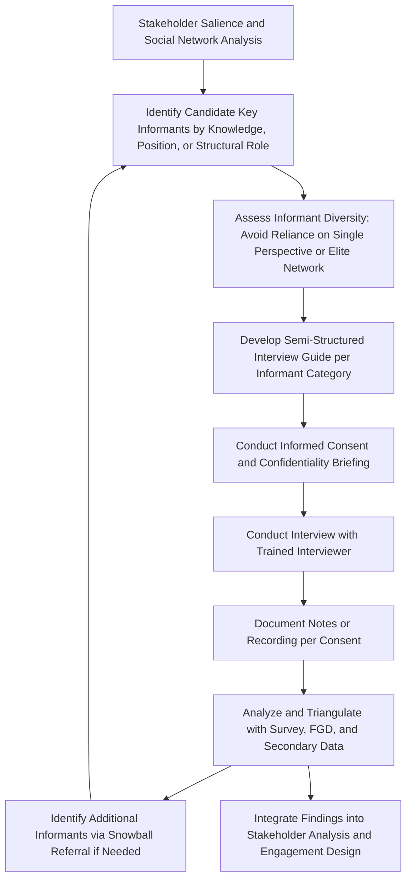

## Key Informant and Semi-Structured Interviews

### Overview

Key informant and semi-structured interviews are individual, in-depth qualitative engagement methods used to gather detailed information from specifically selected individuals who possess particular knowledge, perspective, or authority relevant to the SIA process. This method occupies the deepest end of the engagement method spectrum introduced across this chapter — offering greater individualized depth than focus groups, at the cost of reduced breadth and the absence of group interaction dynamics that focus groups leverage.

Key informant interviews (KIIs) serve a distinct function from other engagement methods covered in this chapter: rather than primarily capturing broad community sentiment (public meetings) or subgroup-shared perspectives (focus groups), they are used to access specialized knowledge, historically or institutionally significant perspective, or individually sensitive information that specific well-positioned individuals hold.

### Distinguishing Key Informant Interviews from General Stakeholder Consultation

- **Key informant interviews** target individuals selected specifically for their specialized knowledge, institutional position, historical memory, or structural position (e.g., identified through the social network mapping exercise as a high-betweenness broker), rather than as a representative sample of the general stakeholder population
- **General semi-structured stakeholder interviews** may be conducted with a broader set of individually selected stakeholders (e.g., all Tier 1 household heads) using a semi-structured format, but without the specific "informant" framing of targeting specialized knowledge holders

[Inference] In practice, SIA documentation often uses "key informant interview" as an umbrella term covering both purposes, since the semi-structured interview methodology is largely shared between them; the meaningful distinction lies in participant selection rationale rather than interview technique.

### When to Use Key Informant Interviews

- **Accessing specialized or institutional knowledge** — e.g., interviewing local government officials, healthcare providers, or customary authorities regarding administrative processes, historical land use, or community governance structures
- **Reaching structurally significant individuals identified through network mapping** — e.g., interviewing a high-betweenness broker identified in the social network mapping exercise who may not hold formal community leadership title but occupies a structurally central information/influence position
- **Gathering historically or politically sensitive information** — where individual interviews provide a level of confidentiality and candor not achievable in group settings, particularly relevant for topics involving prior grievances, conflict history, or politically sensitive land tenure disputes
- **Detailed individualized consultation for Tier 1 stakeholders** — as established in the tiered segmentation framework, priority stakeholders facing severe direct impact (e.g., resettlement-affected households) typically warrant individual consultation rather than group-based methods alone
- **Triangulating and contextualizing findings from other methods** — using informed individual perspective to interpret or explain patterns observed in household survey data or focus group findings

**Key Points**

- Key informant selection should be explicitly informed by outputs from the stakeholder salience analysis and social network mapping exercises established earlier in this course, rather than defaulting only to formally titled community leaders
- Individual interview format allows for the disclosure of sensitive information (personal grievances, conflict history, dissenting views from official community positions) that group settings structurally discourage

### Mermaid Diagram: Key Informant Interview Design and Implementation Workflow

### Interview Guide Design

Semi-structured interview guides balance a defined set of core questions with flexibility to pursue emergent lines of inquiry, distinguishing this method from both fully structured surveys and fully unstructured conversational interviews:

- **Core question set** — a limited number of open-ended questions covering the essential topics the interview is intended to address, ensuring some consistency across multiple informant interviews for later comparative analysis
- **Flexible probing** — interviewer discretion to follow up on unexpected or particularly significant responses with additional, non-predetermined questions
- **Informant-specific tailoring** — while a common thematic guide may exist, questions should be adapted to the specific informant's role and knowledge domain (e.g., a healthcare provider interview would include health-system-specific questions not relevant to a customary land authority interview)

**Example**

| Informant Category | Sample Core Questions |
| --- | --- |
| Local government administrator | "How are land disputes typically resolved in this administrative area?" / "What has been the historical pattern of government engagement with this community?" |
| Customary land authority | "How is land traditionally allocated and inherited in this community?" / "What concerns have community members raised with you about the proposed project?" |
| Healthcare provider | "What health concerns are most common in this community currently?" / "Have you observed any health-related impacts from project activities to date?" |
| Structurally central community member (identified via network mapping) | "Who do people in this community typically turn to for information or advice about outside projects or changes?" / "What have you heard from others about this project?" |

### Sampling and Selection Approaches

- **Purposive selection based on defined criteria** — selecting informants deliberately based on institutional role, specialized knowledge, or structural network position rather than random sampling
- **Snowball sampling** — asking initial informants to identify additional relevant individuals, continuing until thematic saturation (no substantially new information emerging) is reached; particularly useful for mapping informal power structures or historically significant events not documented in official records
- **Maximum variation sampling** — deliberately selecting informants representing diverse perspectives, institutional positions, or demographic backgrounds to avoid a narrow or homogeneous informant pool that would bias findings toward a single viewpoint

**Key Points**

- Snowball sampling carries an inherent risk of narrowing toward a single social network or perspective cluster if not actively counterbalanced with deliberate diversification (e.g., explicitly seeking informants from outside the initial referral network, including dissenting or marginalized voices)
- Informant selection should be periodically reviewed against the evolving stakeholder salience and vulnerability analysis, since who constitutes a relevant "key" informant can shift as the project progresses and new concerns or stakeholder dynamics emerge

### Confidentiality, Consent, and Ethical Considerations

- **Informed consent** — clearly explaining the purpose of the interview, how information will be used, whether and how the informant will be identified or kept anonymous in reporting, and the voluntary nature of participation
- **Confidentiality commitments** — individual interviews generally allow stronger confidentiality assurance than group settings, which should be leveraged appropriately for sensitive topics while being honest about any limitations (e.g., legal disclosure obligations)
- **Attribution decisions** — determining, in consultation with the informant, whether their identity and specific statements can be attributed in reporting, or whether findings should be presented in de-identified, thematic form
- **Managing power dynamics in the interview setting** — being attentive to power differentials between interviewer and informant (e.g., a project staff member interviewing a vulnerable community member) that could affect candor, and considering interviewer selection or setting adjustments to mitigate this
- **Risk assessment for sensitive disclosures** — particularly relevant when interviewing informants regarding conflict history, land disputes, or politically sensitive topics, requiring careful consideration of potential retaliation or social risk to the informant from disclosure

**Key Points**

- Confidentiality and attribution agreements should be explicit and respected in subsequent reporting; breaching an informant's expected confidentiality can cause direct harm to the individual and damage the broader engagement process's credibility
- Particular caution is warranted when key informant interviews touch on topics identified in the vulnerability assessment as carrying elevated social risk (e.g., land disputes involving powerful local actors), where interview design should include a considered approach to protecting informant safety

### Documentation and Analysis

- **Detailed note-taking or recording** — consistent with participant consent, capturing sufficiently detailed notes or audio recordings to support rigorous subsequent analysis rather than relying on post-hoc recollection
- **Thematic and comparative analysis** — coding interview content for recurring themes across informants, while also documenting significant divergent or minority perspectives that may signal emerging risk or overlooked concerns
- **Cross-method triangulation** — systematically comparing key informant interview findings against household survey data, focus group findings, and secondary data sources to assess consistency and identify areas of discrepancy warranting further investigation

### Common Pitfalls

- **Over-reliance on formally titled leaders as sole informants** — missing informally influential or structurally central individuals identified through social network mapping, resulting in an incomplete or elite-skewed picture of community perspective
- **Insufficient informant diversity** — relying on a narrow, homogeneous set of informants (e.g., only male, only elder, only formally employed) that fails to capture the diversity of perspectives relevant to the SIA, particularly missing perspectives from groups identified in the vulnerability assessment
- **Treating individual informant statements as representative community consensus** — presenting a single or small number of key informant perspectives as though they reflect broader community views without appropriate triangulation or caveat
- **Inadequate confidentiality protection** — failing to anticipate and mitigate risks to informants who disclose sensitive information, particularly regarding politically sensitive or conflict-related topics
- **Leading or biased questioning** — interviewer's own assumptions or project-favorable framing inadvertently shaping informant responses, undermining data validity

### Integration with the Broader Engagement Method Toolkit

Key informant and semi-structured interviews complement the other methods covered in this chapter by providing depth and specialized/individualized insight that group-based methods cannot capture:

- **Feed into and validate social network mapping** by providing direct informant perspective on relationship structures and informal influence patterns
- **Provide essential input to Tier 1 individualized consultation** processes established in the tiered segmentation and SEP scheduling frameworks
- **Contextualize and explain findings from public meetings and focus group discussions**, particularly where group settings may have suppressed candid or minority perspectives
- **Support vulnerability assessment refinement** by accessing knowledgeable informants (health workers, social service providers, disability advocates) who can identify vulnerability patterns not otherwise visible through standard household surveys

**Next Steps**

- Focus group discussion design (cross-reference for complementary group-based methods)
- Social network and relationship mapping (cross-reference for structurally significant informant identification)
- Stakeholder segmentation for tiered engagement (cross-reference for Tier 1 individualized consultation)
- Identifying vulnerable and marginalized groups (cross-reference for informant-based vulnerability insight)
- Qualitative data analysis and thematic coding methods for SIA
- Grievance redress mechanism design informed by sensitive disclosure protocols
- Household survey design and quantitative-qualitative triangulation methods