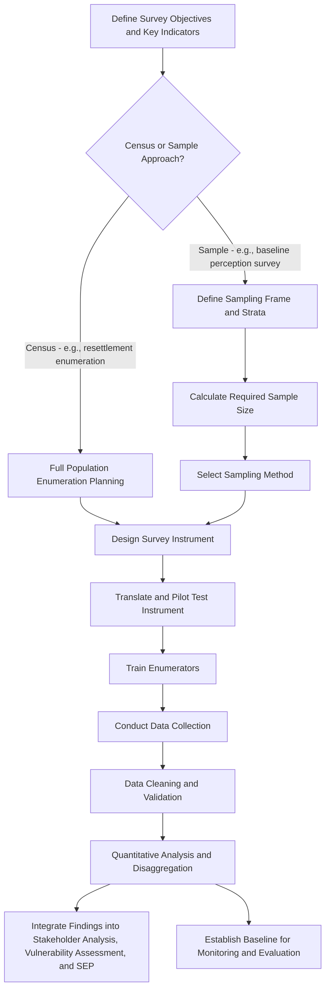

## Household and Community-Wide Surveys

### Overview

Household and community-wide surveys are structured, standardized quantitative data collection instruments administered to a sample or full census of the stakeholder population, used to generate statistically analyzable data on demographics, socioeconomic conditions, perceptions, and impact exposure. Unlike the qualitative methods covered elsewhere in this chapter (focus groups, key informant interviews), surveys are designed specifically to produce representative, comparable, and quantifiable findings across a defined population, making them the primary method for establishing social baseline conditions and measuring change over time.

Surveys serve a foundational role in SIA practice: they typically precede and inform the stakeholder identification, vulnerability assessment, and segmentation work covered earlier in this course, while also providing the quantitative baseline against which project-induced social change is subsequently measured through monitoring and evaluation.

### Core Purposes in SIA

- **Social baseline establishment** — documenting pre-project demographic, economic, and social conditions against which project impacts can later be measured
- **Vulnerability identification** — generating disaggregated data (by sex, age, ethnicity, disability status, income level) that directly feeds the vulnerability identification and stakeholder analysis processes established earlier in this course
- **Impact and needs assessment** — quantifying the scale and distribution of anticipated or experienced project impacts (e.g., number of households facing land loss, livelihood disruption patterns)
- **Perception and attitude measurement** — capturing stakeholder awareness, concerns, and support/opposition levels regarding the project at defined points in time
- **Monitoring and evaluation** — repeated survey waves measuring change in key indicators over the project lifecycle, supporting adaptive management

### Census vs. Sample Survey Design

#### Census Approach

Attempting to survey the entire relevant population (e.g., all households within the direct impact zone) rather than a sample.

- **Appropriate when**: the affected population is small enough to be feasibly covered in full, or when individualized data on every household is required for compensation/resettlement planning purposes (where sampling would be legally or practically inadequate)
- **Common in**: resettlement-affected household enumeration, where every affected household must be individually documented for compensation eligibility

#### Sample Survey Approach

Surveying a statistically representative subset of a larger population, using appropriate sampling methodology to allow generalizable inference to the broader population.

- **Appropriate when**: the population is too large for full census to be feasible within available time/budget, and the objective is representative estimation rather than individualized case documentation
- **Requires**: a defined sampling frame, appropriate sample size calculation (accounting for desired confidence level, margin of error, and population variability), and a probability-based sampling method

**Key Points**

- Compensation and resettlement eligibility determination generally requires a census approach (individualized documentation of every affected household), since sample-based estimation cannot ethically or legally substitute for individual entitlement determination
- General social baseline and perception surveys can appropriately use sample-based approaches, provided the sampling methodology is rigorous and clearly documented

### Sampling Methodology

- **Simple random sampling** — each unit in the sampling frame has an equal probability of selection; straightforward but requires a complete and accurate sampling frame (e.g., household list)
- **Stratified random sampling** — the population is divided into relevant strata (e.g., by village, wealth category, ethnicity) before random sampling within each stratum, ensuring adequate representation of smaller or particularly relevant subgroups (such as those identified in the vulnerability assessment) that might be underrepresented in a simple random sample
- **Cluster sampling** — geographically or administratively defined clusters (e.g., villages) are randomly selected, followed by full or sampled coverage within selected clusters; often more logistically feasible for dispersed rural populations, at some cost to statistical precision
- **Systematic sampling** — selecting every nth unit from an ordered sampling frame (e.g., every 5th household from a village register)

[Inference] Stratified sampling is generally preferable in SIA contexts specifically because it allows deliberate oversampling of small but analytically important subgroups (e.g., female-headed households, specific ethnic minorities) identified during vulnerability assessment, ensuring these groups are represented in sufficient numbers for meaningful disaggregated analysis rather than being statistically underpowered in an unstratified sample.

### Mermaid Diagram: Survey Design and Implementation Workflow

### Survey Instrument Design

#### Question Types

- **Closed-ended/structured questions** — multiple-choice, Likert-scale, or numeric-response questions enabling straightforward quantitative analysis and cross-respondent comparability
- **Semi-open questions** — closed-ended with an "other, please specify" option to capture responses outside anticipated categories
- **Limited open-ended questions** — used sparingly within an otherwise structured survey to capture qualitative nuance, though generally analyzed differently from the structured quantitative components

#### Core Content Modules Common in SIA Household Surveys

- **Household demographics** — composition, age, sex, education, disability status of household members
- **Livelihood and economic activity** — income sources, land use and tenure status, asset ownership
- **Housing and infrastructure access** — dwelling characteristics, access to water, sanitation, electricity, healthcare, education facilities
- **Land and resource use** — for projects involving land acquisition, detailed land holding, tenure documentation status, and resource dependency (e.g., forest products, fishing grounds)
- **Social and cultural characteristics** — ethnicity, religion, customary institutional affiliation, relevant for vulnerability and cultural appropriateness planning
- **Project awareness and perception** — awareness of the project, sources of information, level of concern or support, and specific issues of concern

**Example**

A resettlement census survey module on land tenure might include: "What is your household's primary form of land tenure for your main dwelling plot?" (closed-ended: formal title / customary/traditional tenure / informal occupation / rental / other), followed by "If customary or informal, who in the community can verify this land use history?" (semi-open, feeding into the verification process for compensation eligibility).

### Enumerator Training and Field Implementation

- **Standardized training** — ensuring all enumerators administer the instrument consistently, understand question intent, and follow uniform probing and recording protocols to minimize inter-enumerator variation
- **Local recruitment where appropriate** — enumerators with language fluency and cultural familiarity with the survey population, balanced against the need for independence/objectivity (avoiding enumerators surveying their own immediate family or close associates where bias risk is significant)
- **Informed consent protocols** — clear explanation of survey purpose, voluntary participation, confidentiality handling, and data use, consistent with the ethical standards applicable across all SIA data collection methods
- **Quality control mechanisms** — spot-checking, supervisor field accompaniment, and data validation checks (e.g., logic checks, duplicate detection) during and after fieldwork

### Pilot Testing

Before full-scale deployment, pilot testing the survey instrument with a small sample from the target population is standard good practice, testing for:

- Question comprehension and cultural/linguistic appropriateness (directly connecting to the culturally and linguistically appropriate planning principles established earlier)
- Appropriate response category completeness (avoiding forced-choice questions lacking a relevant response option)
- Survey length and respondent fatigue
- Translation accuracy through back-translation verification

**Key Points**

- Pilot testing should specifically include respondents representative of identified vulnerable subgroups to verify that survey instruments and administration methods are accessible and comprehensible to them, not solely to a general or literate population subset
- Survey length should be carefully calibrated; excessively long instruments risk respondent fatigue and declining data quality in later sections, particularly relevant when surveying respondents with significant time constraints (e.g., agricultural labor obligations)

### Data Quality and Ethical Considerations

- **Respondent selection within households** — determining and consistently applying a protocol for who within a household responds (household head, most knowledgeable adult, or specific respondent for gender-sensitive modules), since this choice can systematically shape which perspectives are captured (e.g., defaulting to male household heads may under-capture women's perspectives on resource use or concerns)
- **Confidentiality and data protection** — secure storage and appropriately restricted access to survey data, particularly given the often-sensitive nature of household economic and demographic information
- **Avoiding survey fatigue and extraction without return** — communities subject to repeated surveys without visible follow-through or benefit can develop survey fatigue and declining trust; findings should be fed back to communities in appropriate summary form as part of the broader engagement feedback loop

**Key Points**

- Gender-sensitive survey modules often warrant a same-gender enumerator-respondent pairing and, where household dynamics might suppress candid response, a private interview setting away from other household members
- Survey data should be integrated with, not treated as a substitute for, qualitative methods (focus groups, key informant interviews) since surveys capture "what" and "how much" effectively but are limited in capturing "why" and contextual nuance

### Common Pitfalls

- **Inadequate sampling frame** — using an outdated or incomplete household list, systematically excluding recently arrived, informally housed, or mobile populations from the sampling frame and therefore from the resulting data
- **Insufficient stratification for vulnerable subgroups** — using unstratified sampling that results in vulnerable subgroups being too few in the sample for meaningful disaggregated analysis
- **Over-reliance on household head as sole respondent** — systematically under-capturing intra-household variation in perspective, particularly along gender lines
- **Skipping pilot testing** — deploying an untested instrument at scale, resulting in comprehension issues, translation errors, or missing response categories discovered only after data collection is complete
- **No baseline-to-monitoring linkage** — designing baseline surveys without considering how the same indicators will be measured in subsequent monitoring waves, undermining the ability to measure change over time
- **Data collected but not fed back** — treating survey data purely as an extractive input to internal analysis without appropriate community-level feedback, contributing to survey fatigue and diminished future cooperation

### Regulatory and Standards Context

- **IFC Performance Standard 1** requires baseline social (and environmental) data collection sufficient to assess project risks and impacts, for which household and community surveys are a standard methodological tool
- **IFC Performance Standard 5 (Land Acquisition and Involuntary Resettlement)** specifically requires a census of affected persons and assets as part of Resettlement Action Plan (RAP) preparation, establishing a clear case where census (not sample) survey methodology is required
- **World Bank Environmental and Social Framework** similarly requires baseline socioeconomic data collection proportionate to project risk, informing both impact assessment and monitoring indicator design

[Unverified] Specific minimum sample size, confidence level, or census-versus-sample threshold requirements are not uniformly codified across these frameworks and depend on project-specific risk categorization; practitioners should verify current applicable guidance for the specific project's financing and regulatory context.

### Integration with the Broader Engagement and Analysis Framework

Household and community-wide survey data feeds directly into and is enriched by other elements covered throughout this course:

- **Stakeholder identification and vulnerability assessment** rely on survey-derived disaggregated demographic and socioeconomic data
- **Stakeholder segmentation** can be informed by survey-identified impact severity and vulnerability distribution across the population
- **Qualitative methods (focus groups, key informant interviews)** provide contextual explanation for patterns observed in survey data, and survey findings in turn help identify which subgroups or topics warrant deeper qualitative follow-up
- **Monitoring and evaluation** relies on baseline survey data as the reference point for measuring project-induced social change over time

**Next Steps**

- Key informant and semi-structured interviews (cross-reference for qualitative triangulation of survey findings)
- Identifying vulnerable and marginalized groups (cross-reference for disaggregated survey data application)
- Stakeholder segmentation for tiered engagement (cross-reference for survey-informed tier assignment)
- Resettlement Action Plan (RAP) census and entitlement documentation methods
- Monitoring, evaluation, and adaptive management indicator design
- Data management, confidentiality, and protection protocols for social data
- Gender-disaggregated data collection and analysis methods