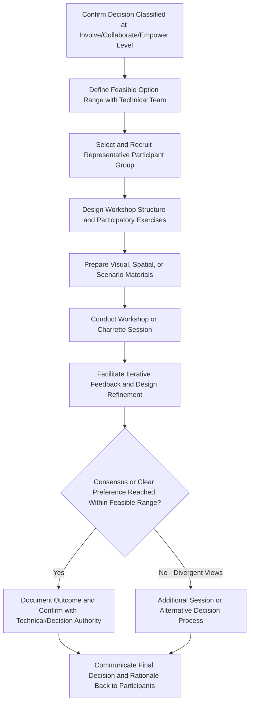

## Participatory Workshops and Design Charrettes

### Overview

Participatory workshops and design charrettes are collaborative, facilitated engagement methods in which stakeholders work directly and actively with project teams to generate, evaluate, or refine project design options, mitigation measures, or community development priorities. These methods occupy the highest-intensity end of the engagement method spectrum covered in this chapter, corresponding directly to the Involve, Collaborate, and (in some designs) Empower levels of the IAP2 spectrum established in the decision-level engagement matching topic — distinguishing them from the more consultative or information-gathering orientation of public meetings, focus groups, and surveys.

The defining feature of these methods is that stakeholders are positioned as active co-creators of specific outputs (a design option, a mitigation measure, a priority list) rather than as respondents providing input into a process largely controlled and synthesized by project staff.

### Distinguishing Workshops from Charrettes

- **Participatory workshops** — a broader category of structured, facilitated group sessions using participatory exercises (ranking, mapping, scenario evaluation, structured brainstorming) to generate stakeholder input on a defined set of questions or options; can vary widely in duration and intensity
- **Design charrettes** — a specific, typically more intensive workshop format originating in architectural and urban planning practice, involving an extended (often multi-day) collaborative design session where stakeholders and technical/design professionals work iteratively together in real time to develop and refine concrete design proposals, often including on-the-spot visualization or sketching of stakeholder input

[Inference] In SIA and infrastructure project practice specifically, "charrette" is most commonly applied to physical design decisions with a spatial dimension — resettlement site layout, community facility design, or land-use planning — where the iterative, visual, real-time design refinement format is particularly well suited, whereas the broader "participatory workshop" label covers a wider range of applications including non-spatial topics (livelihood program design, benefit-sharing criteria).

### Appropriate Use Cases

These methods are best suited to decisions classified, per the decision-level engagement matching framework, as genuinely open to substantial stakeholder influence:

- **Resettlement site layout and design** — working directly with affected households to shape physical site plans, housing design, and communal facility placement within technically and financially feasible parameters
- **Livelihood restoration program design** — collaboratively identifying and designing livelihood support options tailored to affected households' actual skills, preferences, and local market conditions
- **Community development fund priority-setting** — participatory prioritization exercises where community members directly shape how development or compensation funds are allocated
- **Mitigation measure co-design** — collaboratively refining specific mitigation measures (e.g., noise mitigation approaches, environmental monitoring protocols) within a technically bounded option set
- **Benefit-sharing mechanism design** — structuring how project benefits (employment quotas, revenue-sharing, local procurement policies) are distributed and governed

**Key Points**

- These methods should only be deployed for decisions genuinely classified at the Involve/Collaborate/Empower level per the decision-level engagement matching framework; applying a participatory workshop format to a decision that is actually fixed constitutes the "consultation theater" pitfall identified in that topic, and is particularly damaging to trust given the higher stakeholder time and emotional investment these intensive formats require
- The technically/financially bounded option set within which participatory design occurs should be transparently communicated at the outset, consistent with the decision scope transparency principle established earlier

### Mermaid Diagram: Participatory Workshop / Charrette Design Process

### Core Design Elements

#### Participant Selection

- **Representативeness of affected population** — for resettlement or livelihood design charrettes, ensuring participation reflects the diversity of the affected population (gender, age, household type, vulnerability status), consistent with the segmentation and vulnerability principles established earlier
- **Appropriate group size** — larger than a focus group but typically smaller than a full public meeting, to allow genuine interactive design work; may be organized as multiple parallel smaller working groups within a larger overall event
- **Balancing technical and community participants** — including relevant technical staff (engineers, architects, social specialists) alongside community participants to enable real-time feasibility assessment and iterative refinement, rather than a purely community-only session followed by separate technical review

#### Participatory Exercise Design

- **Visual and spatial tools** — physical or digital site maps, 3D models, sketching materials, or scenario boards that allow participants to directly interact with and modify design proposals rather than only verbally describing preferences
- **Option comparison and ranking exercises** — structured methods (e.g., dot-voting, weighted ranking, pairwise comparison) for participants to express and aggregate preferences among a defined option set
- **Small-group breakout and plenary reporting** — combining small-group detailed work with periodic plenary sessions to share progress and surface cross-group themes
- **Iterative "sketch-review-revise" cycles** — presenting an initial concept, gathering feedback, visibly revising the concept, and re-presenting for further feedback within the same session, which is the defining iterative characteristic of the charrette format specifically

**Example**

A resettlement site design charrette convenes affected household representatives alongside project architects and social specialists over a two-day session. Day one involves participants working in small groups with site maps and household cards to propose preferred housing cluster arrangements, communal facility locations, and access road placement within a technically pre-approved site boundary. Technical staff provide real-time feedback on feasibility. Day two involves the architects presenting a synthesized draft layout incorporating the prior day's input, followed by facilitated review and further refinement before finalizing the layout for technical drawing development.

### Facilitation Requirements

- **Dual facilitation capacity** — skilled process facilitation (managing group dynamics, ensuring balanced participation) combined with relevant technical facilitation (someone able to translate community preferences into technically meaningful design implications in real time)
- **Managing power dynamics between technical experts and community participants** — actively preventing technical staff expertise or communication style from dominating or intimidating community participant contribution, ensuring community input genuinely shapes rather than merely validates a pre-formed technical proposal
- **Cultural and linguistic appropriateness** — applying the principles established in the culturally and linguistically appropriate planning topic, including appropriate visual/spatial tools for populations with varying literacy levels and culturally appropriate facilitation approaches
- **Accessibility accommodation** — applying accessibility and inclusive design principles, ensuring physical, sensory, and cognitive access to what are often visually and spatially intensive exercise formats

**Key Points**

- The success of a design charrette depends heavily on genuine technical flexibility being available within the session — if technical staff are not empowered to meaningfully adjust proposals based on real-time community input, the iterative co-design premise of the method is undermined
- Extended multi-day charrette formats carry higher participation burden (time away from livelihood activities, childcare needs) than shorter workshop formats, requiring corresponding logistical support (transportation, childcare provision, compensation for time where appropriate and locally normed) to enable genuine participation, particularly from vulnerable groups

### Documentation and Follow-Through

- **Visual and written outcome documentation** — capturing the specific design outputs, preference rankings, or priority lists generated, along with the process by which they were reached
- **Transparent reporting of how input was incorporated** — consistent with the "what we heard, what we did" principle established in earlier topics, explicitly documenting which participant input was incorporated into final decisions and, where input could not be incorporated, explaining why (technical, financial, or safety constraint)
- **Validation with broader affected population** — since workshop/charrette participants represent a subset of the broader affected population, validating outcomes with the wider Tier 1/Tier 2 stakeholder group (e.g., through subsequent public presentation of the charrette-derived design) helps confirm broader acceptance beyond the specific participant group

### Common Pitfalls

- **Applying intensive participatory format to fixed decisions** — the most damaging pitfall, given the elevated stakeholder investment (time, emotional engagement) these formats require, making a mismatch between promised and actual decision influence particularly costly to trust
- **Insufficient technical flexibility in practice** — convening a participatory design process while technical staff arrive with a substantially fixed proposal and limited genuine willingness to adjust, reducing the exercise to a validation exercise dressed as co-design
- **Non-representative participant selection** — recruiting participants primarily through existing community leadership networks, resulting in outcomes that reflect the preferences of a subset (often more powerful or connected) of the affected population rather than the full range of stakeholder needs, particularly missing vulnerable subgroup perspectives
- **Inadequate accessibility and logistical support** — high-intensity, often multi-day or spatially/visually complex formats can be inaccessible to participants with mobility, sensory, time, or literacy constraints absent deliberate accommodation
- **No validation with broader population** — treating the specific workshop participant group's output as automatically representative of the full affected population's preferences without further validation
- **Underestimating facilitation skill requirements** — assuming that convening technical staff and community members together is sufficient without dedicated, skilled process facilitation to manage power dynamics and ensure genuine collaborative outcomes

### Regulatory and Standards Context

- **IFC Performance Standard 5 (Land Acquisition and Involuntary Resettlement)** encourages participatory approaches to resettlement planning, including community involvement in site selection and housing design where feasible, directly supporting the use of design charrette methods for resettlement-related decisions
- **IFC Performance Standard 1** more broadly supports "Involve" and "Collaborate" level engagement approaches as appropriate for decisions with substantial community impact and genuine decision flexibility
- [Unverified] Specific procedural requirements or standardized methodologies for participatory design processes are not uniformly codified in these frameworks, which describe expected engagement outcomes and principles rather than mandating specific workshop or charrette methodologies; practitioners should verify current applicable guidance for project-specific requirements

### Integration with the Broader Engagement Method Toolkit

Participatory workshops and design charrettes function as the highest-intensity component within a broader, multi-method engagement strategy:

- Typically preceded by **household surveys and vulnerability assessment** to establish the baseline population characteristics informing representative participant selection
- Often follow **focus group discussions** that surface general priorities and concerns, which the workshop/charrette then translates into concrete design co-creation
- Require the **decision-level engagement matching** classification to confirm genuine appropriateness before deployment
- Depend on adequate **scheduling, staffing, and budgeting** given their resource-intensive nature relative to other engagement methods
- Should be explicitly documented within the **Stakeholder Engagement Plan** as a distinct, resourced activity given their elevated planning and facilitation requirements

**Next Steps**

- Matching engagement level to decision context (cross-reference for appropriate use-case confirmation)
- Focus group discussion design (cross-reference for complementary lower-intensity methods)
- Accessibility and inclusive design of engagement (cross-reference for workshop accessibility accommodation)
- Scheduling, staffing, and budgeting for engagement (cross-reference for resourcing intensive formats)
- Resettlement Action Plan (RAP) participatory site selection and design processes
- Livelihood restoration program co-design methods
- Community development fund and benefit-sharing governance design