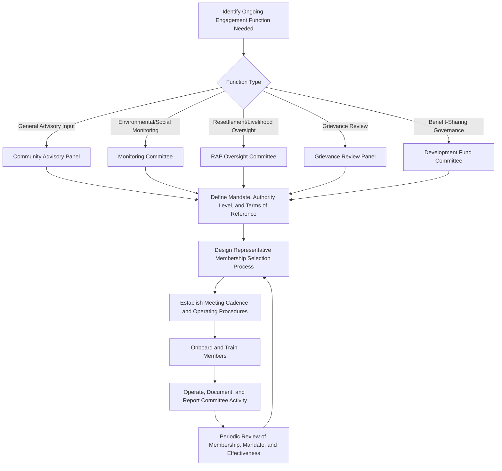

## Advisory Panels and Standing Committees

### Overview

Advisory panels and standing committees are formalized, ongoing engagement structures composed of a defined, typically smaller group of stakeholder representatives who meet on a recurring basis throughout some or all of the project lifecycle, providing a durable institutional mechanism for sustained dialogue, monitoring, and advisory input. Unlike the episodic engagement methods covered elsewhere in this chapter (public meetings, focus groups, workshops), standing structures are defined by their institutional continuity — they persist as a standing body rather than being convened anew for each engagement activity.

This continuity makes advisory panels and committees particularly well suited to functions requiring accumulated institutional knowledge, ongoing monitoring, and sustained relationship-building that episodic methods cannot provide, while introducing distinct governance, representativeness, and legitimacy considerations not present in one-off engagement formats.

### Common Types of Standing Structures in SIA Practice

- **Community advisory panels/committees (CAPs/CACs)** — broad-based standing bodies providing general advisory input on project social performance, typically meeting regularly (monthly or quarterly) throughout construction and operations phases
- **Environmental and social monitoring committees** — standing bodies, often including community representatives and technical/regulatory participants, specifically overseeing environmental and social monitoring data and compliance
- **Resettlement or livelihood restoration oversight committees** — standing bodies specifically monitoring the implementation of resettlement action plans or livelihood restoration programs, tracking commitments against delivery
- **Grievance review panels** — standing bodies, sometimes including independent or CSO representation, providing oversight or review function for grievance mechanism operation and complex case resolution
- **Local employment and procurement committees** — standing bodies overseeing local hiring policy implementation and local business procurement opportunities
- **Benefit-sharing or community development fund governance committees** — standing bodies with decision-making or oversight authority over allocation of project-linked development funds

**Key Points**

- The appropriate standing structure(s) for a given project should be derived from the specific decisions and ongoing monitoring functions identified through the decision-level engagement matching and stakeholder segmentation work established earlier, rather than defaulting to a generic single "community committee" model regardless of project-specific needs
- Multiple distinct standing structures, each with a clearly defined mandate, are often more effective than a single overloaded committee attempting to cover all engagement functions

### Mermaid Diagram: Standing Structure Design and Governance Workflow

### Establishing Legitimacy and Representativeness

Because standing structures involve a necessarily limited number of individuals purporting to represent a broader stakeholder population on an ongoing basis, legitimacy and representativeness require deliberate design attention:

- **Transparent selection process** — clearly defined and disclosed criteria and process for member selection, whether through community election, nomination by recognized sub-groups, or a hybrid selection method, rather than proponent-driven appointment alone
- **Representation of tiered segments and vulnerable groups** — deliberately structuring membership to include representation from Tier 1 (priority/severely affected) stakeholders and identified vulnerable subgroups (women, indigenous peoples, persons with disabilities), rather than defaulting to existing formal leadership structures alone, consistent with the vulnerability identification and segmentation principles established earlier
- **Defined terms and rotation** — establishing membership terms (e.g., 2-year terms with staggered rotation) to prevent indefinite entrenchment of a single set of representatives and to allow evolving representation over the project lifecycle
- **Clear mandate and authority boundaries** — explicit terms of reference defining whether the body has purely advisory function, monitoring/oversight function, or (in some benefit-sharing governance models) actual decision-making authority — directly connecting to the decision-level engagement matching framework established earlier, since a committee's actual authority should be transparently stated rather than ambiguous

**Key Points**

- A standing committee composed exclusively of existing formal community leadership risks reproducing existing power structures and under-representing the vulnerable or marginalized groups identified in earlier stakeholder analysis; deliberate design intervention (reserved seats, targeted recruitment) is often necessary to counteract this default tendency
- Committee legitimacy should be periodically assessed through broader community feedback (e.g., via periodic surveys or focus groups) to verify that the standing body continues to be perceived as genuinely representative rather than becoming disconnected from the wider stakeholder population it purports to represent

### Operating Procedures and Governance

- **Terms of reference** — a foundational document specifying the committee's mandate, membership composition and selection process, meeting frequency, decision-making procedures (consensus, voting, advisory-only), and relationship to project management decision-making authority
- **Meeting cadence** — typically monthly to quarterly depending on the function and project phase intensity (e.g., more frequent during active construction, less frequent during stable operations)
- **Documentation and transparency** — maintaining and appropriately disclosing meeting minutes, decisions, and recommendations, both to committee members' constituent communities and, where appropriate, to broader public disclosure channels
- **Capacity building and induction** — providing new members with orientation on the committee's mandate, relevant technical background, and effective participation skills, particularly important for community representatives without prior experience in formal committee settings
- **Independent facilitation or secretariat support** — particularly for higher-stakes functions (grievance review, monitoring oversight), independent or CSO-provided facilitation/secretariat support can strengthen perceived neutrality relative to proponent-staffed committee administration

**Example**

A mining project establishes a Community Environmental Monitoring Committee with defined terms of reference specifying: quarterly meetings, membership including two representatives each from directly affected villages (selected through village-level nomination processes with a reserved seat for a woman representative from each village), one representative from a regional environmental NGO providing independent technical perspective, and two project technical staff. The committee's mandate is explicitly advisory and monitoring-focused (reviewing environmental monitoring data and raising concerns) rather than decision-making, with this scope clearly communicated to committee members and the broader community to avoid misaligned expectations regarding the committee's actual authority.

### Common Pitfalls

- **Elite capture of committee membership** — allowing existing formal leadership or already-influential individuals to dominate membership, replicating rather than counterbalancing existing power imbalances and under-representing vulnerable groups
- **Ambiguous or overstated authority** — allowing committee members or the broader community to believe the committee has decision-making authority it does not actually possess, creating the same credibility risk identified in the decision-level engagement matching framework when applied to an ongoing institutional structure rather than a single decision
- **Committee capture or co-optation perception** — if committee members receive compensation, benefits, or preferential treatment from the proponent, the committee's perceived independence and legitimacy in the eyes of the broader community can be undermined, paralleling the CSO partnership independence concerns covered earlier
- **Stagnant or unrepresentative membership over time** — failing to establish rotation mechanisms, resulting in a fixed membership that becomes progressively disconnected from evolving community composition and concerns
- **Underinvestment in capacity building** — convening a committee without adequate orientation, technical support, or facilitation capacity, resulting in community representatives unable to meaningfully engage with technical monitoring data or complex proposals
- **No connection to broader stakeholder population** — operating the committee as an isolated structure without mechanisms for members to consult with and report back to their broader constituent communities, undermining the representative function the committee is intended to serve

### Regulatory and Standards Context

- **IFC Performance Standard 1** recognizes ongoing engagement structures, including community advisory or monitoring committees, as a mechanism for sustained stakeholder engagement particularly relevant for higher-risk projects requiring continuous social performance monitoring
- **IFC Performance Standard 5** frequently supports the establishment of resettlement or livelihood restoration oversight committees as part of implementing and monitoring Resettlement Action Plan commitments
- **World Bank ESS10** supports the use of ongoing engagement mechanisms as part of a comprehensive Stakeholder Engagement Plan, particularly for projects with long operational lifecycles requiring sustained rather than purely episodic engagement

[Unverified] Specific requirements regarding committee composition, authority, or operating procedures are not uniformly standardized across these frameworks, which describe engagement outcome expectations rather than mandating specific institutional structures; practitioners should verify current applicable guidance for project-specific requirements and any binding contractual commitments (e.g., lender covenants) that may specify particular standing structure requirements.

### Integration with the Broader Engagement Strategy

Advisory panels and standing committees function as the institutional continuity mechanism within the broader engagement method toolkit established across this chapter:

- **Complement episodic methods** (public meetings, focus groups, surveys) by providing an ongoing forum for issues surfaced through those methods to be tracked and monitored over time
- **Connect directly to the tiered segmentation framework**, typically drawing membership predominantly from Tier 1 and Tier 2 stakeholder segments given the sustained engagement intensity involved
- **Provide a natural institutional home for monitoring and evaluation review**, since standing committees can regularly review engagement effectiveness indicators and project social performance data as an ongoing function
- **Should be explicitly documented in the Stakeholder Engagement Plan**, including terms of reference, membership composition rationale, and resourcing commitments, consistent with the SEP drafting and scheduling/budgeting frameworks established earlier

**Next Steps**

- Matching engagement level to decision context (cross-reference for committee authority/mandate clarity)
- Stakeholder segmentation for tiered engagement (cross-reference for committee membership basis)
- Identifying vulnerable and marginalized groups (cross-reference for representative seat design)
- Partnering with civil society organizations and intermediaries (cross-reference for independent facilitation options)
- Grievance redress mechanism design and grievance review panel integration
- Drafting a stakeholder engagement plan (cross-reference for documenting standing structures)
- Monitoring, evaluation, and adaptive management indicator design for ongoing committee effectiveness