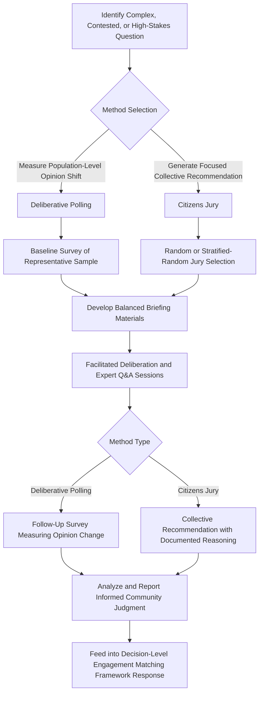

## Deliberative Polling and Citizens' Juries

### Overview

Deliberative polling and citizens' juries are structured engagement methods designed to elicit informed, considered stakeholder judgment on complex issues by combining representative or random sampling with extended, facilitated deliberation and access to balanced expert information. These methods address a specific limitation shared by most other engagement methods covered in this chapter: standard surveys, public meetings, and even focus groups typically capture stakeholder views as currently held, which may be based on incomplete information, misinformation, or insufficient time for reflection — whereas deliberative methods are explicitly designed to measure and shape considered judgment after structured exposure to information and peer discussion.

These methods are comparatively resource-intensive and methodologically demanding relative to other techniques in this chapter, and are correspondingly used more selectively — typically reserved for complex, high-stakes, or contested decisions where the value of genuinely informed collective judgment justifies the additional investment.

### Deliberative Polling

#### Core Methodology

Deliberative polling, a method developed and trademarked by political scientist James Fishkin, follows a structured sequence:

1. **Baseline survey** — a representative random sample of the relevant population is surveyed on their initial views regarding the topic at hand
2. **Balanced briefing materials** — participants receive carefully balanced written materials presenting multiple perspectives and relevant factual information on the topic
3. **Facilitated small-group deliberation** — participants convene (traditionally in person, though online adaptations exist) for structured small-group discussions, often across a full day or multi-day event
4. **Expert question-and-answer sessions** — participants have the opportunity to question a balanced panel of experts or advocates representing different perspectives on the issue
5. **Follow-up survey** — the same participants are surveyed again after the deliberative process, measuring how their views changed with exposure to balanced information and peer deliberation

[Unverified] The specific branded "Deliberative Polling" methodology is associated with a defined institutional process (the Center for Deliberative Democracy); SIA practitioners adapting the general deliberative survey concept without following the full branded protocol should describe their method as an adapted deliberative approach rather than claiming methodological equivalence to the certified process, to avoid overstating methodological rigor.

#### Application in SIA Contexts

Deliberative polling is most relevant in SIA practice for:

- **Complex, technically contested topics** — e.g., evaluating trade-offs between different mitigation approaches with genuinely competing technical and value considerations
- **Measuring genuinely informed community sentiment on contested issues** — providing a more robust indicator of considered community judgment than a single-exposure survey or public meeting show of hands, particularly relevant where initial public sentiment may be significantly shaped by misinformation or limited information exposure

### Citizens' Juries

#### Core Methodology

A citizens' jury (also called a citizens' panel or community jury) convenes a smaller group of randomly or representatively selected community members to deliberate intensively on a specific question, drawing on the metaphor and some procedural features of a legal jury:

1. **Random or stratified-random selection** of a jury panel (typically 12 to 25 participants), designed to be broadly representative of the relevant population's demographic composition
2. **Extended deliberation period** — typically several days (though formats vary), during which jurors receive balanced information and hear from a range of "witnesses" (technical experts, affected stakeholders, advocacy representatives)
3. **Structured facilitation** — an independent facilitator manages the deliberation process, ensuring balanced information exposure and structured discussion
4. **Collective recommendation or verdict** — the jury produces a collective, reasoned recommendation or judgment on the question posed, ideally supported by documented reasoning

**Key Points**

- The random or stratified-random selection process is a defining and distinguishing feature of citizens' juries relative to standing advisory committees (self-selected or nominated) and focus groups (purposively selected by characteristic), intended specifically to produce a demographically representative "mini-public" whose considered judgment can be treated as informative of broader population sentiment
- Both deliberative polling and citizens' juries depend critically on the genuine balance and quality of information provided to participants; biased or incomplete briefing materials undermine the core methodological premise of these approaches

### Mermaid Diagram: Deliberative Method Design and Implementation Workflow

### Comparison with Other Engagement Methods

| Feature | Public Meeting | Focus Group | Standing Committee | Deliberative Polling / Citizens' Jury |
| --- | --- | --- | --- | --- |
| Sample basis | Self-selected attendees | Purposive by characteristic | Nominated/selected representatives | Random or stratified-random |
| Information exposure | Single presentation | Minimal formal briefing | Ongoing but variable | Structured, balanced, extensive |
| Deliberation depth | Low (large group, limited time) | Moderate (small group, single session) | Variable, cumulative over time | High (extended, structured) |
| Output | Raised concerns/comments | Qualitative themes | Ongoing advisory input | Considered judgment/recommendation, often with measured opinion shift |
| Representativeness of broader population | Low (attendance bias) | Low (small, purposive) | Low-moderate (selection-dependent) | Higher (random/stratified selection design) |
| Resource intensity | Low-moderate | Moderate | Ongoing moderate | High |

**Key Points**

- Deliberative polling and citizens' juries offer higher methodological rigor regarding representativeness and informed judgment than most other engagement methods, but at substantially higher resource cost, making them appropriate for a limited subset of particularly complex or contested decisions rather than routine engagement activities
- These methods should be understood as complementary to, not replacements for, the broader engagement method toolkit — they address a specific gap (informed, representative collective judgment on complex trade-offs) rather than covering the full range of engagement objectives established earlier in this course (ongoing relationship-building, individualized grievance capture, broad information disclosure)

### Design and Implementation Considerations

- **Genuine balance in information provision** — the credibility of both methods depends entirely on the perceived and actual neutrality of briefing materials and expert panel composition; involving multiple stakeholder perspectives (including potentially critical voices) in reviewing briefing material balance is good practice
- **Skilled independent facilitation** — given the extended, intensive nature of the deliberation process, experienced independent facilitation (potentially through an academic institution or specialized deliberative democracy practitioner, consistent with the CSO/intermediary partnership principles established earlier) strengthens both process quality and perceived legitimacy
- **Accessibility and inclusion in participant selection** — random or stratified-random selection processes must still account for the accessibility and cultural appropriateness principles established earlier (e.g., providing childcare, transportation, translation, and compensation for participant time to ensure that genuinely representative selection translates into genuinely representative participation, since unaddressed logistical barriers will systematically exclude vulnerable or resource-constrained selected participants even after random selection)
- **Clear connection to actual decision authority** — as with all higher-intensity methods, the process should be preceded by clear decision-level classification (per the decision-level engagement matching framework) confirming that the topic under deliberation is genuinely open to being informed by the resulting collective judgment, rather than convening an intensive deliberative process for a decision that is effectively already fixed

**Example**

A proposed energy project facing significant public contestation regarding competing environmental mitigation approaches (each with different cost, effectiveness, and community impact trade-offs) convenes a citizens' jury of 18 randomly selected residents from the affected region, stratified to ensure representation across age, gender, and distance-from-project categories. Over a four-day process, jurors receive balanced technical briefings from environmental engineers representing different mitigation approaches, hear testimony from affected community members and environmental advocacy organizations, and engage in structured facilitated deliberation before producing a collective recommendation on preferred mitigation approach, along with documented reasoning, which is submitted to project decision-makers as a formal input alongside other engagement findings.

### Common Pitfalls

- **Deploying without genuine decision openness** — convening a resource-intensive deliberative process for a decision that is not actually open to being shaped by the outcome, representing a particularly costly version of the "consultation theater" pitfall given the elevated participant time investment involved
- **Unbalanced briefing materials or expert panels** — compromising the core methodological premise through materials or expert selection that favor a particular outcome, whether intentionally or through inadequate review
- **Selection without accessibility support** — achieving demographically representative random selection but then losing that representativeness in practice due to unaddressed participation barriers (time, transportation, childcare, compensation) affecting selected participants differentially by vulnerability status
- **Treating output as binding without prior clarity** — failing to establish in advance, consistent with decision-level engagement matching principles, whether the deliberative body's output is advisory input or carries stronger decision-influencing weight, leading to potential post-hoc disputes about how the output should be used
- **Insufficient deliberation time** — compressing the process to reduce cost or logistical burden in a way that undermines the genuine reflection and peer deliberation the method depends on for its distinctive value

### Regulatory and Standards Context

[Unverified] Deliberative polling and citizens' juries are not explicitly named or mandated as required methods within major SIA safeguard frameworks (IFC Performance Standards, World Bank ESS10); their use in SIA practice reflects broader good-practice adoption from public policy and deliberative democracy fields rather than a specific safeguard compliance requirement, and practitioners should verify whether any project-specific regulatory or lender requirement references these methods directly before positioning them as a compliance necessity.

**Key Points**

- These methods can serve to strengthen the evidentiary basis and perceived legitimacy of an SIA's stakeholder engagement findings on genuinely contested, high-stakes topics, complementing rather than substituting for the standard engagement methods required under applicable safeguard frameworks
- Where project timelines or budgets do not support full deliberative polling or citizens' jury methodology, adapted lighter-touch deliberative elements (e.g., providing balanced briefing materials before a focus group discussion, or incorporating a structured Q&A with balanced expert panels within a participatory workshop) can capture some of the informed-judgment benefit at lower resource cost, though with correspondingly reduced methodological rigor

### Integration with the Broader Engagement Method Toolkit

Deliberative polling and citizens' juries occupy a specialized, selectively deployed position within the broader engagement toolkit:

- Reserved for **complex, contested, or high-stakes decisions** where standard methods' limitations (attendance bias in public meetings, small purposive samples in focus groups) are particularly consequential
- Require prior **decision-level engagement matching classification** confirming genuine decision openness before deployment
- Depend on **scheduling, staffing, and budgeting** processes accounting for their substantially higher resource intensity relative to other methods
- Can draw on **CSO/intermediary partnerships** for independent facilitation and credibility
- Findings should feed into the same **"what we heard, what we did" documentation and SEP integration** processes established for other engagement methods

**Next Steps**

- Matching engagement level to decision context (cross-reference for appropriate use-case confirmation)
- Participatory workshops and design charrettes (cross-reference for related high-intensity collaborative methods)
- Accessibility and inclusive design of engagement (cross-reference for representative participation support)
- Household and community-wide surveys (cross-reference for baseline/follow-up survey methodology)
- Partnering with civil society organizations and intermediaries (cross-reference for independent facilitation)
- Drafting a stakeholder engagement plan (cross-reference for documenting selective use of deliberative methods)
- Engagement monitoring, evaluation, and adaptive management indicator design