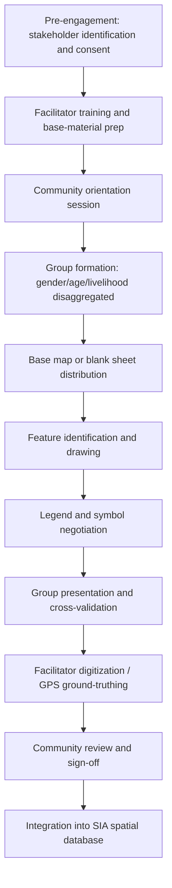

## Participatory and Community Mapping

### Definition and Conceptual Foundation

Participatory mapping is a community engagement technique in which local residents, rather than external experts, create visual representations of their territory, resources, hazards, social assets, or perceived risks. In the context of Social Impact Assessment (SIA), it serves as both a data-collection method and an empowerment mechanism: it surfaces spatial knowledge that formal cadastral, satellite, or administrative datasets often miss (informal land use, customary boundaries, culturally significant sites, hazard-prone zones, or contested resources).

The method rests on the premise that local inhabitants hold tacit, experiential knowledge of their environment that cannot be adequately captured through remote data sources or outsider observation alone. This knowledge is elicited through a collaborative, visual, non-textual process, making it accessible to participants regardless of literacy level.

### Theoretical Origins

Participatory mapping emerged from the broader Participatory Rural Appraisal (PRA) and Participatory Learning and Action (PLA) traditions developed in the 1980s–1990s, associated with practitioners such as Robert Chambers. It draws on:

- **Critical cartography** — the recognition that all maps encode power relationships and that "official" maps often erase marginalized groups' claims to land.
- **Indigenous and customary knowledge systems** — formalizing oral, spatial knowledge into a legible artifact usable in negotiations, legal claims, or planning processes.
- **Counter-mapping** — using mapping deliberately to contest dominant spatial narratives (e.g., state or corporate land claims) by documenting community-recognized boundaries and resource use.

### Core Objectives in SIA

- Document baseline conditions of land use, resource dependency, and social infrastructure prior to a proposed project or policy intervention.
- Identify vulnerable groups' geographic relationship to project footprints (e.g., proximity to pipelines, mining concessions, resettlement zones).
- Reveal cumulative and indirect impact pathways not visible in engineering or environmental data alone.
- Support Free, Prior and Informed Consent (FPIC) processes by giving communities a tool to articulate and defend their spatial claims.
- Triangulate and validate secondary data (GIS layers, census data) against lived experience.

### Typology of Participatory Mapping Methods

**Sketch mapping**

Freehand maps drawn on paper, ground, or flipchart by community members without instruments or scale. Fast, low-cost, ideal for initial scoping workshops. Produces qualitative, non-georeferenced output.

**Scale/transect mapping**

Maps that follow a walked transect line across the community, annotated with observations at intervals (soil type, land use, hazards). Combines mobility data collection with spatial representation.

**3D participatory modeling (P3DM)**

Physical contour models built from cardboard/foam layered to match topographic contour lines, then painted and pinned by community members to mark features. Effective for terrain-sensitive contexts (watersheds, disaster risk, forestry).

**GPS-assisted mapping**

Community members walk boundaries or points of interest with a handheld GPS unit or smartphone; waypoints are later digitized into GIS software. Produces georeferenced vector data compatible with formal planning systems.

**PGIS (Participatory Geographic Information Systems)**

Integrates community-generated spatial data directly into GIS platforms (QGIS, ArcGIS), enabling overlay with cadastral, environmental, or infrastructure layers. Requires facilitator technical capacity.

**Mobile and crowdsourced mapping (VGI — Volunteered Geographic Information)**

Use of apps (OpenStreetMap via OSM Tasking Manager, Mapillary, KoboToolbox with GPS fields, Maptionnaire) allowing distributed, asynchronous data entry by community members using smartphones.

**Mental/cognitive mapping**

Individual, unstandardized sketches capturing perceived (not necessarily metric) spatial relationships — useful for understanding perceived safety, social distance, or accessibility rather than literal geography.

### Standard Workshop Process



### Step-by-Step Facilitation Protocol

**1. Pre-engagement and consent**

Obtain community entry permissions through recognized leadership structures; clarify data ownership, storage, and usage terms explicitly before mapping begins, since spatial data can expose vulnerable claims (e.g., informal settlements, unregistered farms) to appropriation risk.

**2. Disaggregated group formation**

Separate mapping groups by gender, age, ethnicity, or livelihood category where power asymmetries are likely (e.g., women's land-use mapping separate from men's), since mixed groups often replicate dominant voices and mute others.

**3. Base material selection**

Choose between a blank sheet (fully community-generated) or a printed base layer (satellite image, existing cadastral outline) depending on whether the goal is unconstrained knowledge elicitation or georeferenced validation.

**4. Symbol and legend co-creation**

Allow participants to define their own iconography (e.g., a specific symbol for a sacred site, water source, or hazard zone) rather than imposing external cartographic conventions, then record the legend for cross-group comparability.

**5. Facilitated drawing session**

Facilitators pose structured but open prompts ("Where do you collect water?" "Where do floods occur?" "Where do young people gather?") and refrain from correcting participant errors in scale or orientation, since internal consistency matters more than metric accuracy at this stage.

**6. Cross-validation**

Multiple groups present their maps to each other; discrepancies are discussed openly, which often surfaces contested claims or differing resource-use patterns between demographic groups — a valuable SIA finding in itself.

**7. Digitization and georeferencing**

Trained staff transcribe paper/physical outputs into GIS format, using GPS ground-truthing or georeferencing against satellite basemaps (e.g., in QGIS via the Georeferencer plugin) to align community sketches with real-world coordinates.

**8. Verification and sign-off**

Return digitized outputs to the community for review before finalizing, since transcription errors and facilitator bias can distort community intent if unchecked.

### PGIS Technical Workflow

For projects requiring formal spatial datasets suitable for impact modeling or overlay analysis:

```mermaid
flowchart LR
    A[Field data collection: GPS points, polygons, sketches] --> B[Raw data import: GPX, KML, shapefile]
    B --> C[QGIS: Georeferencer / manual digitizing]
    C --> D[Attribute tagging: land use, ownership, hazard type]
    D --> E[Overlay with project footprint layers]
    E --> F[Impact zone identification]
    F --> G[Community validation review]
    G --> H[Final SIA spatial dataset]
```



**Common tools**

- **QGIS** (open-source) — digitizing, georeferencing, overlay analysis.
- **OpenStreetMap / OSM Tasking Manager** — collaborative base map building, especially in data-sparse regions.
- **KoboToolbox / ODK (Open Data Kit)** — mobile form-based data collection with GPS and polygon capture fields, widely used in humanitarian and development SIA fieldwork.
- **Mapillary / KoBo GeoODK** — street-level and ground-truth photo-geotagging.
- **Maptionnaire** — browser-based participatory mapping platform designed for public consultation with map-based survey questions.

[Unverified] Specific feature sets and pricing tiers of proprietary platforms such as Maptionnaire may change; verify current capabilities against vendor documentation before procurement decisions.

### Data Model Example (Simplified GeoJSON Feature)

```json
{
  "type": "Feature",
  "properties": {
    "feature_type": "water_source",
    "community_label": "Sungai Tuo spring",
    "reported_by_group": "women_group_2",
    "seasonal_reliability": "dry_season_low",
    "validation_status": "community_confirmed"
  },
  "geometry": {
    "type": "Point",
    "coordinates": [101.6869, 3.1390]
  }
}
```

Attribute fields should retain provenance metadata (`reported_by_group`, `validation_status`) so that downstream analysts can trace claims back to their originating demographic subgroup — critical for equity-sensitive SIA reporting.

### Strengths

- Elicits tacit, place-based knowledge inaccessible through surveys or remote sensing.
- Low technical barrier (sketch mapping requires no literacy or equipment).
- Builds community ownership and can serve as an advocacy artifact in negotiations.
- Surfaces intra-community heterogeneity when disaggregated by group.
- Directly supports FPIC and land-rights documentation processes.

### Limitations and Risks

- **Georeferencing accuracy** — sketch maps are not metrically accurate; overlay with formal cadastral data requires careful, transparent methodology to avoid misrepresenting boundaries.
- **Elite capture** — dominant individuals or factions may control the drawing process unless facilitation actively manages turn-taking and group composition.
- **Data sensitivity and exposure risk** — georeferenced data on informal or contested land claims can be used against the community (e.g., by land speculators or state actors) if not properly governed; data-sharing agreements should be established before collection.
- **Facilitator bias in digitization** — the transcription step from physical to digital format introduces interpretive choices; community sign-off review mitigates but does not eliminate this.
- **Resource intensity** — P3DM and GPS-based methods require materials, training, and time that may exceed budget in rapid SIA timelines.

[Inference] Where community mapping outputs are later used as legal evidence (e.g., in land tenure disputes), courts or authorities may require independent surveyor validation in addition to community-generated data, since acceptance standards vary by jurisdiction.

### Integration with Other SIA Methods

Participatory mapping is rarely used in isolation. It is commonly triangulated with:

- **Household surveys** — to quantify what the map identifies qualitatively (e.g., percentage of households dependent on a mapped water source).
- **Key informant interviews** — to add narrative depth to mapped features (why a site is sacred, how a hazard has changed over time).
- **Focus group discussions** — often conducted alongside the mapping session itself to discuss disagreements between groups' maps.
- **Remote sensing/GIS baseline data** — for formal overlay and impact-zone delineation.

### Illustrative Example

A proposed hydropower project requires an SIA covering three upstream villages. Facilitators conduct sketch mapping separately with women's and men's groups in each village. The women's groups mark water collection points, washing areas, and informal market paths; the men's groups mark agricultural plots, grazing routes, and fishing zones. Overlaying both digitized outputs against the proposed reservoir footprint in QGIS reveals that the women's water collection points cluster in an area that will be inundated but was not flagged in the men's-only baseline consultation conducted earlier by the project developer — a finding that materially changes the resettlement and livelihood restoration plan.

### Ethical and Governance Considerations

- Establish clear **data sovereignty agreements**: who owns the final spatial dataset, who can access it, and under what conditions it may be shared with government or project proponents.
- Apply **do-no-harm** screening to sensitive features (e.g., locations of endangered species poaching sites, informal settlements vulnerable to eviction) before including them in shareable outputs.
- Ensure **informed consent** covers the specific downstream uses of the map (planning input vs. legal evidence vs. public disclosure), as these carry different risk profiles for participants.

### SVG Diagram: Participatory Mapping Data Flow

<svg xmlns="http://www.w3.org/2000/svg" viewBox="0 0 820 300" font-family="Arial, sans-serif">
<text x="410" y="24" font-size="16" font-weight="bold" text-anchor="middle" fill="#1a1a1a">Participatory Mapping Data Flow (svg_diagram)</text>
<rect x="20" y="60" width="140" height="60" rx="8" fill="#e8f0fe" stroke="#4285f4" stroke-width="1.5" />
<text x="90" y="85" font-size="12" text-anchor="middle" fill="#1a1a1a">Community</text>
<text x="90" y="101" font-size="12" text-anchor="middle" fill="#1a1a1a">field session</text>
<rect x="200" y="60" width="140" height="60" rx="8" fill="#fef7e0" stroke="#f9ab00" stroke-width="1.5" />
<text x="270" y="85" font-size="12" text-anchor="middle" fill="#1a1a1a">Physical/paper</text>
<text x="270" y="101" font-size="12" text-anchor="middle" fill="#1a1a1a">map output</text>
<rect x="380" y="60" width="140" height="60" rx="8" fill="#e6f4ea" stroke="#34a853" stroke-width="1.5" />
<text x="450" y="85" font-size="12" text-anchor="middle" fill="#1a1a1a">GPS ground-</text>
<text x="450" y="101" font-size="12" text-anchor="middle" fill="#1a1a1a">truthing</text>
<rect x="560" y="60" width="140" height="60" rx="8" fill="#fce8e6" stroke="#ea4335" stroke-width="1.5" />
<text x="630" y="85" font-size="12" text-anchor="middle" fill="#1a1a1a">GIS digitization</text>
<text x="630" y="101" font-size="12" text-anchor="middle" fill="#1a1a1a">(QGIS)</text>
<rect x="380" y="180" width="140" height="60" rx="8" fill="#f3e8fd" stroke="#a142f4" stroke-width="1.5" />
<text x="450" y="205" font-size="12" text-anchor="middle" fill="#1a1a1a">Community</text>
<text x="450" y="221" font-size="12" text-anchor="middle" fill="#1a1a1a">validation review</text>
<rect x="560" y="180" width="140" height="60" rx="8" fill="#e8f0fe" stroke="#4285f4" stroke-width="1.5" />
<text x="630" y="205" font-size="12" text-anchor="middle" fill="#1a1a1a">SIA spatial</text>
<text x="630" y="221" font-size="12" text-anchor="middle" fill="#1a1a1a">database</text>
<line x1="160" y1="90" x2="198" y2="90" stroke="#5f6368" stroke-width="1.5" marker-end="url(#arrow)" />
<line x1="340" y1="90" x2="378" y2="90" stroke="#5f6368" stroke-width="1.5" marker-end="url(#arrow)" />
<line x1="520" y1="90" x2="558" y2="90" stroke="#5f6368" stroke-width="1.5" marker-end="url(#arrow)" />
<line x1="630" y1="120" x2="630" y2="150" stroke="#5f6368" stroke-width="1.5" />
<line x1="630" y1="150" x2="450" y2="150" stroke="#5f6368" stroke-width="1.5" />
<line x1="450" y1="150" x2="450" y2="178" stroke="#5f6368" stroke-width="1.5" marker-end="url(#arrow)" />
<line x1="520" y1="210" x2="558" y2="210" stroke="#5f6368" stroke-width="1.5" marker-end="url(#arrow)" />
</svg>

### Related Topics

- Free, Prior and Informed Consent (FPIC) processes
- Focus group discussions and key informant interviews in SIA
- GIS-based cumulative impact assessment
- Stakeholder identification and analysis matrices
- Land tenure and resettlement action planning (RAP)
- Gender-disaggregated engagement methods
- Data governance and privacy in community-generated datasets
- Transect walks and community resource inventories