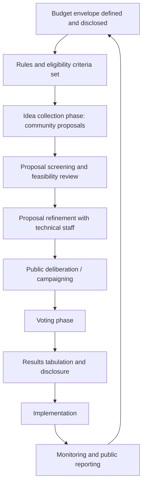
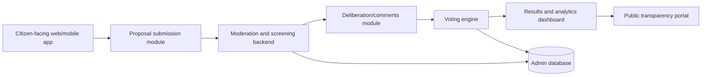

## Participatory Budgeting and Gamified Engagement

### Definition and Conceptual Foundation

Participatory budgeting (PB) is a democratic process in which community members directly decide how to allocate all or part of a public or project-associated budget. Gamified engagement refers to the application of game-design elements (points, levels, competition, progress mechanics, rewards) to non-game civic participation processes to increase engagement, retention, and data quality. In SIA practice, these are increasingly combined: PB provides the decision-making structure, while gamification techniques are layered onto the process (especially digital PB platforms) to sustain participation and lower the psychological barrier to engaging with budget or trade-off decisions.

Together, they represent a shift from consultative engagement (where communities are asked for opinions) to **allocative engagement** (where communities exercise direct decision-making authority over resources), which has significant implications for SIA because it changes the community's role from "impacted stakeholder" to "co-decision-maker" in mitigation or benefit-sharing resource allocation.

### Origins and Evolution

Participatory budgeting originated in **Porto Alegre, Brazil (1989)**, as a municipal governance reform intended to democratize public spending and combat clientelism. It has since diffused globally into thousands of municipalities and, more recently, into corporate/extractive-industry benefit-sharing programs and infrastructure project community development funds — the latter being the primary SIA-relevant application.

Gamification of civic engagement grew out of behavioral economics and UX design fields in the 2010s, applied to civic tech platforms (e.g., Decidim, CitizenLab, Bang the Table) to address chronic low participation rates in traditional consultation.

### Relevance to SIA

- **Benefit-sharing and community development fund allocation** — many extractive, energy, and infrastructure projects now channel a portion of royalties or compensation into community-controlled funds; PB is the standard mechanism for allocating these.
- **Mitigation prioritization** — where multiple mitigation measures are feasible but budget-constrained, PB allows affected communities to rank/select priorities rather than have them imposed.
- **Legitimacy and social license** — PB processes generate documented, auditable evidence of community agency, which strengthens the social license to operate and reduces grievance risk.
- **Distributional equity monitoring** — PB vote/allocation data disaggregated by demographic group provides SIA practitioners with a proxy indicator of whose priorities are actually being funded.

### Standard Participatory Budgeting Cycle

### Phase-by-Phase Technical Detail

**1. Budget envelope definition**

The sponsoring entity (municipality, project proponent, or community trust) discloses the total amount available and any spending category restrictions (e.g., "infrastructure only," "excludes recurrent operational costs"). Transparency at this stage is critical — undisclosed constraints introduced later are a leading cause of PB process delegitimization.

**2. Rules and eligibility criteria**

Defines who can propose, who can vote, minimum/maximum proposal values, and geographic eligibility. SIA practitioners should scrutinize these rules for exclusionary effects (e.g., requiring formal ID or literacy for participation disproportionately excludes migrants, elderly, or low-literacy populations).

**3. Idea collection**

Proposals are gathered via community assemblies, drop-box submissions, or digital platforms. Best practice sets a low submission barrier (simple template, assisted submission for non-literate participants) to avoid skewing input toward already-empowered voices.

**4. Feasibility screening**

Technical staff assess proposals against budget, legal, and engineering feasibility, and either approve, request revision, or reject with documented justification — rejection without transparent reasoning is a major source of participant distrust.

**5. Deliberation/campaigning**

Public forums, exhibitions, or digital comment threads allow proposers to advocate and communities to discuss trade-offs before voting.

**6. Voting**

Conducted via paper ballot, SMS, mobile app, or hybrid methods. Vote weighting schemes vary: one-person-one-vote, point-distribution (allocate 100 points across proposals), or ranked-choice.

**7. Results disclosure and implementation**

Winning proposals are announced publicly with implementation timelines; regular progress reporting maintains legitimacy for future PB cycles.

**8. Monitoring**

Independent tracking of whether funded proposals are actually delivered — a frequent PB failure point that erodes trust in subsequent cycles if neglected.

### Digital PB Platform Architecture

Modern PB implementations, especially at scale, use dedicated civic tech platforms. Representative open-source and commercial options include **Decidim** (Barcelona-originated, open-source, used by 100+ institutions globally), **CONSUL** (Madrid-originated, open-source), **Bang the Table / EngagementHQ**, and **CitizenLab**.

**Core architectural components:**

- **Identity/authentication layer** — verifies eligibility (residency, age) while balancing privacy; common approaches include SMS OTP verification, national ID integration, or community-vouching systems in low-connectivity contexts.
- **Proposal management module** — CRUD interface for submissions, typically with geolocation tagging, category tagging, and budget-estimate fields.
- **Moderation workflow** — staff review queue with approve/reject/revise states and audit logging.
- **Voting engine** — must enforce one-vote-per-eligible-participant rules and support the chosen voting method (approval voting, point allocation, ranked choice); requires safeguards against ballot-stuffing and bot manipulation.
- **Analytics/reporting layer** — aggregates votes by demographic and geographic filters for equity monitoring.

[Unverified] Specific feature sets, pricing, and current version capabilities of platforms such as Decidim, CONSUL, or CitizenLab should be verified against current vendor/project documentation, as civic tech platforms update frequently.

### Gamification Mechanics Applied to Civic Engagement

**Points and progress systems**

Participants earn points for actions (submitting a proposal, attending a forum, commenting constructively), visualized via progress bars, to sustain engagement across a multi-week PB cycle.

**Leaderboards**

Public rankings of most-engaged participants or neighborhoods; effective for driving volume but [Inference] can also amplify existing power imbalances if not paired with equity safeguards, since already-active or better-resourced groups tend to dominate leaderboards.

**Badges and achievement systems**

Non-monetary recognition for milestones (first proposal, first vote, community reviewer status) — low-cost, low-risk gamification element commonly used in civic tech.

**Budget simulation / allocation games**

Interactive tools (e.g., slider-based "spend the budget" interfaces) that let participants experiment with trade-offs before committing a final vote, improving decision quality by making opportunity costs visible.

**Scenario/role-play exercises**

In-person gamified workshops where participants take on different stakeholder roles (e.g., "youth representative," "elder council," "small business owner") to negotiate budget allocation, building empathy and reducing zero-sum framing.

**Digital badges tied to real-world incentives**

Some programs link engagement points to small tangible rewards (transport reimbursement, raffle entries) to offset participation costs, particularly important for low-income participants for whom time is a real opportunity cost.

### Illustrative Example: Community Development Fund Allocation

A mining project's SIA-mandated community development agreement allocates $500,000 annually to a community-controlled fund. The implementing NGO runs a PB cycle: proposals are submitted at village assemblies and via a simple SMS shortcode for remote households; a screening committee (with rotating community representation) filters proposals for feasibility; a point-distribution voting method lets each eligible adult allocate 100 points across up to five proposals; results are tabulated and disclosed at a public assembly with an implementation timeline pinned to a wall calendar. A parallel lightweight gamification layer — a physical "progress board" with stickers marking each completed engagement step per household — is used in place of a digital platform, given low smartphone penetration, demonstrating that gamification does not require digital infrastructure.

### Voting Method Comparison

| Method | Mechanism | Strength | Limitation |
| --- | --- | --- | --- |
| One-person-one-vote | Single vote for top-choice proposal | Simple, easy to explain | Ignores preference intensity |
| Point distribution | Allocate fixed points across multiple proposals | Captures preference strength | More cognitively demanding |
| Ranked choice | Rank proposals in order of preference | Reduces spoiler effects | Requires more sophisticated tabulation |
| Approval voting | Vote for as many proposals as approved of | Simple, reduces strategic voting | Can favor broadly acceptable but low-impact proposals |

### Strengths

- Converts SIA-mandated compensation or benefit-sharing funds into legitimated, community-owned allocation decisions.
- Produces an auditable participation and decision trail useful for SIA monitoring and social license reporting.
- Gamification elements measurably improve sustained engagement in multi-week digital processes compared to single-touchpoint consultations. [Inference] Effect sizes are context-dependent and should not be assumed to transfer uniformly across cultural or connectivity contexts.
- Builds local budgeting literacy and civic capacity beyond the immediate project.

### Limitations and Risks

- **Elite/majority capture** — without disaggregated safeguards (reserved seats, weighted representation), PB voting can systematically favor the interests of larger or more politically connected subgroups over minorities.
- **Digital divide exclusion** — app- or SMS-based PB and gamification systems can exclude non-literate, elderly, or connectivity-poor populations unless paired with in-person/offline channels.
- **Gamification fatigue and extrinsic-motivation crowding-out** — [Speculation] over-reliance on points/badges risks displacing intrinsic civic motivation over repeated cycles, though evidence specific to civic (as opposed to commercial) gamification contexts is limited.
- **Tokenism risk** — if the budget envelope is trivially small relative to total project impact spending, PB can function as a legitimacy-washing exercise rather than genuine decision-sharing; SIA practitioners should assess the materiality of the allocated budget.
- **Implementation failure** — funded proposals not delivered on schedule is a common and trust-eroding failure mode requiring dedicated monitoring capacity.
- **Manipulation and ballot integrity** — digital voting systems require technical safeguards against duplicate voting, bot activity, and coercive block-voting.

### Integration with Other SIA Methods

- **Stakeholder mapping** informs eligibility criteria and outreach design to avoid exclusion.
- **Grievance mechanisms** should be linked to PB processes to handle disputes over proposal rejection or vote outcomes.
- **Household surveys** can establish baseline priorities to cross-check against PB outcomes for representativeness.
- **Monitoring and evaluation frameworks** should track both process indicators (participation rate, demographic representativeness of voters) and outcome indicators (proposal implementation rate, satisfaction).

### Equity Safeguard Design Patterns

- Reserve a minimum proposal allocation share for specific vulnerable groups (women-led proposals, youth-led proposals, minority-language communities).
- Provide assisted-voting stations for non-literate or disabled participants.
- Offer multiple parallel channels (in-person ballot, SMS, app, paper) rather than a single digital-only channel.
- Publish demographic breakdowns of who submitted, who voted, and whose proposals won, to enable ongoing equity auditing.

### SVG Diagram: PB + Gamification Layer Interaction

<svg xmlns="http://www.w3.org/2000/svg" viewBox="0 0 820 280" font-family="Arial, sans-serif">
<text x="410" y="24" font-size="16" font-weight="bold" text-anchor="middle" fill="#1a1a1a">PB Cycle with Gamification Layer (svg_diagram)</text>
<rect x="30" y="70" width="150" height="55" rx="8" fill="#e8f0fe" stroke="#4285f4" stroke-width="1.5" />
<text x="105" y="102" font-size="12" text-anchor="middle" fill="#1a1a1a">Proposal submission</text>
<rect x="230" y="70" width="150" height="55" rx="8" fill="#fef7e0" stroke="#f9ab00" stroke-width="1.5" />
<text x="305" y="102" font-size="12" text-anchor="middle" fill="#1a1a1a">Deliberation forum</text>
<rect x="430" y="70" width="150" height="55" rx="8" fill="#e6f4ea" stroke="#34a853" stroke-width="1.5" />
<text x="505" y="102" font-size="12" text-anchor="middle" fill="#1a1a1a">Voting phase</text>
<rect x="630" y="70" width="150" height="55" rx="8" fill="#fce8e6" stroke="#ea4335" stroke-width="1.5" />
<text x="705" y="95" font-size="12" text-anchor="middle" fill="#1a1a1a">Results &amp;</text>
<text x="705" y="111" font-size="12" text-anchor="middle" fill="#1a1a1a">implementation</text>
<line x1="180" y1="97" x2="228" y2="97" stroke="#5f6368" stroke-width="1.5" marker-end="url(#arrow2)" />
<line x1="380" y1="97" x2="428" y2="97" stroke="#5f6368" stroke-width="1.5" marker-end="url(#arrow2)" />
<line x1="580" y1="97" x2="628" y2="97" stroke="#5f6368" stroke-width="1.5" marker-end="url(#arrow2)" />
<rect x="30" y="180" width="750" height="55" rx="8" fill="#f3e8fd" stroke="#a142f4" stroke-width="1.5" />
<text x="405" y="202" font-size="12" text-anchor="middle" fill="#1a1a1a">Gamification layer: points, badges, progress board, leaderboard</text>
<text x="405" y="219" font-size="11" text-anchor="middle" fill="#5f6368">(applied across all phases to sustain engagement)</text>
<line x1="105" y1="125" x2="105" y2="178" stroke="#a142f4" stroke-width="1" stroke-dasharray="4,3" />
<line x1="305" y1="125" x2="305" y2="178" stroke="#a142f4" stroke-width="1" stroke-dasharray="4,3" />
<line x1="505" y1="125" x2="505" y2="178" stroke="#a142f4" stroke-width="1" stroke-dasharray="4,3" />
<line x1="705" y1="125" x2="705" y2="178" stroke="#a142f4" stroke-width="1" stroke-dasharray="4,3" />
</svg>

### Related Topics

- Community development agreements and benefit-sharing frameworks
- Grievance redress mechanisms (GRM) design
- Civic technology platforms for consultation (Decidim, CONSUL, CitizenLab)
- Free, Prior and Informed Consent (FPIC) processes
- Equity-weighted stakeholder engagement design
- Monitoring and evaluation of community engagement outcomes
- Digital divide and inclusive engagement channel design
- Social license to operate (SLO) measurement