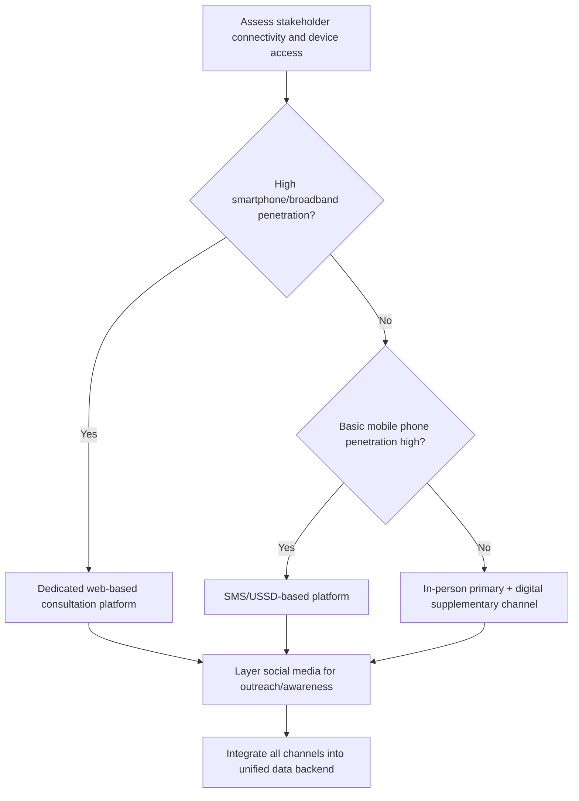
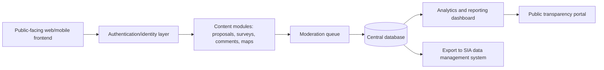
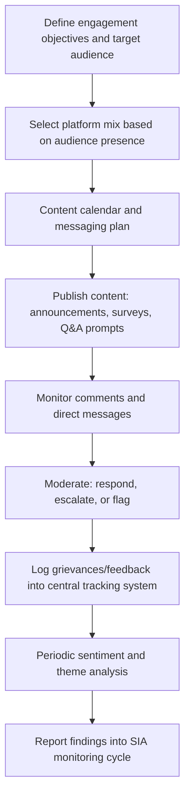

## Digital and Social Media Engagement Platforms

### Definition and Conceptual Foundation

Digital and social media engagement platforms encompass the technological tools and channels used to consult, inform, and interact with stakeholders through internet-mediated means — ranging from purpose-built civic engagement software to mainstream social media networks repurposed for consultation. In SIA practice, these platforms extend the geographic and temporal reach of engagement beyond what in-person methods permit, enabling asynchronous participation, broader demographic reach, and structured data capture, while introducing distinct risks around representativeness, misinformation, and data governance.

These platforms are generally categorized into three functional types: **dedicated civic engagement/consultation platforms** (purpose-built for structured input collection), **mainstream social media channels** (repurposed for outreach and dialogue), and **hybrid/multi-channel systems** that integrate both with offline data collection.

### Relevance to SIA

- Extends consultation reach to diaspora populations, mobile workers, or geographically dispersed stakeholders who cannot attend in-person sessions.
- Enables continuous, longitudinal engagement across a project lifecycle rather than episodic consultation events.
- Provides structured, timestamped, and auditable records of stakeholder input — valuable for demonstrating compliance with IFC Performance Standard 1 and similar disclosure requirements.
- Surfaces real-time sentiment and emerging grievances that might otherwise go undetected until they escalate.
- Introduces representativeness risk that must be explicitly managed and disclosed in SIA methodology sections, since digital channels systematically skew toward younger, better-connected, and higher-literacy populations.

### Typology of Platforms

**Dedicated civic/consultation platforms**

Purpose-built software for structured stakeholder input: **Decidim**, **CONSUL**, **CitizenLab**, **Bang the Table (EngagementHQ)**, **Maptionnaire**, **Social Pinpoint**. These typically offer proposal submission, commenting, voting/polling, interactive mapping, and dashboarded analytics with built-in moderation and audit trails.

**Mainstream social media channels**

Facebook (including Groups and Pages), WhatsApp (broadcast lists and groups), Twitter/X, Instagram, YouTube, and, in some regions, platforms like Line, Telegram, or WeChat. Used for outreach, announcement dissemination, informal Q&A, and low-barrier feedback collection. Not purpose-built for structured consultation and require careful moderation design.

**Survey and form platforms**

KoboToolbox, ODK, SurveyMonkey, Google Forms, Microsoft Forms — used for structured quantitative and semi-structured data collection, often integrated into broader digital engagement strategies.

**SMS/USSD-based platforms**

FrontlineSMS, RapidPro, Twilio-based systems — critical for reaching populations with basic-feature phones and low or no data connectivity, common in rural or lower-income contexts.

**Hybrid/multi-channel platforms**

Systems designed to unify data from multiple input channels (web, SMS, in-person kiosk, WhatsApp bot) into a single backend database for centralized analysis.

### Selection Framework

### Standard Technical Architecture (Dedicated Platform)

**Core architectural components:**

- **Frontend** — responsive web application, often with a companion mobile app; must meet accessibility standards (WCAG) for participants using assistive technology.
- **Authentication layer** — balances identity verification (for representativeness and anti-fraud) against privacy and accessibility; common patterns include email/SMS OTP, social login, or anonymous participation with IP/device-based duplicate detection.
- **Content modules** — configurable components for proposal submission, structured surveys, comment threads, interactive mapping (often via Leaflet.js or Mapbox GIS integration), and polling/voting.
- **Moderation system** — human-in-the-loop review queue, often supplemented by automated profanity/spam filtering; essential for managing hate speech, misinformation, or coordinated inauthentic input.
- **Database** — typically a relational database (PostgreSQL is common in open-source civic tech stacks like Decidim/CONSUL) storing structured submissions with full audit trails.
- **Analytics/reporting layer** — dashboards for tracking participation volume, demographic breakdown (where collected), sentiment trends, and thematic coding of open-text input.

[Unverified] Specific technology stacks, hosting requirements, and current feature sets of named platforms (Decidim, CONSUL, CitizenLab, Social Pinpoint, Bang the Table) should be verified against current vendor or project documentation, as civic tech platforms are actively developed and version details change.

### Social Media Engagement Workflow

### Platform-Specific Considerations

**Facebook/Meta**

Widely used for community outreach in many regions due to high penetration; Facebook Groups enable moderated community discussion spaces. Algorithmic feed visibility limits organic reach, often requiring paid boosting for critical announcements to be seen — a budget and equity consideration for SIA teams.

**WhatsApp**

Effective for broadcast-style announcements and small-group discussion in regions with high WhatsApp penetration (common across Latin America, South Asia, and parts of Africa); WhatsApp Business API enables structured chatbot-style intake for grievances or FAQs at scale, though setup requires Meta Business verification and, typically, a Business Solution Provider (BSP) integration.

**Twitter/X**

Useful for reaching media, policymakers, and urban/younger demographics, but generally unrepresentative of broader affected-community populations in infrastructure/extractive-sector SIA contexts; better suited to public relations monitoring than primary consultation.

**YouTube**

Effective for disseminating explanatory content (project overviews, EIA/SIA findings summaries) in video format, valuable for lower-literacy audiences; comment moderation and community guidelines enforcement require dedicated staff time.

**SMS/USSD systems (e.g., RapidPro, FrontlineSMS)**

Critical equity tool for reaching populations without smartphones or reliable data access; USSD (Unstructured Supplementary Service Data) menus allow structured multiple-choice input over basic phones without internet connectivity, commonly used for grievance intake or simple polling in rural SIA contexts.

### Data Governance and Moderation Design

**Moderation policy elements:**

- Clearly published community guidelines defining acceptable conduct.
- Defined escalation pathway from automated flagging → human review → response or removal.
- Documented response-time commitments (e.g., acknowledgment within 48 hours) to maintain credibility.
- Distinction between moderating for civility/safety versus suppressing legitimate dissent — over-moderation of critical feedback is a significant legitimacy risk in SIA-linked platforms.

**Data governance elements:**

- Explicit data retention and deletion policies, disclosed to participants at point of collection.
- Compliance with applicable data protection regulation (e.g., GDPR where EU-domiciled participants are involved, or local equivalents).
- Anonymization or pseudonymization protocols for published analytics, particularly where sensitive grievances are involved.
- Clear consent language distinguishing between consultation input and any data shared with government or third parties.

### Representativeness Bias Correction Techniques

- **Quota monitoring** — track participation demographics in real time against known population baselines (census, household survey) and trigger supplementary offline outreach when specific groups are underrepresented.
- **Weighted analysis** — apply statistical weighting to digital input when combining with offline survey data to correct for known demographic skew.
- **Multi-channel triangulation** — treat digital platform data as one input stream among several (in-person meetings, household surveys, paper feedback forms) rather than a standalone representative sample.
- **Explicit methodological disclosure** — SIA reports should state which demographic groups were reached digitally versus offline, and how this affects interpretation of the input.

### Strengths

- Extends reach to geographically dispersed or time-constrained stakeholders unable to attend in-person events.
- Generates timestamped, auditable engagement records supporting compliance documentation.
- Enables real-time or near-real-time sentiment and grievance monitoring across a project lifecycle.
- Lowers marginal cost of sustained, longitudinal engagement compared to repeated in-person events.
- Supports multimedia communication (video, interactive maps) that can improve comprehension of complex technical content.

### Limitations and Risks

- **Digital divide and representativeness bias** — systematically underrepresents elderly, low-literacy, low-income, and remote populations unless deliberately counterbalanced with offline channels.
- **Misinformation and coordinated manipulation** — social media channels are vulnerable to astroturfing, bot activity, or organized campaigns that can distort perceived community sentiment; verification protocols are necessary before treating volume as a proxy for genuine sentiment.
- **Algorithmic visibility control** — platform algorithms (particularly Meta and X) determine organic content reach, meaning engagement teams do not fully control who sees consultation announcements without paid promotion.
- **Data privacy and security exposure** — platforms holding sensitive grievance or demographic data are targets for breach risk; robust access controls and encryption practices are required.
- **Moderation burden and cost** — sustained digital engagement requires ongoing staffing for moderation, response, and content management that is easy to underbudget in SIA work plans.
- **Platform dependency risk** — reliance on third-party commercial platforms (subject to policy changes, deprecation, or regional access restrictions) introduces continuity risk for multi-year projects. [Inference] Projects with engagement periods spanning many years should consider data portability and platform-independence safeguards given the historical volatility of social media platform policies and availability.

### Integration with Other SIA Methods

- **Grievance redress mechanisms** — digital channels (SMS, WhatsApp, web forms) are increasingly a primary intake point for formal GRM processes, requiring integration with case management systems.
- **Household surveys** — digital survey tools (KoboToolbox, ODK) are standard for structured quantitative baseline and monitoring data collection.
- **Participatory mapping** — GIS-integrated platforms support digital participatory/PGIS workflows.
- **Stakeholder analysis** — digital engagement analytics feed back into stakeholder mapping updates, revealing previously unidentified or newly mobilized stakeholder groups.

### Illustrative Example

A liquefied natural gas terminal project spans a five-year construction period across a coastal region with a young urban population near the port and an older, lower-connectivity fishing community further along the coast. The engagement team deploys a dedicated CitizenLab-style consultation platform with proposal submission and mapping features for the urban population, layered with Facebook Page updates and boosted posts for broader awareness; for the fishing community, the team deploys a RapidPro-based SMS system allowing simple keyword-based feedback and complaint submission over basic phones, paired with monthly in-person town halls. Quarterly, the team cross-tabulates digital platform demographics against census data, identifies that women over 50 are underrepresented across all digital channels, and adds a targeted door-to-door survey supplement to correct the gap before finalizing the quarterly SIA monitoring report.

### Related Topics

- Grievance redress mechanism (GRM) design and case management systems
- Household survey and structured data collection (KoboToolbox/ODK)
- Stakeholder mapping and analysis
- Participatory and community mapping (PGIS)
- Data protection and privacy governance in community engagement
- Misinformation management in project-affected communities
- Multi-channel engagement strategy design
- Social license to operate (SLO) measurement