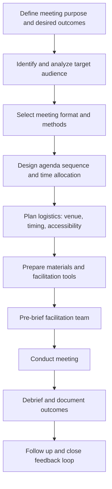

## Meeting Design and Agenda Facilitation

### Definition and Conceptual Foundation

Meeting design and agenda facilitation is the deliberate structuring and skilled management of community engagement meetings to achieve specific participation, information-exchange, and decision-making objectives. It encompasses the pre-meeting design work (purpose definition, sequencing, format selection) and the in-meeting facilitation craft (process management, participation balancing, conflict handling) required to run effective consultation, disclosure, or deliberation sessions in an SIA context.

Unlike ad hoc public meetings, well-designed facilitation treats the meeting itself as an engineered process with defined inputs (objectives, audience, constraints) and outputs (decisions, documented input, relationship outcomes), recognizing that meeting format significantly shapes who participates and what is heard.

### Relevance to SIA

- Meeting quality directly determines the reliability and representativeness of qualitative data captured for baseline and impact assessment.
- Poorly designed meetings (dominated by elites, rushed agendas, one-way information delivery) generate documentation that overstates community consensus and can later be challenged in grievance or legal processes.
- Meeting records (attendance, minutes, agreed actions) form part of the auditable evidence trail required for IFC Performance Standards, Equator Principles, and similar disclosure and consultation compliance frameworks.
- Facilitation quality affects trust-building and social license outcomes independent of the substantive content discussed.

### Meeting Design Process

### Step-by-Step Design Protocol

**1. Purpose definition**

Every meeting should have an explicit, singular primary purpose — informing, consulting, deciding, or relationship-building — since conflating purposes (e.g., trying to both disclose technical findings and gather deep qualitative feedback in one session) typically degrades both objectives. SMART-style objective statements ("participants will be able to identify three resettlement options and indicate a preference ranking by session end") anchor subsequent design choices.

**2. Audience analysis**

Draws on prior stakeholder mapping to characterize the expected audience's composition, literacy levels, language needs, power dynamics, and likely concerns, which determines format, language, materials complexity, and facilitator selection (e.g., gender-matched facilitators for sensitive topics in some cultural contexts).

**3. Format selection**

Matches meeting structure to purpose and audience — large town-hall formats suit broad information disclosure but poorly support balanced input from less-vocal participants, whereas small facilitated breakout groups better support deliberation and can be run in parallel to increase overall participation volume within fixed time.

**4. Agenda sequencing and time-boxing**

Structures the session flow (opening/welcome, context-setting, core content, structured input collection, next steps, closing) with realistic time allocations; best practice reserves the largest time block for two-way exchange rather than one-way presentation, and time-boxes each segment with a visible agenda to maintain accountability to the group.

**5. Logistics and accessibility planning**

Covers venue selection (neutral, accessible location), timing (avoiding conflicts with agricultural cycles, religious observance, or work shifts), physical accessibility for people with disabilities, childcare provision, transport support, and interpretation/translation needs — logistics failures are a common, preventable cause of unrepresentative attendance.

**6. Materials and tool preparation**

Includes visual aids calibrated to audience literacy (diagrams, models, maps rather than dense text), pre-translated materials, sign-in sheets with optional demographic fields, and facilitation tools (talking sticks, voting cards, flipcharts) appropriate to the planned activities.

**7. Facilitation team pre-briefing**

Aligns co-facilitators, notetakers, and interpreters on roles, agenda, key messages, and escalation protocols for difficult moments (hostile questions, emotional distress, conflict between participants) before the session begins.

### Core Agenda Structure Template

| Segment | Typical Duration | Purpose |
| --- | --- | --- |
| Welcome and framing | 5–10 min | Establish purpose, ground rules, agenda overview |
| Context/technical presentation | 15–20 min | Disclose necessary background information |
| Clarifying questions | 10–15 min | Ensure shared factual understanding before deliberation |
| Structured input/deliberation | 30–45 min | Core two-way engagement (breakouts, mapping, prioritization exercises) |
| Report-back and synthesis | 10–15 min | Surface and validate key themes across groups |
| Next steps and closing | 5–10 min | Clarify what happens with input and when follow-up occurs |

Time allocations should be adjusted to context; the principle of allocating more time to two-way exchange than one-way presentation holds across formats.

### Facilitation Techniques

**Opening and ground-rule setting**

Establishes psychological safety and shared expectations (confidentiality norms, respectful disagreement, time limits per speaker) at the outset, which is particularly important where power asymmetries or historical grievances are present.

**Participation balancing techniques**

- **Round-robin** — structured turn-taking ensures quieter participants are not crowded out by more vocal or higher-status individuals.
- **Small-group breakouts** — reduces the social risk of speaking in front of large or hierarchical assemblies, particularly valuable for women, youth, or lower-status participants in stratified communities.
- **Anonymous input channels** — written cards, sticky notes, or digital polling allow sensitive input without public attribution.
- **Progressive stacking** — facilitator consciously prioritizes speaking turns for underrepresented voices when a queue forms, correcting for default patterns of dominant-voice capture.

**Question design**

Open-ended, non-leading questions ("What concerns do you have about the proposed route?") generate richer qualitative data than closed or leading questions ("Do you support the proposed route?"), and should be sequenced from broad/exploratory to specific/decision-oriented as the session progresses.

**Conflict and hostility management**

Facilitators are trained to acknowledge strong emotion without becoming defensive, separate the underlying concern from its emotional delivery, redirect personal attacks toward substantive issues, and know when to pause, take a break, or move a specific dispute to a smaller follow-up conversation rather than let it dominate collective time.

**Visual facilitation**

Live-recording key points on flipcharts, whiteboards, or digital displays visible to the group creates shared accountability for accurate capture and allows real-time correction if a facilitator misrepresents a point.

**Silence and pacing management**

Deliberately allowing pauses after questions (rather than rushing to fill silence) gives participants — particularly those processing in a non-native language or working through a translator — adequate time to formulate responses.

### Language and Interpretation Considerations

- Simultaneous or consecutive interpretation should be budgeted and tested prior to the meeting where multilingual participation is expected; consecutive interpretation roughly doubles required time for verbal segments.
- Materials in local languages should use plain, non-technical phrasing reviewed by native speakers, not machine translation alone.
- Facilitators should periodically check comprehension explicitly ("Can someone summarize what we just covered?") rather than assuming silence indicates understanding.

### Documentation Standards

Meeting records supporting SIA evidentiary requirements typically include:

- Attendance sign-in with demographic disaggregation (where consented) to support representativeness analysis.
- Agenda as actually followed (noting deviations).
- Minutes capturing key themes, concerns raised, and any disagreements — attributed by category (e.g., "several women participants raised...") rather than verbatim individual quotes unless explicit consent for attribution was obtained.
- Photographic or video documentation where consented.
- Action items with named responsible parties and deadlines.
- A closing-the-loop record showing how input was subsequently used or responded to.

[Inference] Where meeting outputs may later be used as evidence in grievance or legal proceedings, documentation standards should be agreed with legal/compliance counsel in advance, as evidentiary requirements vary by jurisdiction and applicable lender/regulatory standards.

### Common Failure Modes and Mitigations

| Failure Mode | Cause | Mitigation |
| --- | --- | --- |
| Elite capture of discussion | Unstructured open floor format | Round-robin, breakouts, progressive stacking |
| Low turnout of specific groups | Poor timing/venue/logistics | Audience-specific scheduling and outreach |
| One-way information dump | Agenda over-weighted to presentation | Time-box presentation; expand deliberation segment |
| Unaddressed hostility derails session | No conflict management protocol | Pre-briefed facilitation team with escalation plan |
| Input collected but not visibly used | No closing-the-loop mechanism | Publish response-to-input report after each cycle |
| Non-representative documentation | No demographic disaggregation in minutes | Structured note-taking templates with tagging |

### Illustrative Example

A proposed transmission line SIA requires a series of village consultation meetings. The facilitation team designs a 90-minute session: 10 minutes of framing and ground rules; a 15-minute plain-language presentation using a physical scale model of a pylon rather than technical drawings; a 10-minute open clarifying-question period; 35 minutes split into three demographic-specific breakout groups (women, youth, general/elders) each facilitated separately using participatory mapping to mark concerns along the proposed route; a 15-minute report-back where each group's facilitator summarizes themes to the reconvened assembly for validation; and a 5-minute closing explaining that a written summary will be posted at the village office within two weeks and a follow-up meeting scheduled. This structure surfaces that the women's breakout group raised distinct concerns about pylon proximity to a water collection path — input that a single mixed-format open-floor meeting had failed to capture in an earlier, less-structured session.

### Related Topics

- Stakeholder mapping and analysis
- Cross-cultural communication and translation protocols
- Grievance redress mechanism (GRM) design
- Participatory and community mapping
- Conflict resolution and negotiation skills
- Focus group discussion methodology
- Closing-the-loop and feedback reporting practices
- Accessibility and inclusive engagement design